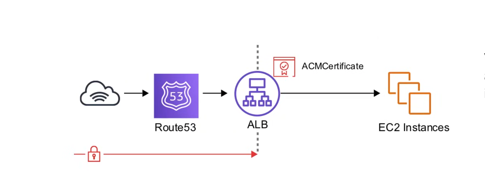
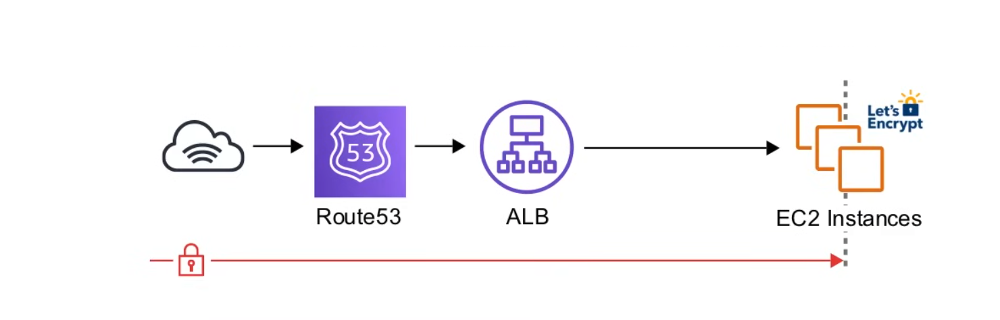
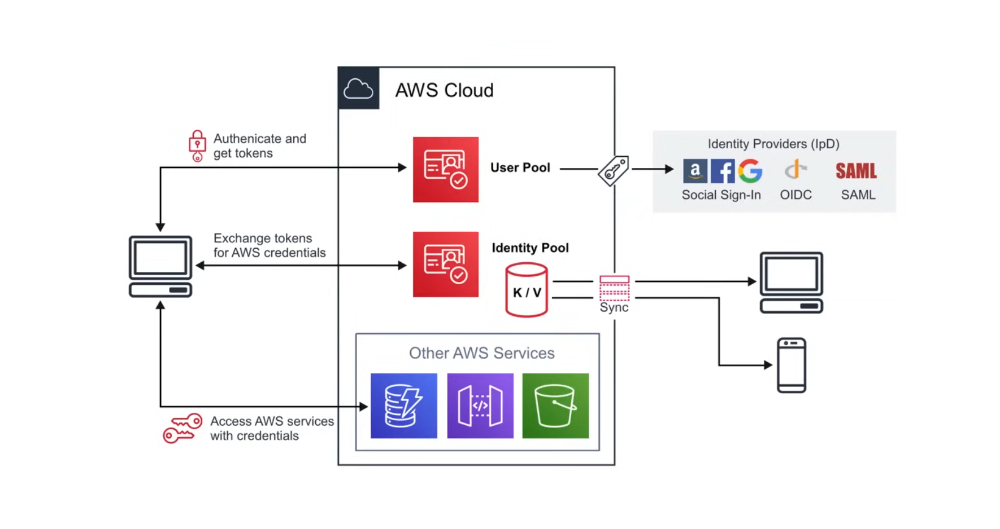
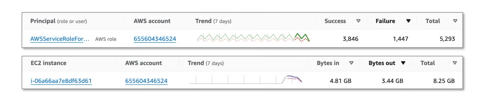
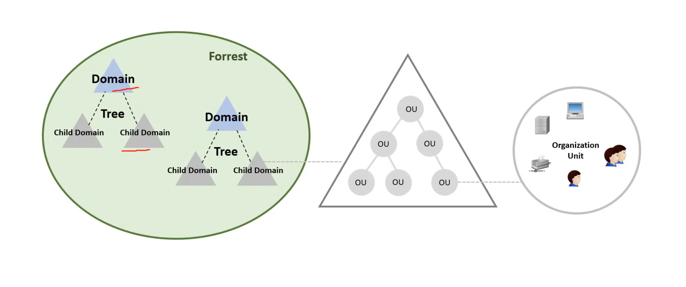
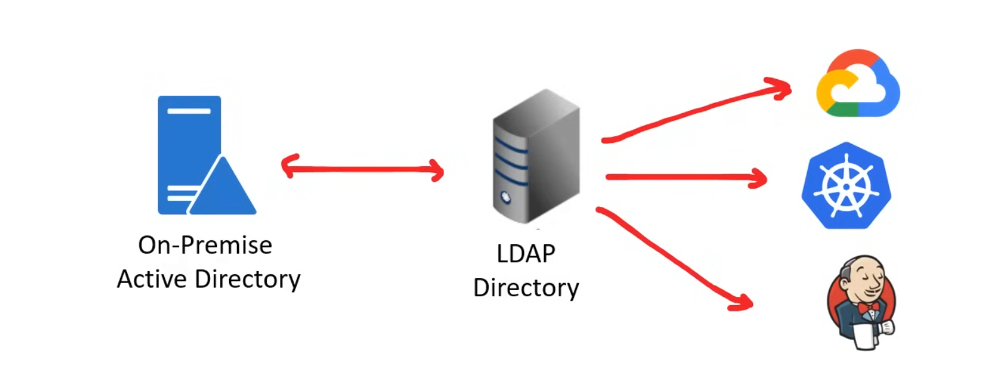

## AWS Certificate Manager (ACM)

**AWS Certificate Manager (ACM)** handles the complexity of creating, storing, and renewing public and private SSL/TLS X.509 certificates and keys that protect your AWS websites 
and applications. 

You can provide certificates for your integrated AWS services either by issuing them directly with ACM or by importing third-party certificates into the ACM management system. 
ACM certificates can secure singular domain names, multiple specific domain names, wildcard domains, or combinations of these. ACM wildcard certificates can protect an unlimited 
number of subdomains. You can also export ACM certificates signed by AWS Private CA for use anywhere in your internal PKI.

ACM can handle two kinds of certificates:

- *Public* - Certificates provided by ACM (Free)
- *Private* - Imported certificates ($400/month)!!!!!

ACM can be attached to the following AWS resources:

- Elastic Load Balancer
- CloudFront
- API Gateway
- Elastic Beanstalk (through ELB)

### ACM SSL Termination

**Terminating SSL at the Load Balancer**

All traffic in-transit beyond the ALB is unencrypted.

You can add as many EC2 instances to the ALB and you don't need to install certificates on each instance. Theoritically, it's less secure.

**Terminating SSL End-to-End**

Traffic in-transit is encrypted, all the way to the application.

Guarantees encryption end-to-end, but it's more complicated to maintain certificates.

### Amazon Cognito

**Amazon Cognito** is a managed Customer Identity and Access Management (CIAM) service that provides scalable user registration, authentication (login), and access control for 
web and mobile apps. It supports social login (Google, Facebook, Apple), enterprise identity federation (SAML/OIDC), and multi-factor authentication (MFA) to enhance security.

- **Cognito User Pools** - User directory authentication to Idp, to grant access to your apps.
- **Cognito Identity Pools** - Provide temporary credentials for users to access AWS Services.
- **Cognito Sync** - Sync user data and preferences across all devices.

### Amazon Detective

**Amazon Detective** is a security service that automatically analyzes and visualizes AWS log data—including CloudTrail, VPC Flow Logs, and GuardDuty findings—to accelerate 
security investigations. It uses machine learning, graph theory, and statistical analysis to uncover the root cause of potential security issues across AWS accounts and 
workloads.

Quickly identify trends for EC2 instances and IAM principles.

- See on a map where API calls are generally being made from.
- See a summary list of how many times specific API calls have been made.
- See how much groups of API calls have increased in volume.
- Launch investigation on specific IAM principles to see if they are utilizing specific tactics
  - Amazon Detective creates a behavior graph in order when making determinations.

### Directory Service

A Directory Service maps the names of network resources to their network addresses. A directory service is shared information infrastructure for locating, managing, 
administering and organizing resources on a network. eg. volumes, folders, printers, users, groups, devices, etc.

A **directory service** is a critical component of a network operating system. Directry services are provided by a directory server. Each resource on the network is considered 
an objetc by the **directory server**. Information about a particuar resource is stored as a collection of attributes associated with that resource or object.

Popular directory services:

- Domain Name Service (DNS)
- Microsoft Active Directory (Azure AD)
- Apache Directory Server
- Oracle Internet Directory (OID)
- OpenLDAP
- Cloud Identity
- JumpCloud

### Active Directory

Microsoft introduced Active Directory Domain Services in Windows 2000, to give organizations a way to managed multiple on-premise infrastructure components and systens using a 
single udentity per user.

### LDAP

**Lightweight Directory Access Protocol (LDAP)** is an open, vendor-neutral, industry standard application protocol for accessing and maintaining distributed directory 
information service over an Internet Protocol (IP) network.

A common use of LDAP is to provide a central place to store usernames and passwords. LDAP enables for **Same Sign-On (SSO)**. Same sign-on allows users to authenticate using a 
single ID and password, but they have to enter it every time they want to login.

**Why use LDAP when SSO is more convenient?**

Most SSO systems are using LDAP, LDAP was not designed natively to work with web applications, and some systems only suport integration with LDAP and not SSO.

### AWS Directory Service

