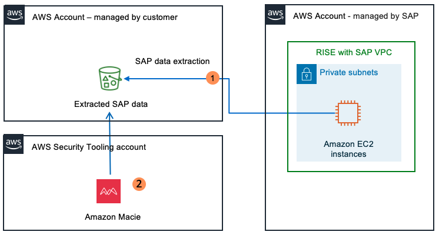

## AWS Certificate Manager (ACM)

**AWS Certificate Manager (ACM)** handles the complexity of creating, storing, and renewing public and private SSL/TLS X.509 certificates and keys that protect your AWS websites 
and applications. 

You can provide certificates for your integrated AWS services either by issuing them directly with ACM or by importing third-party certificates into the ACM management system. 
ACM certificates can secure singular domain names, multiple specific domain names, wildcard domains, or combinations of these. ACM wildcard certificates can protect an unlimited 
number of subdomains. You can also export ACM certificates signed by AWS Private CA for use anywhere in your internal PKI.

ACM can handle two kinds of certificates:

- *Public* - Certificates provided by ACM (Free)
- *Private* - Imported certificates ($400/month)!!!!!

ACM can be attached to the following AWS resources:

- Elastic Load Balancer
- CloudFront
- API Gateway
- Elastic Beanstalk (through ELB)

### ACM SSL Termination

**Terminating SSL at the Load Balancer**

All traffic in-transit beyond the ALB is unencrypted.

You can add as many EC2 instances to the ALB and you don't need to install certificates on each instance. Theoritically, it's less secure.

**Terminating SSL End-to-End**

Traffic in-transit is encrypted, all the way to the application.

Guarantees encryption end-to-end, but it's more complicated to maintain certificates.

### Amazon Cognito

**Amazon Cognito** is a managed Customer Identity and Access Management (CIAM) service that provides scalable user registration, authentication (login), and access control for 
web and mobile apps. It supports social login (Google, Facebook, Apple), enterprise identity federation (SAML/OIDC), and multi-factor authentication (MFA) to enhance security.

- **Cognito User Pools** - User directory authentication to Idp, to grant access to your apps.
- **Cognito Identity Pools** - Provide temporary credentials for users to access AWS Services.
- **Cognito Sync** - Sync user data and preferences across all devices.

### Amazon Detective

**Amazon Detective** is a security service that automatically analyzes and visualizes AWS log data—including CloudTrail, VPC Flow Logs, and GuardDuty findings—to accelerate 
security investigations. It uses machine learning, graph theory, and statistical analysis to uncover the root cause of potential security issues across AWS accounts and 
workloads.

Quickly identify trends for EC2 instances and IAM principles.

- See on a map where API calls are generally being made from.
- See a summary list of how many times specific API calls have been made.
- See how much groups of API calls have increased in volume.
- Launch investigation on specific IAM principles to see if they are utilizing specific tactics
  - Amazon Detective creates a behavior graph in order when making determinations.

### Directory Service

A Directory Service maps the names of network resources to their network addresses. A directory service is shared information infrastructure for locating, managing, 
administering and organizing resources on a network. eg. volumes, folders, printers, users, groups, devices, etc.

A **directory service** is a critical component of a network operating system. Directry services are provided by a directory server. Each resource on the network is considered 
an objetc by the **directory server**. Information about a particuar resource is stored as a collection of attributes associated with that resource or object.

Popular directory services:

- Domain Name Service (DNS)
- Microsoft Active Directory (Azure AD)
- Apache Directory Server
- Oracle Internet Directory (OID)
- OpenLDAP
- Cloud Identity
- JumpCloud

### Active Directory

Microsoft introduced Active Directory Domain Services in Windows 2000, to give organizations a way to managed multiple on-premise infrastructure components and systens using a 
single udentity per user.

### LDAP

**Lightweight Directory Access Protocol (LDAP)** is an open, vendor-neutral, industry standard application protocol for accessing and maintaining distributed directory 
information service over an Internet Protocol (IP) network.

A common use of LDAP is to provide a central place to store usernames and passwords. LDAP enables for **Same Sign-On (SSO)**. Same sign-on allows users to authenticate using a 
single ID and password, but they have to enter it every time they want to login.

**Why use LDAP when SSO is more convenient?**

Most SSO systems are using LDAP, LDAP was not designed natively to work with web applications, and some systems only suport integration with LDAP and not SSO.

### AWS Directory Service

Directory Service provides multiple ways to set up and run Microsoft Active Directory with other AWS services such as Amazon EC2, Amazon RDS for SQL Server, FSx for Windows File 
Server, and AWS IAM Identity Center. Directory Service for Microsoft Active Directory, also known as AWS Managed Microsoft AD, enables your directory-aware workloads and AWS 
resources to use a managed Active Directory in the AWS Cloud.

1. **Simple AD**
   - A Microsoft AD compatible directory, powered by Samba 4.
   - Supports basic AD features.
   - Not available in all regions.

2. **AD Connector**
   - A proxy service to connect your existing on-premise AD directory.

3. **AWS Managed Microsoft AD**
   - A fully managed Microsoft Windows Server Active Directory, running in the AWS Cloud.
   - Supports full AD features.
   - Available in all regions.

4. **Amazon Cognito**
   - Integrate signup and sign-in into your web applications.

### AWS Firewall Manager

**AWS Firewall Manager** simplifies your administration and maintenance tasks across multiple accounts and resources. With Firewall Manager, you set up your protections just 
once and the service automatically applies them across your accounts and resources, even as you add new accounts and resources.

AWS Services that can be managed by Firewall Manager:

- AWS WAF
- AWS WAF Classic
- AWS Shield Advanced
- Amazon VPC security groups
- Network ACLs
- AWS Network Firewall
- Amazon Route 53 Resolver DNS Firewall
- Third Party Firewall Services

Prerequisites:

- Account must be a member of AWS Organizations.
- Account must be the AWS Firewall Manager Admninistrator.
- Must have AWS Config enabled for your accounts and regions.
- Resource Access Manager must be enabled for specific services. eg. AWS Network Firewall or Route 53 Resolver DNS Firewall.

### AWS Inspector

**Amazon Inspector** is a fully managed AWS service that provides automated, continuous vulnerability scanning for EC2 instances, container images (ECR), and Lambda functions. 
It identifies software vulnerabilities and network exposure, offering prioritized risk scores for efficient remediation, integrating with AWS Security Hub and EventBridge for 
automated responses.

AWS Inspector can perform both Network and Host Assessments.

- Install the AWS agent on your EC2 instances.
- Run the assessment for your assessment target.
- Review findings and remediate security risks.

### Amazon Macie

**Amazon Macie** is a data security service that helps customers discover, classify, and protect sensitive data stored in Amazon S3 buckets by continuously monitoring and 
alerting on potential data risks and unauthorized access attempts.

Macie works by using Machine Learning to analyze your ClouTrail logs. Macie has a variety of alerts:

- Anonymized Access
- Config Compliance
- Credential Loss
- Data Compliance
- File Hosting
- Identity Enumeration
- Information Loss
- Location Anomaly
- Open Permissions
- Privilege Escalation
- Ransomware
- Service Disruption
- Suspicious Access

Macie will identify the most at-risk users, which could lead to a compromise.

### AWS Security Hub

**AWS Security Hub** is a unified cloud security solution that prioritizes your critical security issues and helps you respond at scale. Security Hub detects security issues by 
automatically correlating and enriching security signals from multiple sources, such as posture management, vulnerability management (Amazon Inspector), sensitive data (Amazon 
Macie), and threat detection (Amazon GuardDuty).

Security Hub also includes automated response workflows to help you remediate risks, improve team productivity, and minimize operational disruptions. Security Hub receives findings from the following AWS services.

- AWS Security Hub CSPM
- Amazon GuardDuty
- Amazon Inspector
- Amazon Macie

**Features**

1. **Unified security solution**: Gain broader visibility across your cloud environment through centralized management in a unified cloud security solution.

2. **Actionable security insights**: Gain actionable security insights through advanced analytics to learn about security risks associated with your environment.

3. **Reduced response times**: Streamline response times with automated workflows and an integrated ticketing system.

4. **Exposure findings**: Security Hub correlates findings from Security Hub CSPM control checks, Amazon Inspector, and other AWS services to detect exposures associated with AWS resources.

5. **Findings are formatted in the Open Cybersecurity Schema Framework (OCSF)**: Security Hub generates findings in OCSF and receives findings in OCSF from Security Hub CSPM and other AWS services:

   - Amazon GuardDuty
   - Amazon Macie
   - Amazon Inspector

6. **Dashboard**: The Security Hub console provides a comprehensive view of your exposures, threats, security coverage, and resources, as well as an interactive visualization called the attack path graph, which shows how potential attackers can access and take control of resources associated with an exposure finding.

7. **Integrations with third-party products**: You can enhance your security posture with Security Hub integrations. For example, if you use Jira Cloud or ServiceNow ITSM, you can use this feature to create tickets from findings.

