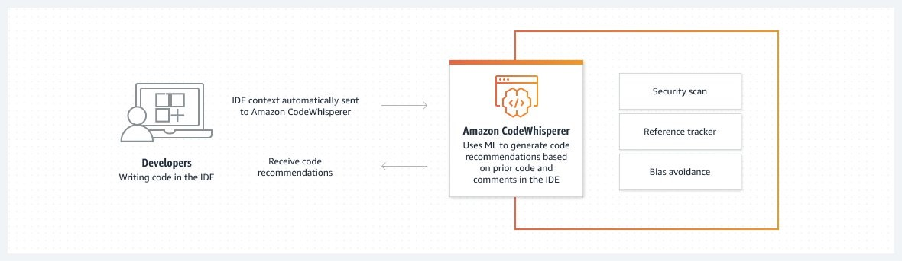

## Amazon Q

**Amazon Q** is a generative AI-powered assistant from AWS designed to help you work faster and more efficiently across various business functions.

1. **Amazon Q Business**: A customizable assistant for general employees. It connects to your company’s internal data (like SharePoint, Slack, and Salesforce) to answer 
questions, summarize documents, and generate content based on your private enterprise information.
2. **Amazon Q Developer**: An expert assistant for software developers and IT professionals. It helps with coding (suggestions and refactoring), testing, troubleshooting AWS 
infrastructure, and modernizing applications (e.g., upgrading Java or porting .NET).
3. **Amazon Q for QuickSight**: Amazon Q in Amazon QuickSight is a generative business intelligence (BI) assistant that allows both analysts and business users to interact with 
data using natural language. It simplifies complex data tasks, such as building dashboards or extracting specific insights, by replacing traditional manual steps with 
4. **Amazon Q for Amazon Connect**: Amazon Q in Amazon Connect (often referred to as Amazon Q in Connect) is a generative AI-powered assistant designed to support both contact 
center agents and end-customers in real-time. It evolved from Amazon Connect Wisdom and is now integrated as a core "AI agent" within the Amazon Connect Assistant.

## Amazon CodeWhisperer

**Amazon CodeWhisperer** is a machine learning (ML)–powered service that helps improve developer productivity by generating code recommendations based on their comments in 
natural language and code in their integrated development environment (IDE).

It integrates with the following IDEs:

- AWS Glue Studio Notebook.
- JetBrains (IntelliJ IDEA, PyCharm, WebStorm, etc.)
- Microsoft Visual Studio Code
- JupyterLab
- Amazon SageMaker Studio
- Visual Studio
- Visual Studio (VS) Code
- Terminal, Shell, CLI

Amazon CodeWhisperer has two tiers, Individual and Professional.

| Individual | Professional |
| --- | --- |
| Authenicate via Code Builder ID | Authenicate via AWS IAM Identity Center |
| In-line Code suggestions | In-line Code suggestions |
| Public code filter and reference tracking | Public code filter and reference tracking |
| Command Line integration | Command Line integration |
| Amazon Q Chat in IDE | Amazon Q Chat in IDE |
| Security vulnerability scanning 50 users/month | Security vulnerability scanning 500 users/month |
| | Customize for organizations |
| | Organizational license management |
| | Organizational policy management |
| | Amazon Q feature development |
| | Amazon Q code Transformation |

