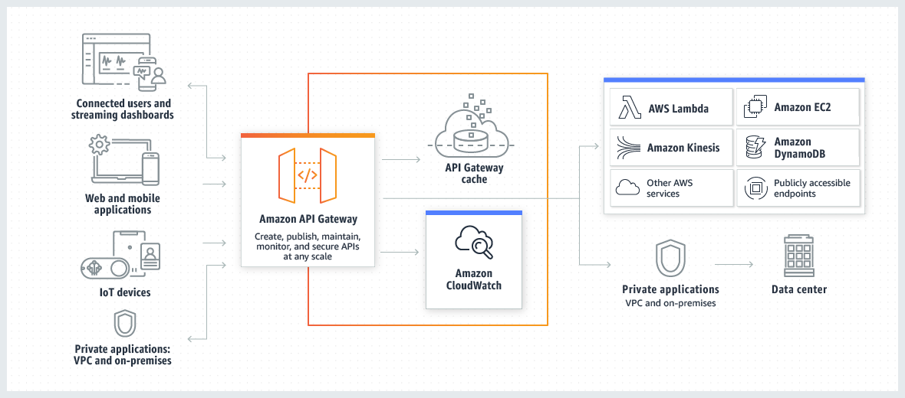
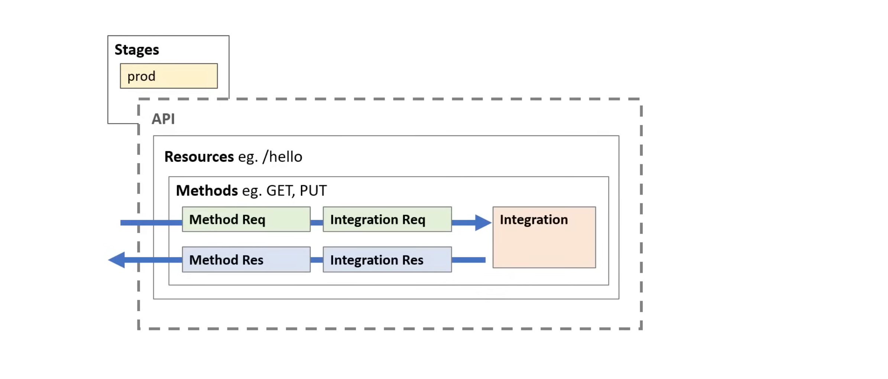
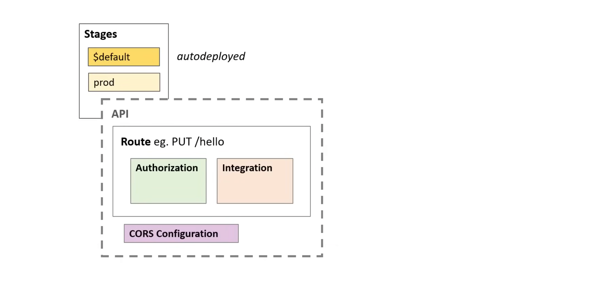

## Amazon API Gateway

**Amazon API Gateway** is an AWS service for creating, publishing, maintaining, monitoring, and securing REST, HTTP, and WebSocket APIs at any scale. It acts as a "front door"
for applications to access data, business logic, or functionality from backend services like AWS Lambda, Amazon EC2, or any web-accessible endpoint. API developers can create
APIs for use in their own client applications.



API Gateway creates RESTful APIs that:

- Are HTTP-based.
- Enable stateless client-server communication.
- Implement standard HTTP methods such as GET, POST, PUT, PATCH, and DELETE.

There are three types of API Gateways:

1. REST API(API Gateway V1)
   - Complete control over requests and response
   - Most feature-rich
   - Higer costs
   - Both private and public APIs

2. HTTP API(API Gateway V2)
   - Low latency
   - Simple feature set
   - Low costs
   - Only Public APIs

3. WebSocket API
  - Persistent connections for real-time use cases such as chat applications or visualization dashboards.

For both REST and HTTP APIs, developers can import an OpenAPI 3 file when creating an API:

```yaml
openapi: 3.0.0
info:
  title: My API
  version: 1.0.0
  description: My Example API
paths:
  /hello:
    get:
      summary: Returns a greetings message
      responses:
        '200':
          description: A Greetings Message
          content:
            application/json:
              schema:
                type: object
                properties:
                  message:
                    type: string
                    example: Hello, World!
```

Importing via CloudFormation:

```yaml
AWSTemplateFormatVersion: '2010-09-09'
Resources:
  # API Gateway REST API
  MyApi:
    Type: AWS::ApiGateway::RestApi
    Properties:
      Name: MyExampleApi
      Description: API Gateway for Lambda integration
      Body:
        'Fn::Transform':
          Name: AWS::Serverless-2016-10-31
          Parameters:
            Location: !Sub 'S3://${BucketName}/openapi.yaml'
```

### OpenAPI Extensions for AWS

AWS Extends the OpenAPI definitions so you can define AWS API Gateway specific features in an OpenAPI file.

Syntax: `x-amazon-apigateway-extension`

- `any-method` object
- `-cors` object
- `-api-key-source` property
- `-auth` object
- `-authorizer` object
- `-authtype` object
- `-binary-media-types` property
- `-documentation` object
- `-endpoint-configuration` object
- `-gateway-responses` object
- `-gateway-responses.gatewayResponses` object
- `-gateway-responses.responseParameters` object
- `-gateway-responses.responseTemplates` object
- `-importexport-version`
- `-tag-value` property
- `-integration` object
- `-integrations` object
- `-integration.requestTemplates` object
- `-integration.requestParameters` object
- `-integration.response` object
- `-integration.responses` object
- `-integration.responseParameters` object
- `-integration.responseTemplates` object
- `-integration.tlsConfig` object
- `-minimum-compression-size`
- `-policy`
- `-request-validator` property
- `-request-validators` object
- `-request-validators.requestValidator` object

#### Examples

1. Example using the `-policy` extension to define IAM Policy for API Paths:

   ```yaml
   ---
   x-amazon-apigateway-policy:
     Version: '2012-10-17'
     Statement: 
     - Effect: Allow
       Principal: "*"
       Action: execute-api:Invoke
       Resource: 
       - execute-api:/*
     - Effect: Deny
       Principal: "*"
       Action: execute-api:Invoke
       Resource: 
       - execute-api:/*
       Condition: 
         IpAddress:
           aws:SourceIp: 
           - 192.0.2.0/24
   ```

2. Example using the `-cors` extension to define CORS for the API:

   ```yaml
   --- 
   x-amazon-apigateway-cors:
     corsConfiguration:
       allowOrigins:
         - "https://example.com"
       allowCredentials: true
       allowHeaders:
         - x-apigateway-header
         - x-amz-date
         -content-type
       allowMethods:
         - "GET"
         - "POST"
         - "OPTIONS"
       exposeHeaders:
         - x-apigateway-header
         - x-amz-date
         -content-type
       maxAge: 300
   ```

### Rest vs HTTP APIs

#### Endpoint Type

| Endpoint Type | REST API | HTTP API |
| --- | --- | --- |
| Edge-optimized | Yes | No |
| Regional | Yes | Yes |
| Private | Yes | No |

#### Security

| Security Features | REST API | HTTP API |
| --- | --- | --- |
| Mutual TLS authentication | Yes | Yes |
| Certificates for backend authentication | Yes | No |
| AWS WAF | Yes | No |

#### Authorization

| Authorization Options | REST API | HTTP API |
| IAM | Yes | Yes |
| Resource Policies | Yes | No |
| Amazon Cognito | Yes | Yes |
| Custom Authorization with a Lambda Function | Yes | Yes |
| JSON Web Token | No | Yes |

#### API Management

| Features | REST API | HTTP API |
| Custom domains | Yes | Yes |
| API Keys | Yes | No |
| Per-client rate limiting | Yes | No |
| Per-client usage throttling | Yes | No |
| Developer Portal | Yes | No |

#### Development

| Features | REST API | HTTP API |
| CORS Configuration | Yes | Yes |
| Test Invocations | Yes | No |
| Caching | Yes | No | 
| User-controlled deployments | Yes | Yes |
| Automatic deployments | No | Yes |
| Custom gateway responses | Yes | No |
| Custom release deploymets | Yes | No |
| Request Validation | Yes | No |
| Request parameter transformation | Yes | Yes |
| Request Body transformation | Yes | No |

#### Monitoring 

| Feature | REST API | HTTP API |
| Amazon CloudWatch Metrics | Yes | Yes |
| Access logs to CloudWatch Logs | Yes | Yes |
| Access logs to Amazon Data Firehose | Yes | No |
| Execution logs | Yes | No |
| AWS X-Ray tracing | Yes | No |

#### Integrations 

| Feature | REST API | HTTP API |
| Public HTTP endpoints | Yes | Yes |
| AWS Services | Yes | Yes |
| AWS Lambda Functions | Yes | Yes |
| Private integrations with Network Load Balancers | Yes | Yes |
| Private integrations with Application Load Balancers | Yes | Yes |
| Private integrations with AWS Cloud Map | No | Yes |
| Mock integrations | Yes | No |
| Response Streaming | Yes | No |

### REST API Components 



1. **API** - A collection of resources and methods that can be exposed through a custom domain name or a stage.
2. **Resources** - A resource represents an endpoint that can be accessed by clients. Resources are nested within other resources. 
3. **Methods** - A method is a HTTP method that can be invoked on a resource. For example, a method can be a GET, POST, PUT, PATCH, or DELETE method. Methods allow users to
   customize request and response.
  - Method Request
  - Integration Request
  - Method Response
  - Integration Response
4. **Integration** - The integration is the backend service that is invoked by the API Gateway. It can be a Lambda function, an EC2 instance, or any other HTTP endpoint.
  - Lambda function (AWS Proxy)
  - HTTP
  - Mock
  - AWS Service
  - VPC Link
5. **Stage** - A stage is a version, a snapshot of the API at a specific point in time. It can be used to deploy the API to different environments such as development, testing, and
   production. It must be deployed in order to be accesible.

### HTTP API Components



1. **API** - A collection of routes and integrations that can be exposed through a custom domain name or a stage.
2. **Routes** - A route is a combination of a HTTP method and a resource path that is invoked by clients. For example, a route can be a GET method on a /users resource. Routes
   are nested within other routes. 
   - You choose the method
   - You define your endpoint
3. **Integration** - The integration is the backend service that is invoked by the API Gateway. It can be a Lambda function, an EC2 instance, or any other HTTP endpoint.
   - Lambda function (AWS Proxy)
   - HTTP
   - AWS Service (limited to specific services)
     - EventBridge, SQS, AppConfig, Kinesis Data Streams, Step Functions 
   - VPC Link
4. **Stage** - A stage is a version, a snapshot of the API at a specific point in time. It can be used to deploy the API to different environments such as development, testing
   and production. It must be deployed in order to be accesible.

   