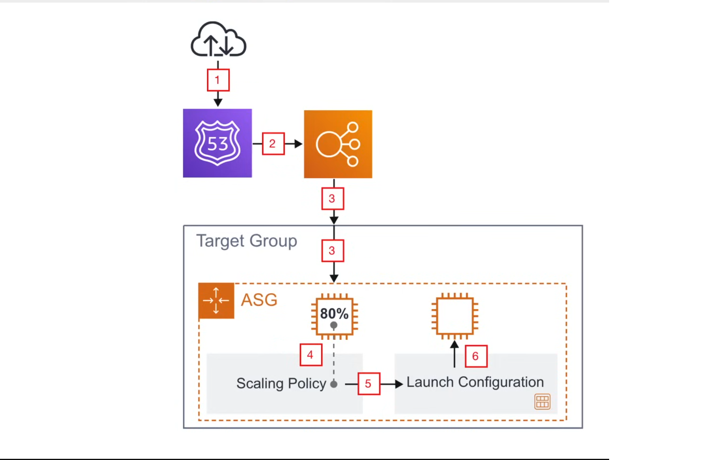
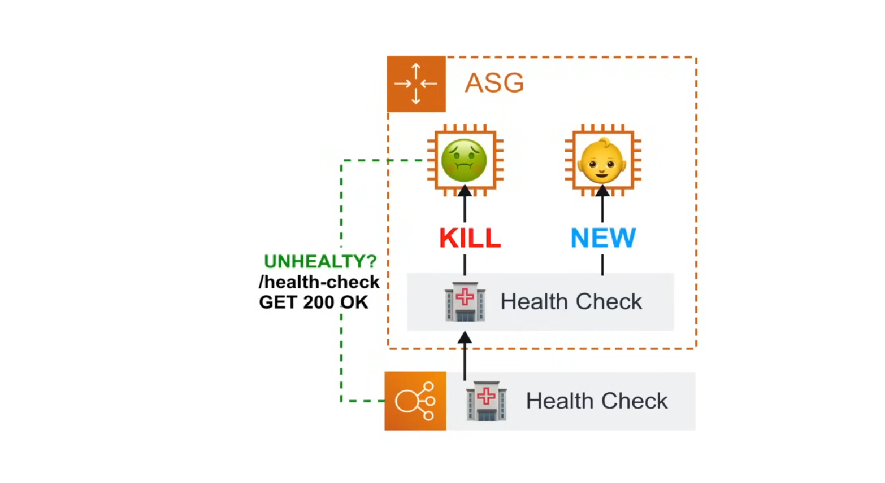
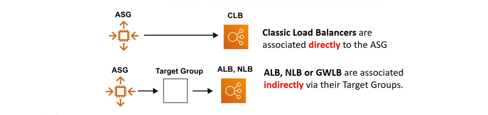
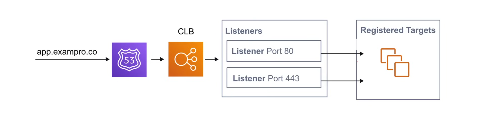
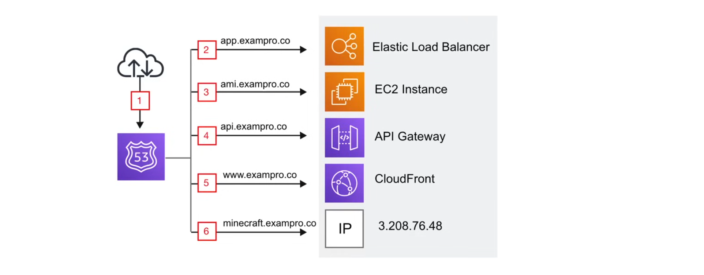

## Auto Scaling Group (ASG)

An **Auto Scaling group (ASG)** is a collection of EC2 instances that are managed by AWS Auto Scaling. The ASG automatically adjusts the number of EC2 instances in the group based on demand. 

Auto Scaling helps you maintain application availability and lets you automatically adjust the number of EC2 instances in response to changing demand. You can use Auto Scaling to automatically scale your Amazon EC2 capacity up or down to meet demand, or on a schedule. Auto Scaling can also automatically replace unhealthy instances with new ones.


Automatic scaling can occur via: 
- **Capacity Settings**: manually setting the expected range of capacity
- **Health Check Replacements**: instances are replaced if they are determined to be unhealthy. Uses EC2 and ELB health checks.
- **Scaling Policies**: set complex rules to determine when to scale up or down 
  - Simple Scaling
  - Step Scaling
  - Target Tracking Scaling
  - Predictive Scaling

ASGs are used to scale **EC2** instances. **ECS** with **EC2** will work, **EKS** with **EC2** will work, but **ECS** with **Fargate** and **EKS** with **Fargate** will not work because Fargate is a serverless container orchestration service.

### ASG Use Cases



1. Burst of traffic hits our domain
2. Route53 points that traffic to our Load Balancer
3. The Load Balancer passes the traffic to it's target group
4. The target group is associated with our ASG and sends the traffic to instances registered to the ASG 
5. The ASG Scaling Policy will check if the instances are near capacity 
6. The Scaling Policy determines that another instance is needed and launches a new EC2 instance with the associated launch configuration to the ASG

### ASG Capacity Settings

The size of an autoscaling group is determined by the following settings:
- **Desired Capacity**: the number of EC2 instances that should ideally be running
- **Minimum Size**: the minimum number of EC2 instances that should at least be running
- **Maximum Size**: the maximum number of EC2 instances that are allowed to be running

To update min size and max size of an ASG:

```bash
aws autoscaling update-auto-scaling-group \
  --auto-scaling-group-name <asg-name> \
  --min-size <min-size> \
  --max-size <max-size>
```
To update desired capacity of an ASG:

```bash
aws autoscaling set-desired-capacity \
  --auto-scaling-group-name <asg-name> \
  --desired-capacity <desired-capacity>
  --honor-cooldown
```
An ASG will always launch instances to meet the minimum size capacity. Changing the min, maxz and desired capacities is considered "manual scaling", since you have to manually change these numbers to change the capacity of the ASG. 

### ASG Health Check Replacements

**Health Check Replacement** is when an ASG replaces instances that have been determined to be unhealthy. There are two types of health checks: 
- **EC2 Health Checks**: If the EC2 instance fails either of it's EC2 health checks, the ASG will replace it.
- **ELB Health Checks**: ASG will perform a health check based on the ELB health check. ELB pings a HTTP endpoint at a specific path, port and status code.

```bash
aws autoscaling update-auto-scaling-group \
  --auto-scaling-group-name <asg-name> \
  --health-check-type ELB \
  --health-check-grace-period 300 \
  --vpc-zone-identifier "subnet-0123456789abcdef0, subnet-0123456789abcdef1, subnet-0123456789abcdef2"
```



### ASG ELB Integration

An Elastic Load Balancer can be attached to an Auto Scaling Group (ASG):

```bash
aws autoscaling attach-load-balancer-target-groups \
  --auto-scaling-group-name <asg-name> \
  --target-group-arns <target-group-arn> \
  --target-group-port 80
```



An attached ELB means that the ASG will use the ELB health checks to determine if an instance is healthy. 

### ASG Dynamic Scaling Policies

**Dynamic Scaling Policies** are how much ASGs should change the capacity. They allow you to automatically adjust the size of an ASG based on demand. There are three dynamic scaling policies:

- **Simple Scaling**: A single CloudWatch alarm triggers a single scaling action.
- **Step Scaling**: A CloudWatch alarm triggers a scaling action based on the size of the alarm breach.
- **Target Tracking Scaling**: A CloudWatch alarm triggers a scaling action to maintain a target value for a metric.

Adjustment types determine how capacity should change (only applicable to Simple and Step Scaling):
- **ChangeInCapacity**: Change capacity based on the scaling adjustment
- **ExactCapacity**: Change capacity to an exact number
- **PercentChangeInCapacity**: Change capacity by a percentage

#### Simple Scaling Policy

**Simple Scaling Policies** simply change capacity in either direction by a certain amount when a CloudWatch alarm is triggered.
 
Create the scale-in/scale-out policies:

```bash
# Scale Out
aws autoscaling put-scaling-policy \
  --auto-scaling-group-name  my-asg \
  --policy-name my-simple-scale-out-policy \
  --scaling-adjustment 30 \
  --adjustment-type PercentageChangeInCapacity 

# Scale In
aws autoscaling put-scaling-policy \
  --auto-scaling-group-name my-asg \
  --policy-name my-simple-scale-in-policy \
  --scaling-adjustment -1 \
  --adjustment-type ChangeInCapacity \
  --cooldown 300
```

Create the CloudWatch alarms:

```bash
# Scale Out
aws cloudwatch put-metric-alarm \
  --alarm-name my-simple-scale-out-alarm \
  --alarm-description "Scale out when CPU > 70%" \
  --metric-name CPUUtilization \
  --namespace AWS/EC2 \
  --statistic Average \
  --period 60 \
  --evaluation-periods 2 \
  --threshold 70 \
  --comparison-operator GreaterThanThreshold \
  --alarm-actions <scale-out-policy-arn> \
  --dimensions Name=AutoScalingGroupName,Value=my-asg \
  --unit Percent
```

```bash
# Scale In
aws cloudwatch put-metric-alarm \
  --alarm-name my-simple-scale-in-alarm \
  --alarm-description "Scale in when CPU < 30%" \
  --metric-name CPUUtilization \
  --namespace AWS/EC2 \
  --statistic Average \
  --period 60 \
  --evaluation-periods 2 \
  --threshold 30 \
  --comparison-operator LessThanThreshold \
  --alarm-actions <scale-in-policy-arn> \
  --dimensions Name=AutoScalingGroupName,Value=my-asg \
  --unit Percent
```

When using Simple Scaling Policies, it is recommended to set a cooldown period. The cooldown period is the amount of time that the ASG should wait before performing another scaling action after a scaling action has been performed. 

It also not recommended to use **Simple Scaling Policies** and cooldown periods together, and instead opt for **Step Scaling Policies** or **Target Tracking Scaling Policies**.

#### ASG Step Scaling Policy

**Step Scaling Policies** changes capacity in either direction by a certain amount at different thresholds (steps), when a CloudWatch alarm is repeatedly triggered. 

```bash
aws autoscaling put-scaling-policy \
  --auto-scaling-group-name my-asg \
  --policy-name my-step-scale-out-policy \
  --policy-type StepScaling \
  --adjustment-type PercentChangeInCapacity \
  --metric-aggregation-type Average \
  --step-adjustments MetricIntervalLowerBound=0.0,MetricIntervalUpperBound=15.0,ScalingAdjustment=10 \
                     MetricIntervalLowerBound=15.0,MetricIntervalUpperBound=25.0,ScalingAdjustment=20 \
                     MetricIntervalLowerBound=25.0,ScalingAdjustment=30 \
  --min-adjustment-magnitude 1
```

#### ASG Target Tracking Scaling Policy

**Target Tracking Scaling Policies** automatically adjust capacity based on the target metric value.

```bash
aws autoscaling put-scaling-policy \
  --auto-scaling-group-name my-asg \
  --policy-name my-target-tracking-policy \
  --policy-type TargetTrackingScaling \
  --target-tracking-configuration file://config.json
```

**config.json**:

```json
{
  "TargetValue": 70,
  "PredefinedMetricSpecification": {
    "PredefinedMetricType": "ASGCPUUtilization"
  }
}
```

**Metric Types**

- ASGAverageCPUUtilization
- ASGAverageNetworkIn
- ASGAverageNetworkOut
- ALBrequestCountPerTarget
- Custom Metric

**Target Tracking Scaling Policy** will create two CloudWatch alarms whereas with **Simple Scaling Policy** and **Step Scaling Policy** you have to create the CloudWatch alarms manually, unless using the AWS Console which creates the alarms automatically for you.

#### ASG Predictive Scaling Policy

**Predictive Scaling Policies** triggers scaling by analyzing historical load data to detect daily and weekly patterns in traffic flow. It then uses this analysis to predict future load and adjust capacity accordingly.

- Reuires a 24 hour forecast of CloudWatch data before it can be used.
- Predictive Scaling Policy will continuosly use the last 14 days of data to tweak the policy
- It will produce hourly forecast for capacity requirements for the next 48 hours
- It will update every 6 hours using the latest CloudWatch data

```bash
aws autoscaling put-scaling-policy \
  --auto-scaling-group-name my-asg \
  --policy-name my-predictive-scaling-policy \
  --policy-type PredictiveScaling \
  --target-tracking-configuration file://config.json
```

**config.json**:

```json
# Forecast Only
{
  "MetricSpecifications": [
    {
      "TargetValue": 40,
      "PredefinedMetricSpecification": {
        "PredefinedMetricType": "ASGCPUUtilization"
      }
    }
  ],
  "Mode": "ForecastOnly"
}

# Forecast and Scale
```json
{
  "MetricSpecifications": [
    {
      "TargetValue": 40,
      "PredefinedMetricSpecification": {
        "PredefinedMetricType": "ASGCPUUtilization"
      }
    }
  ],
  "Mode": "ForecastAndScale"
}
```

### ASG Termination Policies

**ASG Termination Policies** decide the order for terminating instances during scale-in events.

AWS provides predefied termination policies:

1. Default
2. AllocationStrategy
3. OldestLaunchTemplate
4. OldestLaunchConfiguration
5. OldestInstance
6. NewestInstance
7. ClosestToNextInstanceHour

**Custom Termination Policy**

```bash
aws autoscaling put-termination-policy \
  --auto-scaling-group-name my-asg \
  --termination-policies \
  "OldestInstance" \
  "NewestInstance" \
  "ClosestToNextInstanceHour" \
  "AllocationStrategy" 
```

You can create a custom termination policy by invoking a Lambda Function.

## Elastic Load Balancer (ELB)

A **Load Balancer** is a service that distributes incoming traffic across multiple targets, such as EC2 instances, containers, and IP addresses. They can balance the load via different rules which vary based on the type of load balancer.

**Elastic Load Balancer** is a suite of load balancers used to distribute traffic to multiple EC2, ECS, Fargate, and EKS instances. 

### Types of Load Balancers

There are four types of load balancers:

1. **Application Load Balancer (ALB)**
   - Operates at OSI Layer 7 (Application Layer)
   - Suitable for HTTP/HTTPS traffic
   - Capable of routing based on HTTP information, can leverage Web Application Firewall (WAF)
2. **Network Load Balancer (NLB)**
   - Operates at OSI Layer 3/4 (Transport Layer)
   - Suitable for TCP/UDP traffic
   - Designed for large throughput of low-level traffic
3. **Gateway Load Balancer (GWLB)**
   - Routes traffic to virtual appliances before it reaches the target
   - Used as a security layer for traffic in transit
4. **Classic Load Balancer (CLB)**
   - Operates on OSI layer 7 and 3/4
   - Doesn't use target groups, it directly attaches to targets
   - Previous generation of LBs that is only used in legacy cases where clients have not migrated to ALB or NLB.

### ELB Traffic Rules

For a **Classic Load Balancer(CLB)**, traffic is sent to the listeners. When the port matches, it forwards the traffic to any EC2 instances that are registered to the Classic Load Balancer. CLB does not allow application of rules to the listeners.



### Application Load Balancer (ALB)

- **ALB** is designed to balance HTTP and HTTPS traffic
- It operates at layer 7 of the OSI model
- It has a feature called request routing, which allows addition of routing rules to the listeners based on the HTTP protocol
- Supports Web Sockets and HTTP/2 for real-time, bi-directional communication applications
- It can handle authentication and authorization of HTTP requests
- Can only be accessed via it's hostname. If a static IP is required, forward an NLB to the ALB
- AWS Web Application Firewall (WAF) can be placed in front of ALB for OWASP Protection
- AWS Certificate Manager (ACM) can be attached to listeners to server custom domains over SSL/TLS for HTTPS
- Global Accelerator can be placed in front of ALB to improve global availability
- Amazon CloudFront can be placed in front of ALB to improve global caching of common HTTP requests
- Amazon Cognito can be used to authenticate users via incoming HTTP requests

#### ALB Use Cases

1. Microservices and Containerized Applications
2. e-commerce and retail websites
3. Corporate Website and Web Applications
4. SaaS Applications

### Network Load Balancer (NLB)

- NLB is designed to balance TCP/UDP traffic
- It operates at layer 3/4 of the OSI model
- It can handle millions of requests per second while still maintaining extremely low latency
- Global Accelerator can be placed in front of NLB to improve global availability
- Preserves the client's source IP
- When a static IP is required for a Load Balancer

#### NLB Use Cases

1. High-Performanc Computing and Big Data Applications
2. Real-Time and Multiplayer Gaming Platforms
3. Financial Trading Platforms
4. IoT and Smart Device Ecosystems
5. Telecommunications Networks

### Classic Load Balancer (CLB)

- CLB is AWS's first Load Balancer (legacy)
- Can balance HTTP, HTTPS, or TCP traffic (not at the same time)
- It can use Layer 7(OSI Model) specific features such as sticky sessions
- It can also use strict Layer 4(OSI Model) balancing for purely TCP applications

CLB is not recommended for use, instead opt for NLB or ALB.

## AWS Route 53

**Route 53** is a highly available and scalable cloud Domain Name System (DNS) web service. Think GoDaddy or NameCheap, but with integrations with AWS Services. 

Route 53 can be used to:

1. Register domain names
2. Create various record sets on a domain
3. Implement complex traffic flows eg. blue/green deployments, failovers
4. Continuously monitor records via health checks
5. Resolve VPCs outside of AWS

### Route 53 Use Cases

Route 53 is used to map your custom domain name to your AWS resources eg. EC2, ALB, NLB, etc. 



1. Incoming internet traffic
2. Route traffic to our web app backend by ALB
3. Route traffic an instance we use to tweak our AMI
4. Route traffic to an API Gateway which powers our API
5. Route traffic to CloudFront which serves our S3 static-hosted website
6. Route traffic to an Elastic IP, which is a static IP that hosts the companies Minecraft Server

### Route 53 Hosted Zones

A **hosted zone** is a container that holds the DNS record sets, scoped to route traffic for a specific domain or subdomains. 

There are two types of hosted zones:

1. **Public Hosted Zone**
   - Used to route traffic for domains that are accessible on the internet
   - Contains NS and SOA records
   
   ```bash
   aws route53 create-hosted-zone \
     --name "example.com" \
     --caller-reference "$(date +%s)" \
     --hosted-zone-config Comment="My Public Hosted Zone"
   ```

2. **Private Hosted Zone**
   - Used to route traffic for domains that are only accessible within a VPC
   - Contains NS and SOA records

   ```bash
   aws route53 create-hosted-zone \
     --name "vpc.example.com" \
     --vpc VPCRegion=ca-central-1,VPCId=vpc-12345678 \
     --caller-reference "$(date +%s)" \
     --hosted-zone-config PrivateZone=true
   ```

Let's say we wanted to build a SaaS product where each customer gets their own subdomain on the app subdomain. eg. customer1.app.mysaasapp.com.

1. Create a hosted zone domain
   - Create a record set to the subdomain pointing to the nameservers of the subdomain
2. Create a hosted zone for the subdomain eg. App
   - Create a record set for the wildcard to send traffic back to the root of the subdomain.

```yaml
Resources:
  DomainHZ:
    Type: AWS::Route53::HostedZone
    Properties:
      Name: mysaasapp.com
    SubdomainHZ:
      Type: AWS::Route53::HostedZone
      Properties:
        Name: app.mysaasapp.com
    RecordSet:
      Type: AWS::Route53::RecordSet
      Properties:
        HostedZoneId: !Ref DomainHZ
        Name: "*.app.mysaasapp.com"
        Type: A
        TTL: 300
        ResourceRecords:
          - !GetAtt SubdomainHZ.NameServers
    WildcardRecordSet:
      Type: AWS::Route53::RecordSet
      Properties:
        HostedZoneId: !Ref SubdomainHZ
        Name: "*.app.mysaasapp.com"
        Type: A
        ResourceRecords:
          - "app.mysaasapp.com"
```

### Route 53 Record Sets

Record sets are a collection of records which determine where to send traffic. Route 53 supports the following record types:

- A record
- AAAA record
- CAA record 
- CNAME record
- DS record
- MX record
- NAPTR record
- NS record
- PTR record
- SOA record
- SRV record
- SPF record
- TXT record

Record sets are always changes in batch via the API:

```bash
aws route53 change-resource-record-sets \
  --hosted-zone-id "Z1234567890" \
  --change-batch file://change-batch.json
```

The `change-batch.json` file:

```json
{
  "Changes": [
    {
      "Action": "UPSERT",
      "ResourceRecordSet": {
        "Name": "blog.example.com",
        "Type": "CNAME",
        "TTL": 300,
        "ResourceRecords": [
          {
            "Value": "news.example.com"
          }
        ]
      }
    }
  ]
}
```

There are three action types for record sets:

- `CREATE` - Creates a resource record set that has the specified values.
- `DELETE` - Deletes an existing resource record set that has the specified values.
- `UPSERT` - Updates an existing resource record set that has the specified values, or creates a resource record set that has the specified values if it does not exist.

