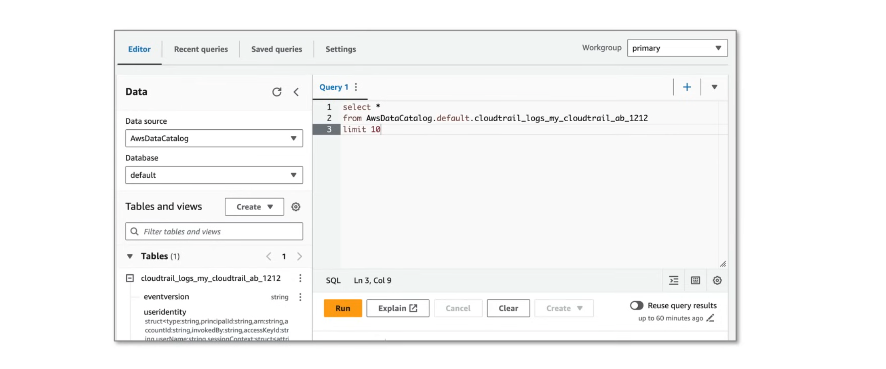

## Amazon Athena

**Amazon Athena** is a serverless, interactive query service that enables analysis of data directly in Amazon S3 using standard SQL. It requires no infrastructure management,
providing quick insights by automatically running queries in parallel, charging only for the data scanned—typically $5 per terabyte. Athena is based off the open-source distributed query engine Apache Presto.

Athena can do two things:

1. **Athena SQL**: Let's you run SQL queries on S3 buckets.
    - Athena uses Tinro SQL which is a fork of Apache Presto.
    - Can access via the AWS Management Console to run queries.
    - JDBC or ODBC drivers are used to interact with Athena.
    - Queries are done via the AWS CLI or AWS SDK.
2. **Apache Spark on Amazon Athena**: Interactively run data analytics using Apache Spark. 
    - Access is via Jupyter compatible notebooks with Apache Spark.

Since Athena is severless, you only pay for what you use. Athena integrates with the following AWS services:

- CloudFormation
- CloudFront
- CloudTrail
- DataZone
- ELB
- EMR
- AWS Glue Data Catalog
- IAM
- QuickSight
- S3 inventory
- Step Functions
- System Manager Inventory
- VPC

### SQL Components



1. **Workgroup**: Saved queries which you grant other users access to.
2. **Data Source**: A group of databases(somtimes referred to as catalog).
3. **Databases**: A group of tables(sometimes called a schema).
4. **Table**: Data organized as a group of rows and columns.
5. **Dataset**: The raw data of the table.

- **Data Definition Language (DDL)**: A subset of SQL to define schema. eg. `CREATE`, `ALTER`, `DROP`.
- **Data Manipulation Language (DML)**: A subset of SQL to manipulate data. eg. `SELECT`, `INSERT`, `UPDATE`, `DELETE`.
- **Data Query Language**: A subset of SQL to select datasets. eg. `SELECT`

The workflow of Athena is often to dump the query results to the destination S3 bucket. 

### SQL Data Types

- **Boolean**: `true` or `false`
- **Tinyint**: 8-bit signed integer, -128 to 127
- **Smallint**: 16-bit signed integer, -32,768 to 32,767
- **Integer**: 32-bit signed integer, -2,147,483,648 to 2,147,483,647
  - Int - used in DDL queries for CREATE TABLE
  - Integer - used in DQL queries for SELECT
- **Bigint**: 9.2 quintillion in either direction
- **Float**: 32-bit signed single-precision floating point number
- **Double**: 64-bit signed double-precision floating point number
- **Decimal**: specifies the extra precision and scale, both values max to 38
- **Char(n)**: Fixed length character data expected provided by n. eg. `char(3) = cat, dog, car`
- **Varchar(n)**: Variable length character data expected provided by n. eg. `varchar(3) = cat, dog, car`
- **String**: A string literal enclosed in single or double quotes 
- **Ipaddress**: represents an IP address in DML queries, not supported for DDL.
- **Binary**: Used in parquet
- **Date**: In ISO format, ie. YYYY-MM-DD
- **Timestamp**: Data and time instant in `java.sql.Timestamp` eg. (2008-09-15 03:04:05.324)
- **Arrsy<data-type>**: An array of data type eg. `ARRAY[1,2,3]`
- **Map<primitive-type, data-type>**: A map of key-value pairs eg. `MAP(ARRAY['foo', 'bar'], ARRAY[1,2])`
- **Struct<col_name:data_type, ...>**: A collection of elements of different component types.

### SQL Table

Tables can be created in two ways:

1. Using SQL CREATE statements
2. Using AWS Glue Wizard

Tables can be created automatically using AWS Glue Crawlers, which will crawl the data to produce a table schema. Athena tables are AWS Glue Data Catalog tables, and so they will exist in both services when creating an Athena table.

When you query FROM, you'll use AWSDataCatalog:

```sql
SELECT *
FROM "AWSDataCatalog"."DATABASE_NAME"."TABLE_NAME"
WHERE "COLUMN_NAME" = 'VALUE'
LIMIT 10;
```
