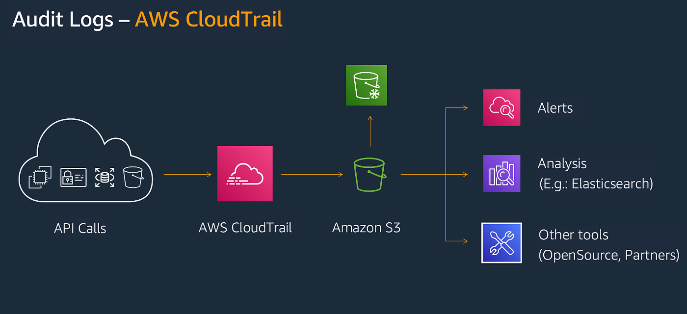
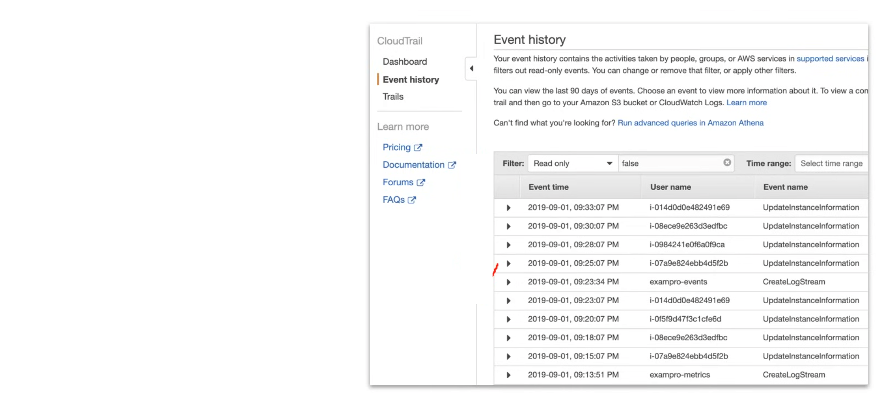

## AWS CloudTrail

AWS CloudTrail is a foundational governance and security service that records user activity and API calls across your AWS infrastructure. It provides a detailed log of "who did
what, where, and when," essential for compliance auditing, security monitoring, and troubleshooting, covering actions from the console, CLI, and SDKs.

AWS CloudTrail is used to monitor API Calls and Action made on an AWS account, to easily identify which users and accounts made the call to AWS. eg.

- Who - user, user agent
- What - region, resource, action
- Where - source IP Address
- When - event time 

CloudTrail already logs by default and will collect logs for 90 days, via Event History. For longer retention, users can create a trail. Trails are output to S3 and do not have
a GUI like Event Hisory. To analyze a Trails you'd have to use Amazon Athena. 

