## The Pillars of Observability

**Observability** is the ability to measure and understand how internal systems work, in order to answer questions regarding performance, tolerance, security, and faults within a system or application.

To obtain observability, you need to use Metrics, Logs, and Traces. Using them together will provide you with a comprehensive view of your system's health and performance.

1. **Metrics**
   - Metrics are numerical values that represent the state of a system at a particular point in time.

2. **Logs**
   - Logs are records of events that occur within a system at a particular point in time.

3. **Traces**
   - Traces are records of requests that flow through a system/app/service that pinpoint performance or failures.

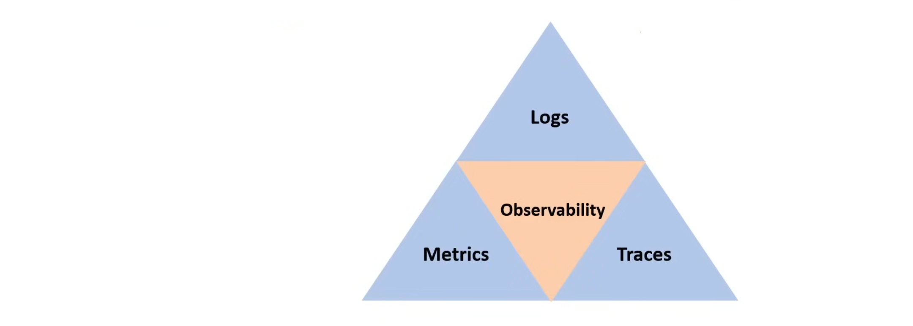

**Alarms** is sometimes referred to as the fourth pillar of observability.

## AWS CloudWatch

**AWS CloudWatch** is a monitoring and observability service that provides visibility into the performance and health of AWS resources and applications running on AWS. It collects and tracks metrics, collects and monitors log files, and sets alarms and responds to changes in your AWS resources.

**CloudWatch** is really just an umbrella service, meaning that it's a collection of monitoring tools as follows:

1. **Logs**
   - Any custom log data
   - Application logs, Nginx logs, Lambda Logs, etc
2. **Metrics**
   - Represents a time series of data points.
   - A variable to monitor, eg. CPU Utilization, Memory Usage, etc
3. **Events**
   - Triggered by a specific action or condition.
   - eg. Take a snapshot of the server every hour(known as Amazon EventBridge)
4. **Alarms**
   - Triggers notifications based on metrics which breach a defined threshold.
5. **Dashboards**
   - Visualize metrics and logs in a single view.
6. **ServiceLens**
   - Visualize and analyze the health, performance, and availability of your applications and services in a single place.
7. **Container Insights**
   - Collects, aggregates, and summarizes metrics and logs from your containerized applications and microservices running on AWS or on-premises.
8. **Synthetics**
   - Test your web applications and APIs for performance and availability.
9. **Contributor Insights**
   - View the top contributors impacting system and application performance in real-time.

CloudWatch Logs is the basis for many CloudWatch services.

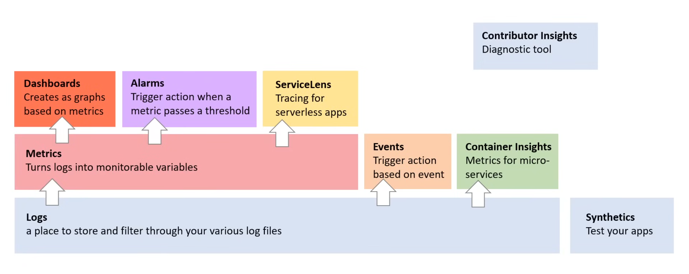

### CloudWatch Logs

**CloudWatch Logs** is a centralized log management service used to monitor, store, and access log data from applications, services, and devices. 

- CloudWatch Logs can be exported to **S3** for tasks such as custom analysis, long-term storage, and backup.
- CloudWatch Logs can be streamed to an **Elasticsearch** cluster in real-time to have more robust full-text search capabilities or use with the ELK Stack.
- **CloudTrail** can be turned on to stream event data to a CloudWatch Log Group.
- By default, log groups are encrypted at rest using **SSE** but users can use their own Customer Master Keys (CMKs) with AWS KMS.
- CloudWatch Logs can be filtered using a Filtering Syntax and CloudWatch Logs has a sub-service called **CloudWatch Insights**.
- By default, Logs are **kept indefinitely and never expire**, but the retention policy can be adjusted for each log group.
  - keeping the indefinite retention
  - choosing a retention period between 1 Day - 10 years

Most AWS Services are integrated with CloudWatch Logs. Logging of services ***sometimes needs to be turned** on or requires the IAM Permission to CloudWatch Logs.

### CloudWatch Log Groups

**Log Groups** are a collection of log streams. It's very common to name log groups with a forward slash syntax:

- `/aws/example/prod/app`
- `/aws/example/prod/db`
- `/aws/example/dev/app`
- `/aws/example/dev/db`

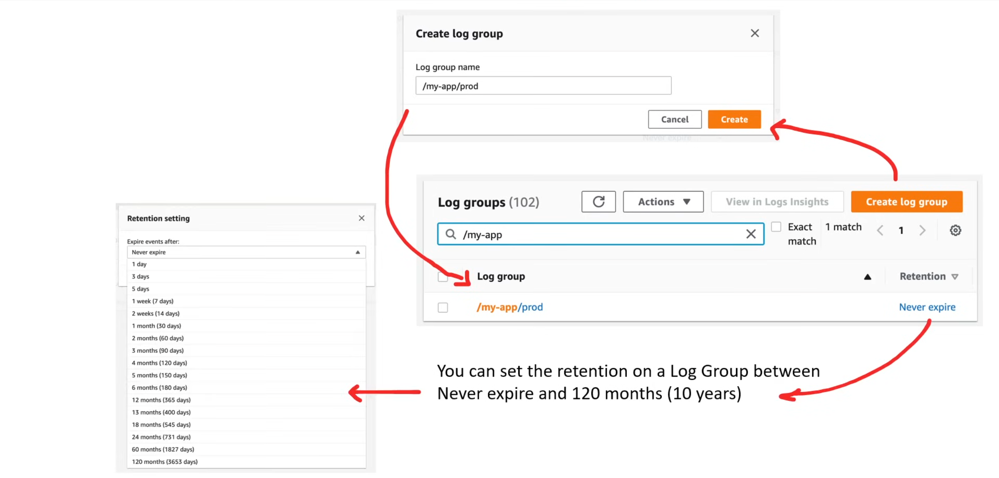

### CloudWatch Log Streams

**Log Streams** represent a sequence of events from an application or instance being monitored. Log Streams can be created manually, but generally they are created automatically by the service sending logs to CloudWatch Logs.

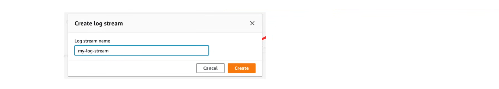

#### Lambda Log Streams

Here is a Log Group of a Lambda function. We can see here the Log Streams are named after the running instance. Lambdas frequency run on new instances, so the log streams contain timestamps.


#### EC2 Application Log Streams

Here is a Log Group of an application running on EC2. We can see here the Log Streams are named after the running instance's ID.

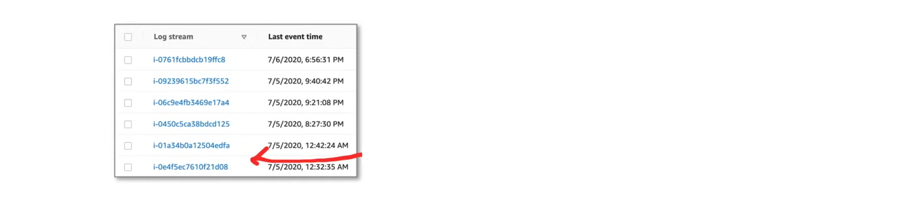

#### AWS Glue

Here is a Log Group of an AWS Glue job. We can see here the Log Streams are named after the Glue Jobs.


### CloudWatch Log Events

**Log Events** represent a single event in a log file. Log events can be seen within a Log Stream.

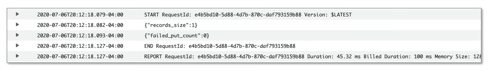

Filter events can be used to filter log events based on simple or pattern matching syntax:

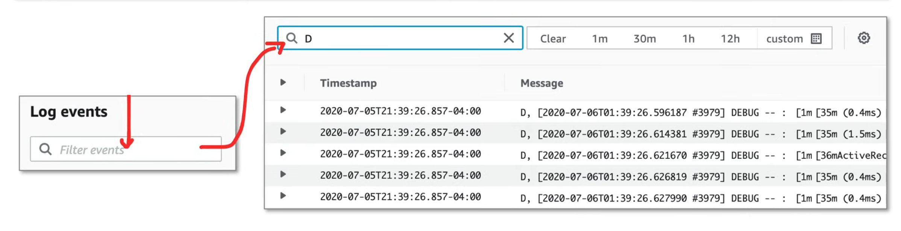

### CloudWatch Logs Insights

**CloudWatch Logs Insights** enables users to interactively search and analyze log data in CloudWatch Logs. It allows users to query their log data using a powerful query language, and visualize the results in charts and graphs.

**Advantages**

- More ribust filtering compared to using simple filter events on log streams
- Less burdensome that having to export logs to S3 and analyze them via Athena

CloudWatch Logs Insights supports all types of logs. CloudWatch Logs Insights is often used via the console to do ad-hoc queries against Log Groups.

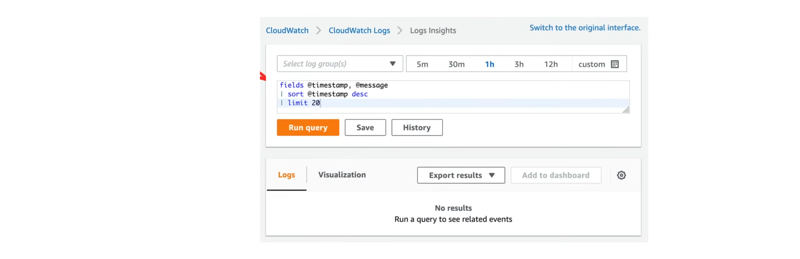

CloudWatch Insights has its own language called **CloudWatch Logs Insights Query Syntax**:

```text
filter action="REJECT"
| stats count(*) as numRejections by srcAddr
| sort numRejections desc
| limit 20
```
- A single request can query up to 20 log groups
- Queries timeout after 15 minutes if they have not completed
- Query results are available for 7 days

AWS provides sample queries for common use cases, and to ease learning the query syntax:

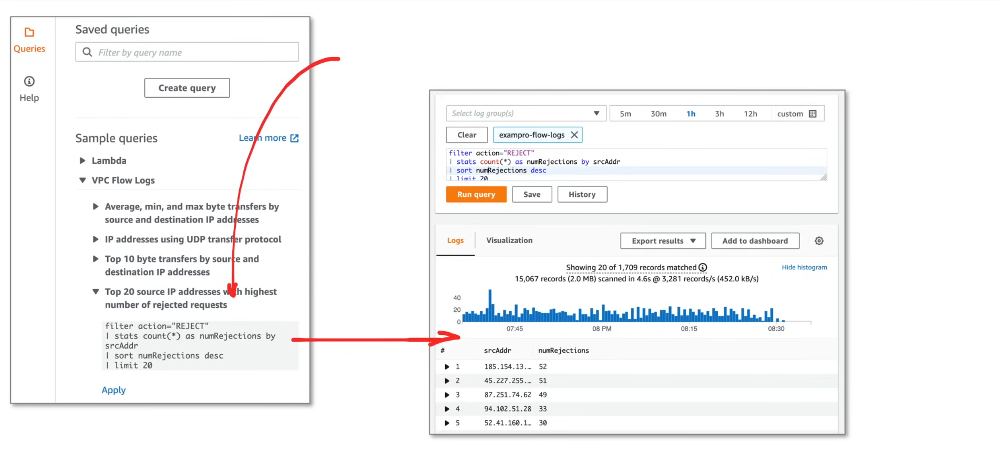

Users can create custom queries to analyze their log data, and save them for future use.

### CloudWatch Discovered Fields

When CloudWatch Logs Insights reads log data, it will first analyze the log events and try to structure the content by generating fields that can be used in a query. CloudWatch Logs Insights inserts the @ symbol at the start of the fields it generates.

Five system fields are automatically generated:

- @timestamp - the event timestamp contained in the log event's timestamp field
- @message - the raw unparsed log event 
- @ingestionTime - the time when the log event was received by CloudWatch Logs
- @logStream - the name of the log stream that the log event belongs to
- @log - a log group identifier in the form of `account-id:log-group-name`

CloudWatch Log Insights automatically discovers fields in logs of AWS services such as:

- **Amazon VPC Flow Logs**: @timestamp, @logStream, @message, accountId, endTime, startTime, version, action, bytes, interfaceId, srcAddr, dstAddr, srcPort, dstPort, protocol, packets, logStatus
- **Amazon Route53**: @timestamp, @logStream, @message, edgeLocation, hostZoneId, protocol, queryName, queryTimestamp, resolverIp, responseCode, version
- **AWS Lambda**: @timesstamp, @logStream, @message, @requestId, @duration, @billedDuration, @type, @maxMemoryUsed, @memorySize, @xrayTraceId, @xraySegmentId 
- **AWS CloudTrail**: evenVersion, evenTime, eventSource, eventName, awsRegion, sourceIPAddress, userAgent, etc.
- **JSON Logs**: The fields of a JSON Log are turned into fields
- **Other Types of Logs**: Fields that CloudWatch Logs Insights doesn't automatically discover can be parsed using the `parse` command in the query syntax. 

You can see all the discovered fields by CloudWatch Insights here:

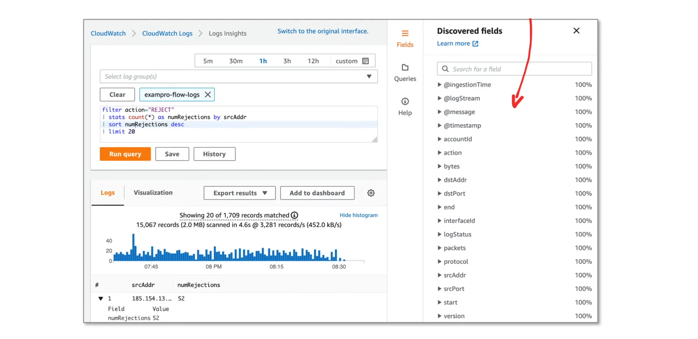

### CloudWatch Metrics

**CloudWatch Metrics** represent a time-ordered set of data points. They are used to monitor the performance and health of your resources and applications. CloudWatch Metrics are collected by CloudWatch Agents, which are installed on your resources and applications. CloudWatch Metrics are stored in CloudWatch Logs, which are then used to create CloudWatch Dashboards and CloudWatch Alarms.

CloudWatch comes with many predefined metrics that are generally name spaced by AWS service.

**EC2 Per-Instance Metrics**

- CPUUtilization
- DiskReadOps
- DiskWriteOps
- DiskReadBytes
- DiskWriteBytes
- NetworkIn
- NetworkOut
- NetworkPacketsIn
- NetworkPacketsOut

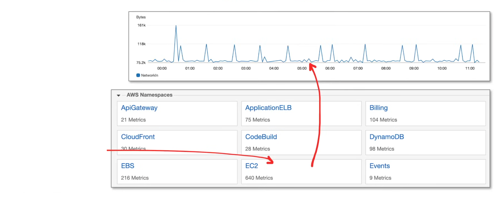

Users can publish their own custom metrics using the AWS CLI or SDK:

```bash
aws cloudwatch put-metric-data \
    --namespace "MyNamespace" \
    --metric-name "MyMetric" \
    --unit Bytes \
    --value 2347237 \
    --dimensions "Name=MyDimension,Value=MyValue"
```

When you publish a custom metric, the resolution can be defined as either:

- standard (1 minute)
- high (>1 minute - 1 second)

With high resolution, you can track it in terms of:

- 1 second
- 5 seconds
- 10 seconds
- 30 seconds
- multiple of 60 seconds

### Availability of Data

When an AWS Services emits data to AWS CloudWatch, the availability of the data varies based on the service. Some services emit data every 5 minutes, while others emit data every 1 minute.

Majority of AWS services data availability is 1 minute.

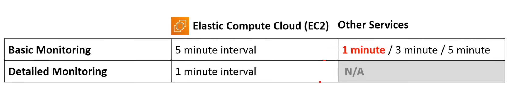

### CloudWatch Agent an Host Level Metrics

There are some agents you might think are tracked by default for EC2 instances, but they are not. They require installed the CloudWatch Agent. 

1. **Host Level Metrics**

These are what you get without installing the CloudWatch Agent:

- CPU Usage
- Network Usage
- Disk Usage
- Status Checks
  - Underlying Hypervisor status
  - Underlying EC2 Instance status

2. **Agent Level Metrics**

These are what you get with the CloudWatch Agent:

- Memory Utilization
- Disk Swap Utilization
- Disk Space Utilization
- Page file Utilization
- Log Collection

The CloudWatch Agent is also used to collect various logs from an EC2 instance and send them to a CloudWatch Log Group.

### CloudWatch Agent - Log Collection

The CloudWatch Agent can be configured to collect various logs from a running EC2 instance and send them to a CloudWatch Log Group. To send logs:

- the agent configuration needs to be updated to include the logs
- the CloudWatch Agent needs to be restarted

The Agent's configuration file is located at `/opt/awslogs/awslogs.conf`.

You specify the location of the log file and the log group you want to send the logs to in the configuration file.

```config
# sample_application_logs
log_group_name = sample/python/logs/production
log_stream_name = {instance_id}
datetime_format = %Y-%m-%d %H:%M:%S
file = /var/www/my-app/current/log/production.log
```

Then restart the CloudWatch Agent to apply the changes:

```bash
sudo systemctl restart awslogs
```

### Installing CloudWatch Agent

The CloudWatch Agent can be installed using AWS Systems Manager (SSM) Run Command onto the target EC2 instance. 

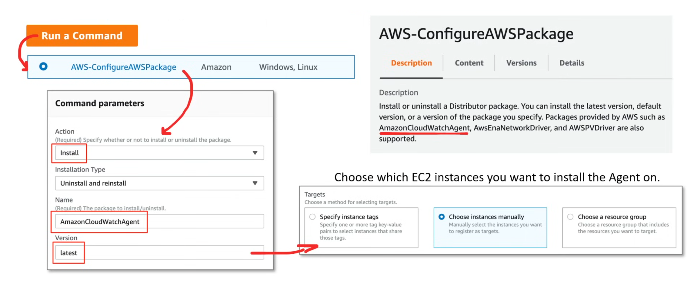

The CloudWatchAgentServerRole IAM role needs to be attached to the EC2 instance to be able to run the agent on the instance.

## AWS EventBridge

**AWS EventBridge** is a serverless event bus service that makes it easier to connect applications together using data from your own applications, integrated SaaS applications, and AWS services.

### Anatomy of an Event

The top level fields listed will always be present in an event. The `detail` field will vary based on the AWS service that emits the event.

```json
{
  "version": "0",
  "id": "6f8f3c4a-3f8f-4f8f-8f8f-8f8f8f8f8f8f",
  "detail-type": "EC2 Instance State-change Notification",
  "source": "aws.ec2",
  "account": "123456789012",
  "time": "2022-01-01T00:00:00Z",
  "region": "us-east-1",
  "resources": [
    "arn:aws:ec2:us-east-1:123456789012:instance/i-12345678901234567"
  ],
  "detail": {
    "instance-id": "i-12345678901234567",
    "state": "running"
  }
}
```
 - `version`: set to zero by default in all events
 - `Id`: A unique value generated for every event
 - `detail-type`: identifies fields and values that appear in the detail field
 - `source`: identifies the service that sourced the event
 - `account`: 12-digit AWS account ID
 - `time`: the event timestamp
 - `region`: the AWS region where the event originated
 - `resources`: JSON array containing the ARNs of the resources that are involved in the event
 - `detail`: JSON object containing the data provided by the AWS service. Can contain 50 fields nested several levels deep.

### Scheduled Expressions

Users can create EventBridge rules with scheduled expressions to trigger events at specific times or intervals. The syntax is similar to cron expressions but with some differences. They are like serverless Cron Jobs.

- All scheduled events use UTC timezone
- The Minimum Precision for schedules is 1 minute

EventBridge supports two types of schedules:

1. Cron expressions
2. Rate expressions

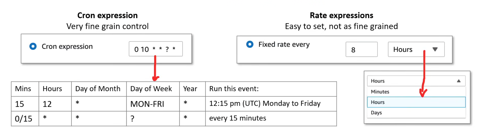

### CloudTrail Events

Not all AWS services emit CloudWatch events to EventBridge. For those services that don't, you can use CloudTrail events to trigger EventBridge rules. Turning on CloudTrail allows EventBridge to track changes to AWS Services made by API Calls or by AWS Users.

The Detail Type of CloudTrail wii be called: "**AWS API Call via CloudTrail**"

```json
{
   ...
   "detail-type": "AWS API Call via CloudTrail",
   "source": "aws.cloudtrail",
   "detail": {
      "eventVersion": "1.08",
      "userIdentity": {
         "type": "IAMUser",
         "principalId": "AIDA12345678901234567",
         "arn": "arn:aws:iam::123456789012:user/my-user",
         "accountId": "123456789012",
         "sessionContext": {
            "attributes": {
               "mfaAuthenticated": "false",
               "creationDate": "2022-01-01T00:00:00Z"
            }
         }
      },
      "eventTime": "2022-01-01T00:00:00Z",
      "eventSource": "s3.amazonaws.com",
      "eventName": "PutObject",
      "awsRegion": "us-east-1",
      "sourceIPAddress": "100.100.100.100",
      "userAgent": "S3Console/0.4",
      "requestParameters": {
         "bucketName": "my-bucket",
         "key": "my-object"
      },
      "responseElements": {
         "ETag": "\"12345678901234567\""
      },
      "requestID": "12345678901234567",
      "eventID": "12345678901234567",
      "eventType": "AwsApiCall",
      "resources": [
         {
            "type": "AWS::S3::Object",
            "id": "my-bucket/my-object",
            "ARN": "arn:aws:s3:::my-bucket/my-object"
         }
      ],
      "tlsDetails": {
         "cipherSuite": "TLS_AES_256_GCM_SHA384",
         "protocol": "TLSv1.3",
         "certificateIssuedBy": "Amazon",
         "certificateIssuerEndDate": "2022-01-01T00:00:00Z",
         "certificateIssuerStartDate": "2022-01-01T00:00:00Z",
         "certificateSerialNumber": "12345678901234567"
      }
   }
}
```

AWS API calls that are larger than **256KB** in size are not supported.

### Event Patterns

Event patterns are used to filter what events should be used to pass along to a target. You can filter events by providing the same fields and values found found in the original event. The only difference is that you don't need to provide the values for the fields you want to filter on.

**Example**

```json
{
  "version": "0",
  "id": "6f8f3c4a-3f8f-4f8f-8f8f-8f8f8f8f8f8f",
  "detail-type": "EC2 Instance State-change Notification",
  "source": "aws.ec2",
  "account": "123456789012",
  "time": "2022-01-01T00:00:00Z",
  "region": "us-east-1",
  "resources": [
    "arn:aws:ec2:us-east-1:123456789012:instance/i-12345678901234567"
  ],
  "detail": {
    "instance-id": "i-12345678901234567",
    "state": "terminated"
  }
}
```

Let's say we want to create an EventBridge rule that triggers when an EC2 instance is terminated. We would just supply the following as the Event Pattern:

```json
{
  "source": ["aws.ec2"],
  "detail-type": ["EC2 Instance State-change Notification"],
  "detail": {
    "state": ["terminated"]
  }
}
```

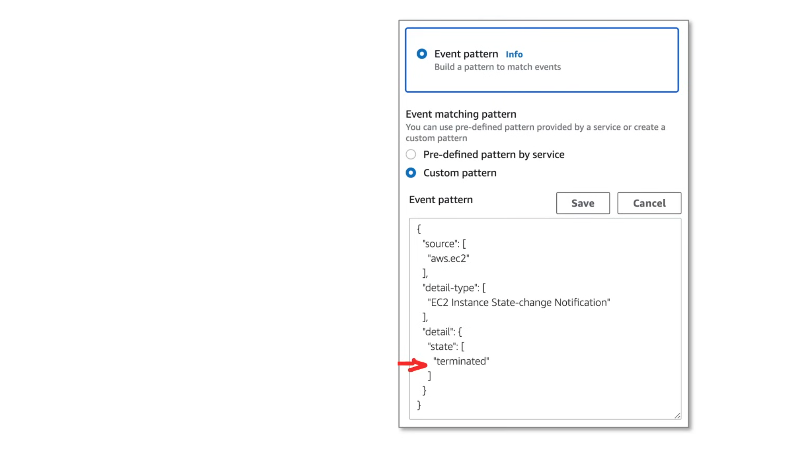

#### Prefix Matching

Prefix matching allows you to match events on the prefix of an event source. For example, if you want to match all events that start with "ca-", you can use the following event pattern:

```json
"region": [
   {
      "prefix": "ca-"
   }
]
```

#### Anything-but Matching

Matches anything execpt what's specified in the rule.

```json
{
  "source": [
    {
      "anything-but": [
         "stopped",
         "overloaded"
      ]
    }
  ]
}
```

#### Numeric Matching

Matches against numeric operator for "<", ">", "=", "<=", ">=":

```json
{
  "detail": {
    "cpu": [
      {
        "numeric": [
          ">",
          80
        ]
      }
    ]
  }
}
```

#### IP Address Matching

Matches against IPv4 and IPv6 addresses:

```json
{
  "detail": {
    "sourceIPAddress": [
      {
        "cidr": "192.168.1.0/24"
      }
    ]
  }
}
```

#### Exists Matching

Works on the presence or absence of a field in the JSON event:

```json
{
  "detail": {
    "c-count": [
      {
        "exists": true
      }
    ]
  }
}
```

#### Empty Value Matching

For string, use "" to match empty strings, for other values, use null.

```json
# String
"eventVersion": [""]

# Other values
"responseElements": [null]
```

#### Complex Multiple Matching

Multiple matching rules are combined into a more complex event pattern:

```json
{
   "time": [{ "prefix": "2017-10-02" }],
   "detail": {
      "state": [{ "anything-but": "intializing" }],
      "c-count": [{ "numeric": [">", 10] }],
      "source-ip": [{ "cidr": "[IP_ADDRESS]" }],
      "x-limit": [{ "anything-but": [ 100, 200, 300 ] }]
   }
}
```

### EventBridge Rules

**EventBridge Rules** are used to filter events and route them to targets. They are created by providing an event pattern and a list of targets. You can specify up to 5 targets for a single rule. Commonly targeted AWS Service include:

- Lambda Function
- SQS Queue
- SNS Topic
- Firehose Delivery Stream
- ESC Task

There might be some additional fields to select the target, depending on the target service. eg. Lambda Function, Lambda Alias, Lambda Version.

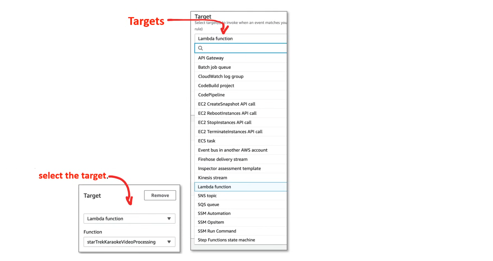

You can also specify what gets passed along, by changing **configure input**, which acts as a filter.

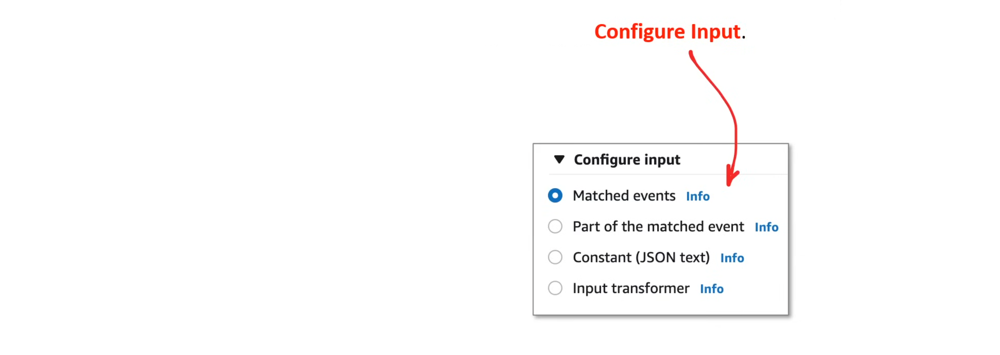

**Match Events**

The entire event pattern text is passed to the target when the rule is triggered.

