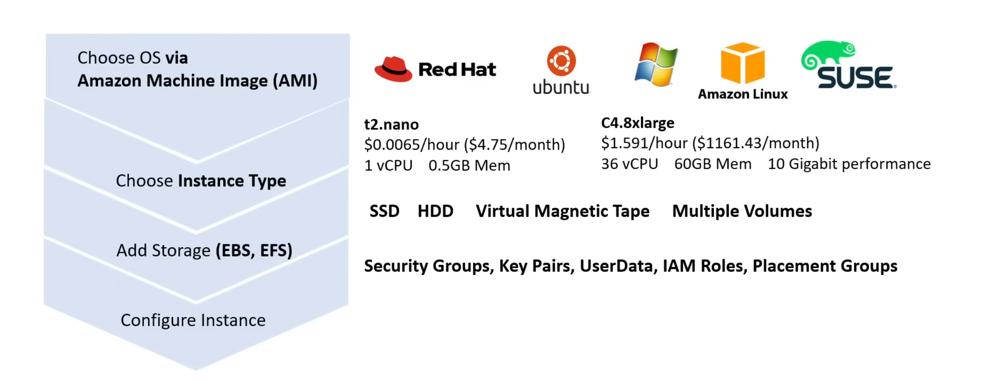
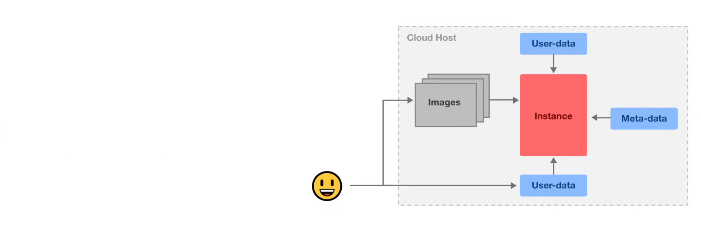
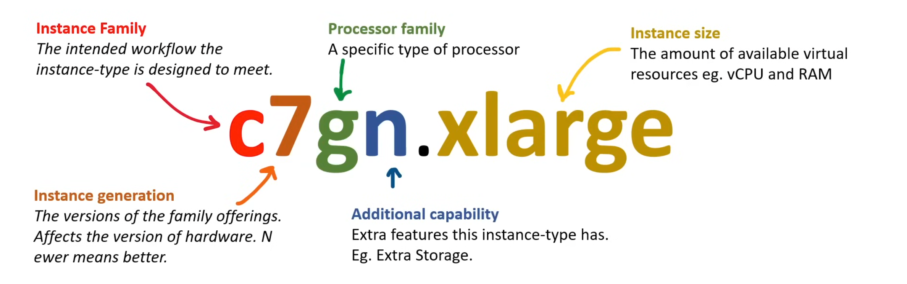
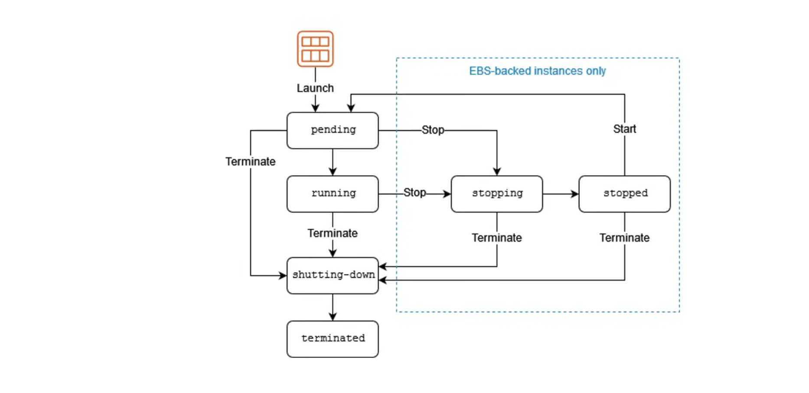

## Amazon Elastic Compute Cloud (EC2)

Elastic Compute Cloud (EC2) is a web service that provides a secure, highly configurable virtual server. EC2's simple web-service interface allows you to provide orientation, capacity, and configuration for virtual servers in the cloud. With AWS, you can launch an instance in minutes. Anything and everything on AWS uses EC2 instances underneath.



### Cloud-Init

Cloud-init is the industry standard multi-distribution method for cross-platform cloud instance initialization. It is supported across all major public cloud providers, provisioning systems for cloud instance initialization package. It is used to initialize cloud instances on first boot. It can be used to install software, configure the instance, and set up the instance for use.

Cloud Instance Initialization is the process of preparing an instance with configuration data for the operating system and runtime environment. It is used to install software, configure the instance, and set up the instance for use.



Cloud Instances are initialized from a disk image and instance data:
- Metadata
- User-data
- Vendor-data

User Data is a script that is run when the instance is first launched. It can be used to install software, configure the instance, and set up the instance for use.


### EC2 User Data

A script can be provided to the EC2 UserData to have cloud-init automatically run it at firt-boot. You can either provide a script or a cloud-config file. 

#### User Data Bash Script Example

```bash
#!/bin/bash

# Update the package list
apt-get update

# Install Nginx
apt-get install -y nginx

# Start Nginx
systemctl start nginx

# Enable Nginx to start on boot
systemctl enable nginx

# Write a simple HTML file
echo "Hello World" > /var/www/html/index.html
```
Scripts must be base64 encoded when directly using the API, the AWS CLI and Cloud Console will automatically encode the script to base64.

#### User Data Cloud-Config Example

```yaml
#cloud-config
package_update: true
package_upgrade: true
packages:
  - nginx
runcmd:
  - systemctl start nginx
  - systemctl enable nginx
  - echo "<html><h1>Hello World</h1></html>" > /var/www/html/index.html
```

Via the AWS CLI, you can pass the script directly or via a file:

```bash
aws ec2 run-instances \
  --image-id ami-0c55b159cbfafe1f0 \
  --count 1 \
  --instance-type t2.micro \
  --security-group-ids sg-12345678901234567 \
  --subnet-id subnet-12345678901234567 \
  --key-name my-key \
  --user-data file://user-data.sh
```

OR, you can provide the script inline:

```bash
aws ec2 run-instances \
  --image-id ami-0c55b159cbfafe1f0 \
  --count 1 \
  --instance-type t2.micro \
  --security-group-ids sg-12345678901234567 \
  --subnet-id subnet-12345678901234567 \
  --key-name my-key \
  --user-data "#!/bin/bash
apt-get update
apt-get install -y nginx
systemctl start nginx
systemctl enable nginx
echo "<html><h1>Hello World</h1></html>" > /var/www/html/index.html"
```
### EC2 Meta Data

EC2 metadata information can be accessed from the instance itself using the Metadata Service (MDS) via a special endpoint. There are two versions of the Metadata Service: 

- **Instance Metadata Service Version 1 (IMDSv1)**: a request/response method
- **Instance Metadata Service Version 2 (IMDSv2)**: a session-oriented method

IMDSv2 was implemented after an exploit of IMDSv1 was discovered. IMDSv2 adds defense in depths attackes against open firewalls, reverse proxies, and SSRF vulnerabilities.

The endpoint address:
- IPv4: `http://169.254.169.254/latest/meta-data/`
- IPv6: `http://fd00:ec2::254/latest/meta-data/`

IMDSv1 using curl:

```bash
curl ttp://169.254.169.254/latest/meta-data
```

IMDSv2 using curl:

```bash
TOKEN=`curl -X PUT "http://169.254.169.254/latest/api/token" -H "X-aws-ec2-metadata-token-ttl-seconds: 21600"` \
&& curl -H "X-aws-ec2-metadata-token: $TOKEN" -v http://169.254.169.254/latest/meta-data/
```
Instance metadata is grouped into categories, and there are over 60+ categories of instance metadata. Some of the categories are:

- `ami-id`
- `ami-launch-index`
- `ami-manifest-path`
- `ancestor-ami-ids`
- `autoscaling/target-lifecycle-state`
- `block-device-mapping/ami`
- `block-device-mapping/ebsN`
- `block-device-mapping/ephemeralN`
- `block-device-mapping/root`
- `block-device-mapping/swap`
- `elastic-gpus/associations/elastic-gpu-id`
- `elastic-inference/associations/eia-id`
- `events/maintenance/history`
...

There are configuration options you can configure around metadata:
- You can enforce the use of tokens (IMDSv2)
- You can turn off the endpoint all together
- You can specify the amount of network hops allowed

### EC2 Instance Types

The instance type naming convention is as follows:



Some parts of the instance type may be omitted, eg. `t3.micro` does not contain Processor Family or Additional Capacity.

### EC2 Instance Families

Instance families are different combinations of CPU, Memory, Storage, and Networking capacity. Instance families allow you to choose the appropriate combination of capacity to meet your workload requirements. Different instance families are different because of the varying hardware used to give them their unique properties.

#### Instance Family Types

1. **General Purpose**
   - **A1**, **T2**, **T3**, **T3a**, **T4g**, **M4**, **M5**, **M5a**, **M5n**, **M6zn**, **M6g**, **M6i**, **Mac**
   - This instance family types offers a balance of compute, memory, and networking resources. 
   - **Best for**: Web servers, development environments, and general-purpose workloads.

2. **Compute Optimized**
   - **C4**, **C5**, **Cba**, **C5n**, **C6g**, **C6gn**
   - This instance family types are ideal for compute-intensive applications that benefit from high-performance processors. 
   - **Best for**: Scientific modeling, dedicated gaming servers, and server engines

3. **Memory Optimized**
   - **R4**, **R5**, **R5a**, **R5b**, **R5n**, **X1**, **X1e**, **High Memory**, **z1d**
   - This instance family types provides high performance for workloads that process large datasets in memory. 
   - **Best for**: In-memory caches, In-memory databases, and real-time big data analytics

4. **Accelerated Optimized**
   - **P2**, **P3**, **P4**, **G3**, **G4ad**, **G4dn**, **F1**, **Inf1**, **VT1**
   - This instance family types are ideal for hardware accelerators or co-processors such as Graphics Processing Units (GPUs).
   - **Best for**: Machine learning, computational finance, siesmic analysis, and speech recognition

5. **Storage Optimized**
   - **I3**, **I3en**, **D2**, **D3**, **D3en**, **H1**
   - This instance family types are ideal for high, sequential read and write access to very large datasets on local storage.
   - **Best for**: No-SQL, In-memory or transactional databases, and data warehousing

Often, Instance families are referred to as Instance Types, but an instance type is a combination of size and family.

- **C**: Compute Optimized
- **D**: Dense Storage
- **F**: Field Programmable Gate Array (FPGA)
- **G**: Graphics Intensive 
- **Hpc**: High Performance Computing
- **Im**: STorage Optimized with a 1:4 (vCPU:Memory) ratio
- **Is**: STorage Optimized with a 1:6 (vCPU:Memory) ratio
- **Inf**: AWS Inferentia
- **M**: General Purpose
- **Mac**: Apple macOS
- **P**: GPU Accelerated
- **R**: Memory Optimized
- **T**: Burstable Performance
- **Trn**: AWS Trainium
- **U**: High Memory
- **VT**: Video Transcoding
- **X**: Memory Intensive

Both **T** and **M** families are General Purpose. The **M** family offers an even balance of compute, memory, and networking resources. The **T** family is the cheapest and is great for variable workloads. It offers a baseline level of CPU performance with the ability to burst above the baseline when needed.

### EC2 Processors

AWS underlying instance can have access to a variety of different processors to meet specific cloud workload needs.

1. **Intel Xeon Processors**
   - Similar to Intel Desktop CPUs but with advanced capabilities.
2. **AMD EPYC Processors**
   - Alternactives to Intel-based instances.
   - POtential cost saving over Intel Processors.
3. **NVIDIA GPUs**
   - Graphics Intensive workloads.
   - Often used in Machine Learning workloads.
4. **AWS Graviton Processors**
   - Custom-built by AWS using ARM architecture.
5. **Intel Habana Gaudi Processors**
   - Specialized processors for Machine Learning workloads.
6. **Intel FPGAs**
   - Intel's offering for field-programmable gate arrays for workloads that benefit from custom hardware acceleration.
7. **Xilinx (AMD)**
   - AMD's offering for field-programmable gate arrays for workloads that benefit from custom hardware acceleration.
8. **AWS Inferentia**
   - AWS processors designed to deliver high-performance machine learning inference at low cost.

### EC2 Instance Sizes

Each instance type includes one or more instance sizes, allowing users to scale their resources to the requirements of the target workloads. Each instance size generally doubles in price and key attributes.

| Name | vCPUs | Memory (GiB) | On-Demand per hour | On-Demand per month |
| --- | --- | --- | --- | --- |
| t2.small | 1 | 12 | $0.0023 | $16.79 |
| t2.medium | 2 | 24 | $0.0464 | $33.87 |
| t2.large | 2 | 36 | $0.0928 | $67.74 |
| t2.xlarge | 4 | 54 | $0.1856 | $135.48 |

### EC2 Instance Profile

EC2 instance profile is a reference to an AMI role that will be passed and assumed by the EC2 instance when it starts up.


Instance profiles allow users to avoid passing long-live AWS credentials. (AWS Access Key and Secret Key)

- EC2 instance profiles can be associated at the time of launch or on a running EC2 instance. If there was no previous EC2 instance profile attached, a hard reboot is required for the role to be assumed.
- Only a single IAM role can be associated with Instance Profile.
- Changing roles is not instantaneous due to eventual consistency. If you need the role immediately, you need to dissociate/associate the profile or hard reboot the instance.

When you select an AMI role when launching an EC2 instance, AWS will automatically create the Instance Profile. Instance Profile are not easily viewed via the AWS console.

Creating the instance profile:

```bash
aws iam create-instance-profile \
  --instance-profile-name MyInstanceProfile
```
Addin the single IAM role to the instance profile:

```bash
aws iam add-role-to-instance-profile \
  --instance-profile-name MyInstanceProfile \
  --role-name MyRole
```

Associating the instance profile with an EC2 instance:

```bash
aws ec2 associate-iam-instance-profile \
  --instance-id i-1234567890abcdef0 \
  --iam-instance-profile Name=MyInstanceProfile
```

Listing all IAM roles:

```bash
aws iam list-instance-profiles
```

Getting info about a specific instance profile:

```bash
aws iam get-instance-profile \
  --instance-profile-name MyInstanceProfile
```

### EC2 Instance Lifecycle

Instance Lifecycle refers to the different states an EC2 instance can be in during its lifetime.



#### Actions

- **Launch**: Create and start an EC2 instance based on an AMI.
- **Stop**: Turn off but not delete the current EC2 instance.
- **Start**: Turn on a previously stopped EC2 instance.
- **Terminate**: Delete the EC2 instance.
- **Reboot**: Perform a soft reboot of the EC2 instance.
- **Retire**: Notifies when an instance is scheduled for retirement due to hardware failure or end-of-life; it must be replaced or migrated.
- **Recover**: Automatically recovers failed instances on new hardware if enabled, keeping the instance id and other configs as they were.

#### States

- **Pending**: The instance is preparing to enter the running state. 
- **Running**: The instance is running and ready for use.
- **Stopping**: The instance is preparing to be stopped.
- **Stopped**: The instance is shut down and cannot be used unless started again.
- **Shutting-down**: The instance is preparing to be terminated.
- **Terminated**: The instance has been permanently deleted and cannot be started.

To prevent the instance from being terminated, you can enable the **Termination Protection** setting(defaut is off):

```bash
aws ec2 modify-instance-attribute \
  --instance-id i-1234567890abcdef0 \
  --disable-api-termination \
  --region us-east-1
```

To prevent the instance from being stopped, you can enable the **Stop Protection** setting(defaut is off):

```bash
aws ec2 modify-instance-attribute \
  --instance-id i-1234567890abcdef0 \
  --disable-api-stop \
  --region us-east-1
```

To configure shutdown behavior, you can use the **Shutdown Behavior** setting(defaut is stop):

```bash
aws ec2 modify-instance-attribute \
  --instance-id i-1234567890abcdef0 \
  --instance-initiated-shutdown-behavior stop \
  --region us-east-1
```

To configure auto-recovery behavior, for instance whether to automatically recover an instance when a system status check fails, you can use the **Auto Recovery** setting(defaut is enabled):

```bash
aws ec2 modify-instance-attribute \
  --instance-id i-1234567890abcdef0 \
  --auto-recovery disabled \
  --region us-east-1
```
