## Amazon Elastic Compute Cloud (EC2)

Elastic Compute Cloud (EC2) is a web service that provides a secure, highly configurable virtual server. EC2's simple web-service interface allows you to provide orientation, capacity, and configuration for virtual servers in the cloud. With AWS, you can launch an instance in minutes. Anything and everything on AWS uses EC2 instances underneath.

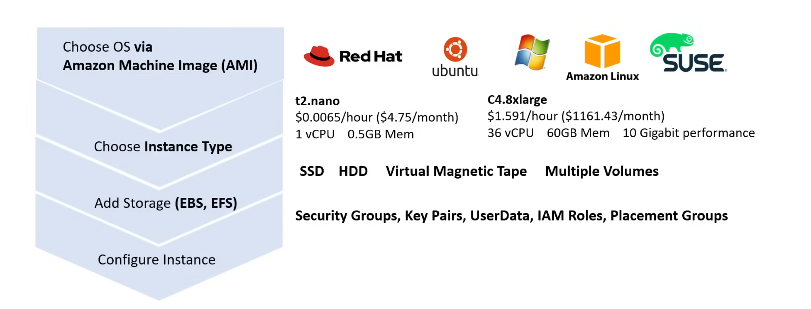

### Cloud-Init

Cloud-init is the industry standard multi-distribution method for cross-platform cloud instance initialization. It is supported across all major public cloud providers, provisioning systems for cloud instance initialization package. It is used to initialize cloud instances on first boot. It can be used to install software, configure the instance, and set up the instance for use.

Cloud Instance Initialization is the process of preparing an instance with configuration data for the operating system and runtime environment. It is used to install software, configure the instance, and set up the instance for use.

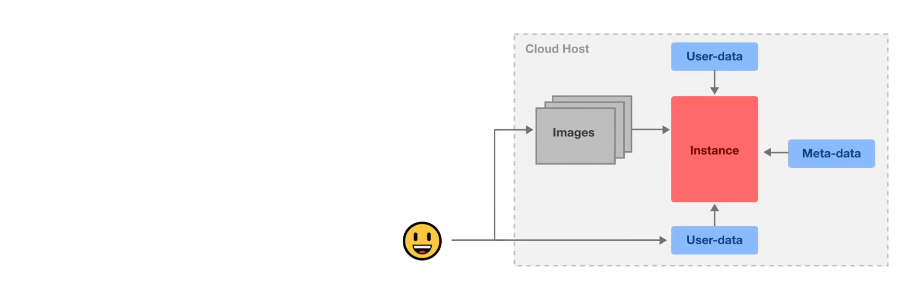

Cloud Instances are initialized from a disk image and instance data:
- Metadata
- User-data
- Vendor-data

User Data is a script that is run when the instance is first launched. It can be used to install software, configure the instance, and set up the instance for use.


### EC2 User Data

A script can be provided to the EC2 UserData to have cloud-init automatically run it at firt-boot. You can either provide a script or a cloud-config file. 

#### User Data Bash Script Example

```bash
#!/bin/bash

# Update the package list
apt-get update

# Install Nginx
apt-get install -y nginx

# Start Nginx
systemctl start nginx

# Enable Nginx to start on boot
systemctl enable nginx

# Write a simple HTML file
echo "Hello World" > /var/www/html/index.html
```
Scripts must be base64 encoded when directly using the API, the AWS CLI and Cloud Console will automatically encode the script to base64.

#### User Data Cloud-Config Example

```yaml
#cloud-config
package_update: true
package_upgrade: true
packages:
  - nginx
runcmd:
  - systemctl start nginx
  - systemctl enable nginx
  - echo "<html><h1>Hello World</h1></html>" > /var/www/html/index.html
```

Via the AWS CLI, you can pass the script directly or via a file:

```bash
aws ec2 run-instances \
  --image-id ami-0c55b159cbfafe1f0 \
  --count 1 \
  --instance-type t2.micro \
  --security-group-ids sg-12345678901234567 \
  --subnet-id subnet-12345678901234567 \
  --key-name my-key \
  --user-data file://user-data.sh
```

OR, you can provide the script inline:

```bash
aws ec2 run-instances \
  --image-id ami-0c55b159cbfafe1f0 \
  --count 1 \
  --instance-type t2.micro \
  --security-group-ids sg-12345678901234567 \
  --subnet-id subnet-12345678901234567 \
  --key-name my-key \
  --user-data "#!/bin/bash
apt-get update
apt-get install -y nginx
systemctl start nginx
systemctl enable nginx
echo "<html><h1>Hello World</h1></html>" > /var/www/html/index.html"
```
### EC2 Meta Data

EC2 metadata information can be accessed from the instance itself using the Metadata Service (MDS) via a special endpoint. There are two versions of the Metadata Service: 

- **Instance Metadata Service Version 1 (IMDSv1)**: a request/response method
- **Instance Metadata Service Version 2 (IMDSv2)**: a session-oriented method

IMDSv2 was implemented after an exploit of IMDSv1 was discovered. IMDSv2 adds defense in depths attackes against open firewalls, reverse proxies, and SSRF vulnerabilities.

The endpoint address:
- IPv4: `http://169.254.169.254/latest/meta-data/`
- IPv6: `http://fd00:ec2::254/latest/meta-data/`

IMDSv1 using curl:

```bash
curl ttp://169.254.169.254/latest/meta-data
```

IMDSv2 using curl:

```bash
TOKEN=`curl -X PUT "http://169.254.169.254/latest/api/token" -H "X-aws-ec2-metadata-token-ttl-seconds: 21600"` \
&& curl -H "X-aws-ec2-metadata-token: $TOKEN" -v http://169.254.169.254/latest/meta-data/
```
Instance metadata is grouped into categories, and there are over 60+ categories of instance metadata. Some of the categories are:

- `ami-id`
- `ami-launch-index`
- `ami-manifest-path`
- `ancestor-ami-ids`
- `autoscaling/target-lifecycle-state`
- `block-device-mapping/ami`
- `block-device-mapping/ebsN`
- `block-device-mapping/ephemeralN`
- `block-device-mapping/root`
- `block-device-mapping/swap`
- `elastic-gpus/associations/elastic-gpu-id`
- `elastic-inference/associations/eia-id`
- `events/maintenance/history`
...

There are configuration options you can configure around metadata:
- You can enforce the use of tokens (IMDSv2)
- You can turn off the endpoint all together
- You can specify the amount of network hops allowed

### EC2 Instance Types

The instance type naming convention is as follows:

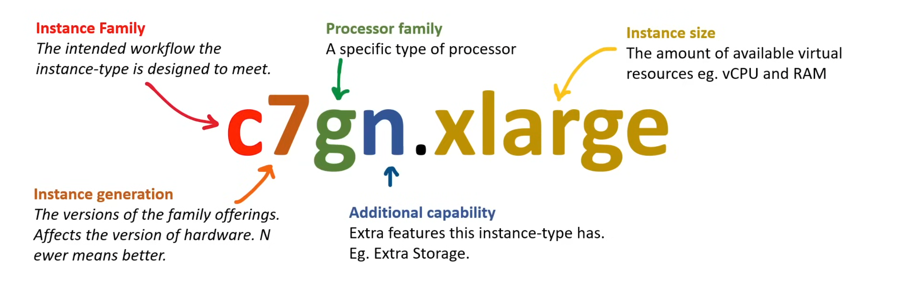

Some parts of the instance type may be omitted, eg. `t3.micro` does not contain Processor Family or Additional Capacity.

### EC2 Instance Families

Instance families are different combinations of CPU, Memory, Storage, and Networking capacity. Instance families allow you to choose the appropriate combination of capacity to meet your workload requirements. Different instance families are different because of the varying hardware used to give them their unique properties.

#### Instance Family Types

1. **General Purpose**
   - **A1**, **T2**, **T3**, **T3a**, **T4g**, **M4**, **M5**, **M5a**, **M5n**, **M6zn**, **M6g**, **M6i**, **Mac**
   - This instance family types offers a balance of compute, memory, and networking resources. 
   - **Best for**: Web servers, development environments, and general-purpose workloads.

2. **Compute Optimized**
   - **C4**, **C5**, **Cba**, **C5n**, **C6g**, **C6gn**
   - This instance family types are ideal for compute-intensive applications that benefit from high-performance processors. 
   - **Best for**: Scientific modeling, dedicated gaming servers, and server engines

3. **Memory Optimized**
   - **R4**, **R5**, **R5a**, **R5b**, **R5n**, **X1**, **X1e**, **High Memory**, **z1d**
   - This instance family types provides high performance for workloads that process large datasets in memory. 
   - **Best for**: In-memory caches, In-memory databases, and real-time big data analytics

4. **Accelerated Optimized**
   - **P2**, **P3**, **P4**, **G3**, **G4ad**, **G4dn**, **F1**, **Inf1**, **VT1**
   - This instance family types are ideal for hardware accelerators or co-processors such as Graphics Processing Units (GPUs).
   - **Best for**: Machine learning, computational finance, siesmic analysis, and speech recognition

5. **Storage Optimized**
   - **I3**, **I3en**, **D2**, **D3**, **D3en**, **H1**
   - This instance family types are ideal for high, sequential read and write access to very large datasets on local storage.
   - **Best for**: No-SQL, In-memory or transactional databases, and data warehousing

Often, Instance families are referred to as Instance Types, but an instance type is a combination of size and family.

- **C**: Compute Optimized
- **D**: Dense Storage
- **F**: Field Programmable Gate Array (FPGA)
- **G**: Graphics Intensive 
- **Hpc**: High Performance Computing
- **Im**: STorage Optimized with a 1:4 (vCPU:Memory) ratio
- **Is**: STorage Optimized with a 1:6 (vCPU:Memory) ratio
- **Inf**: AWS Inferentia
- **M**: General Purpose
- **Mac**: Apple macOS
- **P**: GPU Accelerated
- **R**: Memory Optimized
- **T**: Burstable Performance
- **Trn**: AWS Trainium
- **U**: High Memory
- **VT**: Video Transcoding
- **X**: Memory Intensive

Both **T** and **M** families are General Purpose. The **M** family offers an even balance of compute, memory, and networking resources. The **T** family is the cheapest and is great for variable workloads. It offers a baseline level of CPU performance with the ability to burst above the baseline when needed.

### EC2 Processors

AWS underlying instance can have access to a variety of different processors to meet specific cloud workload needs.

1. **Intel Xeon Processors**
   - Similar to Intel Desktop CPUs but with advanced capabilities.
2. **AMD EPYC Processors**
   - Alternactives to Intel-based instances.
   - POtential cost saving over Intel Processors.
3. **NVIDIA GPUs**
   - Graphics Intensive workloads.
   - Often used in Machine Learning workloads.
4. **AWS Graviton Processors**
   - Custom-built by AWS using ARM architecture.
5. **Intel Habana Gaudi Processors**
   - Specialized processors for Machine Learning workloads.
6. **Intel FPGAs**
   - Intel's offering for field-programmable gate arrays for workloads that benefit from custom hardware acceleration.
7. **Xilinx (AMD)**
   - AMD's offering for field-programmable gate arrays for workloads that benefit from custom hardware acceleration.
8. **AWS Inferentia**
   - AWS processors designed to deliver high-performance machine learning inference at low cost.

### EC2 Instance Sizes

Each instance type includes one or more instance sizes, allowing users to scale their resources to the requirements of the target workloads. Each instance size generally doubles in price and key attributes.

| Name | vCPUs | Memory (GiB) | On-Demand per hour | On-Demand per month |
| --- | --- | --- | --- | --- |
| t2.small | 1 | 12 | $0.0023 | $16.79 |
| t2.medium | 2 | 24 | $0.0464 | $33.87 |
| t2.large | 2 | 36 | $0.0928 | $67.74 |
| t2.xlarge | 4 | 54 | $0.1856 | $135.48 |

### EC2 Instance Profile

EC2 instance profile is a reference to an AMI role that will be passed and assumed by the EC2 instance when it starts up.


Instance profiles allow users to avoid passing long-live AWS credentials. (AWS Access Key and Secret Key)

- EC2 instance profiles can be associated at the time of launch or on a running EC2 instance. If there was no previous EC2 instance profile attached, a hard reboot is required for the role to be assumed.
- Only a single IAM role can be associated with Instance Profile.
- Changing roles is not instantaneous due to eventual consistency. If you need the role immediately, you need to dissociate/associate the profile or hard reboot the instance.

When you select an AMI role when launching an EC2 instance, AWS will automatically create the Instance Profile. Instance Profile are not easily viewed via the AWS console.

Creating the instance profile:

```bash
aws iam create-instance-profile \
  --instance-profile-name MyInstanceProfile
```
Addin the single IAM role to the instance profile:

```bash
aws iam add-role-to-instance-profile \
  --instance-profile-name MyInstanceProfile \
  --role-name MyRole
```

Associating the instance profile with an EC2 instance:

```bash
aws ec2 associate-iam-instance-profile \
  --instance-id i-1234567890abcdef0 \
  --iam-instance-profile Name=MyInstanceProfile
```

Listing all IAM roles:

```bash
aws iam list-instance-profiles
```

Getting info about a specific instance profile:

```bash
aws iam get-instance-profile \
  --instance-profile-name MyInstanceProfile
```

### EC2 Instance Lifecycle

Instance Lifecycle refers to the different states an EC2 instance can be in during its lifetime.

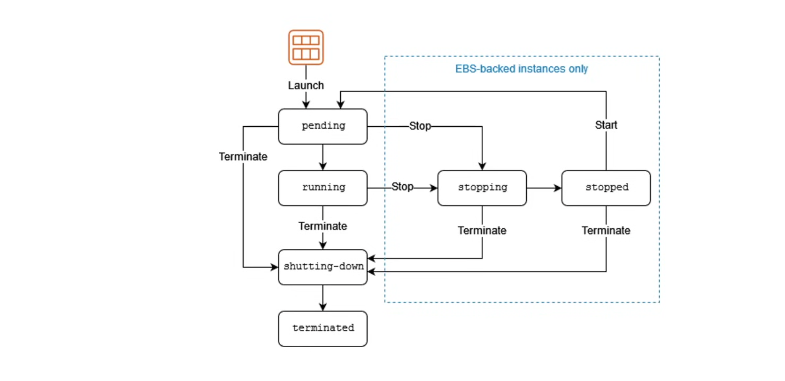

#### Actions

- **Launch**: Create and start an EC2 instance based on an AMI.
- **Stop**: Turn off but not delete the current EC2 instance.
- **Start**: Turn on a previously stopped EC2 instance.
- **Terminate**: Delete the EC2 instance.
- **Reboot**: Perform a soft reboot of the EC2 instance.
- **Retire**: Notifies when an instance is scheduled for retirement due to hardware failure or end-of-life; it must be replaced or migrated.
- **Recover**: Automatically recovers failed instances on new hardware if enabled, keeping the instance id and other configs as they were.

#### States

- **Pending**: The instance is preparing to enter the running state. 
- **Running**: The instance is running and ready for use.
- **Stopping**: The instance is preparing to be stopped.
- **Stopped**: The instance is shut down and cannot be used unless started again.
- **Shutting-down**: The instance is preparing to be terminated.
- **Terminated**: The instance has been permanently deleted and cannot be started.

To prevent the instance from being terminated, you can enable the **Termination Protection** setting(defaut is off):

```bash
aws ec2 modify-instance-attribute \
  --instance-id i-1234567890abcdef0 \
  --disable-api-termination \
  --region us-east-1
```

To prevent the instance from being stopped, you can enable the **Stop Protection** setting(defaut is off):

```bash
aws ec2 modify-instance-attribute \
  --instance-id i-1234567890abcdef0 \
  --disable-api-stop \
  --region us-east-1
```

To configure shutdown behavior, you can use the **Shutdown Behavior** setting(defaut is stop):

```bash
aws ec2 modify-instance-attribute \
  --instance-id i-1234567890abcdef0 \
  --instance-initiated-shutdown-behavior stop \
  --region us-east-1
```

To configure auto-recovery behavior, for instance whether to automatically recover an instance when a system status check fails, you can use the **Auto Recovery** setting(defaut is enabled):

```bash
aws ec2 modify-instance-attribute \
  --instance-id i-1234567890abcdef0 \
  --auto-recovery disabled \
  --region us-east-1
```

### EC2 Instance Console Screenshot

Instance Console Screenshot will take a screenshot of the current state of the instance. This is useful for troubleshooting booting issues when you cannot connect to the instance over SSH or RDP.

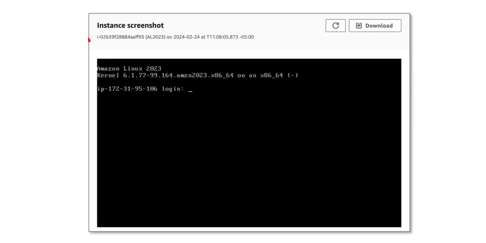

You can use the AWS CLI to grab the screenshot of the instance console:

```bash
aws ec2 get-console-screenshot
```

If something went wrong, you might see something other than a login screen.

### EC2 Hostnames

A hostname is a unique name in your network to identify a computer via DNS. With AWS, the hostname format will vary depending on what compute service is being used.

You need to ensure that your cloud-init(`/etc/cloud/cloud.cfg`) configuration will preserve hostname changes across reboots.

```yaml
#cloud-config
hostname: my-hostname
preserve_hostname: true
```
Then change the hostname and reboot for the name to take effect:

```bash
sudo hostnamectl set-hostname my-hostname
sudo reboot
```

Changing the hostname could be necessary in specific use-cases where software is expecting a very specific hostname. ie. when building microservices using Service Meshes.

There are two hostnametypes for the guest OS hostname:

1. **IP Name**
   - Legacy naming scheme based on the private IP address of the instance. 
   - Used when you launch an IPv4 only instance. 
   
   ```bash
   # us-east-1
   private-ipv4-address.ec2.internal
   ip-10-24-34-0.ec2.internal

   # Other regions
   private-ipv4-address.region.compute.internal
   ip-10-24-34-0.ca-central-1.compute.internal
   ```

2. **Resource Name**
   - EC2 instance ID is included in the hostname of the instance.
   - Used when you launch an IPv6 only instance.
   - If dualstack, you can choose.

   ```bash
   # us-east-1
   ec2-instance-id.ec2.internal
   i-1234567890abcdef0.ec2.internal

   # Other regions
   ec2-instance-id.region.compute.internal
   i-1234567890abcdef0.ca-central-1.compute.internal
   ```
### EC2 Default User Name

The default user name for an OS managed by AWS will vary based on the distribution.

| Distribution | Default User Name |
| --- | --- |
| Amazon Linux AMIs | ec2-user |
| CentOS AMI | centos/ec2-user |
| Debian AMI | admin |
| Fedora AMI | ec2-user |
| RHEL AMI | ec2-user/root |
| SUSE AMI | ec2-user/root |
| Ubuntu AMI | ubuntu |
| Oracle AMI | ec2-user |
| Bitnami AMI | bitnami |

When using  Session Manager, you will need to change your user to the default user name for the distribution. 

```bash
sudo su - ec2-user
```

### EC2 Burstable Instances

Burstable Instances allow workloads to handle bursts of higher CPU usage for very short durations. This allows AWS customers to save money overall since they do not need to upgrade their instance based on highest peak usage. 

- **T4g**: Graviton (ARM),cheaper than t46
- **T3a**: AMD EPYC, cheaper than t3
- **T3**: Intel Xeon Scalable, best overall
- **T2**: Intel Xeon, free tier due to previous generation processors

#### Standard Mode

- The default mode for burstable instances
- Provides a baseline level of CPU performance with the ability to burst above the baseline using accumulated CPU credits, suitable for workloads with variable CPU usage.

#### Unlimited Mode

Allows an instance to sustain high CPU performance for any period, whenever required, exceeding the baseline and accumulated CPU credits, with additional charges applied for extra CPU usage beyond the accumulated credits.

### EC2 Source and Destination Checks

The EC2 source/destination check is a security feature that prevents an instance from sending or receiving traffic that has a different source or destination IP address than the instance itself. This is a security feature that is enabled by default on all EC2 instances.

To disable the source/destination check, you can use the AWS CLI:

```bash
aws ec2 modify-instance-attribute \
  --instance-id i-1234567890abcdef0 \
  --source-dest-check 
```

Disabling the source/destination check is useful when you want to utilize the instance for Network Address Translation (NAT) or as a load balancer. 

### EC2 System Log

EC2 Management Console allows users to observe the system log for an EC2 instance. This is useful if you are trying to troubleshoot an instance on boot, to see if anything is wrong.

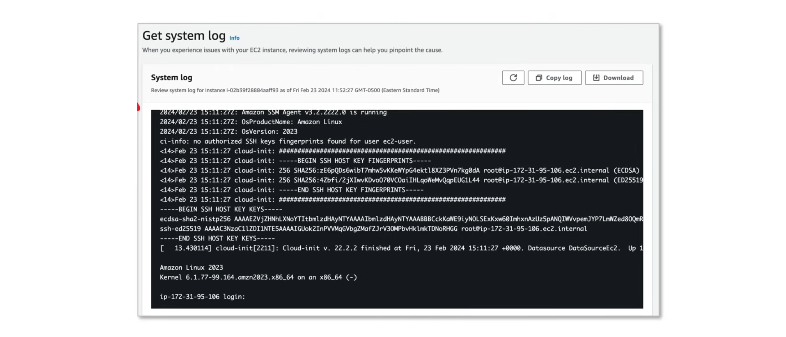

Some Marketplace and community AMIs will write the default user name and password for software in the system log for initial logins. 

Logs can be delivered to CloudWatch Logs installing the CloudWatch Unified Agent and can be accessed through a CloudWatch Log Group of the same name as the instance.

Logs that would be collected from an EC2 instance if CloudWatch Unified Agent is running and the EC2 instance is permitted to write to CloudWatch logs:

- `/var/log/ssm/amazon-ssm-agent.log/`
- `/var/log/audit/audit.log`
- `/var/log/cloud-init-output.log`
- `/var/log/cfn-init.log`
- `/var/log/cfn-init-cmd.log`
- `/var/log/cloud-init.log` (AL1 / AL2 only)
- `/var/log/cron`
- `/var/log/maillog`
- `/var/log/messages`
- `/var/log/secure`
- `/var/log/spooler`
- `/var/log/yum.log`
- `/var/log/zypper.log`
- `/var/log/auth.log`
- `/var/log/dpkg.log`
- `/var/log/syslog`
- `/var/log/aws/ams/bootstrap.log`
- `/var/log/aws/ssm/build.log`

### EC2 Placement Groups

EC2 Placement Groups allow users to choose the logical placement of EC2 instances in the AWS cloud to optimize for communication, performance, and durability. Placement Groups are free of charge.

#### Cluster Placement Group

- Packs instances close together in a single Availability Zone (AZ) to achieve the lowest possible latency and highest possible network throughput.
- Low-latency network performance for tightly-coupled node-to-node communication.
- Ideal for high-performance computing (HPC) applications that require low-latency communication between instances.
- Cluster cannot be multi-AZ.


#### Partition Placement Group

- Spreads instances across logical partitions
- Each partition does not share the underlying hardware with each other (rack partition)
- Well suited for large distributed and replicated workloads (Hadoop, Cassandra, Kafka,etc.)


#### Spread Placement Group

- Each instance is placed on a different rack
- Used when critical instances should be kept separate from each other (ie. database primary and replica)
- Can spread a maximum of 7 hosts per AZ
- Spread can be multi-AZ.

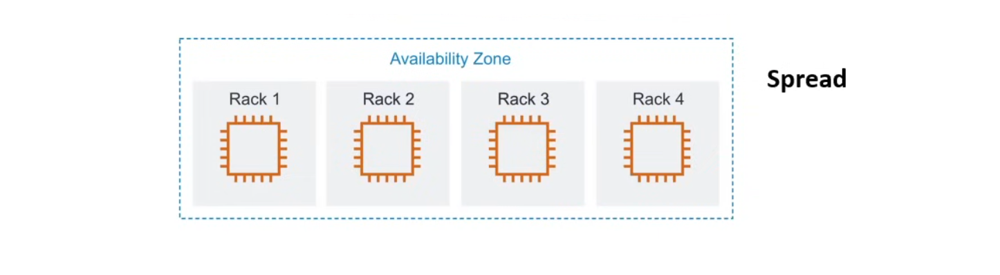

### EC2 Connect

There are a lot of ways to connect to an EC2 instance. The most common ways are:

1. SSH
2. EC2 Instance Connect
3. Session Manager
4. Fleet Manager Remote Desktop
5. EC2 Serial Console

#### SSH Client

- Connect from your local computer via an SSH connection using a public and private key
- You generate the public and private key pair on AWS and download the private key to your local computer
- Port 22 needs to be allowed in the Security Group in order to connect to the instance

```bash
ssh -i /path/to/private-key.pem ec2-user@<public-ip-address>
```

#### EC2 Instance Connect

Short-lived SSH keys controlled by IAM policies, works only with Linux and not all instances.

#### Session Manager

- Connection to a Linux or Windows computer via a reverse connection.
- Windows will log into PowerShell and Linux will log into bash.
- Does not require open ports, access is controlled via IAM policies.
- Supports audit trails for logins.

#### Fleet Manager Remote Desktop

- Fleet Manager allows you to connect to Windows machines via a remote desktop connection within the browser.
- It uses the SSM agent to establish a connection to the instance.
- It is a good alternative to RDP or VNC.

#### EC2 Serial Console

- Allows you to connect to an instance via a serial connection.
- Useful for troubleshooting boot issues.
- Requires the instance to be configured to allow serial console access.

### EC2 Amazon Linux

Amazon Linux is AWS's managed Linux distribution, which is based on CentOS and Fedora Linux, which are in turn based on Red Hat Enterprise Linux (RHEL). 

Amazon Linux has three versions:

1. Amazon Linux 1 (AL1)
2. Amazon Linux 2 (AL2)
3. Amazon Linux 2023 (AL2023)

**Amazon Linux 1** is deprecated and no longer supported. **Amazon Linux 2** is also deprecated and no longer supported. **Amazon Linux 2023** is the current version and is supported until December 31, 2029. Standard support will be until June 30, 2027, followed by a maintenance phase until June 30, 2029.

Amazon Linux uses the `yum` and `dnf` tools for package management.

```bash
# Update all packages
sudo yum update -y

# Install a package
sudo yum install -y <package-name>

# Remove a package
sudo yum remove -y <package-name>

# Search for a package
sudo yum search <package-name>

# List all installed packages
sudo yum list installed
```

#### Amazon Linux Extras

**Amazon Linux Extras** is a feature of Amazon Linux 2 that allows users to install additional software packages on their instances. Amazon Linux 2 was packaged with significantly fewer than Amazon Linux 1, hence the vital need for Amazon Linux Extras. **Amazon Linux 2023** has significantly more packages than **Amazon Linux 2**, so it does not need Amazon Linux Extras.

```bash
# List all available extras
sudo amazon-linux-extras list

# Install an extra
sudo amazon-linux-extras install <extra-name>

# Remove an extra
sudo amazon-linux-extras remove <extra-name>

# Search for an extra
sudo amazon-linux-extras search <extra-name>

# List all installed extras
sudo amazon-linux-extras list installed
```

#### Amazon Linux and EPEL

Extra Packages for Enterprise Linux (EPEL) is a repository of additional packages for Red Hat Enterprise Linux (RHEL) and its derivatives, from Fedora sources. EPEL provides packages that are not available in the default repositories of RHEL and its derivatives, but are available in the default repositories of other Linux distributions.

#### Amazon Linux 2 vs Amazon Linux 2023

Amazon Linux 2023 is a major upgrade over Amazon Linux 2, with a number of improvements and new features. Amazon Linux 2023 is based on Amazon Linux 2, but with a number of improvements and new features. Amazon Linux 2023 is also based on Amazon Linux 2, but with a number of improvements and new features.

| Amazon Linux 2 (AL2) | Amazon Linux 2023 (AL2023) |
|---|---|
| Limited Packages but can be extended with Amazon Linux Extras | Has thousands of packages available |
| Python 2.7 | Python 3.9 |
| `yum` package manager | `dnf` package manager |
| Security Enhanced Linux (SELinux) disabled by default | Security Enhanced Linux (SELinux) enabled by default |
| OpenSSL 1.0.2 | OpenSSL 3 |
| Sourcing CentOS 7 | Sourcing CentOS Stream 9 |
| gp2 volumes be default | gp3 volumes be default |
| Crony installed by default to have crontab | Crony not installed by default |
| OpenJDK | Amazon Corretto |

### EC2 AMI

Amazon Machine Image (AMI) is a snapshot of a virtual machine (VM) that is used to create and launch EC2 instances. You can turn your EC2 instance into an AMI and use it to create new instances.

An AMI holds the following information:

- A template for the root volume for the instance (EBS Snapshot or Instance Store template) eg. an operating system, an application server, and applications
- Launch permissions that control which AWS accounts can use the AMI to launch instances
- Block device mappings that specify the volumes to attach to the instance when it is launched

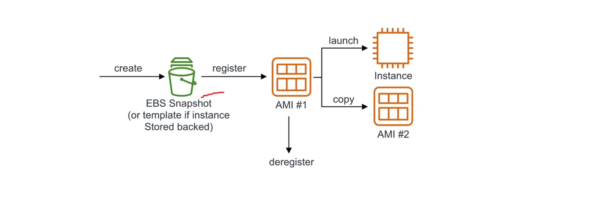

AMIs are region specific.

#### Use Cases

- AMIs help keep incremental changes to the OS, application code, and system packages.
- Using Systems Manager Automation, AMIs can be patched with security updates and baked.
- AMIs are used with **Launch Configurations** and **Launch Templates** to manager AMI revisions.

### AWS Marketplace

The AWS Marketplace allows users to purchase subscriptions to vendor-managed AMIs. Security-hardened AMIs are a popular choice for users on the AWS Marketplace. eg. Center of Internet Security (CIS).

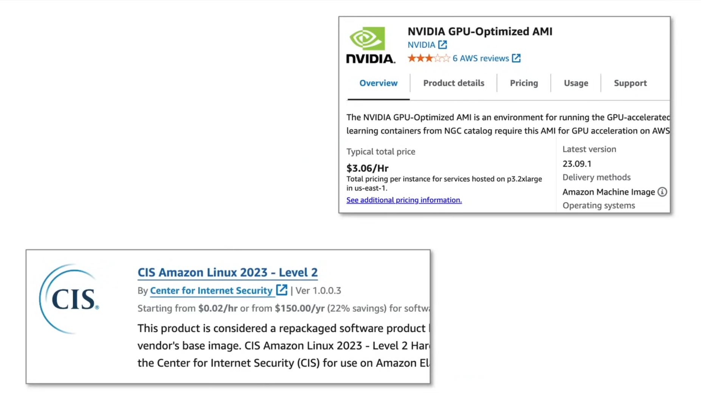

### Choosing an AMI

It's important to note that the AMI ID will be different for each region. So it's very important to always use the correct AMI ID for the region you are deploying to. 

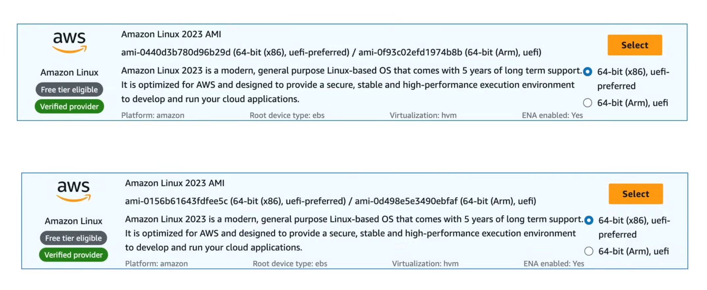

Some AMIs will have multiple architecture options with alternate AMI IDs. AMIs can be selected based on the following:
- Region
- Operating System
- Architecture (x86 or ARM)
- Launch Permissions
- Root Device Volume
  - EBS-backed AMI
  - Instance Store-backed AMI

### AMI Boot Modes

AMIs have two possible boot modes:

1. Legacy BIOS (Basic Input/Output System)
2. UEFI (Unified Extensible Firmware Interface)

#### Legacy BIOS (Basic Input/Output System)
   
The traditional firmware interface for computers, that has been around for decades. It initializes hardware during the boot-up process and provides runtime services for operating systems and programs.
- No support for Secure Boot
- May be required when using legacy OSs or legacy software

#### UEFI (Unified Extensible Firmware Interface)
   
UEFI is a modern firmware interface for computers, designed to replace the older BIOS firmware interface.
- Supports Secure Boot
- Faster boot times
- Supports larger disks 
- Pre-boot environment with a GUI and network capabilities

Unless specifically required for some reason, it's always recommended to use UEFI.

### AMI Elastic Network Adapter (ENA)

Elastic Network Adapter (ENA) is a network interface for EC2 instances that provides high-performance networking. It supports network speeds of upto 100Gbps for supported instance types. All instances based on Nitro System use ENA for enhanced networking.

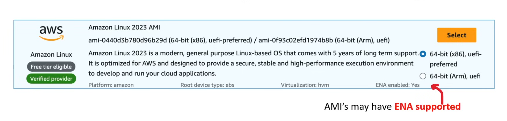

### Root Device Type

An AMI root device is the device that is used to boot the instance. It can be either an EBS-backed volume or an instance-backed volume.

#### EBS-backed Instance

An EBS volume is automatically attached at launch time. The storage is independent of the instance and the instance can be stopped or terminated without loss of data.

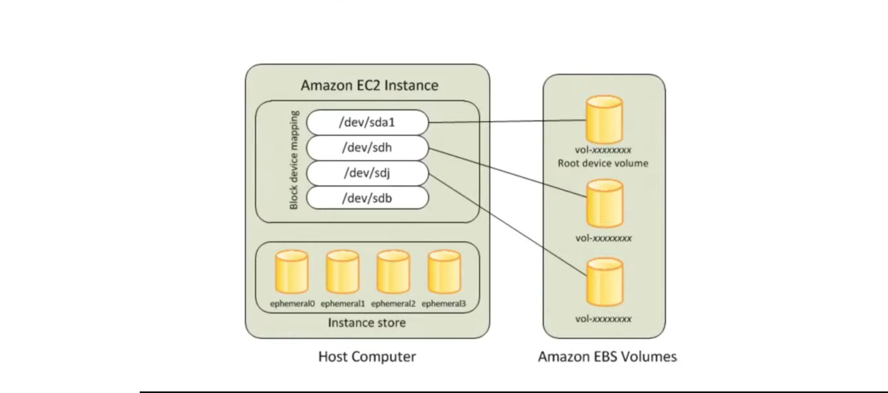

#### Instance store-backed Instance

The native volumes of the instance store are used as the root device. When the instance is stopped or terminated, all data is lost. Instance store-backed AMIs are less common than EBS-backed AMIs.

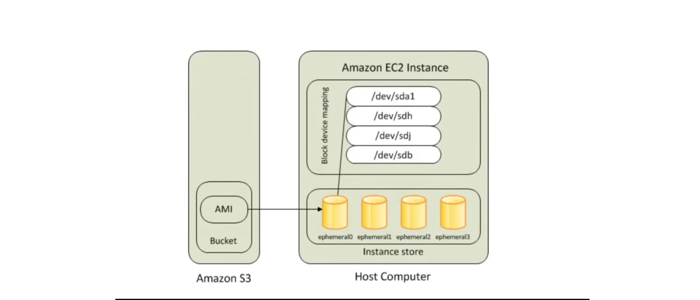

### AMI - Creating an Copying

You can create an AMI from an existing EC2 instance that os either running or stopped.

```bash
# Create an AMI from an existing EC2 instance
aws ec2 create-image \
  --instance-id <instance-id> \
  --name "<ami-name>" \
  --description "<ami-description>"
```

You can also copy an AMI across to another region. At the same time you can encrypt a non-encrypted AMI during the copy.

```bash
# Copy an AMI to another region
aws ec2 copy-image \
  --source-image-id <ami-id> \
  --source-region <source-region> \
  --name "<ami-name>"
  --encrypted \
  --region <destination-region>
```

### AMI - Store and Restore

You can store an AMI in an S3 bucket and restore it later. The reason you would want to do this is if you want to copy AMIs from one AWS partition to another. This is also useful for backing up AMIs and for sharing AMIs with other AWS accounts.

Storing an AMI to S3:

```bash
# Store an AMI in an S3 bucket
aws ec2 create-instance-export-task \
  --instance-id i-0123456789abcdef0 \
  --target-environment vmware \
  --export-to-s3-task DiskImageFormat=VMDK,S3Bucket=my-ami-backup-bucket,S3Prefix=exported-ami/
```

Restoring an AMI from S3:

```bash
# Restore an AMI from an S3 bucket
aws ec2 import-image \
  --description "Imported AMI" \
  --disk-containers "Format=VMDK,S3Bucket=my-ami-backup-bucket,S3Key=exported-ami/my-exported-vm.vmdk"
```

#### Why use this over Copying an AMI?

- Cheaper long-term storage
- Lifecycle management of AMIs
- Disaster recovery
- Auditing and compliance

### AMI Deprecate, Disable, and Deregister

**Deprecating** an AMI allows users to mark a date when the AMI will no longer be available for use. 

```bash
# Deprecate an AMI
aws ec2 enable-image-deprecation \
  --image-id <ami-id> \
  --deprecate-at <date> 
```

**Disabling** an AMI prevents users from using the AMI to launch new instances. It can be re-enabled at a later date.

```bash
# Disable an AMI
aws ec2 disable-image \
  --image-id <ami-id> 
```

**Deregistering** an AMI is when the user is done with an AMI and would like to prevent any new instances from being launched with the AMI. Deregistering does not delete the snapshots associated with the AMI. 

```bash
# Deregister an AMI
aws ec2 deregister-image \
  --image-id <ami-id>

aws ec2 delete-snapshot \
  --snapshot-id <snapshot-id>
```

### AMI - Sharing

AMIs can have the following settings:
- **Public**: any AWS account can launch the AMI
- **Explicit**: specific AWS accounts, Organizations/Organization Units, can launch the AMI
- **Implicit**: only the AWS account that created the AMI can launch it

```bash
# Share an AMI with specific AWS accounts
aws ec2 modify-image-attribute \
  --image-id <ami-id> \
  --launch-permission "Add=[{Group=all}]"
```
AMIs can be sold in the AWS Marketplace.

### AMI - Virtualization Types

| Description | Hardware Virtual Machine (HVM) | Paravirtual (PV) |
| --- | --- | --- |
| **Virtualization** | Full virtualization with hardwar assistance | Software-assisted virtualization that requires OS modifications |
| **Hardware Assisted** | Uses hardware assisted technology from the host's system CPU | Relies on a hypervisor to emulate hardware |
| **Performance** | Potentially higher, especially for applications that require direct access to hardware | Initially had better performance for some workloads due to low overhead, but has been surpassed by HVM advancements |
| **OS Support** | Broader, can run unmodified operating systems, any OS that can run on physical hardware can run on HVM | Limited to OSs modified for paravirtualization, cannot run unmodified operating systems |
| **Boot Method** | Can boot from an EBS volume or an instance store | Can only boot from an instance store |
| **Usage** | Recommended for modern OSs and applications requiring specific hardware features | Historically used for certain workloads and older instance types. Less commonly used for new deployments |

