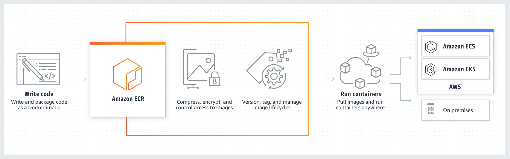
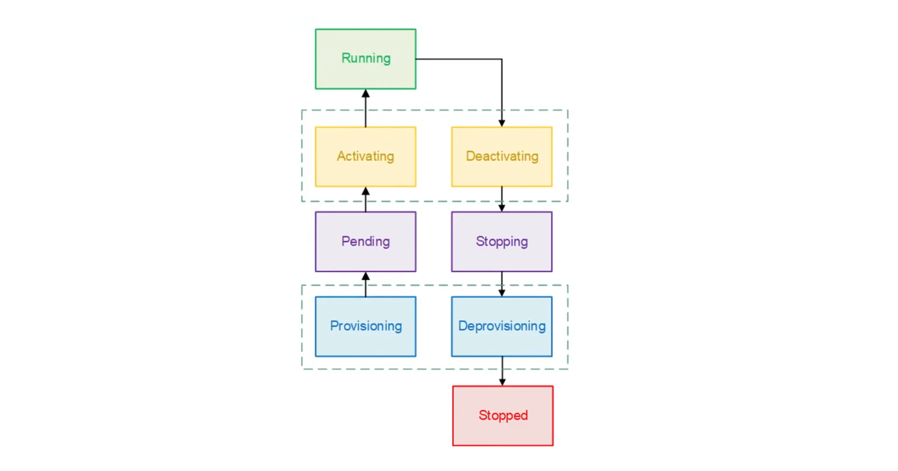

## Elastic Container Registry (ECR)

**Amazon Elastic Container Registry (ECR)** is a fully managed, high-performance Docker container registry provided by AWS. It enables developers to securely store, manage, and 
deploy container images, integrating seamlessly with Amazon EKS, ECS, and CI/CD tools. ECR supports both private and public repositories, automatically scaling infrastructure 
and offering features like vulnerability scanning.

- **ECR** lets you store Docker and Open Container Initiative (OCI) images and artifacts.
- Allows users to control private registry access via Register policy.
- Allows users control private repo access via Repo policy.
- Allows users to scan images on push to identify software vulnerabilities.
- Private image replication allows users to have cross-account and cross-region images.
- ECR allows you to create a Pull Through Cache to sync the contents of an upstream public registry.
- Repo images are encrypted at-rest.
- Amazon ECR lifecycle allows users to manage and automate cleaning up of container images.
- Images can be signed using the AWS Signer to ensure images are from trusted developers.
- Tags can be set to mutable or immutable.



- A registry contains multiple repos
- A repo contains multiple images
- An image can have multiple tags
- A tag points to a specific image version
  - eg. 1.0, latest

ECR Supports
 - **Public registries**: accessible to anyone
 - **Private registries**: only accessible to those within the AWS account
   - Control access via **Register Policy**
     - `ecr:ReplicateImage`
     - `ecr:BatchImportUpstreamImage`
     - `ecr:CreateRepository`
   - Control Access via **Repo Policy**
     - `ecr:DescribeImages`
     - `ecr:DescribeRepositories`

To push to ECR, you must first authenicate using docker with an authorization token. To obtain this token, you need to have AWS credentials configured in your environment:

```sh
# Login to ECR
aws ecr get-login-password \
  --region us-east-1 \ |
  docker login \
    --username AWS \
    --password-stdin <aws_account_id>.dkr.ecr.<region>.amazonaws.com

# Build, tag  and Push Image
docker buildx build -f Dockerfile \
  --platform linux/amd64,linux/arm64,linux/386,linux/ppc64le,linux/s390x \
  -t "<aws_account_id>.dkr.ecr.<region>.amazonaws.com/my-image:latest" \
  --push .
```

Image tag mutability feature prevents image tags from being overwritten. To turn it on:

```sh
aws ecr create-repository \
  --repository-name my-repo \
  --image-tag-mutability IMMUTABLE \
  --region us-east-1
```

When tag immutability is turned on for a repository, this affects all tags, you cannot make some tags immutable and others mutable. Immutable tags is a best practice because if 
there was a security vulnerability with a specific image, you can rollbackto the previous image ore preserve the history of vulnerabilities.

The `ImageTagAlreadyExistsExceptio` error is returned if you attempt to push an image with a tag that is already in the repository.

ECR lifecycle can be used to expire old images based on specific criteria:

```json
{
    "rules": [
        {
            "rulePriority": 1,
            "description": "Expire images older than 30 days",
            "selection": {
                "tagStatus": "tagged",
                "tagPatternList": ["prod*"],
                "countType": "sinceImagePushed",
                "countUnit": "days",
                "countNumber": 14
            },
            "action": {
                "type": "expire"
            }
        }
    ]
}
```

## Elastic Container Service (ECS)

Amazon Elastic Container Service (Amazon ECS) is a fully managed container orchestration service that helps you easily deploy, manage, and scale containerized applications. As a 
fully managed service, Amazon ECS comes with AWS configuration and operational best practices built-in. 

It's integrated with both AWS tools, such as Amazon Elastic Container Registry, and third-party tools, such as Docker. This integration makes it easier for teams to focus on 
building the applications, not the environment. You can run and scale your container workloads across AWS Regions in the cloud, and on-premises, without the complexity of 
managing a control plane.

### ECS Components

1. **Cluster**: Multiple instances which will house the docker containers.
2. **Task Definition**: A JSON file that defines the configuration of (up to 10) containers you want to run.
3. **Task**: Launches containers defines in task definition. Tasks do not remain once workload is complete.
4. **Service**: Ensures tasks remain running eg. Web app
5. **Container Agent**: Binary on each EC2 instance, which monitors, starts and stops tasks.
6. **ECS Controller/Schduler**: Responsible for scheduling the deployment and placement of containers, Replace unhealthy containers.
   - You can create your own schedulers or use thrid-party schedulers.

### AWS Fargate

**AWS Fargate** is a serverless, pay-as-you-go compute engine for containers that works with both **Amazon ECS** and **Amazon EKS**, eliminating the need to manage underlying 
EC2 server infrastructure. It automatically scales and manages infrastructure, allowing developers to focus on application development by defining CPU, memory, and networking 
requirements for each container.

- You can create an empty ECS cluster (no EC2 provisioned), and then launch Tasks as Fargate.
- With fargate, you no longer have to provision, configure, and scale clusters of EC2 instances to run containers.
- You are charged for at least 1 minute, and then it's by the second.
- You pay based on duration and consumption.
- Fargate must use awslogs networking mode, and will have an ENI in the VPC per task group.
- When using ELB to point to Fargate, you have to use an IP address, because Fargate tasks do not have hostnames.

### Configuring Fargate Tasks

- In your Fargate Task Definition, you define the memory and vCPU.
- You will then add your containers and allocate the memory and vCPU required for each container.
- When you run the Task, you can select the VPC and subnet the task should run in.
- Apply a security group to the Task.
- Apply an IAM role to the Task.

Security Groups and IAM roles can be applied to both ECS and Fargate Tasks and services.

### ECS Task Execution Role

The task **execution role** grants the Amazon ECS container and Fargate agents permission to make AWS API calls on your behalf. The task execution IAM role is required depending 
on the requirements of your task. You can have multiple task execution roles for different purposes and services associated with your account.

Common permissions:

- Access to Secrets Manager or SSM Parameter Store.
- Access to download private image form ECR.
- Full Access to CloudWatch Logs.

Example Task Execution Role with CloudFormation:

```yaml
AWSTemplateFormatVersion: '2010-09-09'
Description: ECS Task Execution Role

Resources:
  Type: AWS::IAM:Role
  Propertise:
    RoleName: CruddurServiceExecutionRole
    AssumeRolePolicyDocument:
      Version: "2012-10-17"
      Statement:
        - Effect: Allow
          Principal:
            Service: ecs-tasks.amazonaws.com
          Action: sts:AssumeRole
    Policies:
      - PolicyName: 'cruddur-execution-policy'
        PolicyDocument: 
          Version: "2012-10-17"
          Statement: 
            - Sid: 'VisualEditor0'
              Effect: 'Allow'
              Action: 
                - 'ecr:GetAuthorizationToken'
                - 'ecr:BatchCheckLayerAvailability'
                - 'ecr:GetDownloadUrlForLayer'
                - 'ecr:BatchGetImage'
                - 'logs:CreateLogStream'
                - 'logs:PutLogEvents'
              Resource: '*'
            - Sid: 'VisualEditor1'
              Effect: 'Allow'
              Action: 
                - 'ssm:GetParameters'
                - 'ssm:GetParameter'
              Resource: !Sub 'arn:aws:ssm:${AWS::Region}:${AWS::AccountId}:parameter/cruddur/${ServiceName}/*'
    ManagedPolicyArns:
      - arn:aws:iam::aws:policy/CloudWatchLogsFullAccess
```
### ECS Task Role

**ECS tasks** can have an **IAM role** associated with them. The permissions granted in the IAM role are vended to containers running in the task. This role allows your 
application code (running in the container) to use other AWS services. The task role is required when your application accesses other AWS services, such as Amazon S3.

Common Permissions:

- Access to SSM messages for ECS Exec
- CloudWatch Logs Full Access for container logging
- XRay Daemon Write Access so XRay can be used for traceability.

Example Task IAM Role using CloudFormation:

```yaml
AWSTemplateFormatVersion: '2010-09-09'
Description: ECS Task IAM Role

Resources:
  Type: AWS::IAM:Role
  Propertise:
    RoleName: CruddurServiceTaskRole
    AssumeRolePolicyDocument:
      Version: "2012-10-17"
      Statement:
        - Effect: Allow
          Principal:
            Service: ecs-tasks.amazonaws.com
          Action: sts:AssumeRole
    Policies:
      - PolicyName: 'cruddur-task-policy'
        PolicyDocument: 
          Version: "2012-10-17"
          Statement: 
            - Sid: 'VisualEditor0'
              Effect: 'Allow'
              Action: 
                - 'ssmmessages:CreateControlChannel'
                - 'ssmmessages:CreateDataChannel'
                - 'ssmmessages:OpenControlChannel'
                - 'ssmmessages:OpenDataChannel'
              Resource: '*'
    ManagedPolicyArns:
      - arn:aws:iam::aws:policy/CloudWatchLogsFullAccess
      - arn:aws:iam::aws:policy/AWSXRayDaemonWriteAccess
```

### ECS Capacity Providers

When you use Amazon EC2 instances for your capacity, you use Auto Scaling groups to manage the Amazon EC2 instances registered to their clusters. Auto Scaling helps ensure that 
you have the correct number of Amazon EC2 instances available to handle the application load.

You create an Auto Scaling Group, and associate that with your custom capacity provider. You can then add the capacity provider to your ECS cluster.

1. Create an Auto Scaling Group:
   
   ```sh
   aws autoscaling create-auto-scaling-group \
    --auto-scaling-group-name cruddur-asg \
    --launch-template LaunchTemplateId=lt-0123456789abcdef0,Version=1 \
    --min-size 1 \
    --max-size 10 \
    --desired-capacity 2 \
    --vpc-zone-identifier subnet-0123456789abcdef0 \
     # Other parameters omitted for brevity
   ```
2. Create Capacity Provider:

   ```sh
   aws create-capacity-provider \
    --name MyEC2CapacityProvider \
    --auto-scaling-group-provider autoScalingGroupArn=ASG_ARN, managedScaling={"status":"ENABLED", "targetCapacity":75}, managedTerminationProtection="ENABLED"  
   ```

3. At the cluster level:
 
   ```sh
   aws ecs put-cluster-capacity-providers \
     --cluster my-cluster \ 
     --capacity-providers MyEC2CapacityProvider \
     --default-capacity-provider-strategy capacityProvider="MyEC2CapacityProvider",weight=1,base=0
   ```
4. At the task level:

   ```sh
   aws ecs create-service \
     ...
     --capacity-provider-strategy capacityProvider="MyEC2CapacityProvider",weight=1,base=0
   ```

### ECS Task Lifecycle



1. **PROVISIONING**: Amazon ECS has to perform additional steps before the task is launched. For example, for tasks that use the awsvpc network mode, the elastic network 
interface needs to be provisioned.

2. **PENDING**: This is a transition state where Amazon ECS is waiting on the container agent to take further action. A task stays in the pending state until there are available 
resources for the task.

3. **ACTIVATING**: This is a transition state where Amazon ECS has to perform additional steps after the task is launched but before the task can transition to the RUNNING 
state. This is the state where Amazon ECS pulls the container images, creates the containers, configures the task networking, registers load balancer target groups, and 
configures service discovery.

4. **RUNNING**: The task is successfully running.

5. **DEACTIVATING**: This is a transition state where Amazon ECS has to perform additional steps before the task is stopped. For example, for tasks that are part of a service 
that's configured to use Elastic Load Balancings target groups, the target group deregistration occurs during this state.

6. **STOPPING**: This is a transition state where Amazon ECS is waiting on the container agent to take further action. For Linux containers, the container agent will send the 
stop signal defined in your container image to notify the application needs to finish and shut down using the STOPSIGNAL instruction. This is SIGTERM by default. Then it will 
send a SIGKILL after waiting the StopTimeout duration set in the task definition.

7. **DEPROVISIONING**: Amazon ECS has to perform additional steps after the task has stopped but before the task transitions to the STOPPED state. For example, for tasks that 
use the awsvpc network mode, the elastic network interface needs to be detached and deleted.

8. **STOPPED**: The task has been successfully stopped. If your task stopped because of an error, see Viewing Amazon ECS stopped task errors.

9. **DELETED**: This is a transition state when a task stops. This state is not displayed in the console, but is displayed in describe-tasks.

### Task Definition

JSON Example:

```json
{
  "family": "backend-flask",
  "executionRoleArn": "arn:aws:iam::982383527471:role/EscEc2BasicServiceExecutionRole",
  "taskRoleArn": "arn:aws:iam::982383527471:role/EcsEc2BasicTaskRole",
  "networkMode": "bridge",
  "cpu": "256",
  "memory": "512",
  "requiresCompatibilities": [ 
    "FARGATE" 
  ],
  "containerDefinitions": [
    {
      "name": "backend-flask",
      "image": "982383527471.dkr.ecr.ca-central-1.amazonaws.com/backend-flask",
      "essential": true,
      "healthCheck": {
        "command": [
            "CMD-SHELL",
            "python /backend-flask/bin/health-check"
        ],
        "interval": 30,
        "timeout": 5,
        "retries": 3,
        "startPeriod": 60
      },
      "portMappings": [
        {
          "name": "backend-flask",
          "containerPort": 4567,
          "hostPort": 80,
          "protocol": "tcp", 
          "appProtocol": "http"
        }
      ],
      "logConfiguration": {
        "logDriver": "awslogs",
        "options": {
            "awslogs-group": "cruddur",
            "awslogs-region": "ca-central-1",
            "awslogs-stream-prefix": "backend-flask"
        }
      },
      "enviroment": [
        {
          "name": "AWS_REGION",
          "value": "ca-central-1"
        }
      ],
      "secrets": [
        {
          "name": "DB_PASSWORD",
          "valueFrom": "arn:aws:secretsmanager:ca-central-1:982383527471:secret:cruddur/backend-flask/DB_PASSWORD-Abcdef"
        }
      ]
    }
  ]
}
```

- **`Family`**: A way to group similar task definitions(it's how versioning works).
- **`Execution Role`**: The role used to prepare or managed the container.
- **`Task Role`**: The role used by the running compute of the container.
- **`Network Mode`**
  - *`Host`* - Connect directly to host machine
  - *`Bridge`* - Isolate between containers but they can still communicate with each other
  - *`AWSVPC`* - creates an ENI in your VPC. Fargate can only used AWSVPC mode.
  - *`None`* - disable networking
- **`CPU and Memory`**: How much memory and compute
- **`Requires compatibilities`**: EC2, Fargate, EXTERNAL
- **`Container Definition`**: Defines the connection of containers to be provisioned on the compute.
  - *`Name`*: Name of the container
  - *`Image`*: a URI to the container image eg. ECR, DockerHub
  - *`Essential`*: There always has to be one essential container, if this container fails, all containers fail.
  - *`HealthCheck`*: Perform a health check.
  - *`PortMappings`*: Map the container port to the host port.
  - *`LogConfiguration`*: Write logs to AWS CloudWatch.
  - *`Environment`*: Environment variables you want to set for your container.
  - *`Secrets`*: Secrets pulled from Secrets Manager or SSM Parameter Store.

