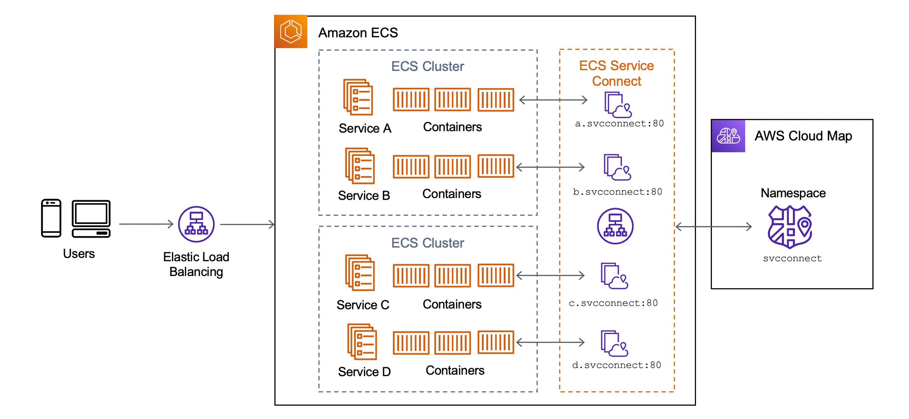
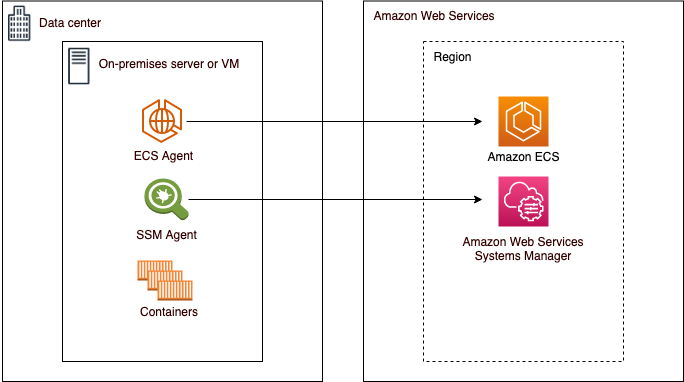

## Elastic Container Registry (ECR)

**Amazon Elastic Container Registry (ECR)** is a fully managed, high-performance Docker container registry provided by AWS. It enables developers to securely store, manage, and 
deploy container images, integrating seamlessly with Amazon EKS, ECS, and CI/CD tools. ECR supports both private and public repositories, automatically scaling infrastructure 
and offering features like vulnerability scanning.

- **ECR** lets you store Docker and Open Container Initiative (OCI) images and artifacts.
- Allows users to control private registry access via Register policy.
- Allows users control private repo access via Repo policy.
- Allows users to scan images on push to identify software vulnerabilities.
- Private image replication allows users to have cross-account and cross-region images.
- ECR allows you to create a Pull Through Cache to sync the contents of an upstream public registry.
- Repo images are encrypted at-rest.
- Amazon ECR lifecycle allows users to manage and automate cleaning up of container images.
- Images can be signed using the AWS Signer to ensure images are from trusted developers.
- Tags can be set to mutable or immutable.


- A registry contains multiple repos
- A repo contains multiple images
- An image can have multiple tags
- A tag points to a specific image version
  - eg. 1.0, latest

ECR Supports
 - **Public registries**: accessible to anyone
 - **Private registries**: only accessible to those within the AWS account
   - Control access via **Register Policy**
     - `ecr:ReplicateImage`
     - `ecr:BatchImportUpstreamImage`
     - `ecr:CreateRepository`
   - Control Access via **Repo Policy**
     - `ecr:DescribeImages`
     - `ecr:DescribeRepositories`

To push to ECR, you must first authenicate using docker with an authorization token. To obtain this token, you need to have AWS credentials configured in your environment:

```sh
# Login to ECR
aws ecr get-login-password \
  --region us-east-1 \ |
  docker login \
    --username AWS \
    --password-stdin <aws_account_id>.dkr.ecr.<region>.amazonaws.com

# Build, tag  and Push Image
docker buildx build -f Dockerfile \
  --platform linux/amd64,linux/arm64,linux/386,linux/ppc64le,linux/s390x \
  -t "<aws_account_id>.dkr.ecr.<region>.amazonaws.com/my-image:latest" \
  --push .
```

Image tag mutability feature prevents image tags from being overwritten. To turn it on:

```sh
aws ecr create-repository \
  --repository-name my-repo \
  --image-tag-mutability IMMUTABLE \
  --region us-east-1
```

When tag immutability is turned on for a repository, this affects all tags, you cannot make some tags immutable and others mutable. Immutable tags is a best practice because if 
there was a security vulnerability with a specific image, you can rollbackto the previous image ore preserve the history of vulnerabilities.

The `ImageTagAlreadyExistsExceptio` error is returned if you attempt to push an image with a tag that is already in the repository.

ECR lifecycle can be used to expire old images based on specific criteria:

```json
{
    "rules": [
        {
            "rulePriority": 1,
            "description": "Expire images older than 30 days",
            "selection": {
                "tagStatus": "tagged",
                "tagPatternList": ["prod*"],
                "countType": "sinceImagePushed",
                "countUnit": "days",
                "countNumber": 14
            },
            "action": {
                "type": "expire"
            }
        }
    ]
}
```

## Elastic Container Service (ECS)

Amazon Elastic Container Service (Amazon ECS) is a fully managed container orchestration service that helps you easily deploy, manage, and scale containerized applications. As a 
fully managed service, Amazon ECS comes with AWS configuration and operational best practices built-in. 

It's integrated with both AWS tools, such as Amazon Elastic Container Registry, and third-party tools, such as Docker. This integration makes it easier for teams to focus on 
building the applications, not the environment. You can run and scale your container workloads across AWS Regions in the cloud, and on-premises, without the complexity of 
managing a control plane.

### ECS Components

1. **Cluster**: Multiple instances which will house the docker containers.
2. **Task Definition**: A JSON file that defines the configuration of (up to 10) containers you want to run.
3. **Task**: Launches containers defines in task definition. Tasks do not remain once workload is complete.
4. **Service**: Ensures tasks remain running eg. Web app
5. **Container Agent**: Binary on each EC2 instance, which monitors, starts and stops tasks.
6. **ECS Controller/Schduler**: Responsible for scheduling the deployment and placement of containers, Replace unhealthy containers.
   - You can create your own schedulers or use thrid-party schedulers.

### AWS Fargate

**AWS Fargate** is a serverless, pay-as-you-go compute engine for containers that works with both **Amazon ECS** and **Amazon EKS**, eliminating the need to manage underlying 
EC2 server infrastructure. It automatically scales and manages infrastructure, allowing developers to focus on application development by defining CPU, memory, and networking 
requirements for each container.

- You can create an empty ECS cluster (no EC2 provisioned), and then launch Tasks as Fargate.
- With fargate, you no longer have to provision, configure, and scale clusters of EC2 instances to run containers.
- You are charged for at least 1 minute, and then it's by the second.
- You pay based on duration and consumption.
- Fargate must use awslogs networking mode, and will have an ENI in the VPC per task group.
- When using ELB to point to Fargate, you have to use an IP address, because Fargate tasks do not have hostnames.

### Configuring Fargate Tasks

- In your Fargate Task Definition, you define the memory and vCPU.
- You will then add your containers and allocate the memory and vCPU required for each container.
- When you run the Task, you can select the VPC and subnet the task should run in.
- Apply a security group to the Task.
- Apply an IAM role to the Task.

Security Groups and IAM roles can be applied to both ECS and Fargate Tasks and services.

### ECS Task Execution Role

The task **execution role** grants the Amazon ECS container and Fargate agents permission to make AWS API calls on your behalf. The task execution IAM role is required depending 
on the requirements of your task. You can have multiple task execution roles for different purposes and services associated with your account.

Common permissions:

- Access to Secrets Manager or SSM Parameter Store.
- Access to download private image form ECR.
- Full Access to CloudWatch Logs.

Example Task Execution Role with CloudFormation:

```yaml
AWSTemplateFormatVersion: '2010-09-09'
Description: ECS Task Execution Role

Resources:
  Type: AWS::IAM:Role
  Propertise:
    RoleName: CruddurServiceExecutionRole
    AssumeRolePolicyDocument:
      Version: "2012-10-17"
      Statement:
        - Effect: Allow
          Principal:
            Service: ecs-tasks.amazonaws.com
          Action: sts:AssumeRole
    Policies:
      - PolicyName: 'cruddur-execution-policy'
        PolicyDocument: 
          Version: "2012-10-17"
          Statement: 
            - Sid: 'VisualEditor0'
              Effect: 'Allow'
              Action: 
                - 'ecr:GetAuthorizationToken'
                - 'ecr:BatchCheckLayerAvailability'
                - 'ecr:GetDownloadUrlForLayer'
                - 'ecr:BatchGetImage'
                - 'logs:CreateLogStream'
                - 'logs:PutLogEvents'
              Resource: '*'
            - Sid: 'VisualEditor1'
              Effect: 'Allow'
              Action: 
                - 'ssm:GetParameters'
                - 'ssm:GetParameter'
              Resource: !Sub 'arn:aws:ssm:${AWS::Region}:${AWS::AccountId}:parameter/cruddur/${ServiceName}/*'
    ManagedPolicyArns:
      - arn:aws:iam::aws:policy/CloudWatchLogsFullAccess
```
### ECS Task Role

**ECS tasks** can have an **IAM role** associated with them. The permissions granted in the IAM role are vended to containers running in the task. This role allows your 
application code (running in the container) to use other AWS services. The task role is required when your application accesses other AWS services, such as Amazon S3.

Common Permissions:

- Access to SSM messages for ECS Exec
- CloudWatch Logs Full Access for container logging
- XRay Daemon Write Access so XRay can be used for traceability.

Example Task IAM Role using CloudFormation:

```yaml
AWSTemplateFormatVersion: '2010-09-09'
Description: ECS Task IAM Role

Resources:
  Type: AWS::IAM:Role
  Propertise:
    RoleName: CruddurServiceTaskRole
    AssumeRolePolicyDocument:
      Version: "2012-10-17"
      Statement:
        - Effect: Allow
          Principal:
            Service: ecs-tasks.amazonaws.com
          Action: sts:AssumeRole
    Policies:
      - PolicyName: 'cruddur-task-policy'
        PolicyDocument: 
          Version: "2012-10-17"
          Statement: 
            - Sid: 'VisualEditor0'
              Effect: 'Allow'
              Action: 
                - 'ssmmessages:CreateControlChannel'
                - 'ssmmessages:CreateDataChannel'
                - 'ssmmessages:OpenControlChannel'
                - 'ssmmessages:OpenDataChannel'
              Resource: '*'
    ManagedPolicyArns:
      - arn:aws:iam::aws:policy/CloudWatchLogsFullAccess
      - arn:aws:iam::aws:policy/AWSXRayDaemonWriteAccess
```

### ECS Capacity Providers

When you use Amazon EC2 instances for your capacity, you use Auto Scaling groups to manage the Amazon EC2 instances registered to their clusters. Auto Scaling helps ensure that 
you have the correct number of Amazon EC2 instances available to handle the application load.

You create an Auto Scaling Group, and associate that with your custom capacity provider. You can then add the capacity provider to your ECS cluster.

1. Create an Auto Scaling Group:
   
   ```sh
   aws autoscaling create-auto-scaling-group \
    --auto-scaling-group-name cruddur-asg \
    --launch-template LaunchTemplateId=lt-0123456789abcdef0,Version=1 \
    --min-size 1 \
    --max-size 10 \
    --desired-capacity 2 \
    --vpc-zone-identifier subnet-0123456789abcdef0 \
     # Other parameters omitted for brevity
   ```
2. Create Capacity Provider:

   ```sh
   aws create-capacity-provider \
    --name MyEC2CapacityProvider \
    --auto-scaling-group-provider autoScalingGroupArn=ASG_ARN, managedScaling={"status":"ENABLED", "targetCapacity":75}, managedTerminationProtection="ENABLED"  
   ```

3. At the cluster level:
 
   ```sh
   aws ecs put-cluster-capacity-providers \
     --cluster my-cluster \ 
     --capacity-providers MyEC2CapacityProvider \
     --default-capacity-provider-strategy capacityProvider="MyEC2CapacityProvider",weight=1,base=0
   ```
4. At the task level:

   ```sh
   aws ecs create-service \
     ...
     --capacity-provider-strategy capacityProvider="MyEC2CapacityProvider",weight=1,base=0
   ```

### ECS Task Lifecycle


1. **PROVISIONING**: Amazon ECS has to perform additional steps before the task is launched. For example, for tasks that use the awsvpc network mode, the elastic network 
interface needs to be provisioned.

2. **PENDING**: This is a transition state where Amazon ECS is waiting on the container agent to take further action. A task stays in the pending state until there are available 
resources for the task.

3. **ACTIVATING**: This is a transition state where Amazon ECS has to perform additional steps after the task is launched but before the task can transition to the RUNNING 
state. This is the state where Amazon ECS pulls the container images, creates the containers, configures the task networking, registers load balancer target groups, and 
configures service discovery.

4. **RUNNING**: The task is successfully running.

5. **DEACTIVATING**: This is a transition state where Amazon ECS has to perform additional steps before the task is stopped. For example, for tasks that are part of a service 
that's configured to use Elastic Load Balancings target groups, the target group deregistration occurs during this state.

6. **STOPPING**: This is a transition state where Amazon ECS is waiting on the container agent to take further action. For Linux containers, the container agent will send the 
stop signal defined in your container image to notify the application needs to finish and shut down using the STOPSIGNAL instruction. This is SIGTERM by default. Then it will 
send a SIGKILL after waiting the StopTimeout duration set in the task definition.

7. **DEPROVISIONING**: Amazon ECS has to perform additional steps after the task has stopped but before the task transitions to the STOPPED state. For example, for tasks that 
use the awsvpc network mode, the elastic network interface needs to be detached and deleted.

8. **STOPPED**: The task has been successfully stopped. If your task stopped because of an error, see Viewing Amazon ECS stopped task errors.

9. **DELETED**: This is a transition state when a task stops. This state is not displayed in the console, but is displayed in describe-tasks.

### Task Definition

JSON Example:

```json
{
  "family": "backend-flask",
  "executionRoleArn": "arn:aws:iam::982383527471:role/EscEc2BasicServiceExecutionRole",
  "taskRoleArn": "arn:aws:iam::982383527471:role/EcsEc2BasicTaskRole",
  "networkMode": "bridge",
  "cpu": "256",
  "memory": "512",
  "requiresCompatibilities": [ 
    "FARGATE" 
  ],
  "containerDefinitions": [
    {
      "name": "backend-flask",
      "image": "982383527471.dkr.ecr.ca-central-1.amazonaws.com/backend-flask",
      "essential": true,
      "healthCheck": {
        "command": [
            "CMD-SHELL",
            "python /backend-flask/bin/health-check"
        ],
        "interval": 30,
        "timeout": 5,
        "retries": 3,
        "startPeriod": 60
      },
      "portMappings": [
        {
          "name": "backend-flask",
          "containerPort": 4567,
          "hostPort": 80,
          "protocol": "tcp", 
          "appProtocol": "http"
        }
      ],
      "logConfiguration": {
        "logDriver": "awslogs",
        "options": {
            "awslogs-group": "cruddur",
            "awslogs-region": "ca-central-1",
            "awslogs-stream-prefix": "backend-flask"
        }
      },
      "enviroment": [
        {
          "name": "AWS_REGION",
          "value": "ca-central-1"
        }
      ],
      "secrets": [
        {
          "name": "DB_PASSWORD",
          "valueFrom": "arn:aws:secretsmanager:ca-central-1:982383527471:secret:cruddur/backend-flask/DB_PASSWORD-Abcdef"
        }
      ]
    }
  ]
}
```

- **`Family`**: A way to group similar task definitions(it's how versioning works).
- **`Execution Role`**: The role used to prepare or managed the container.
- **`Task Role`**: The role used by the running compute of the container.
- **`Network Mode`**
  - *`Host`* - Connect directly to host machine
  - *`Bridge`* - Isolate between containers but they can still communicate with each other
  - *`AWSVPC`* - creates an ENI in your VPC. Fargate can only used AWSVPC mode.
  - *`None`* - disable networking
- **`CPU and Memory`**: How much memory and compute
- **`Requires compatibilities`**: EC2, Fargate, EXTERNAL
- **`Container Definition`**: Defines the connection of containers to be provisioned on the compute.
  - *`Name`*: Name of the container
  - *`Image`*: a URI to the container image eg. ECR, DockerHub
  - *`Essential`*: There always has to be one essential container, if this container fails, all containers fail.
  - *`HealthCheck`*: Perform a health check.
  - *`PortMappings`*: Map the container port to the host port.
  - *`LogConfiguration`*: Write logs to AWS CloudWatch.
  - *`Environment`*: Environment variables you want to set for your container.
  - *`Secrets`*: Secrets pulled from Secrets Manager or SSM Parameter Store.

### Port Mappings

**Bridge Mode**
- Container port(guest) maps to hosts different port.
- The guest and host ports can be different.

```json
"portMappings": [
    {
        "containerPort": "3000",
        "hostPort": "80",
        "protocol": "tcp"
    }
]
```

**Host Mode**

- Container port (guest) directly maps to the same host port.
- The guest and host ports will be the same.
  - The host port definition is not required since it will be the same.

```json
"portMappings": [
    {
        "containerPort": "3000",
        "protocol": "tcp"
    }
]
```

**AWSVPC Mode**

- Gives the container it's own network interface with a direct public IP address
- The guest and host port will be the same.
  - The host port definition is not required since it will be the same.

```json
"portMappings": [
    {
        "containerPort": "3000",
        "protocol": "tcp"
    }
]
```

### ECS Exec

**Amazon ECS Exec** allows you to run interactive shell commands or execute single commands directly inside an Amazon ECS container. It functions similarly to docker exec but is 
designed for cloud-native environments, eliminating the need to first interact with the host container operating system, open inbound ports, or manage SSH keys. 

- ECS Exec works with both *ECS EC2* and *ECS Fargate* containers.
- ECS Exec commands are run as root.
- ECS Exec commands cannot be executed from the AWS Management console.
- ECS Exec session has an idle timeout of 20 minutes.
- ECE Exec must be turned on during the launch of a task, it cannot be turned on for existing tasks.

**Prerequisites**

- AWS CLI Installed
- Sessions Manager Plugin Installed
- The Task role must have permission

  ```json
  {
    "Version": "2012-10-17",
    "Statement": [
        {
            "Effect": "Allow",
            "Action": [
                "ssmmessages:CreateControlChannel",
                "ssmmessages:CreateDataChannel",
                "ssmmessages:OpenControlChannel",
                "ssmmessages:OpenDataChannel"
            ],
            "Resource": "*"
        }
    ]
  }
  ```
- You must meet version requirements for ECS or Fargate

To remove any zombie SSM agent child processes found, set the task definition parameter `initProcessEnabled` to `true`, this starts the init process inside the container. 

```json
{
    "taskRoleArn": "ecsTaskRole",
    "networkMode": "awsvpc",
    "requiresCompatibilities": [
        "EC2",
        "FARGATE"
    ],
    "executionRoleArn": "ecsTaskExecutionRole",
    "memory": ".5 gb",
    "cpu": ".25 vcpu",
    "containerDefinitions": [
        {
            "name": "amazon-linux",
            "image": "amazonlinux:latest",
            "essential": true,
            "command": ["sleep","3600"],
            "linuxParameters": {
                "initProcessEnabled": true
            }
        }
    ],
    "family": "ecs-exec-task"
}
```

Then you can turn on the ECS Exec feature for your services and standalone tasks by specifying the `--enable-execute-command` flag when using one of the following AWS CLI 
commands: `create-service`, `update-service`, `start-task`, or `run-task`.

Example when running `create-service`:

```sh
aws ecs create-service \
  --cluster cluster-name \
  --task-definition task-definition-name \
  --enable-execute-command \
  --service-name service-name \
  --launch-type FARGATE \
  --network-configuration "awsvpcConfiguration={subnets=[subnet-12344321],securityGroups=[sg-12344321],assignPublicIp=ENABLED}" \
  --desired-count 1
```

The use ECS Exec to remotely execute a command:

```sh
aws ecs execute-command \
  --cluster cluster-name \
  --task task-id \
  --container container-name \
  --interactive \
  --command "/bin/sh"
```

### Log Configuration

The log configuration for the container. This parameter maps to LogConfig in the docker container create command and the `--log-driver` option to docker run. A log driver tells 
where the container should log, `awslogs` will log to CloudWatch logs.

By default, containers use the same logging driver that the Docker daemon uses. However, the container might use a different logging driver than the Docker daemon by specifying 
a log driver configuration in the container definition.

There are other third-party log drivers that can be used.

1. AWS EC2 log driver support:
   - `awslogs`, `fluentd`, `json-file`, `journald`, `logentries`, `syslog`, `splunk`, `awsfirelens`.

2. Fargate Log driver support:
   - `awslogs`, `splunk`, `awsfirelens`

By default, `awslogs` is blocking and you might want to configure it for nonblockor instead use AWS FireLens. AWS FireLens works with either Fluent Bit, or Fluentd. 

### ECS Service Connect

**Amazon ECS Service Connect** is a fully managed networking capability that simplifies service-to-service communication within Amazon ECS clusters. It provides built-in service
discovery, reliable connectivity, and observability without requiring you to manage complex infrastructure like sidecar proxies or external load balancers for internal traffic.

**ECS Service Connect** is an evolution of App Mesh, abstracting a lot of the configuration between App Mesh, Cloud Map, and ELB. 

#### Features

- Service Discovery.
- Consistent Approach to handle Service-to-Service Communication.
- Encrypts data in-transit between services using TLS.
- Telemetry data in the ECS Console and CloudWatch.
- Traffic Health checks.
- Automatic retries.
- Rolling deployments.

With ECS Service Connect, you can refer and connect to your services by logical names using a namespace provided by AWS Cloud Map and automatically distribute traffic between 
ECS tasks without deploying and configuring load balancers.



You can simply create a cluster via AWS CLI with service-connect-default parameter and a default Cloud Map namespace name for service discovery purposes.

```sh
aws ecs create-cluster \
  --cluster "svc-cluster-2" \
  --service-connect-defaults '{
    "namespace": "svc-namespace"
}'
```

Then create a service using an existing task definition called `webui-svc-cluster` and expose your web user-interface server using ECS Service Connect. To use Service 
Connect, you need to add port names in your task definition.

```sh
aws ecs create-service \
  --cluster "svc-cluster-2" \
  --service-name "webui" \
  --desired-count 1 \
  --task-definition "webui-svc-cluster" \
  --service-connect-configuration '{
    "enabled": true,
    "namespace": "svc-namespace",
    "services":
     [
        {
           "portName": "webui-port",
          "clientAliases": [
             {
                "port": 80,
                "dnsName": "webui"
              }
            ]
        }
      ]
  }'
```
### ECS Optimized AMI

The **Amazon ECS-optimized AMI** is a specialized Amazon Machine Image (AMI) designed specifically for running containerized workloads on Amazon ECS. It comes pre-configured 
with essential components like the ECS container agent, the Docker daemon, and necessary runtime dependencies.

When you launch an EC2 instance via ECS EC2 Management console, it will automatically use an Amazon ECS-optimized AMI by default. 

#### Features

- Comes with Docker installed.
- Comes with ECS Container Agent installed.
- OS-level optimized for containers.
- There is a variant of ECS Optimized with GPUs.

To change the AMI and use the GPU variant AMI, then you need to adjust it in the launch template:

```sh
aws ec2 create-launch-template \ 
  --launch-template-name "ECEEC2LaunchTemplate" \
  --version-description "Version1" \
  --launch-template-data \
       {
         "ImageId":"ami-0c55b159cbfafe1f0",
         "InstanceType":"t3.micro"
       }
...      
```

### ECS Optimized Bottlerocket AMI

**Bottlerocket** is a Linux based open-source operating system that is purpose built by AWS for running containers on virtual machines or bare metal hosts. The **Amazon 
ECS-optimized Bottlerocket AMI** is secure and only includes the minimum number of packages that's required to run containers. 

Bottlerocket differs from Amazon Linux in the following ways:
 - Bottle rocket does not include a package manager.
 - Software can only be run as containers.
 - Updates are both applied and can be rolled back in a single step, which reduces the likelihood of update errors.
 - The primary mechanism to manage Bottlerocket hosts is with a container scheduler.
 
Bottlerocket AMIs also don't support the following services and features.
 - ECS Anywhere
 - ECS Service Connect
 - Amazon EFS in encrypted mode and AWSVPC Network Mode.

### ECS EC2 Instance Cluster Registration

To register an ECS EC2 instance to a cluster you need to provide the username in the `user-data.toml` file:

```yaml
# userdata.toml
[settings.ecs]
cluster = "my-cluster-name"
```
Then run the instance:

```sh
aws ec2 run-instances \
  --key-name ecs-bottlerocket-instance \
  --subnet-id subnet-08fc675773504410c \
  --image-id ami-09557774777477747 \
  --instance-type t3.large \
  --region us-east-1 \
  --user-data file://userdata.toml \
  --iam-instance-profile Name=ecsInstanceRole
```

### ECS Anywhere

**Amazon ECS Anywhere** provides support for registering an external instance such as an on-premises server or virtual machine (VM), to your Amazon ECS cluster. External 
instances are optimized for running applications that generate outbound traffic or process data. If your application requires inbound traffic, the lack of Elastic Load Balancing 
support makes running these workloads less efficient. Amazon ECS added a new EXTERNAL launch type that you can use to create services or run tasks on your external instances.

- $0.01025 per hour for each managed ECS Anywhere instance.
- You can register an external instance to a single cluster.
- External instaces require an IAM role that allows them to communicate with AWS APIs.
- External instances support ECS Exec.
- AWSVPC network mode is not supported.
- Service Load Balancing is not supported.
- Service discovery is not supported.
- ECS capacity providers are not supported.
- ECS Anywhere uses the launch template type `EXTERNAL`.
- SELinux is not supported.
- EFS Volumes are not supported.
- ECS Anywhere can be run on Windows but not without a Windows LICENSE.



To configure an ECS Anywhere instance you need to:

1. Create a Systems Manager activation pair:

   ```sh
   aws ssm create-activation \
     --iam-role ecsAnywhereRole \
     | tee ssm-activation.json
   ```

2. Download the Install script:
   
   ```sh
   curl --proto "https" -o "/tmp/ecs-anywhere-install.sh" \
     "https://amazon-ecs-agent.s3.amazonaws.com/ecs-anywhere-install-latest.sh"
   ```
3. Run the install script:

   ```sh
   sudo bash /tmp/ecs-anywhere-install.sh \
     --region $REGION \
     --cluster $CLUSTER_NAME \
     --activation-id $ACTIVATION_ID \
     --activation-code $ACTIVATION_CODE
   ```
The install script runs and starts the ECS Service agent which you can manage with `systemctl`. 

```sh
sudo systemctl status ecs.service
```

