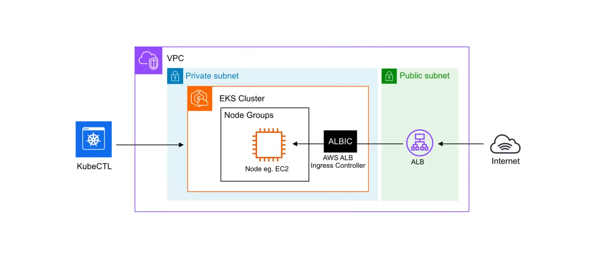

## Amazon Elatic Kubernetes Service(EKS)

**Amazon Elastic Kubernetes Service (EKS)** is a fully-managed, certified Kubernetes conformant service that simplifies the process of building, securing, operating, and 
maintaining Kubernetes clusters on AWS. Amazon EKS integrates with core AWS services such as CloudWatch, Auto Scaling Groups, and IAM to provide a seamless experience for 
monitoring, scaling, and load balancing your containerized applications.

For it's compute nodes, EKS supports the following:

- EC2 Instances
  - *Managed Node groups* - Autoscaling is fully managed by AWS.
  - *Self-managed node groups* - Customer can self-managed scaling using EC2 Auto Scaling Groups.
  - *Karpenter* - Cloud native open-source autoscaler.
- Fargate Instances
- External Instances (on premise)

You can connect and managed your cluster via `kubectl`. Use ALB to route traffic to your nodes via the AWS ALB Ingress Controller.

### EKS Add-Ons

**AWS Managed Add-Ons**

- **Amazon VPC CNI Plugin for Kubernetes**
  - Enable pod networking within your cluster.
- **CoreDNS**
  - Enable service discovery within your cluster.
- **Kube Proxy**
  - Enable service networking within your cluster.
- **Amazon EKS Pod Identity Agent**
  - Install EKS Pod Identity Agent to use EKS Pod Identity to grant AWS IAM permissions to pods through Kubernetes service accounts.
- Amazon Guard Duty Agent
- Amazon EBS CSI Driver
- Amazon EFS CSI Driver
- Mountpoint for Amazon S3 CSI Driver
- CSI Snapshot controller
- AWS Distro for OpenTelemetry
- Amazon CloudWatch Observability Agent

**Third Party Add-Ons**

- AccuKnox 
- NetApp
- Calyptia
- Cribl
- Dynatrace
- Datree
- Datadog
- GroundCover
- Grafana Labs
- HA Proxy
- Pow
- KubeCost
- Kasten
- Kong
- LeakSignal
- New Relic
- Rafay
- Solo.io
- StormForge
- Splunk
- Teleport
- Tetrate
- Upbound Universal Crossplane
- Upwind

### EKS Connector

