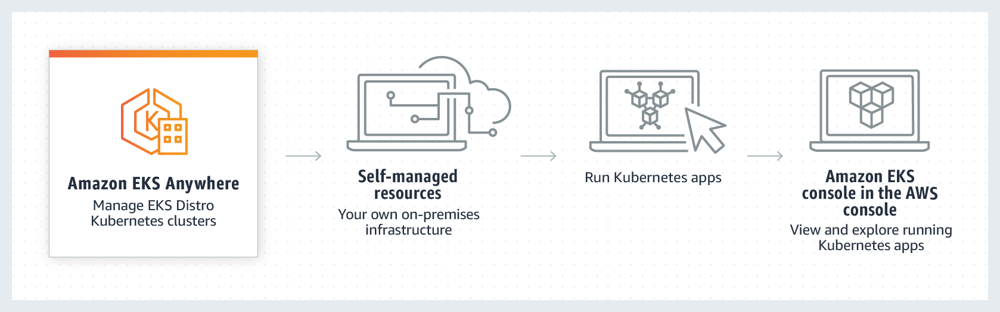
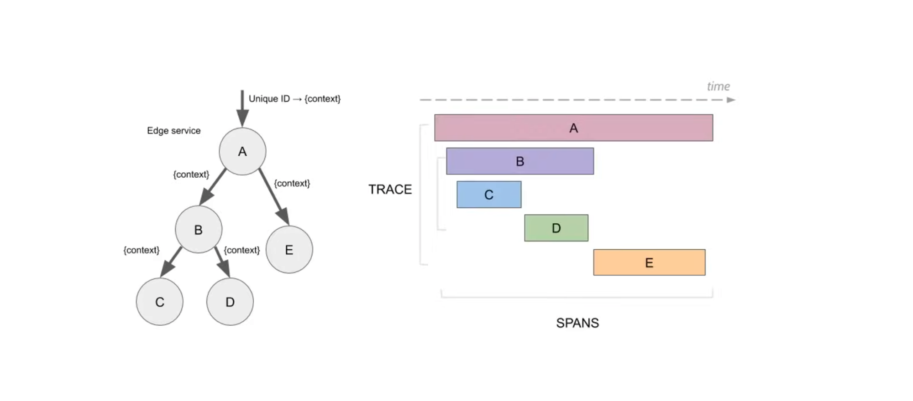
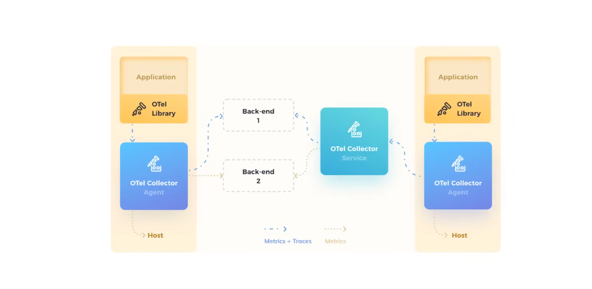

## Amazon Elatic Kubernetes Service(EKS)

**Amazon Elastic Kubernetes Service (EKS)** is a fully-managed, certified Kubernetes conformant service that simplifies the process of building, securing, operating, and 
maintaining Kubernetes clusters on AWS. Amazon EKS integrates with core AWS services such as CloudWatch, Auto Scaling Groups, and IAM to provide a seamless experience for 
monitoring, scaling, and load balancing your containerized applications.


For it's compute nodes, EKS supports the following:

- EC2 Instances
  - *Managed Node groups* - Autoscaling is fully managed by AWS.
  - *Self-managed node groups* - Customer can self-managed scaling using EC2 Auto Scaling Groups.
  - *Karpenter* - Cloud native open-source autoscaler.
- Fargate Instances
- External Instances (on premise)

You can connect and managed your cluster via `kubectl`. Use ALB to route traffic to your nodes via the AWS ALB Ingress Controller.


### EKS Add-Ons

**AWS Managed Add-Ons**

- **Amazon VPC CNI Plugin for Kubernetes**
  - Enable pod networking within your cluster.
- **CoreDNS**
  - Enable service discovery within your cluster.
- **Kube Proxy**
  - Enable service networking within your cluster.
- **Amazon EKS Pod Identity Agent**
  - Install EKS Pod Identity Agent to use EKS Pod Identity to grant AWS IAM permissions to pods through Kubernetes service accounts.
- Amazon Guard Duty Agent
- Amazon EBS CSI Driver
- Amazon EFS CSI Driver
- Mountpoint for Amazon S3 CSI Driver
- CSI Snapshot controller
- AWS Distro for OpenTelemetry
- Amazon CloudWatch Observability Agent

**Third Party Add-Ons**

- AccuKnox 
- NetApp
- Calyptia
- Cribl
- Dynatrace
- Datree
- Datadog
- GroundCover
- Grafana Labs
- HA Proxy
- Pow
- KubeCost
- Kasten
- Kong
- LeakSignal
- New Relic
- Rafay
- Solo.io
- StormForge
- Splunk
- Teleport
- Tetrate
- Upbound Universal Crossplane
- Upwind

### EKS Connector

You can use **Amazon EKS Connector** to register and connect any conformant Kubernetes cluster to AWS and visualize it in the Amazon EKS console. After a cluster is connected, 
you can see the status, configuration, and workloads for that cluster in the Amazon EKS console. You can use this feature to view connected clusters in Amazon EKS console, but 
you can’t manage them.

The Amazon EKS Connector can connect the following types of Kubernetes clusters to Amazon EKS.

- On-premises Kubernetes clusters
- Self-managed clusters that are running on Amazon EC2
- Managed clusters from other cloud providers

You install the EKS Connector via helm in your target cluster:

```sh
helm -n eks-connector install eks-connector \
  oci://public.ecr.aws/eks-connector/eks-connector-chart \
  --set eks.activationCode="your_activation_code" \
  --set eks.activationId="your_activation_id" \
  --set eks.agentRegion="your_region"
```

### EKS CTL

`eksctl` is a command-line utility tool that automates and simplifies the process of creating, managing, and operating Amazon Elastic Kubernetes Service (Amazon EKS) clusters. 
Written in Go, eksctl provides a declarative syntax through YAML configurations and CLI commands to handle complex EKS cluster operations that would otherwise require multiple 
manual steps across different AWS services.

**EKS** can:

- Deploy EC2-backed nodes.
- Fargate-backed nodes.
- Deploy to a private cluster on AWS Outposts.

By default, `eksctl` uses the following defaults:

- Autogenerated names eg. fabulous-mushroom-123985432
- Two m5.large worker nodes
- EC2 instances configured with AWS EKS AMI
- us-west-2 region to deploy
- A dedicated VPC

You can use a yaml file to create a cluster with `eksctl`:

```yaml
apiVersion: eksctl.io/v1alpha5
kind: ClusterConfig

metadata:
  name: my-cluster
  region: us-east-1

nodeGroups:
  - name: nodegroup-1
    instanceType: m5.large
    desiredCapacity: 10
  - name: nodegroup-2
    instanceType: m5.xlarge
    desiredCapacity: 3 
```

### EKS Distro

**Amazon EKS Distro (EKS-D)** is a Kubernetes distribution based on and used by Amazon Elastic Kubernetes Service (EKS) to create reliable and secure Kubernetes clusters. With 
EKS-D, you can rely on the same versions of Kubernetes and its dependencies deployed by Amazon EKS. This includes the latest upstream updates, as well as extended security 
patching support. EKS-D follows the same Kubernetes version release cycle as Amazon EKS, and we provide the bits here. EKS-D offers the same software that has enabled tens of 
thousands of Kubernetes clusters on Amazon EKS.

EKS-D comes with the following components:

- CNI Plugins
- CoreDNS
- etcd
- CSI Sidecars (deprecated)
- AWS IAM authenticator
- Kubernetes Metrics Server (deprecated)

#### Installation Methods

- Community - kubeadm, kinit, kops
- Third-party partners eg. Pulumi DataDog, SysDig, KubeStack
- EKS Anywhere

#### Use Cases

- Hybrid Deployments: Consistecy between AWS and on-premise Kubernetes clusters.
- Development and Testing: Identical production and development environments.
- AWS Services Extension: AWS integration to on-premise setups.

### EKS Anywhere

**Amazon EKS Anywhere** is a new deployment option for Amazon EKS that enables you to easily create and operate Kubernetes clusters on-premises with your own virtual machines or 
bare metal hosts. It brings a consistent AWS management experience to your data center, building on the strengths of Amazon EKS Distro, the same distribution of Kubernetes that 
powers EKS on AWS.



- EKS Anywhere allows you to managed your cluster form the AWS Management Console.
- An Admin Machine is required to run cluster lifecycle operation
  - Does not have to continously run
  - Critical cluster artifacts are saved to the admin machine on creation eg. kubeconfig

Clusters can be deployed to:

- VMWare VSphere
- Bare Metal (using Tinkerbell)
- AWS Snowball Edge
- Apache CloudStack
- Nutanix
- Docker (dev clusters)

EKS-Anywhere is open-source and free. EKS Anywhere Enterprise Subscriptions for 24/7 Support goes for $24K per cluster for a 1 year term. For a 3-year term, it's $18K per 
cluster per year.

### Traces and Spans

A **trace** is a data/execution path through the system, and can be though of as a directed acrylic graph(DAG) of spans. 



A **Span** represents a logical unit of work, in Jaeger that has an operation name, the start time of the operation, and the duration. Spans may be nested and ordered to model 
casual relationships.

### Open Telemetry

**Open Telemetry(OTEL)** is a collection of open-source tools, APIs, SDKs, and integrations that help you instrument, generate, collect, and export telemetry data 
(traces, metrics, and logs) from your applications and services. It provides a vendor-neutral standard for observability, allowing you to collect telemetry data from 
different sources and export it to various backends for analysis and visualization. 

Open Telemetry standardizes how telemetry data are generated and collected. 



A **Wire Protocol** refers to a way of getting data from point to point. eg. SOAP, AMQP

### Open Telemetry Instrumentation

Instrumentation is the act of embedding a monitoring library into your existing application in order to capture monitoring data such as metrics, traces, or logging.

Open Telemetry supports a variety of programming languages:

- C++
- .NET
- Erlang/Elixir
- Go
- Python
- JavaScript
- Php
- Java
- Ruby
- Rust
- Swift

For certain frameworks, there plug-and-play libraries to quickyly instrument your apps:
 
 - Spring
 - ASP.Net Core
 - Express
 - Quarkus

```ruby
# require otel-ruby
require 'opentelemetry-sdk'

# export traces to console by default
ENV['OTEL_TRACES_EXPORTER'] = 'console'

# configure sdk with defaults
OpenTelemetry::SDK.configure

@tracer = OpenTelemetry.tracer_provider.tracer('sinatra', '1.0')

OpenTelemetry::Context.with_current(context) do
  @tracer.in_span(
    span_name,
    kind: :server,
    attributes: {
      'component' => 'http',
      'http.method' => ENV['REQUEST_MATHOD'],
      'http.url' => ENV['REQUEST_URI'],
      'http.route' => ENV['PATH_INFO'],
    }
  ) do |span|
    # Run application stack
    status, header, response_body = @app.call(env)
    
    span.set_attribute('http.status_code', status)
    
  end
end
```

### Open Telemetry Collector

