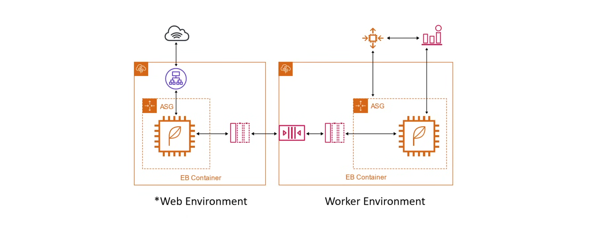
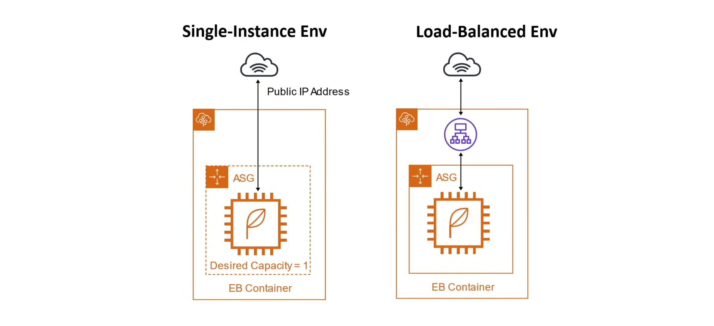

## AWS Elastic Beanstalk

**AWS Elastic Beanstalk(EB)** is a fully managed Platform-as-a-Service (PaaS) that simplifies the deployment and scaling of web applications and services in the AWS Cloud. It handles the underlying infrastructure management, allowing developers to focus solely on their application code. Think of **Elastic Beanstalk** as the Heroku of AWS.

With most PaaS, you choose a platform, upload your code, and it runs with little to no knowledge of the underlying infrastructure. AWS does not recommend using EB for production applications.

Elastic Beanstalk is powered by a CloudFormation template which sets up for users the following:

- Elastic Load Balancer
- Auto Scaling Groups
- RDS Databases
- EC2 Instances Preconfigured 
- Monitoring(CloudWatch)
- In-Place Blue/Green Deployment methodologies
- Security (Secret rotation)
- Dockerized Environments

**Supported Languages**

- Go
- Java
- Node.js --> Express
- Python --> Django
- Ruby --> Rails
- PHP --> Laravel
- Tomcat --> Spring
- ASP.NET
- Docker

### Web Vs Worker Environment

| Web Environment               | Work Environment                                                           |
|-------------------------------|----------------------------------------------------------------------------|
| Creates and ASG               | Creates an ASG                                                             |
| Creates an ALB                | Creates an SQS Queue                                                       |
| Comes in two variants         | Install the SQS Daemon on the EC2 instances                                |
| Sets up an Elastic IP Address | Creates the CloudWatch alarm t dynamically scale instances based on health |

### Web Environment Types

There are two types:

- Single Instance
- Load Balanced

#### Single Instance

- Uses an ASG but desires capcity set to 1 to ensure a server is always running.
- No ELB to save on cost.
- Public IP address has to be used to route traffic to server.

#### Load Balanced

- Uses an ASG set to scale
- Uses an ELB
- Designed to Scale
