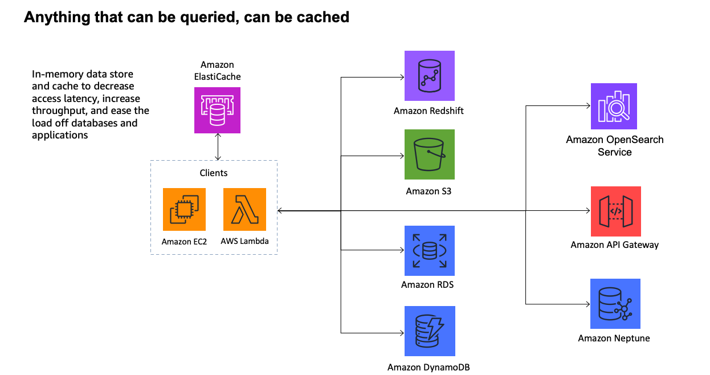

## Amazon ElastiCache

**Amazon ElastiCache** is a fully managed, in-memory data store and caching service provided by Amazon Web Services (AWS). It supports Redis OSS, Valkey, and Memcached engines to boost application performance—achieving microsecond latency—by storing frequently accessed data in memory rather than slower disk-based databases. It is widely used for real-time applications and caching.

It provides a high-performance, scalable, and cost-effective caching solution.  At the same time, it helps remove the complexity associated with deploying and managing a distributed cache environment. **ElastiCache** is intended to cache data or HTML fragments to greatly improve response time in 10s to 100s of milliseconds. 

- ElastiCache is only accessible by resources in the same VPC to ensure low latency.
- ElastiCache can be deployed in multiple AZs for high availability
- ElastiCache can be deployed on-prem via AWS Outposts
- ElastiCache can use RBAC for Redis 6.0+ so users managed user access via the AWS management console
- ElastiCache can be replicatd cross-region via ElastiCache Global Datastores
- Users can reserve nodes to save money with ElastiCache Standard
- ElastiCache can be automate to perform backups of data stores



### Deployment Options

ElastiCache supports two deployment modes:

1. ElastiCache (standard)
2. ElastiCache Serverless

| | Serverless | Standard |
| --- | --- | --- |
| Use Case | Unpredictable workloads | Predictable Workloads |
| Management | Automatically Scales | Customer Manages Cluster and Nodes |
| Billing | Data stored<br>ElastiCache Processing Units (ECPU) consumed | Number of node<br>Type of node(size) |

Standard can be deployed on-prem via AWS Outposts.

### Caching Options

1. **Memcached**
   - It is a simple key/value store.
   - Generally preferred for caching HTML fragments.
   - The trade off to being simple, is that is very fast.

2. **Redis**
   - Can perform complex operations on data.
   - It's very good for leaderboards and keeping track of unread notification data.
   - It's very fast, but arguably not as fast as Memcached.

## Redis

**Redis** ia an open-source in-memory key–value database, used as a distributed cache and message broker, with optional durability. Because it holds all data in memory and because of its design, Redis offers low-latency reads and writes, making it particularly suitable for use cases that require a cache. Data loss is possible because all data is stored in memory. 

Redis is so fast, that it can deliver content from it's store with single to double digit millisecond latency. Redis supports the following data structures:

- Strings
- Sets
- Sorted Sets
- lists
- Hashes
- Bitmaps
- Bitfields
- HyperLogLog
- Geospatial Indexes
- Streams

### Strings

Redis strings are the most basic value. They are binary-safe, so they can contain any kind of data, such as a JSON object, an image, or a serialized object. Strings can have a maximum size of 512 MB.

```sh
redis:6379> GET nonexisting
(nil)
redis:6379> SET mykey "Hello World"
OK
redis:6379> GET mykey
"Hello World"
redis:6379> DEL mykey
(integer) 1
redis:6379> GET mykey
(nil)
```

Atomic counter can be applied to strings that represent a number:

- INC - add 1
- DECR - subtract 1
- INCBY - add a certain amount eg. 10

```sh
redis:6379> SET mykey "10"
OK
redis:6379> INCR mykey
(integer) 11
redis:6379> DECR mykey
(integer) 10
redis:6379> GET mykey
"10"
```
The most common string commands are:

- SET - set a string at a key
- GET - Get a string by it's key
- APPEND - append additional text to the string
- EXISTS - check if a string exists at specified key

