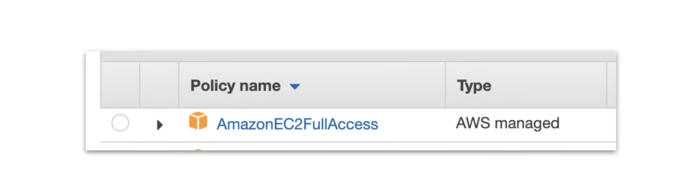
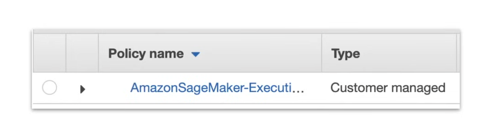

## AWS Identity and Access Management (IAM)

AWS IAM allows you to create and manage AWS users and groups, with permissions to allow and deny them access to AWS resources.

1. **IAM Policies**: JSON documents which grant permissions to a specific user, group, or role to access AWS services. Policies are attached to IAM Identities.
2. **IAM Permission**: The API call that is allowed or denied, according to the IAM Policy.
3. **IAM Identity**: A user, group, or role that is allowed or denied access to AWS resources.
    - **IAM User**: A user is an identity that represents a person who logs into the console or interacts with AWS resources programmatically or via clickOps.
    - **IAM Group**: A group is a collection of users that are granted the same permissions. Groups are used to simplify the management of permissions for multiple users.
    - **IAM Role**: A role grants AWS resources permissions to specific AWS API actions. Policies are associated with roles, then assigned to an AWS resource.

#### IAM - Managed vs Customer vs Inline Policies

- **Managed Policies**: A policy that is managed by AWS, which cannot be edited by users. In AWS, managed policies are labeled with an orange box icon.

    
- **Customer Managed Policies**: A policy that is managed by users, which can be edited by users. In AWS, customer managed policies have no label.

    
- **Inline Policies**: A policy that is directly attached to the user.

    

### Anatomy of an IAM Policy

IAM policies are written in JSON, and contain permissions, which determine which API actions are allowed and which ones are denied. 

Sample IAM Policy:

```JSON
{
    "Version": "2012-10-17",
    "Statement": [
        {
            "Sid": "Deny-Barclay-S3-Access",
            "Effect": "Deny",
            "Action": "s3:*",
            "Principal": {"AWS": ["arn:aws:iam:123456789012:barclay"]},
            "Resource": "arn:aws:s3:::barclay-s3-bucket"
        },
        {
            "Effect": "Allow",
            "Action": "iam:CreateServiceLinkedRole",
            "Resource": "*",
            "Condition": {
                "StringLike": {
                    "iam:AWSServiceName": [
                        "rds.amazonaws.com",
                        "rds.application-autoscaling.amazonaws.com"
                    ]
                }
            }
        }
    ]
}
```

- **Version policy language**: 2012-10-17 is the latest version.
- **Statement**: A list of permissions.
- **Sid**(Optional): A unique identifier for a statement.
- **Effect**: Allow or Deny.
- **Action**: List of API action to allow or deny.
- **Principal**: The user, group, or role that is allowed or denied access to AWS resources.
- **Resource**: The AWS resource to which the action applies.
- **Condition**(Optional): Circumstances under which the policy grants permissions.

