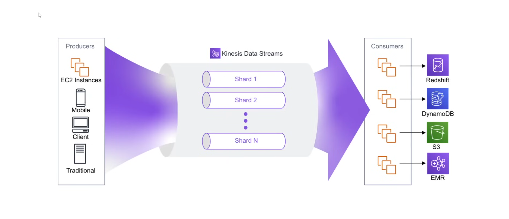
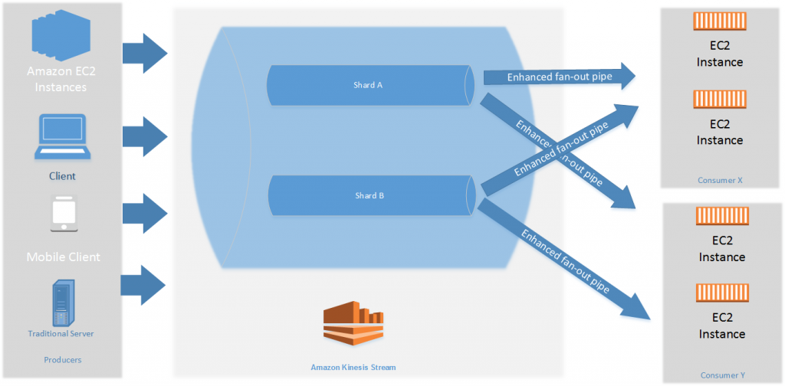
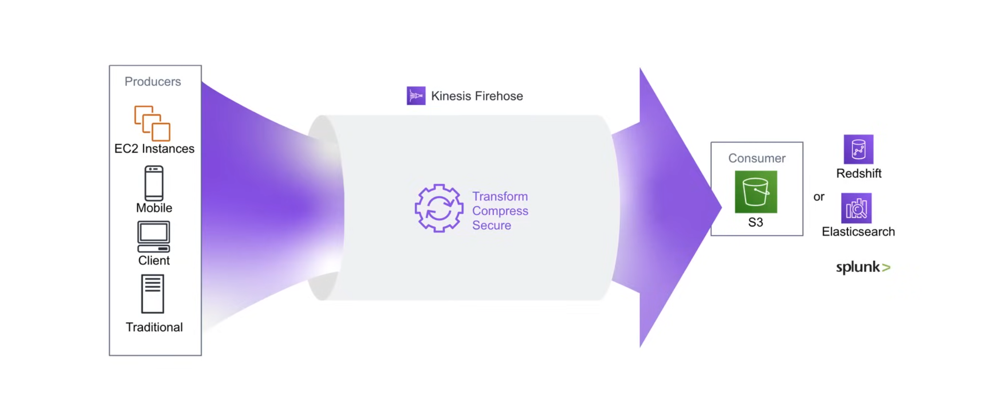
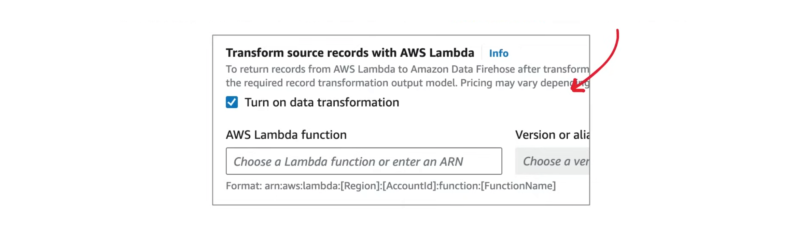

## AWS Kinesis

**Amazon Kinesis** is a fully managed AWS service designed to ingest, process, and analyze real-time streaming data at massive scale. It acts as a high-speed conveyor belt for
data, enabling live dashboards, instant alerts, and real-time analytics for IoT telemetry, application logs, and video.

Streaming Data Examples:

- Stock Prices
- Game Data
- Social Network Data
- Geospatial Data
- Click Stream Data

There are 4 different types of Kinesis Streams:

1. **Kinesis Data Streams**
   - A real-time data sreaming service.
   - Configure custom producers and consumers.
   - The most flexible data streaming option.
2. **Amazon Kinesis Firehose**
   - A serverless and simpler version of Data Streams.
   - Integrates directly to specific AWS services.
   - You pay-on-demand based on how much data consumed.
3. **Managed Service for Apache Flink**
   - Allows users to run queries against data running through their streams.
   - Reports and analysis can be created on emerging data.
4. **Kinesis Video Streams**
   - Allows users to analyze or apply processing on real-time streaming video.

### Kinesis Data Streams

**Amazon Kinesis Data Streams (KDS)** is a fully managed, serverless, real-time data streaming service that ingests and stores large volumes of data (such as IoT telemetry, logs,
and clickstreams) from multiple sources. It allows for real-time processing and analysis by multiple consumers, with data retained for 1 to 365 days, ensuring durability across
multiple Availability Zones.



**Kinesis Data Streams** has two capacity modes:

- On Demand
- Provisioned

| | On Demand | Provisioned |
|---|---|---|
| Use Case | Unpredictable or rapidly changing workloads | Predictable workloads |
| Management | Automatically scales | Customer manages shards |
| Billing | Volume of data ingested and retrieved | Number of shards, data transfer |
| Capacity | Writes 200 MiB per second, 200K records per second.<br> Reads 400 MiB per second per consumer<br> 2 consumers by default<br> Enhanced Fan-Out to add 20 more consumers | Writes 1 MiB per second per shard, 1K records per second per shard<br> Reads 2 MiB per second per shard<br>200 max shards |
|

Capacity Modes can be changed at any time in any direction.

#### Producers and Consumers

**Producers**

- **Amazon Kinesis Agent**<br> The Amazon Kinesis Agent is a standalone Java application that provides an easy and reliable way to collect, parse, transform, and stream log files, events, and metrics from servers to various AWS services, and send to Kinesis.
- **AWS SDK**<br>Use PutRecord, PutRecords, for a simple way to publish to a stream.<br>Does not scale.
- **AWS Direct Integration**<br>Offers over 40 direct integrations with other AWS services and third-party tools, facilitating real-time data processing and analytics. These integrations allow for data ingestion from various sources and delivery to multiple destinations for storage and analysis.<br> i.e **Aurora, CloudFront, RDS, CloudWatch, Amazon Connect, AWS Database Migration Service, DynamoDB, EventBridge, IoT Core**.
- **Amazon Kinesis Producer Library(KPL)**<br>A software library that simplifies the development of producer applications for Amazon Kinesis Data Streams, allowing developers to achieve high write throughput. It acts as an intermediary, handling complex logic like data aggregation, retries, and monitoring, so developers can focus on business logic.

**Consumers**

- **Third Party**<br>Third-party consumers for Amazon Kinesis Data Streams enable real-time data processing, analytics, and ingestion into external platforms using native connectors.<br>i.e **Apache Flink, Apache Spark, Databricks, Apache Druid, Confluent Platform (Kafka), Adobe Experience Platform, and Talend.**
- **AWS SDK**<br>Use GetRecords, GetShardIterator, for a simple way to read from a stream.<br>Does not scale.
- **Kinesis Data Firehose**<br>Send data to Firehose, which in turn directly integrates delivery to other AWS services. It automatically captures, transforms, and delivers data to destinations like Amazon S3, Redshift, and OpenSearch with low-latency buffering, scaling automatically to handle high-volume data streams.
- **Amazon Kinesis Client Library**<br>a software library for building applications that read and process data from an Amazon Kinesis Data Stream. It manages the complexities of distributed processing, allowing developers to focus solely on their business logic.

#### Data Stream Shards

**Shards**

A Kinesis Data Stream is made up of one or more shards. A Kinesis Data Stream shard is the base throughput unit of an Amazon Kinesis Data Stream, defining capacity as 1 MB/s (1,000 records/s) for writes and 2 MB/s for reads. Shards provide ordered data ingestion and are managed manually in provisioned mode or automatically in on-demand mode.

- Each shard can support up to 5 transactions per second for threads
- Up to a maximum total data read rate of 2 MiB per second
- Up to 1K records per second for writes
- Up to a maximum total data write rate of 1 MiB per second
- Each shard has a sequence of data records. Each data record has a sequence number assigned by Kinesis Data Stream
- With an increase in data rates, you can increase or decrease the number of shards allocated to the sream

**Partition Keys**

A **partition key** is a string provided by the data producer with each record to determine which shard the record is stored in. 

- Used to group data by shard within a stream
- Partition keys are unicode strings, which a maximum length of 256 characters for each key
- AWS uses an MD5 hash function to map the partition key to a 128-bit integer value, which in turn maps to a specific shard's hash key range.
- When an application puts data into a stream, it must specify a partition key

**Sequence Number**

A **Sequence Number** is a unique, AWS-assigned identifier for each record within a specific shard, acting as a strict ordering index. It is generated upon PutRecord or PutRecords API calls, with values increasing over time for the same partition key. Sequence numbers allow for precise data replay and stream positioning.

Sequence numbers for the same partition key generally increase over time. The longer the time period between write requests, the larger the sequence numbers become.

#### Data Retention

**Retention Period** is how long data will remain in the stream until it is released(deleted). Amazon Kinesis Data Streams retention period defaults to 24 hours, but can be configured to store data from 24 hours up to 365 days (8,760 hours). Data is accessible for consumption throughout this period, with options to extend retention for reprocessing historical data or compliance needs.

The retention period can be adjusted using the AWS CLI:

```sh
aws kinesis increase-stream-retention-period \
  --stream-name <stream-name> \
  --retention-period-hours <retention-period-hours>
```

It takes a couple of minutes for the retention period to change, and incoming records will follow the previous retention period until the change is complete. Retention periods greater then 24 hours incur additional charges.

#### Data Streams CLI

Using the AWS CLI, the `PutRecord` API call can be used to send data to the stream. The data must be base64 encoded.

```sh
echo 'Send Reinforcement Learning to Kinesis Data Stream' | base64
aws kinesis put-record \
  --stream-name $DATA_STREAM_NAME \
  --partition-key $DATA_STREAM_PARTITION_KEY \
  --data U2VuZCBSZWluZm9yY2VtZW50IExlYXJuaW5nIHRvIEtpbmVzaXMgRGF0YSBTdHJlYW0=
```
`PutRecords` can be used for batch records.

Using the AWS CLI `GetRecords` API call, we can retrieve records from the stream. The `ShardIterator` is used to specify the starting point for reading records from the stream. 

```sh
export SHARD_ITERATOR=$(aws kinesis get-shard-iterator \
  --shard-id $DATA_STREAM_SHARD_ID \
  --shard-iterator-type TRIM_HORIZON \
  --stream-name $DATA_STREAM_NAME \
  --query 'Shard Iterator')
aws kinesis get-records \
  --shard-iterator $SHARD_ITERATOR \
  --limit 10
```

### Enhanced Fan Out (EFO)

Enhanced fan-out allows developers to scale up the number of stream consumers (applications reading data from a stream in real-time) by offering each stream consumer its own read throughput. It allows up to 20 consumers to receive records from a stream with throughout of up to 2 MiB of data per shard. Consumers that utilize EFO have dedicated througput per consumer.



Consumers must be configured using KCL or Streams API to utilize EFO.

### Kinesis Producer Library (KPL)

The Kinesis Producer Library (KPL) is an open-source Java library that simplifies the development of producer applications for Amazon Kinesis Data Streams by managing complex tasks like data aggregation, retries, and monitoring. This enables developers to achieve high write throughput and focus on their application's core business logic.

- When you need to send multiple records per second (mps)
- When you need your producer to vertically scale by 100X
- When you need a producer that is highly efficient of underlying compute resourecs

KPL is a Java Library. The use of KPL has to be implemented in Java.

**Example KPL Producer**

```java
public class KPLClickEventsToKinesis extends AbstractClickEventsToKinesis {

   private final KinesisProducer kinesis;

   public KPLClickEventsToKinesis(BlockingQueue<ClickEvent> inputQueue) {
      super(inputQueue);
      kinesis = new KinesisProducer(new KinesisProducerConfiguration()
              .setRegion(REGION)
              .setRecordMaxBufferedTime(5000));
   }

   @Override
   protected void runOnce() throws Exception {
      ClickEvent event = inputQueue.take();
      String partitionkey = event.getSessionId();
      ByteBuffer data = ByteBuffer.wrap(
              event.getPayload().getBytes("UTF-8"));
      while (kinesis.getOutstandingRecordsCount() > 5e4) {
         Thread.sleep(1);
      }
      kinesis.addUserRecord(STREAM_NAME, partitionKey, data);
      recordsPut.getAndIncrement();
   }
}
```

### Kinesis Client Library (KCL)

The Kinesis Client Library (KCL) is a software Java library from Amazon Web Services (AWS) that simplifies the development of applications that consume and process data from Amazon Kinesis Data Streams.

KCL is a Java Library, but via the MultiLang Daemon, other languages such as Ruby and Python can also be used.

**Example KCL Consumer**

```python
from amazon_kclpy import kcl
import json, base64

class RecordProcessor(kcl.RecordProcessorBase):

   def initialize(self, initialization_input):
      pass

   def process_records(self, process_records_input):
      pass

   def lease_lost(self, lease_lost_input):
      pass

   def shard_unexpectedly_closed(self, shard_unexpectedly_closed_input):
      pass

   def shutdown(self, shutdown_input):
      pass

if __name__ == "__main__":
   kclprocess = kcl.KCLProcess(RecordProcessor())
   kclprocess.run()
```

### Amazon Data Firehose (Kinesis Data Firehose)

**Amazon Data Firehose** (formerly Kinesis Data Firehose) is a fully managed, serverless service designed to reliably capture, transform, and deliver real-time streaming data to destinations like Amazon S3, Redshift, OpenSearch, and HTTP endpoints. It handles scaling, data buffering, compression, and format conversion (e.g., JSON to Parquet) automatically.



- Users pick one consumer from a predefined list
- Data immediately dissappears once it's consumed
- Incoming data can be converted into other file formats and compress then secure the data
- Users pay only for data that is ingested

#### Data Firehose Sources

Data Firehose allows users to easily configure a source or sources of data oftent with little or no programming skills. Users are not forced to learn Java to best leverage Firehose like Kinesis Data Streams.

Ruby Example:

```ruby
require 'aws-sdk-firehose'

# Initialize a Kinesis Client
client = AWS::Firehose::Client.new

stream_name = 'My-Firehose'

# Prepare Records
10.times.map do | i |
  data = {hello: "world: #{i}"}.to_json
  response = client.put_record(
   delivery_stream_name: stream_name,
   record: {data: data}
  )
  # binding.pry
  puts "Response: #{response.inspect}"
end
```
**Sources**

The following sources can send data to Firehose:

- Kinesis Data Streams
- Amazon Managed Streaming for Apache Kafka, but destination can only be S3.
- Direct PUT via the AWS CLI or the many supported services.
  - Lamda, CloudWatch Logs, CloudWatch Events, Cloud Metric Streams, IOT, EventBridge, SNS, etc.

#### Data Firehose Destinations

Data Firehose can send to specific AWS services, third party services, or an HTTP endpoint. 

**AWS Services Destinations**

- Amazon S3
- Amazon RedShift
- Amazon OpenSearch Service
- Amazon OpenSearch Serverless

**Third Party Destination**

- Coralogix
- Datadog
- Dynatrace
- Elastic
- Honeycomb
- Logic Monitor
- Logz.io
- MongoDB Cloud
- New Relic
- Splunk
- Splunk Observability Cloud
- Sumo Logic
- Snowflake

Each destination has different configuration options, and more often than not, third-party applications require an API key from the provider. 

#### Data Transformation

Before data is sent to the destination, it can be transformed using AWS Lambda. 



When enabled, Firehose will buffer incoming data. The buffer size can be changed from 0.2 to 3 MB, and the interval between 0-900 seconds. There is a payload size limit of 6 MB for both the Lambda request and the response.

When transforming, data, ensure that you return a JSON payload with the following:

- `RecordId` - the original record id passed from data Firehose
- `Result` - `Ok`, `Dropped` or `ProcessingFailed`
- `Data` - The transformed data, base64 encoded

```python
import base64
def lambda_handler(event, context):
   output = []
   for record in event['records']:
      print(record['recordId'])
      payload = base64.b64decode(record['data']).decode('utf-8')
 
      # Do Custom Processing on the Payload here  

      output_record = {
         'recordId': record['recordId'],
         'result': 'Ok',
         'data': base64.b64encode(payload.encode('utf-8')).decode('utf-8')
      }
      output.append(output_record)

   print("Successfully processed {} records.".format(len(event['records'])))
   return {'records': output}
```

AWS Lambda has a blueprint for transforming data using Lambda.
