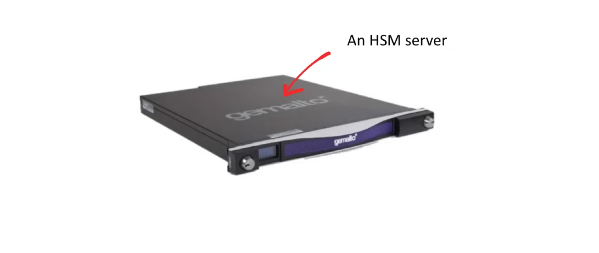

## AWS Key Management Service (KMS)

**AWS Key Management Service (AWS KMS)** is an AWS managed service that makes it easy for you to create and control the keys used to encrypt and sign your data. The AWS KMS keys 
that you create in AWS KMS are protected by FIPS 140-3 Security Level 3 validated hardware security modules (HSM). They never leave AWS KMS unencrypted. To use or manage your 
KMS keys, you interact with AWS KMS.

With most AWS Services, you just check the encryption box and choose a KMS Key and you are all set.

KMS can be used with CloudTrail to audit access history. KMS integrates with may AWS Services including, Alexa for Business, RDS, Athena, CodeCommit, Forecast, S3, CodeBuild, 
CodeDeploy, Aurora,FSx, SageMaker, CodePipeline, CloudWatch, Galcier, SES, MS, Kendra, SNS, Glue, Amazon Connect, Kinesis, SQS, DocumentDB, Transcribe, Secrets Manager, DAX, 
Amazon Translate, Snowball, SQS, Snowball Edge, SnowMobile, DynamoDB, Lex, Amazon WorkMail, EBS, LightSail, Workspace, EC2, MSK, AWS Backup, AWS Storage Gateway, EFS, MQ, ACM, 
Systems Manager, Elastic Transcoder, Neptune, Cloud9, X-Ray, ElastiCache, Amazon Personalize, CloudTrail, Elasticsearch Service, RedShift. 

KMS is a multi-tenant Hardware Security Model (HSM). ie. 

- *HSM* - Specialized hardware used to store encryption keys.
      - It's designed to be tamper-proof
      - It stores keys in memory, so they are never written to disk.
- *Multil-tenant*: Multiple customers utilize the same piece of hardware, and they are only isolated from each other virtually.

**ClouHSM** is a single-tenant HSM which gives you full control. A dedicated HSM means you can meet stricter compliance FIPS 140-2 Level 3. KMS is only FIPS 140-2 Level 2 
validated.

### Customer Master Key (CMK)

**Customer Master Keys** are the primary resource in AWS KMS. A CMK is a logical representation of a master key. 

The CMK includes metadata such as:

- The Key ID
- Creation date
- Description
- Key Date

The CMK also contains the key material used to encrypt and decrypt data. AWS KMS supports symmetric and asymmetric keys.

- **Symmetric Keys** - A 256-bit key that is used for encryption and decryption.
   - Uses only one key.
   - eg. Encrypting an S3 bucket using AES-256

- **Asymmetric Keys** - An RSA Key pair that is used for encryption and decryption or signing and verification, (but not both).
   - Uses two keys, a public key and a private key.
   - eg. EC2 key pairs used to SSH into a server.

### KMS CLI

You can perform many KMS actions through the AWS CLI:

- `aws kms create-key`- Creates a unique customer managed customer master key (CMK) in your AWS Account and region.
- `aws kms encrypt` - Encrypts plaintext into ciphertext by using a customer master key (CMK)
- `aws kms decrypt` - Decrypts ciphertext that was encrypted by an AWS customer master key (CMK)
- `aws kms re-encrypt` - Decrypts ciphertext and then re-encrypts it within AWS KMS.
   - Manually rotate a CMK
   - Change the CMK that protects a ciphertext
   - Change the encryption context of a ciphertext
- `aws kms enable-key-rotation` - Enables automatic rotation of the key material for the specified symmetric CMK. You cannot perform this operation in a different AWS account.

### AWS Audit Manager

**AWS Audit Manager** is a fully managed service that helps automate evidence collection for audits and compliance with industry standards and regulations (e.g., CIS, GDPR, 
HIPAA, PCI DSS). It continuously evaluates AWS resource configurations and usage, converting technical data into audit-friendly reports to reduce manual effort.

**AWS Audit Manager** contains:

 - *Framework Library* - Browse the library of control frameworks that support various compliance standards. eg. PCI, CIS, SOC2, HIPPA, and more.
 - *Control Library* - Browse existing controls, or create your own controls to use in a custom framework.

- You can create assessments to review the evidence collected and generate an assessment report.
- You can continuously collect evidence by directly integrating AWS Config and AWS Security Hub.
