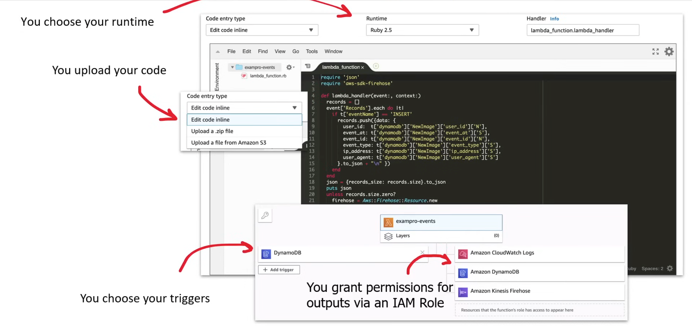
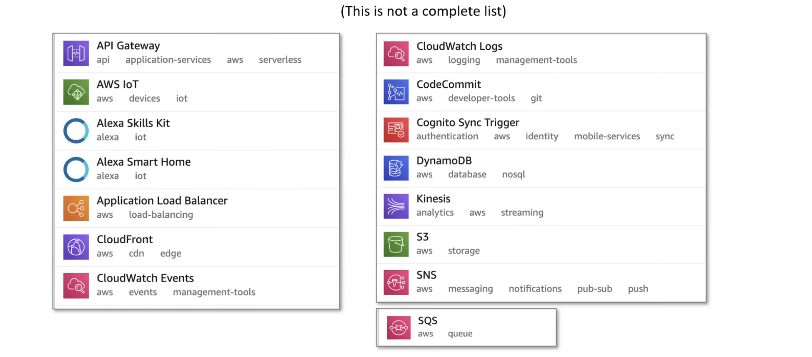
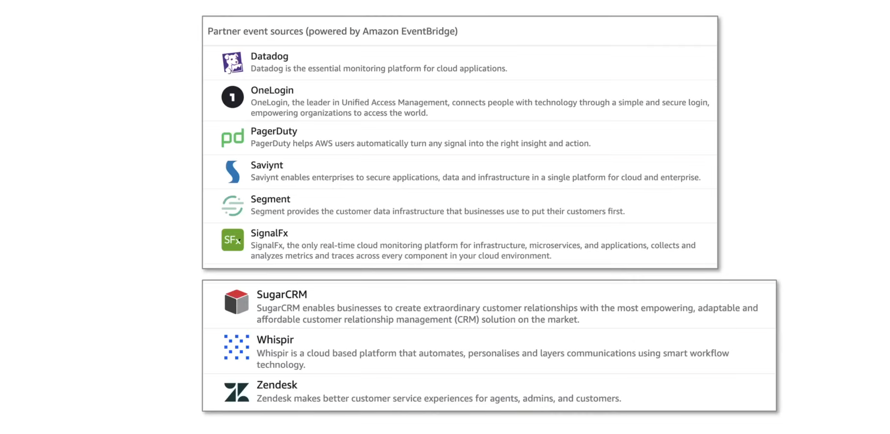
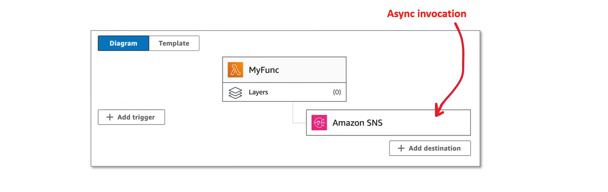
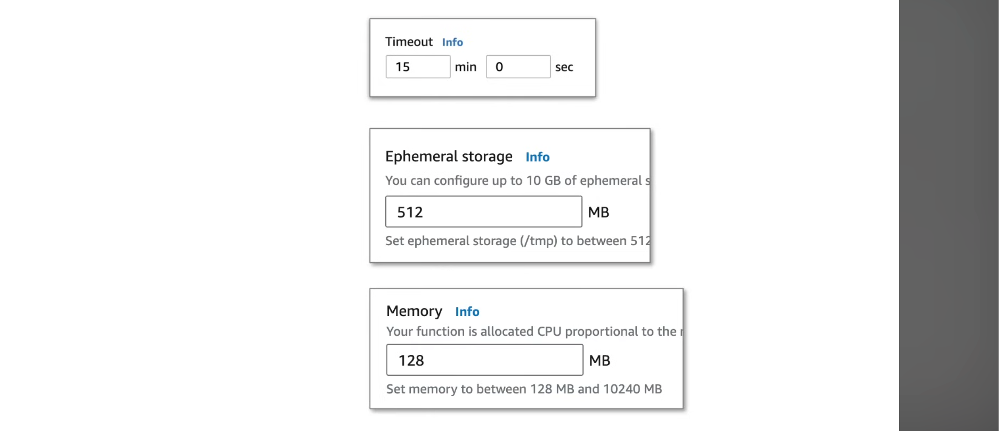
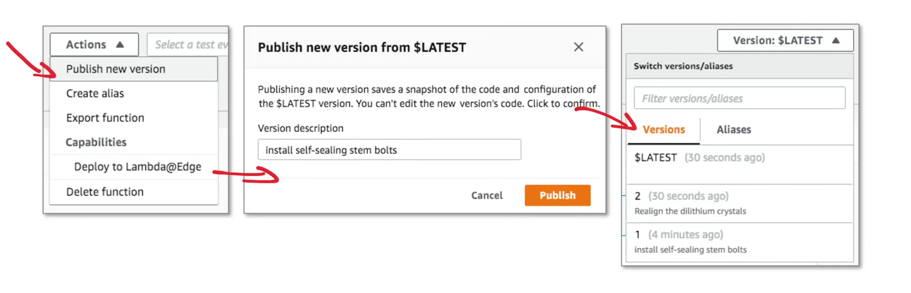
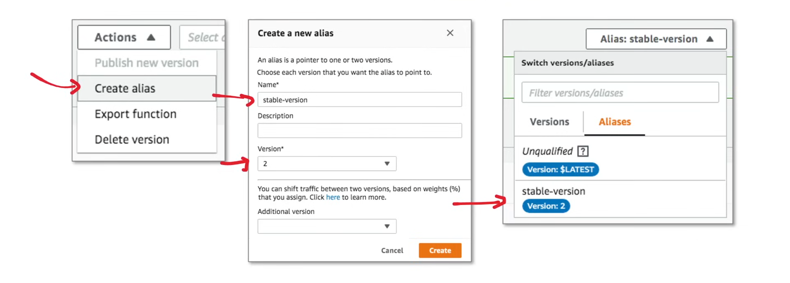
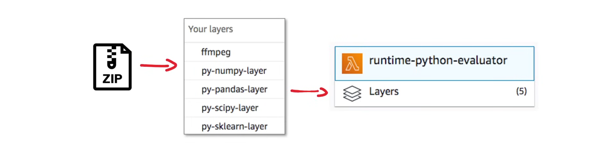

## AWS Lambda

**AWS Lambda** is a serverless Function as a Service that allows AWS users to run code without provisioning or managing servers. Lambda executes code in response to events and automatically manages the underlying compute resources required to run the code.

It automatically scales from a few to 1000 Lambda functions concurrently in seconds. User pay only for the compute time consumed, there is no charge when the code is not running. AWS Lambda supports multiple runtimes as follows:

- Ruby
- Python
- Java
- Go
- Powershell
- NodeJS
- C#
- Rust

### Use Cases

Lambda is commonly used to glue AWS services together, so the use cases are endless. 

1. **Processing Thumbnails**

A web service allows users to upload their profile photos, they are stored in an S3 bucket. An event trigger can be setup, which will invoke a Lambda function, to process the profile photo into a thumbnail and store it back in the bucket.


2. **Contact Email Forms**

A company has a contact email form that submits form data via API Gateway Endpoint. That endpoint triggers a lambda function which validates the form data and, if valid, will save the submission in DynamoDB and send an email to the company via SNS.


### Lambda UI



### Lambda Triggers

Lambdas can be invoked via the AWS SDK or triggered from other AWS Services. 



AWS Lambda can also be triggered from event sources via partner services through the EventBridge service.



### Lambda Destinations

AWS Lambda can be invoked in two ways:

- Sync Invocations
- Async Invocations

Destination is for invoking **Async Invocation**.



Destinations:

- SNS Topis 
- SQS Queue
- Lambda Function
- EventBridge Bus

Can go to destination on: 

- Successful execution
- Failed Execution

### Memory and Timeout

Time Settings:

- Default: 3 Seconds
- Min: 1 Second
- Max: 15 Minutes

Storage Settings:

- Default: 512 MB
- Min: 512 MB
- Max: 10240 MB

Memory Settings:

- Default: 128 MB
- Min: 128 MB
- Max: 10240 MB



### Function Versions

Versions are used to manage the deployment of AWS lambda functions. eg. Publish a new version of a lambda for beta testing without affecting the production versions. 



Each function version will have its own unique ARN. i.e.

- arn:aws:lambda:us-east-1:1111111:function:MyFunction:$LATEST
- arn:aws:lambda:us-east-1:1111111:function:MyFunction:2
- arn:aws:lambda:us-east-1:1111111:function:MyFunction:1

When referencing a Lambda, use its ARN. A Lambda has two initial versions:

1. Qualified ARN: The function ARN with the version suffix. i.e
   - `arn:aws:lambda:region:account-id:function:function-name:$LATEST`
2. Unqualified ARN: The function ARN without the version suffix. i.e 
   - `arn:aws:lambda:region:account-id:function:function-name`

Aliases cannot be created with an **Unqualified ARN**, they point to the latest.

### Lambda Aliases

Aliases allow users to give a specific lambda version a friendly name when accessing the Lambda programmatically. 



### Lambda Layers

AWS Lambda let's you pull in additional code and content in the form of layers. A **Layer** is a ZIP archive that contains libraries, a custom runtime, and/or other dependencies. You can use libraries in your function without including them in the deployment package.

One can have up to 5 layers attached to a function. All layers cannot exceed the unzipped deployment package size limit of 250 MB. 



### Instruction Sets

An **Instruction Set** are a set of opscodes that represent the operations that a CPU can perform. 

- Load (LDA): 01x1000
- Store (STA): 02x1001
- Add (ADD): 03x1002
- Jump (JMP): 04x1003
- Substract (SUB): 05x1004

There are two instruction set architectures available for Lambda:

- **arm64**: 64-bit ARM Architecture, for the AWS Graviton2 processor
- **x86_64**: 64-bit x86 Architecture, for the x86-based processor

**arm64** has a smaller instruction set, therefore programs built against arm are more efficient and as a result are more cost effective. 

For a program to run a specific architecture, the language has to turn into a machine language such as assembly code, which in turn calls opscodes. When possible, it's recommended to use **arm64** since it's more proficient.

### Lambda Runtimes

A **Lambda Runtime** is a preconfigured environment to run specific programming languages. Runtimes are useful since they don't require users to configure a container or OS configuration. Runtimes are fully-managed and security-hardened by AWS. 

Lambda Runtimes are released as stable programming language verisons are released. Older runtimes are deprecated, which forces users to upgrade their Lambdas and code to run on more recent runtime versions.

A runtime will specify: 
- A named version: eg. Node.js 22
- Identifier: eg. nodejs22.x
- Operating System: eg. Amazon Linux 2023

```bash
aws lambda create-function \
--function-name my-nodejs-function \
--runtime nodejs22.1 \
--handler lambda_function.lambda_handler \
--role arn:aws:iam::123456789012:role/lambda-execution-role \
--zip-file fileb://function.zip
```
The identifier `nodejs22.1` is used to tell which runtime to use.

Code is delivered as a ZIP archive when using Lambda runtimes.

