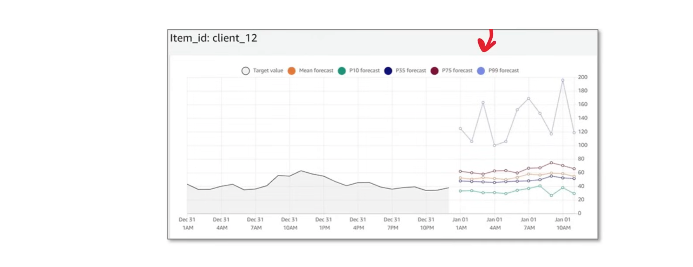
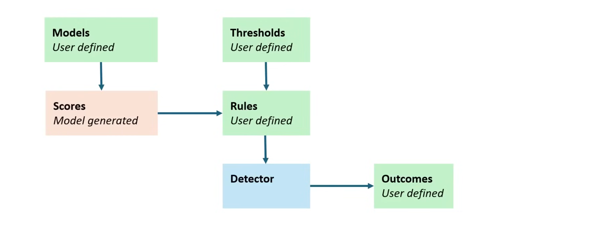
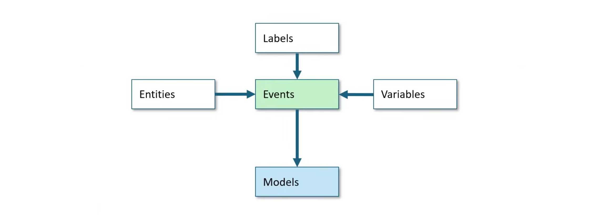

## Amazon CodeGuru

**Amazon CodeGuru** is a suite of machine learning developer tools designed to improve code quality and application performance through intelligent recommendations. It offers
two main components: **CodeGuru Reviewer** (for automated code reviews in Java and Python) and **CodeGuru Profiler** (to optimize runtime performance, identify bottlenecks, and
reduce infrastructure costs).

CodeGuru has three services:

- CodeGuru Security - detect, track, and fix code security issues
  - Code Security Analysis Scan
  - Code Quality Analytics Scan
  - Secrets Detection Scan
- CodeGuru Profiler - optimize runtime performance, identify bottlenecks, and reduce infrastructure costs
- CodeGuru Reviewer - associate a repo for continous code change recommendations
  - GitHub Actions is used to automate continous checks for GitHub repositories.

CodeGuru supports the following languages:
 - Java
 - JavaScript
 - Python
 - C#
 - TypeScript
 - Ruby
 - Go
 - IaC
   - CloudFormation
   - Terraform
   - AWS SDK (TypeScript, Python)

## Amazon Comprehend

**Amazon Comprehend** is a fully managed, natural language processing (NLP) service that uses machine learning to extract insights, sentiment, and entities from text without
requiring prior ML expertise. It processes documents, customer feedback, and social media to identify topics, languages, and sensitive data (PII).

Amazon Comprehend can analyze text and extract the following:
- **Entities** - eg. Person, Organization, Location
  !
- **Key Phrases** - Text that appear important eg. <u>Pay</u> the amount of <u>$220.00</u> by <u>August 8th</u>.
- **Language** - confidence of the language being spoken eg. English
- **Personal Identifiable Information (PII)** - eg. Social Security Number, Email Address, Phone Number
- **Sentiment** - eg. Positive, Negative, Neutral, Mixed
- **Targeted Sentiment** - Specific words and their attitude eg. Awful 1.0 Negative
- **Syntax** - Identify parts of a language.
- **Custom Models** - upload training data to analyze and extract custom text
  - **Amazon Comprehend Flywheel** - automate the training of model versions fos custom models

- Amazon Comprehend is serverless, you pay based on the size of the requests, in units. eg. 1 unit = 100 characters.
- Real-time analysis can be peformed via an endpoint.
- Analysis jobs allow for batch jobs.

The primary way of using Amazon Comprehend is via the AWS SDK:

Example for analyzing text for language and sentiment using Ruby:

```ruby
require 'aws-sdk-comprehend'

client = Aws::Comprehend::Client.new(region: 'us-east-1')
text = "Hello World, this is Gedion Kiprotich from Kenya. I am a DevOps engineer and I am passionate about automation."

# Detect the dominant language
language_response = client.detect_dominant_language(text: text)
language_code = language_response.languages.max_by(&:score).language_code
puts "Dominant Language: #{language_code}"

# Detect sentiment
sentiment_response = client.detect_sentiment({
  text: text, 
  language_code: language_code
})

# Print the sentiment analysis results
puts "Sentiment: #{sentiment_response.sentiment}"
puts "Positive: #{sentiment_response.sentiment_scores.positive}"
puts "Negative: #{sentiment_response.sentiment_scores.negative}"
puts "Neutral: #{sentiment_response.sentiment_scores.neutral}"
puts "Mixed: #{sentiment_response.sentiment_scores.mixed}"
```
## Amazon Forecast

**Amazon Forecast** is a fully managed AWS service that uses machine learning (ML) to deliver highly accurate time-series forecasts without requiring prior ML experience. It
automates data preparation, model training, and tuning to predict business metrics like inventory demand, workforce staffing, and financial, based on historical data and related
variables (e.g., weather, holidays).

You need to upload your dataset to S3 with:
- Historical Data
- Additional Metadat (Optional)

### Amazon Forecast Workflow

1. Create a Data Set Group / Create a Data Import Job
   - Define teh schema
   - Register the task
2. Create Predictor / Get Accurate Metrics
   - ELT Job evaluates the model
     - Choose a predefined backtest
3. Create Forecast
   - Deploy the predictor
   - Retrain with full dataset
4. Query Forecast / Export Forecast

Amazon Forecast will produce a visual graph:



## Amazon Fraud Detector

**Amazon Fraud Detector** is a fully managed fraud detection service that automates the detection of potentially fraudulent activities online. These activities include
unauthorized transactions and the creation of fake accounts. Amazon Fraud Detector works by using machine learning to analyze your data. It does this in a way that builds off of
the seasoned expertise of more than 20 years of fraud detection at Amazon.

You upload your dataset for data model training to an S3 bucket which will then be referenced by Fraud Detector. 

**Amazon Fraud Detector** comes with the following predefined models, which you'll train your data against:
- **Online Fraud Insights**: Optimized to detect fraud when little historical data is available about the entity being evaluated. eg. New customers registering online for an
account.
- **Transaction Fraud Insights**: Testing fraud use cases where the e ntity that is being evaluated might a history of intercations that the model cqn analyze to improve
prediction accuracy.
- **Account Takeover Insights**: If an account was compromised by phishing attacks or any other type of attack.

Using the AWS SDK, real-time fraud detection systems can be architected using AWS Step Functions, Amazon Kinesis, AWS Lambda and other AWS Application integration services. 

To create a model:
- Choose the Model Type eg. Online Fraud Insights
- Choose the data sources eg. S3
- Define the data schema
  - Define the label mapping
- Define the Model variables to be used

```python
import boto3
fraudDetector = boto3.client('frauddetector')

fraudDetector.create_model_version(
  modelId = 'sample_fraud_detection_model',
  modelType = 'ONLINE_FRAUD_INSIGHTS',
  trainingDataSource = 'EXTERNAL_EVENTS',
  trainingDataSchema = {
    'modelVariables': [
      'ip_address',
      'email_address'
    ],
    'labelSchema': {
      'labelMapper': {
        'FRAUD': ['fraud'],
        'LEGIT': ['legit']
      }
      unlabeledEventsTreatment': 'AUTO'
    }
  },
  externalEventsDetail = {
    'dataLocation' : 's3://bucket-name/file.csv'
    'dataAccessRoleArn' : 'role_arn' 
  }
)    
```

After reviewing mode performance, we set it to active to deploy the model for real-time detection.

```python
import boto3
fraudDetector = boto3.client('frauddetector')

fraudDetector.update_model_version_status(
  modelId = 'sample_fraud_detection_model',
  modelType = 'ONLINE_FRAUD_INSIGHTS',
  modelVersionNumber = '1.0.0',
  status = 'ACTIVE'
) 
```

### Fraud Detector Components



- **Models**: ML models that are trained on your data to detect fraud.
- **Thresholds**: Thresholds are used to determine the risk level of a given event. 
- **Scores**: Numerical values that represent the risk level that a given event is being fraudulent. Different models use different scoring.
- **Rules**: The decision logic that interprets the model’s risk score. Rules determine the final outcome (e.g., Approve, Review, Reject)
  - Variable or List - What data to operate on
  - Expression - rule language eg. operators, regex
  - Outcome - the outcome return
- **Detector**: A detector is a container for models, rules, and outcomes. 
- **Outcomes**: The actionable result of a rule eg.
  - risk levels (high_risk, medium_risk, low_risk)
  - actions (approve, review)

To define an event type, you need to define Labels, Entities, and Variables.



- **Labels**: Classify an event as fraudulent or legitimate, used to train supervised machine learning models.
- **Entities**: Represents the doer of the event eg. Customer
- **Variables**: Data elements extracted from the event, such as email address, IP address, phone number, or transaction amount.

Events contain the data and rules that will be analyzed by the model.

## Amazon Kendra

Amazon Kendra is a fully managed, machine-learning search engine service that uses natural language processing (NLP) and machine learning to find answers within large,
decentralized data repositories. It enables organizations to index unstructured/semi-structured data (PDFs, docs, Wikis) across various sources (S3, SharePoint, Google Drive) to
provide accurate, context-driven search results.

Instead of key-word matching, Amazon Kendra uses semantic and contextual understanding to search a query. It's like interacting with a human expert who can understand the
context of your question and provide a relevant answer. Amazon Lex Chatbot can be used as an interface to Amazon Kendra.

Amazon Kendra has the following components:
- **Index**: A table that holds the index of documets to make them searchable.
- **Data Source**: Where the documents are stored. eg. S3, Sharepoint, Box, Postgres, you need to define a schema
  - **Data Source Template Schemas**: AWS Provides around 40 schema templates for common AWS Services or third party cloud storage services.
- **Document Addition API**: An API to add documents directly to an index.

Amazon Kendra has two versions which provide all features but with different limitations:

| Feature | Developer Edition | Enterprise Edition |
| --- | --- | --- |
| 5 indexes with up to 5 data sources each | 5 indexes with up to 50 data sources each |
| 10K documents or 3GB of extracted text | |
| 4K queries per day or 0.05 queries per second | 8K queries per day or 0.1 queries per second |
| Runs in 1 AZ | Runs in 3 AZs |
 
The Developer Edition has free tier with upto 750hrs first 30 days.

1. Create Index:

   ```sh
   aws kendra create-index \
     --name my-index \
     --description "My Index" \
     --role-arn arn:aws:iam::123456789012:role/KendraIndexRole
   ```
2. Create Data Source:
   
   ```sh
   aws kendra create-data-source \
     --index-id index-id \
     --name my-data-source \
     --role-arn arn:aws:iam::123456789012:role/KendraDataSourceRole \
     --type S3 \
     --configuration '{"S3Configuration": {"BucketName": "bucket-name"}}'
  # different data source would use a template to define the schema
  # --type TEMPLATE \
  # --configuration '{"TemplateConfiguration": {"TemplateId": {JSON Schema}}}'
  ```
3. Sync the data source to the Index (update the index):

   ```sh
   aws kendra start-data-source-sync-job \
     --index-id index-id \
     --id data-source-id
   ```
4. Query Kendra index for results:

   ```sh
   aws kendra query \
     --index-id index-id \
     --query-text "What is the capital of France?"
   ```

## Amazon Lex

**Amazon Lex** is a fully managed AWS service for building conversational AI interfaces into applications using voice and text. Powered by the same deep learning technology as
Alexa, it enables developers to create sophisticated, natural language chatbots for FAQ, customer service, and transactional tasks, incorporating generative AI for improved user
experiences.

Amazon Lex Version 2 provides:
- Natural Language Understanding (NLU)
- Automatic Speech Recognition (ASR)

AWS Provides multiple bot templates for common industries as a starting point.
- Provide transcripts to create new bots
- Use GenAI to build a bot by describing what you want.
- Choose a target language, you can choose from multiple AWS provided voices.

Amazon Lex integrates with AWS Lambda to connect with various AWS Services.

#### Amazon Lex Network of Bots

Amazon Lex has a feature that adds multiple bots to a single network. A network can intelligently route a query to the appropriate bot. This provides a unified experience for
customers and reduces duplication of intent configuration for multiple specialized bots.

### Components of a Bot

1. **Bot**: A bot performs automated tasks such as ordering a pizza, booking a hotel, ordering flowers, and so on. An Amazon Lex V2 bot is powered by automatic speech
recognition (ASR) and natural language understanding (NLU) capabilities.
2. **Language**: An Amazon Lex V2 bot can converse in one or more languages. Each language is independent of the others, you can configure Amazon Lex V2 to converse with a user
using native words and phrases.
3. **Version**: A version is a numbered snapshot of your work that you can publish for use in different parts of your workflow, such as development, beta deployment, and
production. Once you create a version, you can use a bot as it existed when the version was made. After you create a version, it stays the same while you continue to work on
your application.
4. **Alias**:  An alias is a pointer to a specific version of a bot. With an alias, you can update the version the your client applications are using. For example, you can point
an alias to version 1 of your bot. When you are ready to update the bot, you publish version 2 and change the alias to point to the new version. Because your applications use
the alias instead of a specific version, all of your clients get the new functionality without needing to be updated.
5. **Intent**: An intent represents an action that the user wants to perform. You create a bot to support one or more related intents. For example, you might create an intent
that orders pizzas and drinks. For each intent, you provide the following required information:
   - **Intent name** – A descriptive name for the intent. For example, OrderPizza.
   - **Sample utterances** – How a user might convey the intent. For example, a user might say "Can I order a pizza" or "I want to order a pizza."
   - **How to fulfill the intent** – How you want to fulfill the intent after the user provides the necessary information. We recommend that you create a Lambda function to fulfill the intent.
6. **Slot**: An intent can require zero or more slots, or parameters. You add slots as part of the intent configuration. At runtime, Amazon Lex V2 prompts the user for specific
slot values. The user must provide values for all required slots before Amazon Lex V2 can fulfill the intent.
7. **Slot Type**: Slot type – Each slot has a type. You can create your own slot type, or you can use built-in slot types. For example, you might create and use the following
slot types for the OrderPizza intent:
   - Size – With enumeration values Small, Medium, and Large.
   - Crust – With enumeration values Thick and Thin.

## Amazon Personalize

Amazon Personalize is a fully managed AI service that enables developers to deliver real-time, customized recommendations and user segmentation at scale, using the same
technology as the Amazon patform. It creates individualized experiences—such as product recommendations, tailored searches, and content feeds—without requiring extensive machine
learning expertise.

1. Create a **dataset** group
2. Upload **dataset** to a data group (csv files)
   - Provide multiple data sets ie.
     - User Item Interaction data
     - User Data
     - Item Data
  - Provide a JSON schema mapping for the CSV files
  - Reference the dataset location from an S3 object location
3. **Solutions** and **Recipes** allow users to fine tune the model
4. **Event Trackers** - Using the Ingestion SDK, users can track user events and feed them to the model in real-time.
5. **Filters** allow users to remove certain items from the recommendations based on rules
6. Launch a campaign to allo applications to get recommendations from the solutions.

#### Datasets

- **User Interaction Data** - Core dataset that is used to train a custom model. At a minimum, this dataset must include three attributes. ie.
  - `USER_ID`: A unique identifier of the user
  - `ITEM_ID`: A uniue identifier for the item
  - `TIMESTAMP`: The Unix timestamp of the interaction
- **User Data** - Contains metadat about the users, which can be used to improve the recommendation quality.
  - The only required attribute for this dataset is the `USER_ID` which must correspond to the `USER_ID` in the User Item Interaction Data.
- **Item Data** - Contains metadata about the items eg. categories, price, or brand.
  - Must include an `ITEM_ID` which matches the `ITEM_ID` in the User Item Interaction Data.  
  - Must be called `CATEGORY_L1` (graphic to left is wrong)

To configure recommendations, you can use the AWS SDK with your preferred programming language. For example, using the AWS Python SDK:

```python
import boto3
from botocore.config import Config

my_config = Config(
    region_name = 'ca-central-1'
)
client = boto3.client('personalize-runtime', config=my_config)

campaign_arn = 'arn:aws:personalize:ca-central-1:982383527471:campaign/my-campaign'
user_id = '127'
item_id='9910'
# context = {'itemId': 'item-id-for-context'}

resp = client.get_recommendations(
  campaignArn=campaign_arn,
  userId=user_id,
  itemId=item_id,
  # context=context
)

# Print out the recommendation results
for item in resp['itemList']:
  print(f"Item ID: {item['itemId']} Score: {item.get('score', 'N/A')}")
```

## Amazon Polly

**Amazon Polly** is a fully-managed service that generates voice on demand, converting any text to an audio stream. Using deep learning technologies to convert articles, web pages, PDF documents, and other text-to-speech (TTS). Polly provides dozens of lifelike voices across a broad set of languages for you to build speech-activated applications that
engage and convert.

Meet diverse linguistic, accessibility, and learning needs of users across geographies and markets. Powerful neural networks and generative voice engines work in the background, synthesizing speech for you.

Engine Types:
- **Standard($)**: The original engine using concatenative synthesis (stringing together phonemes). It is suitable for basic applications and offers a broad range of languages.
- **Long From($$)**: Specialized for extended content such as audiobooks, articles, and training materials. This engine focuses on maintaining listener engagement and high quality over longer durations.
- **Neural($$$)**: Supports a Newscaster speaking style that is tailored to news narration use cases. Utilizes sequence-to-sequence neural networks to produce highly natural-sounding, human-like speech. This engine offers a balance between high quality and broad usability.

There is a variation between voices, depending on the text being spoken, no standard speed (word per minute) is available for Amazon Polly voices.

- **Lexicons** - A lexicon is a collection of custom pronunciations for words that you provide to Amazon Polly. A lexicon file (`.xml`, `.pls`) with up to 40K characters and up to 100 pronunciation rules.

- **Speech Marks** - Speech marks are metadata that describe the speech that you synthesize, such as where a sentence or word starts and ends in the audio stream. When you request speech marks for your text, Amazon Polly returns this metadata instead of synthesized speech. By using speech marks in conjunction with the synthesized speech audio stream, you can provide your applications with an enhanced visual experience.

Example:

```sh
aws polly synthesize-speech \
  --engine neural \
  --text "Hello, world!" \
  --output-format mp3 \
  --voice-id Joanna \
  hello_world.mp3
```

**Speech Synthesis Markup Language(SSML)** is and XML-based markup language for speech synthesis applications. It is used to control the way that Amazon Polly synthesizes speech. 

```xml
<speak>
  He was caugth up in the game. <break time="1s"> In the middle of the 10/03/2014 <sub alias="World Wide Web Consortium">W3C</sub> meeting,
  he shouted, "Nice Job!" quite loudly. When his boss stared at him, he repeated <amazon:effect name="whispered">"Nice Job,"</amazon:effect> 
  in a whisper.
</speak>
```

**Amazon Polly** supports the following **SSML**:

```xml
<speak> :  the root element
<break> : pause
<emphasis> : emphasis words eg. Strong, Moderate, Reduced, or None
<lang> : specify a different language
<mark> : a custom tag for metadata
<p> : pause between paragraphs
<phoneme> : phonetic pronunciation of specific text
<prosody> : change the pitch, rate, or volume of the speech
<s> : add a pause between sentences
<sub> : substitute text eg. W3C -> World Wide Web Consortium
<say-as> : control how special types of words are spoken
<w> : spcify parts of speech
<amazon:breath> and <amazon:auto-breaths> : add breathing sounds
<amazon:domain name="news"> : newscaster speaking style (only available for neural)
<amazon:effect name="drc"> : adding dynamic range compression
<amazon:effect name="whispered"> : whispering
<amazon:effect phonation="soft"> : speaking softly
<amazon:effect vocal-tract-length> : controlling timbre
```

## Amazon Rekoginition

**Amazon Rekognition** is a cloud-based image and video analysis service that makes it easy to add advanced computer vision capabilities to your applications. The service is
powered by proven deep learning technology and it requires no machine learning expertise to use. Amazon Rekognition includes a simple, easy-to-use API that can quickly analyze
any image or video file that’s stored in Amazon S3.

You can add features that detect objects, text, unsafe content, analyze images/videos, and compare faces to your application using Rekognition's APIs. With Amazon Rekognition's
face recognition APIs, you can detect, analyze, and compare faces for a wide variety of use cases, including user verification, cataloging, people counting, and public safety.

**Amazon Rekognition** has the following prebuilt models:
- Object Detection
- Face Detection
- Searching faces in connection
- People pathing
- Detecting Personal Protective Equipment (PPE)
- Recognizing Celebrities
- Moderating content
- Detecting Text
- Detecting Video segments
- Detecting face liveness

For image requirements:
- JPGs or PNGs
- Base64 encoding when passed via the HTTP API
  - AWS SDKs for Java, JavaScript, Python, and PHP will automatically base64 encode.
- Can access images from S3 bucket.

**Amazon Rekognition Custom Labels** can identify the objects, logos, and scenes that are specific to your business. For example, you can train a model to identify specific car models, car parts, or car brands. You can also train a model to identify specific products, product categories, or product brands.

### Examples

Detecting objects using `detect_labels`:

```ruby
require 'aws-sdk-rekognition'
bucket = 'rekog-example-1422' # the bucket name without s3://
photo  = 'andrew.jpg' # the name of file
client   = Aws::Rekognition::Client.new region: 'us-east-1'
attrs = {
  image: {
    s3_object: {
      bucket: bucket,
      name: photo
    },
  },
  max_labels: 10
}
response = client.detect_labels attrs
puts "Detected labels for: #{photo}"
response.labels.each do |label|
puts "Label:      #{label.name}"
puts "Confidence: #{label.confidence}"
puts "Instances:"
label['instances'].each do |instance|
  box = instance['bounding_box']
  puts "  Bounding box:"
  puts "    Top:        #{box.top}"
  puts "    Left:       #{box.left}"
  puts "    Width:      #{box.width}"
  puts "    Height:     #{box.height}"
  puts "  Confidence: #{instance.confidence}"
end
puts "Parents:"
label.parents.each do |parent|
  puts "  #{parent.name}"
end
puts "------------"
puts ""
end
```
