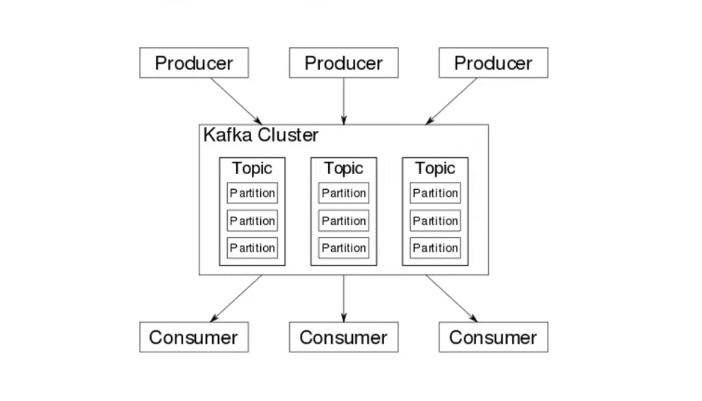
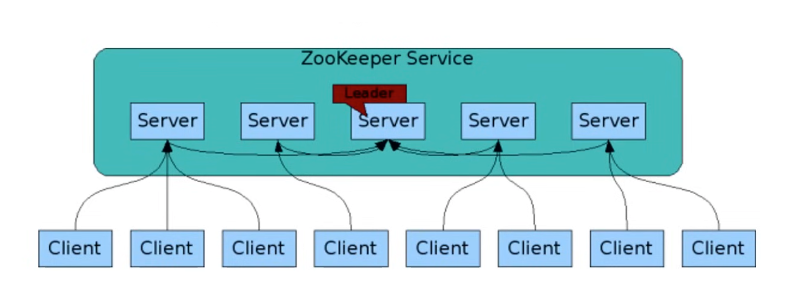
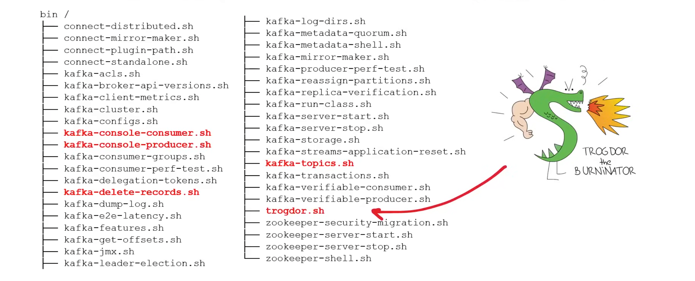

## Amazon MSK

**Amazon Managed Streaming for Apache Kafka (Amazon MSK)** is a streaming data service that manages Apache Kafka infrastructure and operations, making it easier for developers 
and DevOps managers to run Apache Kafka applications and Apache Kafka Connect connectors on AWS—without becoming experts in operating Apache Kafka.

Amazon **MSK** operates, maintains, and scales Apache Kafka clusters, provides enterprise-grade security features out of the box, and has built-in AWS integrations that 
accelerate development of streaming data applications.

Amazon MSK utilizes Zookeeper servers, Amazon MSK does not support KRaft. 

There are two types of nodes:
 - *Broker nodes*- handles storage and processing of messages
 - *ZooKeeper nodes*- manages the overall structure of the cluster

Amazon MSK comes in two types of clusters: 
 - *Provisioned cluster*- You select the number of broker nodes and the storage capacity for each broker.
 - *Serverless Cluster*- You pay for what you use and don't have to manage instances.

**Kafka** has direct integrations with:
 - Amazon S3
 - EventBridge Pipes

**Amazon MSK** is launched within your VPC, and need your connect to originate from the same VPC. You can enable public access on clusters after the launch of a cluster. Turn on public access for an MSK cluster:

```sh
aws kafka update-connectivity \
  --cluster-arn ClusterArn \
  --current-version Current-Cluster-Version \
  --connectivity-info {"PublicAccess": {"Type": "SERVICE_PROVIDED_EIPSS"}}
```

### Bootstrap Brokers

**Bootstrap brokers** refer to a list of broker endpoints that an Apache Kafka client can use as a starting point to connect to the cluster. 

```sh
aws kafka get-bootstrap-brokers \
  --cluster-arn ClusterArn
```

Output:

```json
{
  "BootstrapBrokerString": "string",
  "BootstrapBrokerStringPublicSasl": "string"
}
```
- *BootstrapBrokerStringPublicSasliam* is for public access.
- *BootstrapBrokerStringSasliam* string for access within AWS.

Depending on how many AZs your cluster is deployed across, you will get a comma separated list with an endpoint for each AZ.

### ZooKeeper Connection String

**Zookeeper connection url string** is used with Kafka to specify the host and port of the Zookeeper ensemble that Kafka should connect to for managing cluster metadata and 
coordination:

- Broker Registration
- Topic Configuration
- Cluster Membership
- Quota Management
- Access Control Lists (ACLs)

```sh
# Topic Configuration
bin/kafka-topic.sh --create \
  --zookeeper "ZookeeperConnectString" \
  --replication-factor 2 \
  --partitions 1 \
  --topic "TopicName"
```

We can get the **Zookeeper Connection String URL** using describe-cluster command:

```sh
aws kafka describe-cluster \
  --cluster-arn ClusterArn \
  --query "ClusterInfo.ZookeeperConnectString"
```

We cannot call the `describe-cluster` command against MSK serverless cluster.

Starting from Kafka 2.8, there is a mode called **KRaft**(Kafka Raft Metadata), which allows Kafka to run without Zookeeper.

### Amazon MSK Connect

**MSK Connect** is a feature of Amazon MSK that makes it easy for developers to stream data to and from their Apache Kafka clusters. MSK Connect uses **Kafka Connect open-source 
framework** for connecting Apache Kafka clusters with external systems such as databases, search indexes, and file systems.

You can download Kafka Connect plugins (or create your own). Upload to S3 and then create a plugin in MSK Connect:

```sh
aws kafkaconnect create-custom-plugin \
  --name mongodb \
  --description "MongoDB Kafka Connector" \
  --content-location '{
    "s3Location":{
      "bucketArn": "arn:aws:s3:::bucket-name",
      "fileKey": "file-key"
    }
  }'
```
The you create a connector specifying the plugin and configuration information to your source:

```sh
aws kafkaconnect create-connector \
  --kafka-cluster clusterArn=<kafka-cluster-arn> \
  --kafka-client-authentication-type NONE \
  --kafka-cluster-encryption-in-transit-type PLAINTEXT \
  --plugin name=<plugin-name>, revision=<plugin-revision> \
  --service-execution-role-arn <your-execution-role-arn> \
  --connector-configuration '
  {
    "name": "MongoDBSourceConnector",
    "config": {
      "connector.class": "<connector-class>",
      "tasks.max": "1",
      "topics": "<topic-name>",
      "connection.uri": "mongodb://yourMongoDBInstance",
      // other necessary configuration properties
    }
  }'
```
### Apache Kafka

**Apache Kafka** is an open-source streaming platform to create high-performance data pipelines, streaming analytics, data integration, and mission-critical applications. Kafka 
was originally developed by LinkedIn and open-sourced in 2011.

Kafka was written in Scala and Java, so to use Kafka, you need to write Java Code. 

In Kafka, data is stored in partitions on a Kafka cluster which can span multiple machines (distributed computing). 



- **Producers** publish messages in a key and value format using Kafka Producer API.
- **Consumers** can listen for messages and consume them using the Kafka Consumer API.
- Messages are organized into Topics. Producers will push messages to topics and consumers will listen on topics. 
- We can interact with Kafka using Kafka-CLI scripts.
- We can use a programming SDK for Kafka in various languages.

### Apache Zookeeper

**Apache Zookeeper** is an open-source centralized service for maintaining configuration information, naming, providing distributed synchronization, and providing group services.

**Zookeeper** exposes common services (such as naming, configuration management, synchronization, and group services) in a simple interface so you don't have to write them from scratch.



Open-source projects that use Zookeeper:

- Apache Hadoop
- Apache Kafka
- Apache Solr
- Apache Hbase
- Apache Accumulo
- Apache Druid
- Apache Helix

### Kafka CLI

The Kafka CLI scripts are downloaded alongside Kafka. Kafka CLI is different from other CLI tools in that it's a series of scripts instead of one library. 

Kafka's testing framework is called Trogdor, a reference to Homestar runner character. 



To create a Topic:

```sh
./bin/kafka-topics.sh --create-topic \
  --topic my-topic \
  --bootstrap-server <boroker-host:port> \
  --replication-factor 3 \
  --partitions 1
```

Sending messages to a Producer:

```sh
# Waits for input, each line will be sent as a message
./bin/kafka-console-producer.sh \
  --broker-list <broker1-hostname:port>, <broker2-hostname:port> \
  --topic my-topic 

# Send a single message
echo "Hello Kafka!" | ./bin/kafka-console-producer.sh \
  --broker-list <broker1-hostname:port> \
  --topic my-topic

# Send multiple messages by providing a multiple line file with each message on it's own line
cat messages.txt | ./bin/kafka-console-producer.sh \
  --broker-list <broker1-hostname:port> \
  --topic my-topic
```

Receive messages from a topic as a Consumer:

```sh
./bin/kafka-console-consumer.sh \
  --bootstrap-server <broker1-hostname:port> \
  --topic my-topic \
  --from-beginning
```
