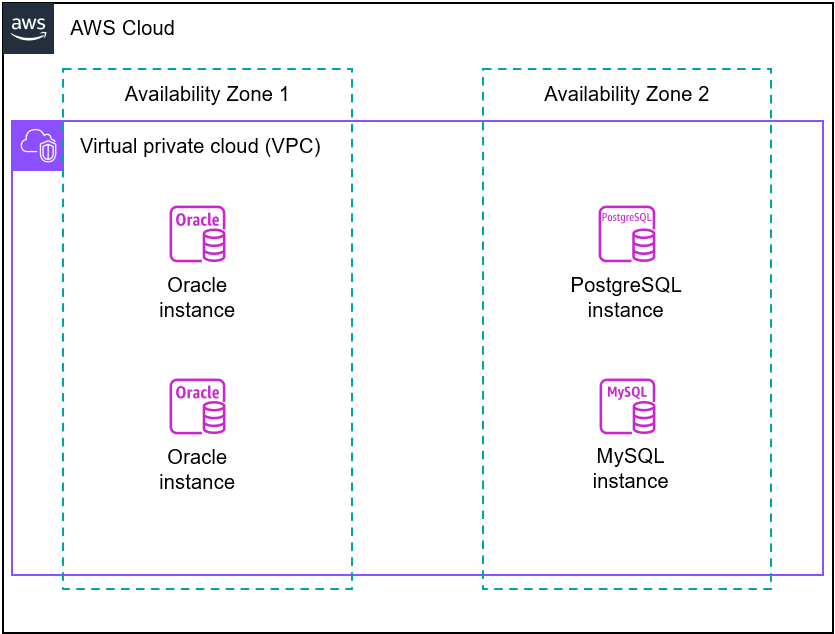
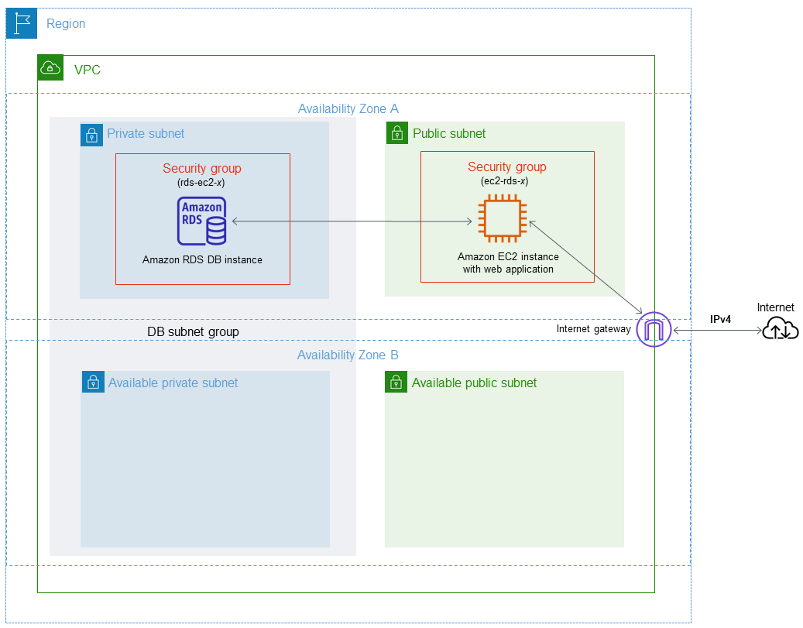
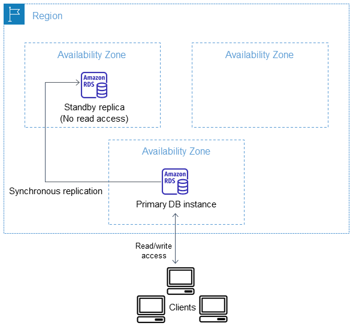
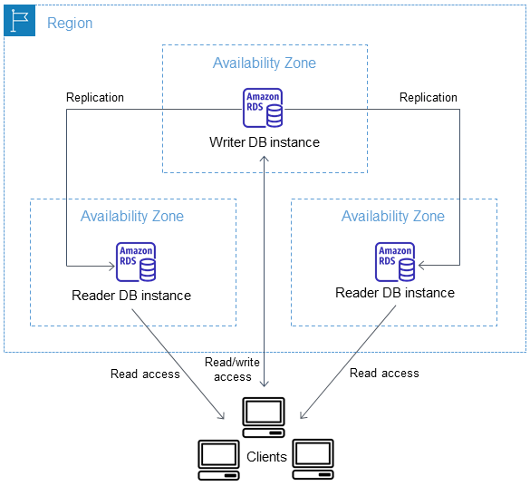
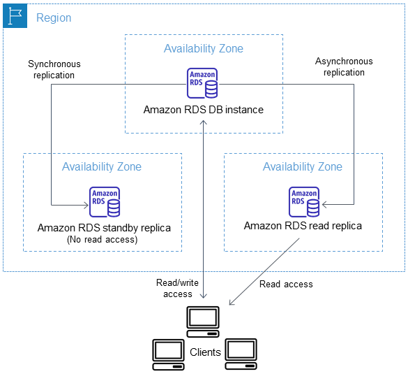
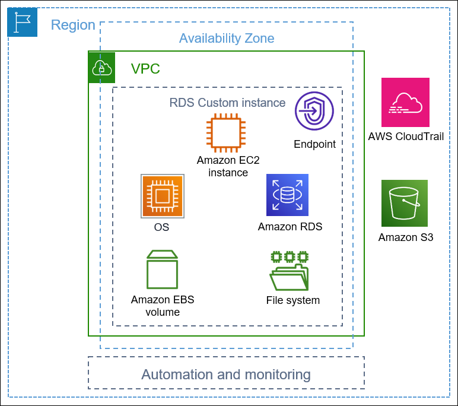
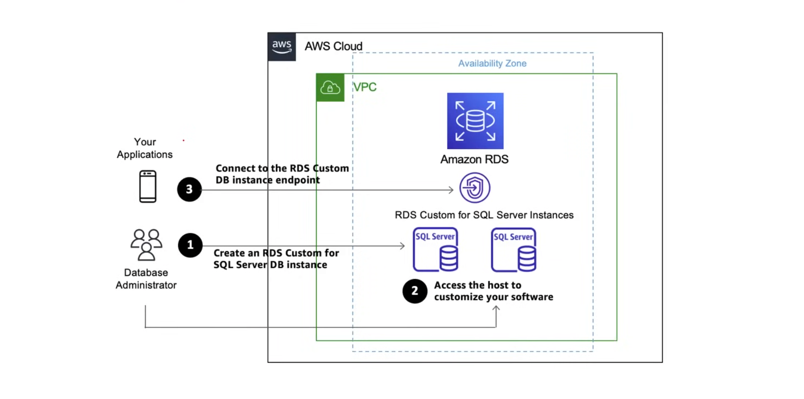
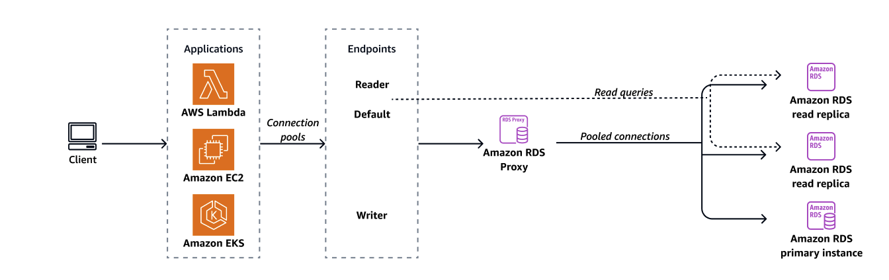

## Amazon Relational Database Service (RDS)

**Amazon Relational Database Service (Amazon RDS)** is a fully managed web service that simplifies the setup, operation, and scaling of relational databases in the cloud. By
automating administrative tasks like hardware provisioning, database setup, patching, and backups, it allows developers to focus on application development rather than
infrastructure management.

**Features**

- Supports multiple database engines:
  - Aurora PostgreSQL
  - Aurora MySQL
  - Aurora DSQL
  - RDS for PostgreSQL
  - RDS for MySQL
  - RDS for MariaDB
  - RDS for Oracle
  - RDS for Microsoft SQL Server
  - RDS for Db2
- Automatic and manual backups
- High availability and durability with Multi-AZ deployments
- Read replicas for scaling read traffic
- Performance Insights for database performance monitoring
- Customizable DB parameters
- RDS Proxy for a connection pooler
- Various authentication nethods
- Blue/Green Deployments for safe DB updates
- Flexible migration options



### RDS Database Engines

1. **MySQL** - The most popular open-source SQL database that was purchased and is now owned by Oracle. It offers replication and partitioning features for scalability and
availabiity.

2. **MariaDB** - A community-driven fork of MySQL, created by the original developers of MySQL after Oracle acquired it. It is designed to be a drop-in replacement for MySQL,
offering better performance and more features.

3. **PostgreSQL** - A powerful, open-source object-relational database system with a strong reputation for reliability, feature robustness, and performance. It supports advanced
data types and functions such as JSON, XML, and key-value pairs for application development, making it a favorite for complex applications.

4. **Oracle** - Oracle Database is a proprietary, commercial relational database management system (RDBMS) developed and marketed by Oracle Corporation. It is one of the most
widely used database management systems in the world, particularly in enterprise environments. Features a complex architecture that supports large-scale databases and
multi-tiered applications.

5. **Microsoft SQL Server** - Microsoft SQL Server is a relational database management system (RDBMS) developed by Microsoft. It is a popular choice for enterprise-level
applications and is known for its scalability, performance, and security features. Integrates seamlessly with other Microsoft products and services, including Azure cloud
services.

6. **IBM Db2** - IBM Db2 is a family of data management products developed by IBM. It is a relational database management system (RDBMS) that supports multiple database engines,
including Db2, Db2 Warehouse, and Db2 on Cloud. Db2 is a popular choice for enterprise-level applications and is known for its scalability, performance, and security features.

7. **Amazon Aurora** - Amazon Aurora is a MySQL and PostgreSQL-compatible relational database that is designed to run on AWS infrastructure. It automatically divides your
database volumes into 10GB segments spread across many disks, enhancing performance and reliability.

### RDS Encryption

- Amazon RDS can encrypt your Amazon RDS DB instances at rest. 
- Data that is encrypted at rest includes the underlying storage for DB instances, its logs, automated backups, read replicas, and snapshots.
- Amazon RDS encrypted DB instances use the industry standard AES-256 encryption algorithm to encrypt your data on the server that hosts your Amazon RDS DB instances.
- Encryption is handled using the AWS Key Management Service(KMS).
- RDS encryption can only be turned on when creating the DB instance, it cannot be turned on later. For already created DB instances, you can take a snapshot and launch new DB instances from the snapshot with encryption turned on.
- Encryption-in-transit is provided by default via the database DNS endpoint.

### RDS Backup

**Amazon RDS** creates and saves automated backups of your DB instance or Multi-AZ DB cluster during the backup window of your DB instance. RDS creates a storage volume snapshot
of your DB instance, backing up the entire DB instance and not just individual databases. RDS saves the automated backups of your DB instance according to the backup retention
period that you specify. If necessary, you can recover your DB instance to any point in time during the backup retention period.

Snapshot and backup functionality supports multi-volume configurations. All backup operations include both the primary volume and any additional storage volumes. Snapshots
capture the entire database storage configuration. Point-in-time recovery (PITR) works across all storage volumes.

The first snapshot of a DB instance contains the data for the full database. Subsequent snapshots of the same database are incremental, which means that only the data that has
changed after your most recent snapshot is saved.

#### Automated Backups

An RDS DB instance must be in the available state for automated backups to occur. Automated backups don't occur while your DB instance is in a state other than available, for
example, storage_full. Automated backups don't occur while a DB snapshot copy is running in the same AWS Region for the same database.

- Choose a retention perod between 0-35 days. 0 days would mean automatic backup is turned off. You can use Point-in-time recovery (PITR) to restore at any 5min interval within your retention period.
- Stores transactional logs throughout the day.
- Automated backups are enabled by default.
- All the backup data is stored inside S3.
- You define your backup window.
- Storage I/O may be suspended during backups.
- Automated backups do not incurr any additional costs.

```sh
aws rds modify-db-instance \
  --db-instance-identifier my-rds-postgres-db \
  --backup-retention-period 7 \
  --preferred-backup-window 03:00-04:00 \
  --apply-immediately
```

#### Manual Backups

- Taken manually by the user.
- The backups persist even if the original RDS instance is deleted.
- RDS DB snapshots can be copied across regions.
- DB snapshots can be shared to other AWS accounts.
- Manual Snapshots can be exported to S3.
- Manual snapshots incurr additional charges.

```sh
aws rds create-db-snapshot \
  --db-snapshot-identifier pre-update-backup \
  --db-instance-identifier my-rds-postgres-db
```

### Restoring Backups

Restoring a backup for automated and manual backups creates a new RDS instance and restores the data to that instance. You provide the name of the DB snapshot to restore from,
and then provide a name for the new DB instance that is created from the restore. You can't restore from a DB snapshot to an existing DB instance; you create a new DB instance
when you restore the snapshot. You can use the restored DB instance as soon as its status is `available`. 

Restoring a manual snapshot via the AWS CLI:

```sh
aws rds restore-db-instance-from-db-snapshot \
  --db-instance-identifier restore-db-instance \
  --db-snapshot-identifier pre-update-backup
```

Restoring a PITR backup via automated backups with the AWS CLI:

```sh
aws rds restore-db-instance-to-point-in-time \
  --source-db-instance-identifier my-rds-postgres-db \
  --target-db-instance-identifier restore-db-instance \
  --restore-time "2026-04-02T12:00:00Z"
```

Restoring DB backups is not a fast process because it involves creating new DB instances, which should be taken into consideration for Recovery Time Objectives(RTOs).

### RDS Subnet Groups

An **Amazon RDS DB subnet group** is a collection of subnets in a Virtual Private Cloud (VPC) that you designate for your DB instances. When you create an RDS instance, you must
associate it with a subnet group, which tells RDS which subnets and IP addresses it can use.

- Each DB Subnet Group should have subnets in at least 2 AZs in a given AWS region.
- RDS will choose a subnet from a subnet group to deploy your RDS instance.
- Subnets in a DB Subnet Group are either private or public.
- For a DB instance to be publicly accessible, all of the subnets in it's DB subnet group must be public.



### RDS Multi-AZ Depolyment

You can run your DB instance in several Availability Zones, an option called a Multi-AZ deployment. When you choose this option, Amazon automatically provisions and maintains
one or more secondary standby DB instances in a different AZ. Your primary DB instance is replicated across Availability Zones to each secondary DB instance.

A Multi-AZ deployment provides the following advantages:

- Providing data redundancy and failover support
- Eliminating I/O freezes
- Minimizing latency spikes during system backups
- Serving read traffic on secondary DB instances (Multi-AZ DB clusters deployment only)

#### Multi-AZ Instance Deployment

When the deployment has one standby DB instance, it's called a Multi-AZ DB instance deployment. A Multi-AZ DB instance deployment has one standby DB instance that provides failover support, but doesn't serve read traffic. Multi-AZ Instance deployment is Multi-AZ for Amazon RDS instances. 



#### Multi-AZ Cluster Deployment

When the deployment has two standby DB instances, it's called a Multi-AZ DB cluster deployment. A Multi-AZ DB cluster deployment has standby DB instances that provide failover support and can also serve read traffic. Multi-AZ Cluster deployment is Multi-AZ for Amazon Aurora DB clusters. 



Multi-AZ deployment offer Autoatic Failover protection. In case of a failover, RDS will automatically failover to the secondary DB instance. The failover process can take up to 60 seconds.

You can configure Multi-AZ deployment on already existing RDS instance, using the AWS CLI:

```sh
aws rds modify-db-instance \
  --db-instance-identifier my-rds-postgres-db \
  --multi-az \
  --apply-immediately
```

If not applied immediately, the Multi-AZ will only be provisioned during the next maintenance window. 

### RDS Read Replicas

A **read replica** is a read-only copy of a DB instance. You can reduce the load on your primary DB instance by routing queries from your applications to the read replica. In
this way, you can elastically scale out beyond the capacity constraints of a single DB instance for read-heavy database workloads.

**Read replicas** improve **read contention** which in turn improve database performance and latency. **Read contention** is when multiple processes or instances competing for access to the same index or data block at the same time.

- You must have automated backups enabled, to use Read Replicas
- Asynchronous replication occurs between the primary RDS instance and the replicas.
- You can have up to 5 replicas of a MySQL, MariaDB, and PostgreSQL database. For Aurora, you can have up to 15 replicas. 
- Each Read Replica will have it's own DNS endpoint.
- By deafult, Read Replicas will use the same Storage Type as the source database. The storage type of a Read Replica can be changed independently of the source database.
- You can have Multi-AZ replicas, replicas in other regions, or even replicas of Read Replicas.



Replicas can be promoted to their own databases, but this breaks replication, hence no automatic failover support. In the case of a failure, you must manually update URLs to
point to copies.

Creating a Read Replica using the AWS CLI:

```sh
aws rds create-db-instance-read-replica \
  --db-instance-identifier my-rds-postgres-db-replica \
  --source-db-instance-identifier my-rds-postgres-db \
  --allocated-storage 100 \
  --max-allocated-storage 1000 \
  --upgrade-storage-config
```

### Multi-AZ vs Read Replicas

| Multi-AZ Deployments | Read Replicas |
| --- | --- |
| Synchronous replication, highly durable | Asynchrounous replication, highly scalable |
| Only Database engine on primary instance is active | All read replicas are accessible and can be used for read scaling |
| Autonated backups are taken from standy | No backups configured by default |
| Always spans two AZs within a single region | Can be within an AZ, Cross-AZ, or cross-region |
| Database engine version upgrades happen on primary instance | Database engine version upgrade is independent of the source database. |
| Automatic failover to standby when a problem is detected | Can be manually promoted to a standalone database instance |

### DB Instances

A **DB instance** is an isolated database environment running in the cloud. A DB instance can contain multiple user-created databases, and can be accessed using the same client
tools and applications you might use to access a standalone database instance. DB instances are simple to create and modify with the AWS command line tools, Amazon RDS API
operations, or the AWS Management Console.

You can have up to 40 Amazon RDS DB instances, with the following limitations:

- 10 for each SQL Server edition (Enterprise, Standard, Web, and Express) under the "license-included" model
- 10 for Oracle under the "license-included" model
- 40 for Db2 under the "bring-your-own-license" (BYOL) licensing model
- 40 for MySQL, MariaDB, or PostgreSQL
- 40 for Oracle under the "bring-your-own-license" (BYOL) licensing model

Each DB instance has a customer-supplied DB instance identifier, which must be unique for that customer in an AWS Region. The DB instance identifier forms part of the DNS
hostname allocated to your instance by RDS. 

Example: `db1.abcdefghijkl.us-east-1.rds.amazonaws.com`, where `db1` is your instance ID.

### DB Instance Classes

The **DB instance class** determines the computation and memory capacity of an Amazon RDS DB instance. The DB instance class that you need depends on your processing power and
memory requirements. A DB instance class consists of both the DB instance class type and the size.

##### DB Instance Class Types

1. **General Purpose**
   - db.m8g, db.m7i, db.m7g, db.m6g, db.m6i, db.m5, db.m4, db.m3
2. **Memory Optimized**
   - Optimized Z Family(high frequency CPU): db.z1d 
   - Optimized X Family: db.x2g, db.x2i, db.x1
   - Optimized R Family(balanced compute): db.r8g, db.r7g, db.r7i, db.r6g, db.r6i, db.r5b, db.r5d, db.r4, db.r3
3. **Compute Optimized**
   - db.c6gd
4. **Burstable**
   - db.t4g, db.t3, db.t2
5. **Optimized Reads**
   - db.m8gd, db.r8gd, db.r6gd, db.r6id

### DB Instance Storage

DB instances for Amazon RDS for Db2, MariaDB, MySQL, PostgreSQL, Oracle, and Microsoft SQL Server use Amazon Elastic Block Store (Amazon EBS) volumes for database and log
storage.

The following list briefly describes the three storage types:

1. **Provisioned IOPS SSD** – Provisioned IOPS storage is designed to meet the needs of I/O-intensive workloads, particularly database workloads, that require low I/O latency
and consistent I/O throughput. Provisioned IOPS storage is best suited for production environments.

2. **General Purpose SSD** – General Purpose SSD volumes offer cost-effective storage that is ideal for a broad range of workloads running on medium-sized DB instances. General
Purpose storage is best suited for development and testing environments.

3. **Magnetic** – Amazon RDS also supports magnetic storage for backward compatibility. We recommend that you use General Purpose SSD or Provisioned IOPS SSD for any new storage
needs. The maximum amount of storage allowed for DB instances on magnetic storage is 3 TiB. Not recommended.

Maximum storage that most DB instances support is 64 TiB, though it will greatly vary based on engine type, instance type, and size. RDS allows you to increase the storage size
of an EBS volume, but it does not support decreasing the storage size of an EBS volume. To decrease the storage size, you would have to create a new DB instance with less
provisioned storage space.

### RDS Performance Insights

**RDS Performance Insights** enables you to monitor and explore different dimensions of database load based on data captured from a running DB instance. When Performance
Insights is enabled, the Amazon RDS Performance Insights API provides visibility into the performance of your DB instance. Amazon CloudWatch provides the authoritative source
for AWS service-vended monitoring metrics. Performance Insights offers a domain-specific view of DB load.

**Performance Insights** helps to easily identify bottlenecks and performance issues. By default, it is turned on, providing 1 week of performance data. At an additional cost, the retention period can be changed to 2 years.

### RDS Custom

**RDS Custom** automates database administration tasks and operations. RDS Custom makes it possible for you as a database administrator to access and customize your database
environment and operating system. With RDS Custom, you can customize to meet the requirements of legacy, custom, and packaged applications.

With Custom RDS, you can:

- Install third-party applications.
- Install custom database and OS patches and packages.
- Configure specific database settings.
- Configure file systems to share files directly with their applications.

RDS Custom works with:

- Microsoft SQL Server
- Oracle Database



How it works:

- You create RDS Custom DB instances
- You connect an RDS Custom DB instance endpoint
- Directly access the host to make changes



### RDS Proxy

**Amazon RDS Proxy** is a fully managed, highly available database proxy for Amazon RDS that makes applications more scalable, resilient, and secure. It acts as an intermediary
between your application and your database to handle connection pooling and failover.

### RDS Proxy Benefits

1. **Improved Application Performance**: RDS Proxy maintains a pool of established connections to your RDS database instances, reducing the stress on database compute and memory
resources that typically occurs when new connections are established.
2. **Increased Application Availability**: RDS Proxy minimizes application disruption from outages affecting the availability of your database by automatically connecting to a
new database instance while preserving application connections. 
3. **Enhanced Application Security**: RDS Proxy gives you additional control over data security by giving you the choice to enforce IAM authentication for database access and
avoid hard coding database credentials into application code.
4. **Reduced Operational Burden**: RDS Proxy is fully serverless and a fully managed database proxy so it automatically scales to accommodate your workload while removing the
burden of patching and managing your own proxy server.



### RDS Optimized Reads and Writes

**RDS Optimized Reads and Writes** are performance-enhancing features designed to accelerate database workloads at no additional cost by leveraging specialized hardware and
optimized I/O paths. Writes 0.5X faster and Reads 2X faster.

RDS Optimized Reads and Writes utilizes NVMe-based SSD block storage instead of AWS EBS for temporary tables for greater performance. 

Queries that use temporary tables; sort, hash aggregations, high-load joins, and Common Table Expressions (CTEs).

RDS Optimized Reads and Writes are available for specific combination of Instance Classes and Engine Versions. eg.

- db.r5b + MySQL 8.0
- Some DB Engines only allow for optimized reads.
- Reads and writes have different requirements.
- Additional database configurations may be required to take advantage of optimized reads and writes.

### RDS IAM Authentication

**RDS IAM database authentication** allows you to connect to your DB instance or cluster using AWS Identity and Access Management (IAM) credentials instead of a traditional
password. This method uses short-lived authentication tokens generated by Amazon RDS upon request.

IAM database authentication works with MariaDB, MySQL, and PostgreSQL. With this authentication method, you don't need to use a password when you connect to a DB instance.
Instead, you use an authentication token.

An **authentication token** is a unique string of characters that Amazon RDS generates on request. Authentication tokens are generated using AWS Signature Version 4. 

- Each token has a lifetime of 15 minutes. You don't need to store user credentials in the database, because authentication is managed externally using IAM.
- You can also still use standard database authentication, alongside IAM authentication.
- Users can use IAM Authentication instead of having to use a password.
- EC2 instances can use IAM Authentication instead of having to use a password.

1. Enable IAM Authentication on an RDS instance:

   ```sh
   aws rds modify-db-instance \
     --db-instance-identifier my-db-instance \
     --enable-iam-database-authentication \
     --apply-immediately
   ```
2. Create a policy and attach to user or role to allow ability to authenticate as specific users:
   
   ```json
   {
     "Version": "2012-10-17",
     "Statement": [
       {
         "Effect": "Allow",
         "Action": [
           "rds-db:connect"
         ],
         "Resource": [
           "arn:aws:rds-db:us-east-1:123456789012:dbuser:my-hello/db-user-1",
           "arn:aws:rds-db:us-east-1:123456789012:dbuser:db-hello/db-user-2"
         ]
       }
     ]
   }
   ```
3. Create DB users and grant database access(Postgres):
   
   ```sql
   CREATE USER db-user-1;
   CREATE USER db-user-1;
   GRANT db-hello To db-user-1;
   GRANT db-hello To db-user-2;
   ```
4. Generate Authentication token to be used in place of password when authenticating:

   ```sh
   export RDSHOST = "db-hello.123456789012.us-east-1.rds.amazonaws.com"
   export PGPASSWORD = "$(aws rds generate-db-auth-token \
     --hostname $RDSHOST \
     --port 5432 \
     --username db-user-1 \
     --region us-east-1)"
   ```
### RDS Kerberos Authentication

**Amazon RDS Kerberos authentication** provides a centralized, secure way to manage database user identities by integrating with Microsoft Active Directory (AD). It enables
features like Single Sign-On (SSO), allowing users to authenticate to database instances using their existing AD credentials without sending passwords over the network.

RDS support for Kerberos and Active Directory provides the benefits of single sign-on and centralized authentication of database users. It works with:

- AWS Directory Service for Microsoft Active Directory
- On-premises Active Directory

It can be used with:

- Microsoft SQL Server
- PostgreSQL
- MySQL
- Oracle

Microsoft SQL Server and PostgreSQL DB instances support one and two-way forest trust relationships, while Oracle DB instances support one-way and two-way external and forest
relationships.

### Secrets Manager Integration

Amazon RDS supports integration with **AWS Secrets Manager** to streamline how you manage your master user password for your RDS database instances. With this feature, RDS fully
manages the master user password and stores it in AWS Secrets Manager whenever your RDS database instances are created, modified, or restored. 

The feature supports the entire lifecycle maintenance for your RDS master user password including regular and automatic password rotations; removing the need for you to manage
rotations using custom Lambda functions.

RDS integration with AWS Secrets Manager improves your database security by ensuring your RDS master user password is not visible in plaintext to administrators or engineers
during your database creation workflow. Furthermore, you have flexibility in encrypting the secrets using your own managed key or by using a KMS key provided by AWS Secrets 
Manager.

- By default, the secret will be rotated every 7 days.
- Web applications will have to be configured to access the password programmatically from AWS Secrets Manager.
- The secret is deleted when the RDS instance is deleted.

Secrets Manager Integration does not work with:

- Microsoft SQL Server
- Amazon RDS Blue/Green deployments
- Amazon RDS Custom
- Oracle Data Guard Switchover
- RDS for Oracle with CDB

Let Secrets Manager manage master user passwords for RDS:

```sh
aws rds modify-db-instance \
  --db-instance-identifier my-db-instance \
  --db-instance-class  db.m5.large \
  --manage-master-user-password \
  --apply-immediately
```

RDS generates the master user password and manages it throughout it's lifecycle in Secrets Manager. 

