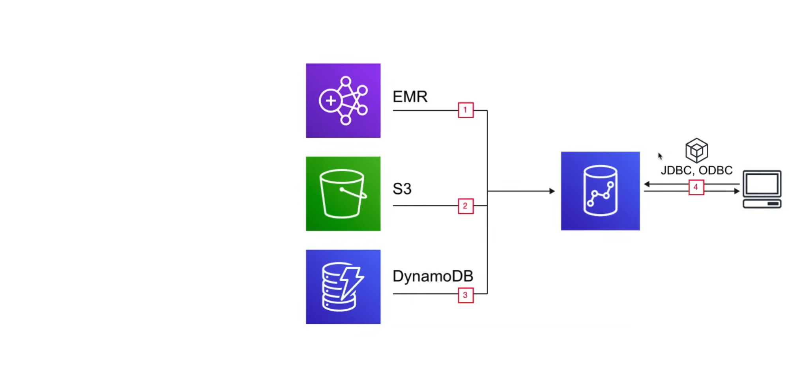
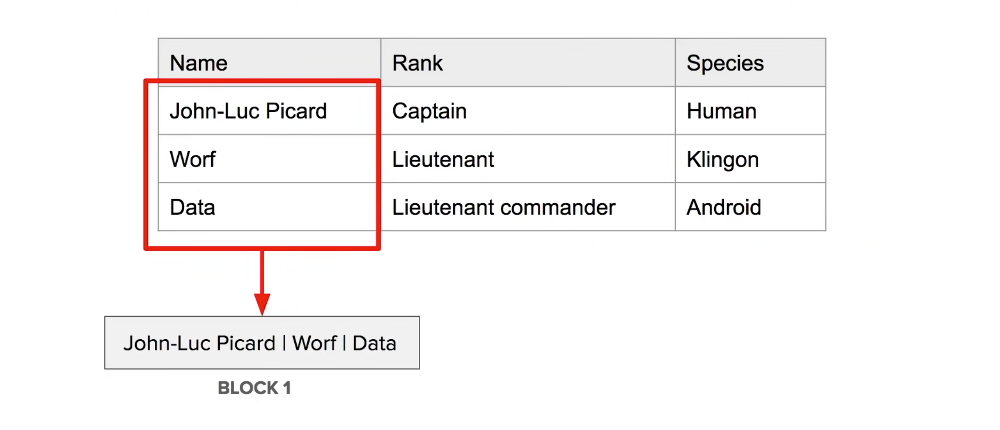
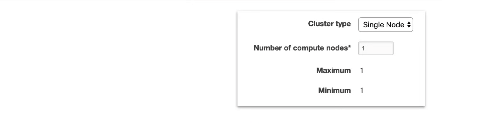
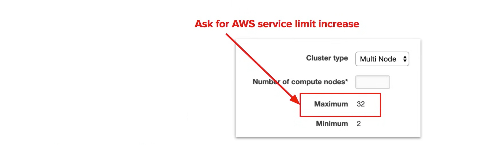
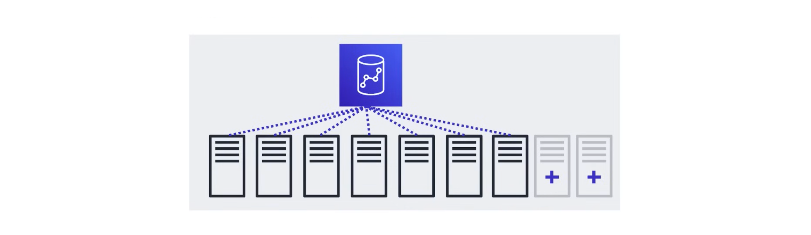
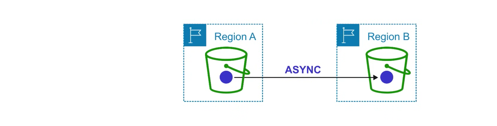

## What is a Database Transaction?

A transaction symbolizes a unit of work done within a database management system. eg. reads and writes. 

| Database | Data Warehouse |
| --- | --- |
| Online Transaction Processing (OLTP) | Online Analytical Processing (OLAP) |
| A **database** was built to store current transactions and enable fast access to specific transaction for ongoing business processes. | A **data warehouse** is built to store large quantities of historical data and enable fast, complex queries across all data. |
| Adding items to a cart, checking out, updating a user profile. | Generating reports |
| Singel source | Multiple Sources |
| Short transactions (small and simple queries) with an emphasis on writes | Long-running queries (long and complex queries) with an emphasis on reads |

## Amazon Redshift

Amazon Redshift is a fast, fully managed, petabyte-scale cloud data warehouse service designed for large-scale analytics and business intelligence
(BI) workloads. It uses a combination of columnar storage, data compression, and Massively Parallel Processing (MPP) to deliver high-speed query performance.

- Pricing starts at just $0.25 per hour with no upfront costs or commitments.
- Scales up to petabytes for $1000 per petabyte, per year.
- Redshifts price is 1/10 less than the cost of most similar servces.
- Redshift is used for business intelligence.
- Redshift uses OLAP (Online Analytical Processing)
- Redshift is a **Columnar Storage** database.

**Columnar Storage** for database tables is an extremely important factor in optimizing analytic query performance because it drastically reduces the overall disk I/O requirements and reduces the amount of data that needs to be loaded from disk.  

### Use Case

Continously copy data from EMR, S3, and DynamoDB, to power business intelligence tool. Using third-party library we can connect and query Redshift for data. 

### Columnar Storage

**Columnar Storage** is a database storage format that stores data in columns rather than rows. This is useful for analytical queries because it allows you to query only the columns you need, rather than the entire table. It also allows you to compress the data more effectively, since the data in each column is of the same type.

**OLAP** applications look at multiple records at the same time, and columnar storage saves memory because you fetch only the columns of data needed instead of whole rows. 

### Configurations

#### Single Node

Nodes come in sizes of 160GB. You can launch a single node to get started with Redshift. 

#### Multi-Node

Multi-node mode can be used to launch a cluster of nodes. 

- **Leader Node** - Manages client connections and receiving queries.
- **Compute Node** - Stored data and performs queries up to 128 compute nodes.

### Node Types and Sizes

There are two types of nodes: 

- **Dense Compute (dc)** - Optimized for compute-intensive workloads. Best for high performance, but with less storage. 
- **Dense Storage (ds)** - Optimized for storage-intensive workloads. Best for large datasets, but with less compute power.

The smallest node you can select is `dc2.large`.

### Compression

- Redshift uses multiple compression techniques to achieve significant compression relative to traditional relationa data stores.
- Similar data is scored sequentially on disk.
- Does not require indexes or materialized views, which saves a lot of space, compared to traditional systems.
- When loading data to an empty table, data is sampled, and the most appropriate compression scheme is selected automatically.

### Processing

- Redshift uses **Massively Parallel Processing (MPP)** to process queries. 
- Automatically distributes data and query loads across all nodes.
- Allows users to easily add new nodes to a data warehouse while still maintaining fast query performance.

### Backups

Backups are enabled by default with a 1-day retention period. The retention period can be adjusted up to 35 days. Redshift always attempts to maintain at least 3 copies of the users data. ie.

- The original copy
- Replica on the compute nodes
- Backup copy in S3

Redshift can asynchronously replicate snapshots to S3 in a different region. 

### Billing

**Compute Node Hours**

- The total number of hours ran across all nodes in the billing period
- Billed for 1 unite per node per hour
- No charges for Leader Node hours, only compute nodes incur charges

**Backup**

- Backups are stored on S3 and are charged at S3 rates.

**Data Transfer**

- Billed only for transfers within a VPC, not outside of it.