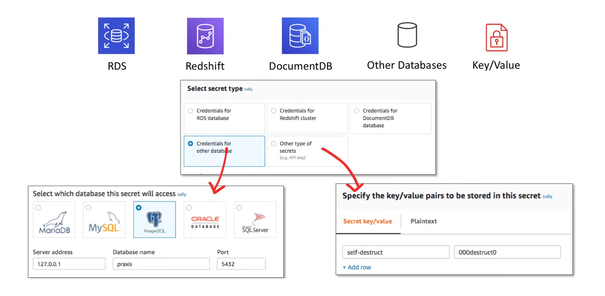
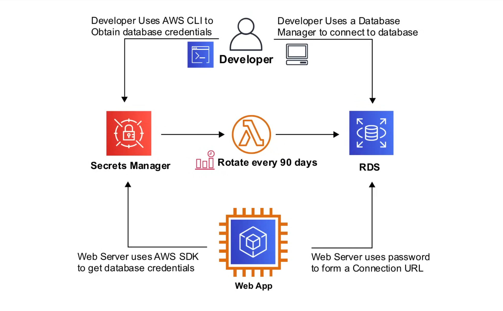

## AWS Secrets Manager

**AWS Secrets Manager** helps you manage, retrieve, and rotate database credentials, application credentials, OAuth tokens, API keys, and other secrets throughout their 
lifecycles. Many AWS services store and use secrets in Secrets Manager but it's mostly used to store and rotate database credentials.



- Storing the credentials in Secrets Manager helps avoid possible compromise by anyone who can inspect your application or the components. 
- You replace hard-coded credentials with a runtime call to the Secrets Manager service to retrieve credentials dynamically when you need them.
- With automatic secret rotation you can replace long-term secrets with short-term ones, significantly reducing the risk of compromise. 
- Since the credentials are no longer stored with the application, rotating credentials no longer requires updating your applications and deploying changes to application clients.
- Secrets Manager enforces ecryption at-rest by using KMS.
- CloudTrail can monitor credentials access in case you need to audit.
- AWS charges $0.40 per secret per month, and $0.05 per 10,000 API calls.

### Automatic Secret Rotation

- You can setup automatic rotation for any database credentials stored in Secrets Manager.
- You can rotate upto 365 days(1 year).
- Rotation is performed via a Lambda function.
- You can rotate the password for the superuser or for a developer programmatically acessing the database.

### Secrets Manager CLI

Create a secret from a credentials file:

```sh
aws secretsmanager create-secret \
    --name MyTestSecret \
    --secret-string file://mycreds.json
```
The JSON file looks like this:

```json
{
  "engine": "mysql",
  "username": "admin",
  "password": "EXAMPLE-PASSWORD",
  "host": "my-database-endpoint.us-west-2.rds.amazonaws.com",
  "dbname": "myDatabase",
  "port": "3306"
}
```
Create a secret with key/value pairs:

```sh
aws secretsmanager create-secret \
    --name MyTestSecret \
    --description "My test secret created with the CLI." \
    --secret-string "{\"user\":\"admin\",\"password\":\"EXAMPLE-PASSWORD\"}"
```

To delete a secret, with the ability to recover:

```sh
aws secretsmanager delete-secret \
    --secret-id MyTestSecret \
    --recovery-window-in-days 7
```

To delete a secret immediately:

```sh
aws secretsmanager delete-secret \
    --secret-id MyTestSecret \
    --force-delete-without-recovery
```

You can also check the details of a secret:

```sh
aws secretsmanager describe-secret \
    --secret-id MyTestSecret
```

To generate a random password:

```sh
aws secretsmanager get-random-password \
    --require-each-included-type \
    --password-length 20
```

To delete the resource-based policy attached to a secret:

```sh
aws secretsmanager delete-resource-policy \
    --secret-id MyTestSecret
```

To retrieve the resource-based policy attached to a secret:

```sh
aws secretsmanager get-resource-policy \
    --secret-id MyTestSecret
```

To retrieve the encrypted secret value of a secret:

```sh
aws secretsmanager get-secret-value \
    --secret-id MyTestSecret
```

To retrieve the previous secret value:

```sh
aws secretsmanager get-secret-value \
    --secret-id MyTestSecret
    --version-stage AWSPREVIOUS
```

To list the secrets in your account:

```sh
aws secretsmanager list-secrets
```

To add a resource-based policy to a secret:

```shaws secretsmanager put-resource-policy \
    --secret-id MyTestSecret \
    --resource-policy file://mypolicy.json \
    --block-public-policy
```

The policy JSON file `mypolicy.json`:

```json
{
    "Version":"2012-10-17",
    "Statement": [
        {
            "Effect": "Allow",
            "Principal": {
                "AWS": "arn:aws:iam::123456789012:role/MyRole"
            },
            "Action": "secretsmanager:GetSecretValue",
            "Resource": "*"
        }
    ]
}
```

To store a new secret value in a secret:

```sh
    aws secretsmanager put-secret-value \
    --secret-id MyTestSecret \
    --secret-string "{\"user\":\"diegor\",\"password\":\"EXAMPLE-PASSWORD\"}"
```

To store a new secret value from credentials in a JSON file:

```sh
aws secretsmanager put-secret-value \
    --secret-id MyTestSecret \
    --secret-string file://mycreds.json
```

The JSON file `mycreds.json`:

```json
{
  "engine": "mysql",
  "username": "saanvis",
  "password": "EXAMPLE-PASSWORD",
  "host": "my-database-endpoint.us-west-2.rds.amazonaws.com",
  "dbname": "myDatabase",
  "port": "3306"
}
```
To replicate a secret to another region:

```sh
aws secretsmanager replicate-secret-to-regions \
    --secret-id MyTestSecret \
    --add-replica-regions Region=eu-west-3
```

To delete a replica secret:

```sh
aws secretsmanager remove-regions-from-replication \
    --secret-id MyTestSecret \
    --remove-replica-regions eu-west-3
```

To restore a previously delete secret:

```sh
aws secretsmanager restore-secret \
    --secret-id MyTestSecret
```

To configure and start automatic rotation of a secret:

```sh
aws secretsmanager rotate-secret \
    --secret-id MyTestDatabaseSecret \
    --rotation-lambda-arn arn:aws:lambda:us-west-2:1234566789012:function:SecretsManagerTestRotationLambda \
    --rotation-rules "{\"ScheduleExpression\": \"cron(0 8/8 * * ? *)\", \"Duration\": \"2h\"}"
```

To configure and start automatic rotation on a rotation interval:

```sh
aws secretsmanager rotate-secret \
    --secret-id MyTestDatabaseSecret \
    --rotation-lambda-arn arn:aws:lambda:us-west-2:1234566789012:function:SecretsManagerTestRotationLambda \
    --rotation-rules "{\"ScheduleExpression\": \"rate(10 days)\"}"
```

To rotate a secret immediately:

```sh
aws secretsmanager rotate-secret \
    --secret-id MyTestDatabaseSecret
```

### Use Case



