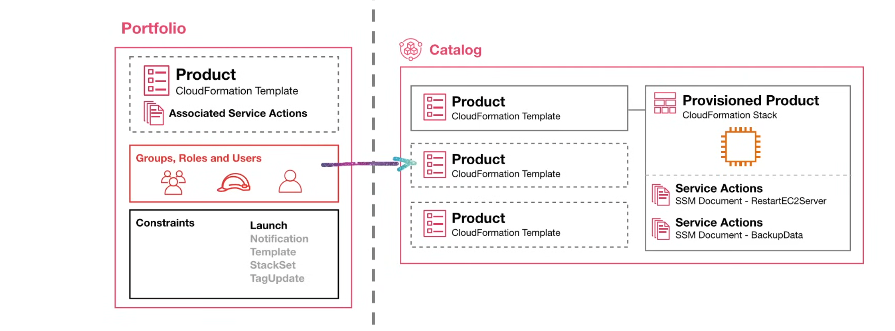
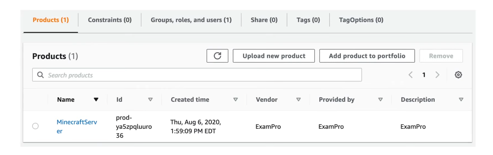
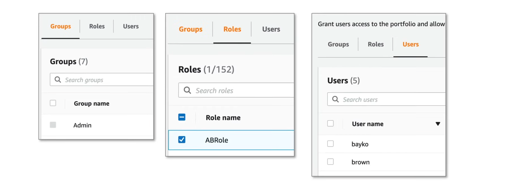
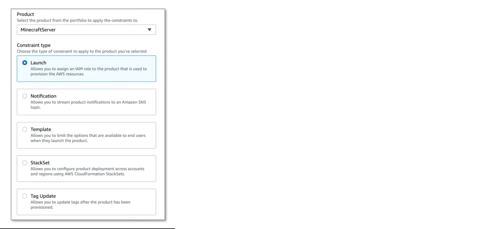
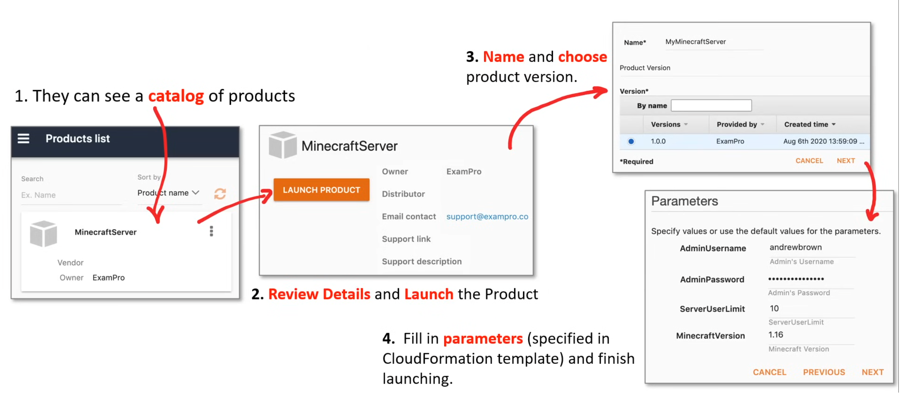
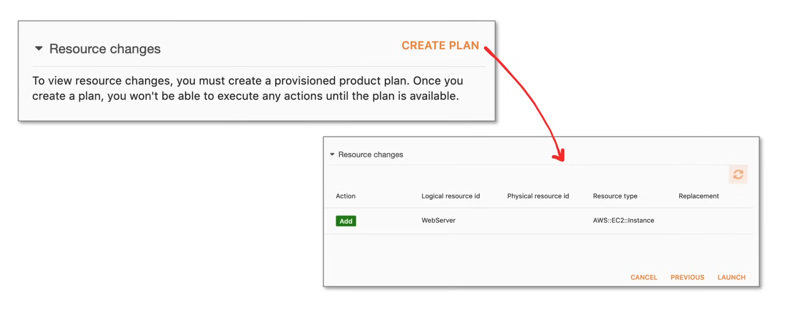
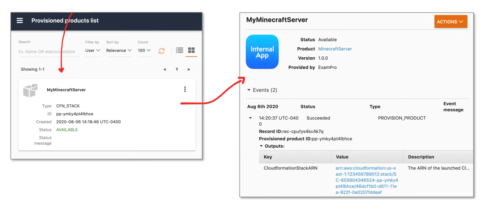
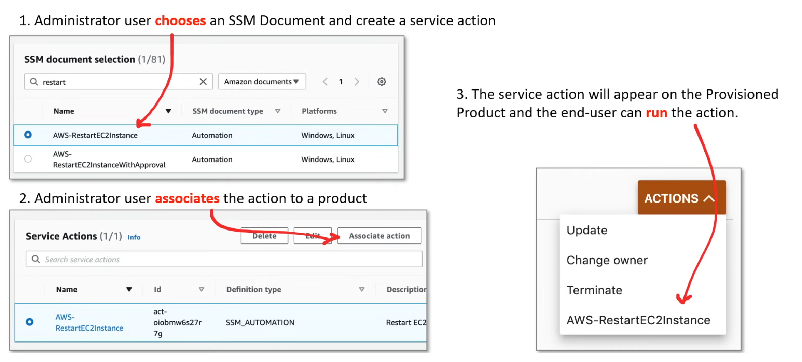

## AWS Service Catalog

**AWS Service Catalog** is a managed service that allows organizations to create and manage catalogs of products and services that are approved for use on AWS to achieve consistent governance and meet compliance requirements. It provides a simple and secure way to manage the lifecycle of IT services, from creation to retirement.

The **AWS Service Catalog** is an alternative to granting direct access AWS resources via the AWS console.

#### Advantages

1. Standardization 
2. Self-service discovery and launch
3. Fine-grained access control
4. Extensibility and version control

### Service Catalog Architecture



1. **Portfolio**
   - A container for products, permissions and constraints.
2. **Product**
   - A CloudFormation template or a set of templates that define the resources to be provisioned.
3. **Permissions**
   - Who can view and launch products.
4. **Constraints**
   - A constraint is a rule that is applied to a provisioned product.
5. **Catalog**
   - A user-friendly console to view and launch products.
6. **Provisioned Product**
   - A provisioned product is a product that has been launched by a user.
   - They are CloudFormation stacks.
7. **Service Actions**
   - SSM documents that can be executed on the stacks.

### Service Catalog Users

There are two types of catalog users:

1. **Catalog Administrator**: Manages the catalog 
2. **End Users**: Uses the service catalog to launch products

#### Catalog Administrator

A **Catalog Administrator** manages a catalog of products and services, organizing them into portfolios and controlling access to end users. An administrators technical responsibilities include:

- Preparing CloudFormation templates
- Configuring constraints
- Managing IAM roles assigned to products

#### End Users

**End Users** use the AWS Management Console to launch products that the administartors have granted them access to.

### Administrator Product

A **product** is a CloudFormation template that defines the resources that will be launched.

```yaml
Resources:
  MyEC2Instance:
    Type: AWS::EC2::Instance
    Properties:
      ImageId: ami-0c55b159cbfafe1f0
      InstanceType: t2.micro
      Tags:
        - Key: Name
          Value: MyEC2Instance
```

- Users can create or associate an AWS Budget to a product.
- Once a product is created, it cannot be deleted, but only edited.
- A product must be removed from the portfolio and not provisioned by a user in order to delete.
- In order for products to be visible to end users, they must be added to a portfolio.

### Administrator Portfolio

A **portfolio** is a collection of products. Constraints are used to restrict how products in a portfolio can be used. Products are associated with Groups, roles, or users, to determine who can see and launch the products.



To grant access so that end users can see products in the catalog, users need to associate to a portfolio Groups, role, Users or roles.

- All products in the portfolio will be shared to the added identities.
- Users cannot limit some products to some users in a portfolio.



### Administratot Constraints

Users can create constraints on products in a portfolio. Constraints are used to restrict how products in a portfolio can be used.



#### Constraint Types

Users are required to choose the constraint type to apply to the selected product when creating a constraint.

1. **Launch**
   - Use a specified IAM role instead of the end-user credentials. This way, users don't have to grant end-user permissions to services directly, which is less permissive and more secure.
2. **Notifications**
   - Send product notifications to stack.
3. **Template**
   - Limit the options that are presented to the end user during product launching.
   - Set restrictions on the underlying CloudFormation parameter inputs. eg. Only allow t2.micro instances types.
4. **StackSet**
   - Allows users to configure product deployment across accounts and regions using AWS CloudFormation StackSets.
5. **TagUpdate**
   - Allow or disallow end users to update tags on resources associated with a provisioned product.

### End User Products

The End User experiences a user-friendly interface in the AWS Management Console when opening up AWS Service Catalog. They can see two things, **Products** and **Provisioned Products**.

#### Steps to launch a product

1. End users can see catalog products.

2. End users review details and launch products.

3. End users fill in parameters(specified in CloudFormation template) and finish launching the product.

4. End users name and choose product version.



Just before launching a product, users can choose to create a **Provisioned Product Plan**. The plan includes the list of resources that will be created or modified, before the product is launched.

It is essentially a CloudFormation change set.



### End User Provisioned Products

**Provisioned Products** are the resources that have been launched and can be monitored and managed by end users.



### Service Actions

Service actions are a set of actions that can be performed on a provisioned product. They are essentially SSM documents that can be executed on the stacks.



