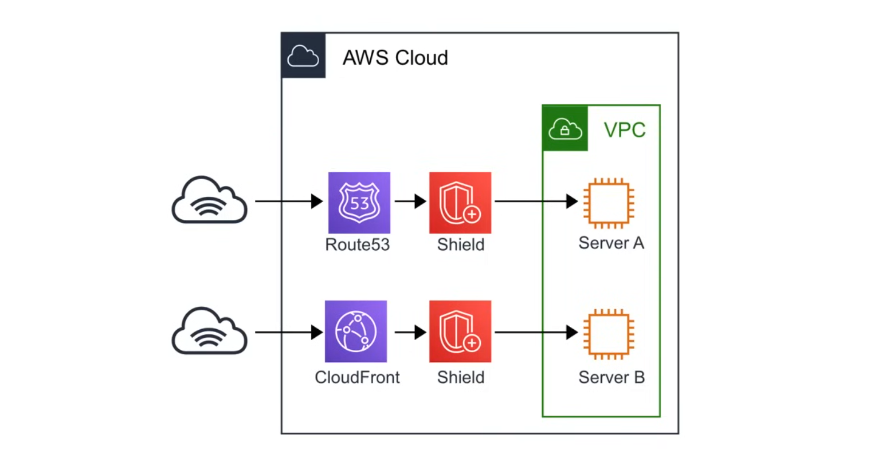
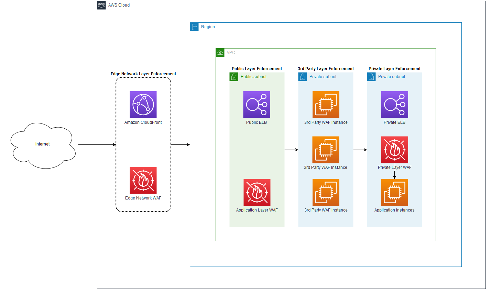
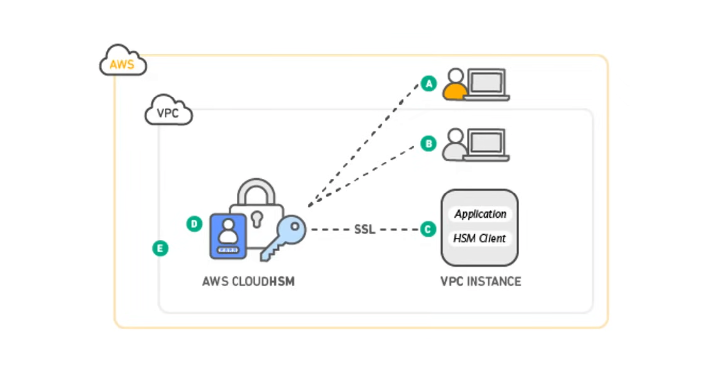
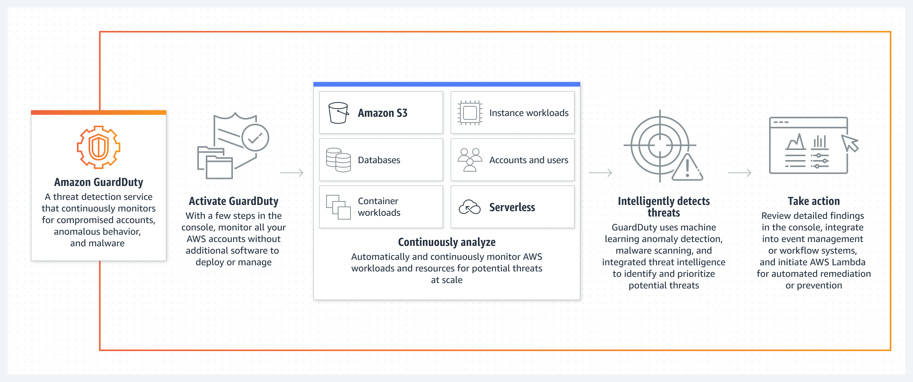
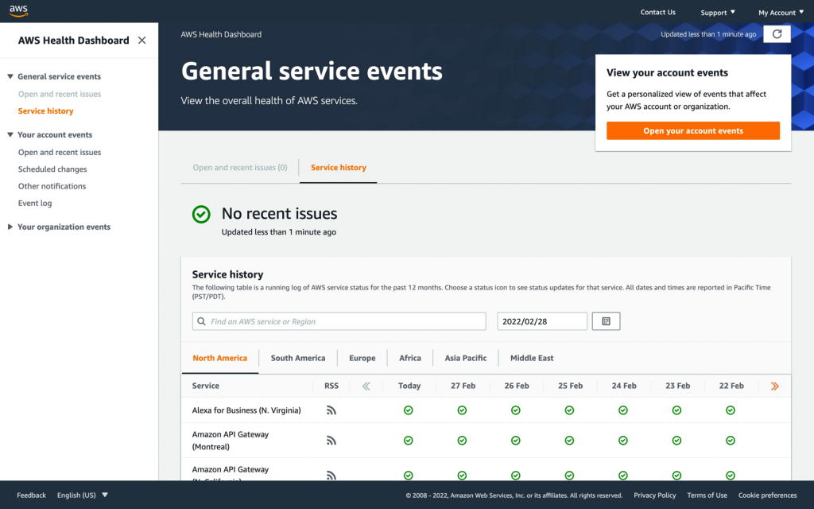
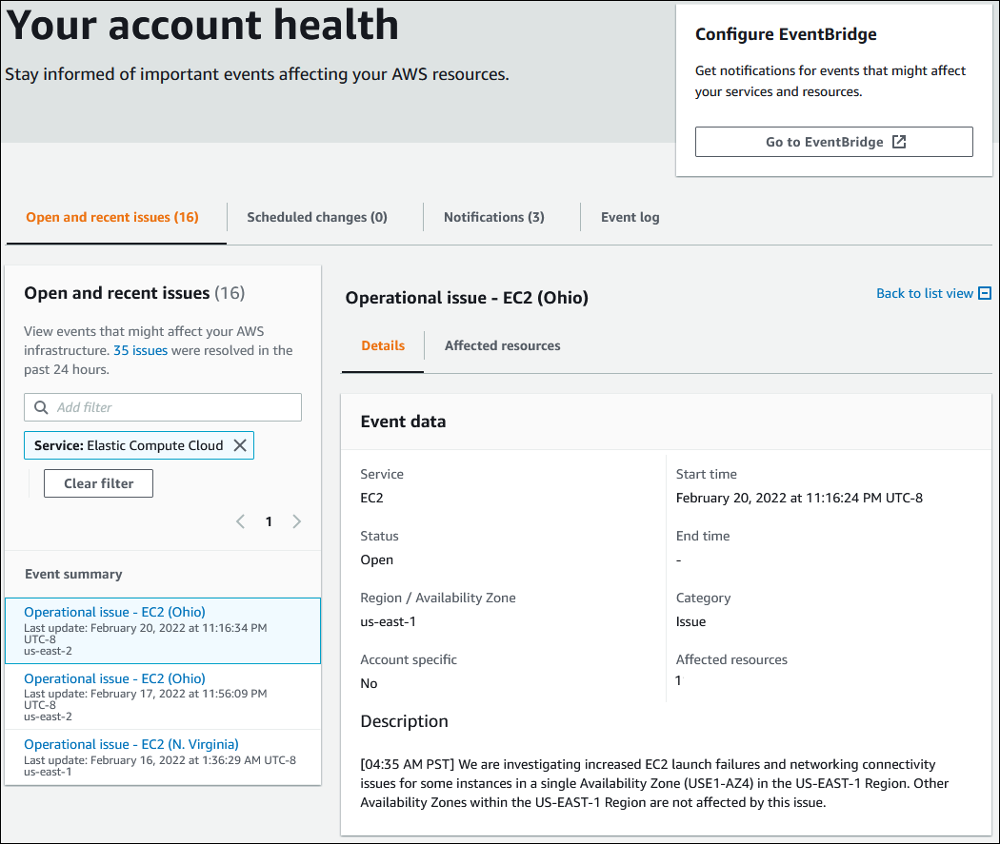

## AWS Shield

**AWS Shield** is a managed Distributed Denial of Service (DDoS) protection service that safeguards applications running on AWS from most common and sophisticated network and application layer attacks. AWS provides two levels of protection against DDoS attacks: 

- **AWS Shield Standard** - AWS Shield Standard is automatically included at no extra cost beyond what you already pay for AWS WAF and your other AWS services. 
- **AWS Shield Advanced** - For added protection against DDoS attacks, AWS offers AWS Shield Advanced. AWS Shield Advanced provides expanded DDoS attack protection for your 
Amazon EC2 instances, Elastic Load Balancing load balancers, Amazon CloudFront distributions, and Amazon Route 53 hosted zones.

When you route traffic through AWS Route53 or CloudFront, AWS Shield automatically protects your resources from common DDoS attacks with AWS Shield Standard. 

It protects your applications against Layer 3, 4 and 7 attacks.

| Standard | Advanced |
| --- | --- |
| Free | $3,000/year |
| Protection against most common DDoD attacks | Protection against larger and more sophisticated attacks |
| Access to tools and best practices to build a DDoS resilient arcchitecture |  |
| Automatically available on all AWS services | Available on : <ul><li>Amazon Route53</li><li>Elastic CloudFront</li><li>Elastic Load Balancing</li><li>AWS Global Accelerator</li><li>Elastic IP(Amazon EC1 and NLB)</li></ul> |
| | Notable features:  <ul><li>Visibility and reporting on Layer 3,4 and 7</li><li>Access to Team and Support</li><li>DDoS Cost protection</li><li>Comes with SLA</li></ul> |

Both plans integrate with WAF to provide Layer 7 protection.

## AWS Web Application Firewall (WAF)

**AWS WAF** is a web application firewall that lets you monitor and manage web requests that are forwarded to protected AWS resources. With AWS WAF, you can protect resources 
such as Amazon CloudFront distributions, Amazon API Gateway REST APIs, Application Load Balancers, and AWS AppSync GraphQL APIs.

You can use AWS WAF to inspect web requests for matches to conditions that you specify, such as the IP address that the requests originate from, the value of a specific request 
component, or the rate at which requests are being sent. 

AWS WAF can manage matching requests in a variety of ways, including counting them, blocking or allowing them, or sending challenges like CAPTCHA puzzles to the client user or 
browser.

- Write your own rules to ALLOW or DENY traffic based on the contents of HTTP requests
- Use a ruleset form a trusted AWS Security Partner in the AWS WAF Rules Marketplace
- WAF can be attached to either CloudFront or an Application Load Balancer

Protect Web Applications from attacks covered in the OWASP Top 10 most dangerous attacks:

1. Injection
2. Broken Authentication
3. Sensitive data exposure
4. XML External Entities (XXE)
5. Broken Access Control
6. Security Misconfiguration
7. Cross-Site Scripting (XSS)
8. Insecure Deserialization
9. Using Components with Known Vulnerabilities
10. Insufficient Logging & Monitoring

## AWS CloudHSM

A **Hardware Sceurity Module (HSM)** is a piece of hardware designed to store encryption keys. HSM store key in memory, and never writes them to disk. 

- Multi-tenant HMSs are FIPS 140-2 Level 2 compliant. eg. AWS KSM
- Single-tenant HSMs are FIPS 140-2 Level 3 compliant. eg. AWS CloudHSM

**CloudHSM** is a single-tenant HSM as a service that automates hardware provisioning, software patching, high availability and backups. CloudHSM enables users to generate and use their own encryption keys, and manage access to those keys using their own FIPS 140-2 Level 3 validated hardware.

You can transfer your keys to other commercial HSM solutions to make it easy for you to migrate keys on and off of AWS. You can configure AWS KMS to use CloudHSM cluster as a custom key store rather than the default KMS key store.

## Amazon Guard Duty

**Amazon GuardDuty** is a threat detection service that continuously monitors your AWS accounts and workloads for malicious activity and delivers detailed security findings for visibility and remediation.

It uses Machine Learning to analyze the following AWS logs:

- CloudTrail Logs
- VPC Flow Logs
- DNS Logs

It will alert you of findings which you can automate an incident response via CloudWatch Events or with 3rd Party Services.

## AWS Service Health Dashboard

The Service Healthe Dashboard shows the general health status of AWS Services.

An icon and details will indicate the status of each service.

## AWS Personal Health Dashboard

**AWS Personal Health Dashboard** provides alerts and guidance for AWS events that might affect your environment. All customers can access the AWS Personal Health Dashboard. 

The Personal Health Dashboard shows recent events to help you managed active events, and show proactive notifications so that you can plan for scheduled activities. Use these alerts to get notified about changes that can affect your AWS resources, and then follow the guidance to diagnose and resolve issues.

## AWS Artifact

**AWS Artifact** is a self-serve portal that provides on-demand access to AWS security and compliance reports and select online agreements. Reports available in AWS Artifact 
include our Service Organization Control (SOC) reports, Payment Card Industry (PCI) reports, and certifications from accreditation bodies across geographies and compliance 
verticals that validate the implementation and operating effectiveness of AWS security controls. Agreements available in AWS Artifact include the Business Associate Addendum 
(BAA) and the Nondisclosure Agreement (NDA).
