## AWS Global Accelerator

**AWS Global Accelerator** is a networking service that improves the availability and performance of your applications for global users. It finds the optimal path from the end-user to target web-servers. It uses the AWS global network to route user traffic to the nearest healthy endpoint, such as an EC2 instance, Elastic Load Balancer, or Elastic IP address.

Global Accelerators are deployed within Edge Locations, so user traffic is sent to an Edge Location instead of directly to the target web-applications. This reduces latency and improves performance.

There two types of Global Accelerators:

- **Standard Global Accelerator**: Automatically routes traffic to the nearest healthy endpoint.
- **Basic Global Accelerator**: Routes traffic to specific endpoints.

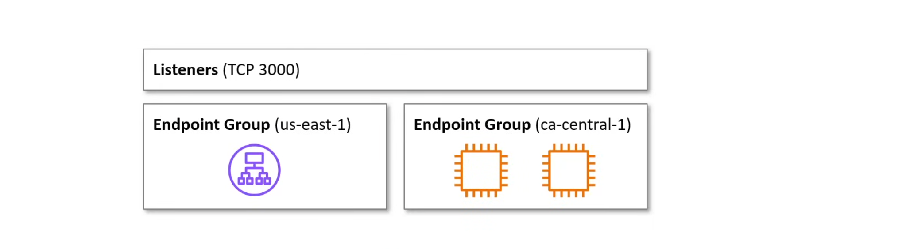

1. **Listeners**: Listens for traffic on a specific port and sends traffic to an endoint group.
2. **Endpoint Groups**: A collection of endpoints within a specific AWS region. *Traffic Dials* can be used to change the traffic distribution percentage.
3. **Endpoints**: Represents resources to send traffic to. eg.
   - Network Load Balancer
   - Application Load Balancer
   - EC2 Instance
   - Elastic IP Address

**Global Accelerator** has a speed comparison tool, i.e `https://speedtest.globalaccelerator.aws/`

## AWS CloudFront

**CloudFront** is a content delivery network (CDN) service provided by Amazon Web Services (AWS). A **Content Delivery Network (CDN)** is a distributed network that delivers web pages and content to users based on their geographical location, the origin of the webpage, and a content delivery server.

**CloudFront** can be used to deliver:

- Static Content
- Dynamic Content
- Streaming Content
- Web Sockets

Amazon CloudFront can be fronted with AWS WAF for OWASP top 10 protection. Amazon CloudFront can stream videos on demand using ISS Microsoft Smooth Streaming.

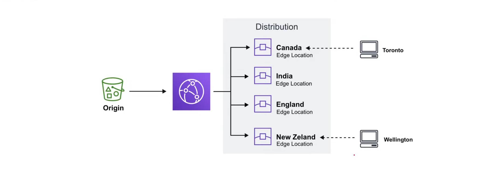

### CloudFront Core Components

1. **Origin**: Location where all of the original files are located. eg. an S3 bucket, EC2 Instance, ELB, or Route53
2. **Edge Location**: compute located strategically close to the end users.
3. **Regional Caches**: compute located in broad geographic locations to speed up requests for edge locations.
4. **Distribution**: A collection of edge locations and regional caches that define how cached content should be delivered.

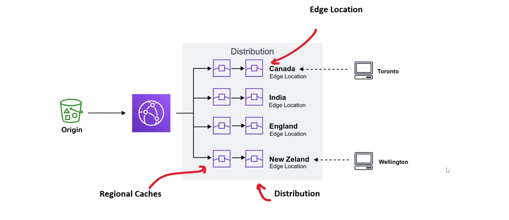

### CloudFront Lambda@Edge

**Lambda@Edge** is a serverless compute service that allows you to run code at the edge of the network. They are Lambda functions to override the default behavior of requests and responses. 

There are four functions for **Lambda@Edge**:

1. **Viewer Request**: When CloudFront receives a request from a viewer, it sends the request to the Lambda function.
2. **Viewer Response**: Before CloudFront sends a response to a viewer, it sends the response to the Lambda function.
3. **Origin Request**: Before CloudFront forwards a request to the origin, it sends the request to the Lambda function.
4. **Origin Response**: When CloudFront receives a response from the origin, it sends the response to the Lambda function.


#### Viewer Request Use Cases

- Redirecting HTTP to HTTPS
- Inspecting cookies for authentication
- Modifying headers for A/B testing

#### Viewer Response Use Cases

- Adding security headers
- Setting cookies for client-side tracking
- Customizing error messages

#### Origin Request Use Cases

- Rewriting URLs for SEO or routing
- Injecting headers for origin authentication
- Selective content serving based on user-agent 

#### Origin Response Use Cases

- Modifying headers to control acching
- Updating URLs in HTML for versioning
- Customizing error responses from the origin

**Lambda@Edge** functions support Python and Node.js. They are deployed at Regional Edge Caches.

#### Example Viewer Request Function

Redirecting HTTP to HTTPS:

```python
def lambda_handler(event, context):
    request = event['Records'][0]['cf']['request']
    # Perform operations on the request: Redirect HTTP to HTTPS
    if request['headers']['cloudfront-forwarded-proto'][0]['value'] == 'https':
        response = {
            'status': 301,
            'statusDescription': 'Moved Permanently',
            'headers': {
                'location': [
                    {
                        'key': 'Location',
                        'value': 'https://' + request['headers']['host'][0]['value'] + request['uri']
                    }
                ]
            }
        }
    # Return the original request for CloudFront to process
    return request
```

#### Example Viewer Response Function

Adding security headers:

```python
def lambda_handler(event, context):
    response = event['Records'][0]['cf']['response']
    # Perform operations on the response: Add security headers to the response
    headers = response['headers']
    headers['x-content-type-options'] = [
        {
            'key': 'X-Content-Type-Options',
            'value': 'nosniff'
        }
    ]
    headers['x-frame-options'] = [
        {
            'key': 'X-Frame-Options',
            'value': 'DENY'
        }
    ]
    headers['x-xss-protection'] = [
        {
            'key': 'X-XSS-Protection',
            'value': '1; mode=block'
        }
    ]
    # Return the modified response
    return response
```

#### Example Origin Request Function

Serving different version based on user-agent:

```python
def lambda_handler(event, context):
    request = event['Records'][0]['cf']['request']
    # Perform operations on the request: Serve different version based on user-agent
    user_agent = request['headers'].get('user-agent', [{'value': ''}])[0]['value']
    if 'mobile' in user_agent.lower():
        request['uri'] = '/mobile' + request['uri']
    else:
        request['uri'] = '/desktop' + request['uri']
    # Return the modified request
    return request
```

#### Example Origin Response Function

Change 404 to 200 and provide response body:

```python
def lambda_handler(event, context):
    response = event['Records'][0]['cf']['response']
    # Perform operations on the response: Check 404 status and modify the response
    if response['status'] == '404':
        response['status'] = '200'
        response['statusDescription'] = 'OK'
        response['body'] = 'Custom error page content'
        response['headers']['content-type'] = [
            {
                'key': 'Content-Type',
                'value': 'text/html'
            }
        ]
    # Return the modified response
    return response
```

### CloudFront Functions

**CloudFront Functions** are lightweight edge functions for high scale, latency-sensitive CDN customizations. CloudFront functions are cheaper, faster, but more limited compared to Lambda@Edge functions.

CloudFront functions have two `functions`:

1. **Viewer Request**: When CloudFront receives a request from a viewer, it sends the request to the Lambda function.
2. **Viewer Response**: Before CloudFront sends a response to a viewer, it sends the response to the Lambda function.

CloudFront functions are written in JavaScript and are deployed at Edge Locations. 

#### Use Cases

- Cache key normalization
- Header Manipulation
- Status code modification & body generation
- URL redirects or rewrites
- Request authorization

#### Example Viewer Request Function

Redirect HTTP to HTTPS:

```javascript
function handler(event) {
    var request = event.request;
    var headers = request.headers;
    // Check is viewer request is using HTTP
    if (request.uri.startsWith('http://')) {
        // Generate an HTTP redirect response to HTTPS
        var response = {
            statusCode: 301,
            statusDescription: 'Moved Permanently',
            headers: {
                "location": {
                    value: "https://" + headers.host.value + request.uri
                }
            }
        };
        return response;
    }
    return request;
}
```

#### Example Viewer Response Function

Add security headers:

```javascript
function handler(event) {
    var response = event.response;
    var headers = response.headers;
    // Add security headers to the response
    headers['x-content-type-options'] = {
        value: 'nosniff'
    };
    headers['x-frame-options'] = {
        value: 'DENY'
    };
    headers['x-xss-protection'] = {
        value: '1; mode=block'
    };
    headers['referrer-policy'] = {
        value: 'same-origin'
    };
    // Return the modified response
    return response;
}
```
### CloudFront Functions vs Lambda@Edge

| Feature | CloudFront Functions | Lambda@Edge |
| --- | --- | --- |
| **Programming Languages** | JavaScript (ECMAScript 5.1 compliant) | Python and Node.js |
| **Event Sources** | Viewer Request<br>Viewer Response | Viewer Request<br>Viewer Response<br>Origin Request<br>Origin Response |
| **Scale** | 10M+ requests per second | Up to 10K requests per second per region |
| **Function Duration** | Submillisecond | Up to 5 seconds( viewer request and response)<br>Up to 30 seconds (origin request and response) |
| **Max Memory** | 2MB | 128 - 3008 MB |
| **Max Size Function Code+Libs** | 10KB | 1MB (viewer request and response)<br>50MB (origin request and response) |
| **Network, File System, & Request Body Access** | No | Yes |
| **Geolocation and device data access** | Yes | No (viewer request)<br>Yes (viewer response, origin request & response) |
| **Build & Test within CloudFront** | Yes | No |
| **Function Logging & Metrics** | Yes | Yes |
| **Pricing** | Charged per request; Free tier available | Charged per request, function duration; No free tier |
| **Deployment** | Deployed at Edge Locations | Deployed at Regional Edge Caches |


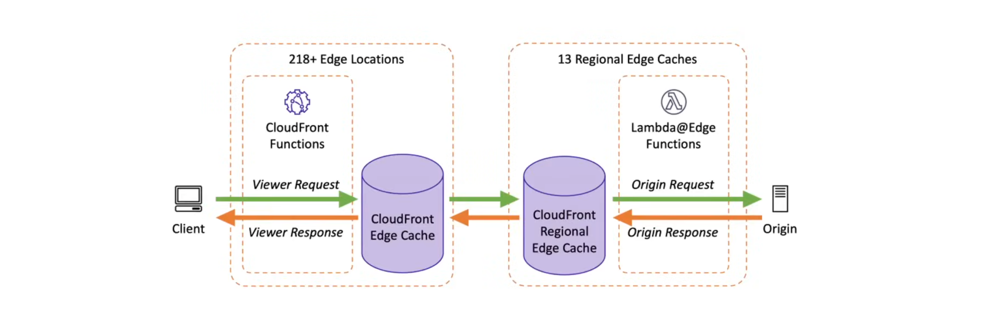

### CloudFront Origin

**CloudFront Origin** is the source where CloudFront will send requests for content that is not served from the cache. It can be an Amazon S3 bucket, an Amazon EC2 instance, or any other web server.

This information is provided when creating the CloudFront distribution.

```json
{
    "Origins": {
        "Quantity": 1,
        "Items": [
            {
                "Id": "awsexamplebucket.s3.amazonaws.com-cli-example",
                "DomainName": "awsexamplebucket.s3.amazonaws.com",
                "OriginPath": "",
                "CustomHeaders": {
                    "Quantity": 0
                },
                "S3OriginConfig": {
                    "OriginAccessIdentity": ""
                }
            }
        ]
    }
}
```

- **Domain Name**: the address to the origin.
- **Origin Path**: The path at the specified address to the origin.
- **Custom Headers**: The custom headers to be sent to the origin.
- **S3OriginConfig**: The S3 origin configuration.
  - Amazon S3
- **CustomOriginConfig**: The custom origin configuration.
  - AWS Elemental MediaStore Container
  - Application Load Balancer
  - Lambda function URL
  - HTTP server eg. Amazon EC2 instance
  - CloudFront Origins Group


## Amazon Elastic Block Store (EBS)

**What is IOPS?**

**IOPS** is an acronym for **Input/Output Operations Per Second**. It is the speed at which non-contagious reads and writes can be performed on a storage medium. The higher the IOPS, the faster the storage device can perform read and write operations. A high I/O = lots of small, fast read and writes.

**What is Throughput?**

**Throughput** is the transfer rate to and from the stoarge medium in megabytes per second (MBps).

**What is Bandwidth?**

**Bandwidth** is the maximum rate at which data can be transferred between two points in a network.

**What is EBS?**

**Elastic Block Store** is a highly available and durable block storage attaching persistent block storage volumes to Amazon EC2 instances. Volums are automatically replicated within their Availability Zone to protect against instance failure. 

Types of volumes that can be deployed:

- **General Purpose SSD (gp2)**: For general usage without specific requirements.
- **General Purpose SSD (gp3)**: Up to 20% cheaper per GB than **gp2**.
- **Provisioned IOPS SSD (io1)**: For very fast input/output operations.
- **Provisioned IOPS SSD (io2)**: For more durability than **io1**
- **io2 Block Express**: Higher throughput and IOPS with support for larger capacity.
- **Throughput Optimized HDD (st1)**: Magnetic drive optimised for quick throughput.
- **Cold HDD (sc1)**: Low cost HDD for infrequently accessed workloads.
- **Magnetic (standard)**: Precious generation HDD.

All **io2** volumes created after November 21, 2023 are **io2 Block Express volumes**. **io2** volumes created before November 21, 2023 can be converted to **io2 Block Express volumes**.

### EBS Volume Type Usage

| Feature | General Purpose SSD Volumes | Provisioned IOPS SSD Volumes  | Throughput Optimized HDD | Cold HDD | Magnetic |
| --- | --- | --- | --- | --- | --- |
| **Volume Type** |  <ul><li>gp2</li><li>gp3</li></ul> | <ul><li>io1</li><li>io2 Block Express</li></ul> | st1 | sc2 | standard |
| **Use Cases** | <ul><li>Transactional Workloads<li>Virtual Desktops<li>Medium-sized, single-instance databases<li>Low-latency interactice applications<li>Boot volumes<li>Development & testing environments</li></ul> | **io1** <ul><li>Large, in-memory databases</li><li>Mission-critical transactional databases</li><li>Other I/O intensive applications</li></ul><br>**io2 Block Express** <ul><li>Large, in-memory databases</li><li>Mission-critical transactional databases</li><li>Other I/O intensive applications</li></ul> | <ul><li>Big Data and analytics</li><li>Data warehouses</li><li>Log processing</li></ul> | <ul><li>Throughput-oriented storage for data that is infrequently accessed</li><li>Where lowest storage cost is important</li></ul> | <ul><li>Infrequently Accessed data workloads</li></ul> |
| **Durability** | 99.8% - 99.9% | **io1** 99.8% - 99.9%<br>**io2 Block Express** 99.999% | 99.8% - 99.9% | 99.8% - 99.9% | N/A |
| **Volume Size** | 1GiB - 16GiB | **io1** 4GiB - 16TiB<br>**io2 Block Express** 4GiB - 64TiB | 125 GiB - 16 TiB | 125 GiB - 16 TiB | 1 GiB - 1 TiB | 
| **Max IOPS** | 16,000 (16 KiB I/O)| **io1** 16,000 (16 KiB I/O)<br>**io2 Block Express** 256,000 (256 KiB I/O) | 500 (1 MiB I/O)| 250 (1 MiB I/O)| 40 - 200 (1 MiB I/O) |
| **Max Throughput** | **gp2** 250 MiB/s<br>**gp3** 1,000 MiB/s | **io1** 250 MiB/s<br>**io2 Block Express** 4,000 MiB/s | 500 (1 MiB/s)| 250 (1 MiB/s)| 40 - 90 (1 MiB/s |
| **EBS Multi-attach** | Not supported for either gp2 or gp3 | Supported for both io1 and io2 Block Express | Not Supported | Not Supported | N/A |
| **NVMe Reserve** | Not supported for either gp2 or gp3 | Supported only for io2 Block Express | N/A | N/A | N/A |
| **Boot Volume** | Supported for both gp2 and gp3 | Supported for both io1 and io2 Block Express | Not Supported | Not Supported | N/A |

### Hard Disk Drive (HDD) 

**HDD** is a magnetic storage device that uses rotating platters to, an actuator arm, and a magnetic head to read and write data(similar to a record player). **HDD** is very good at writing a continuous amount of data. **HDD** is not great for writing many small reads and writes. 

- Better for throughput
- Physical Moving Part

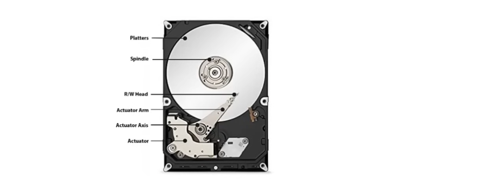

#### RPMs (Revolutions Per Minute)

- The speed at which the drive's platters are spinning. Faster RPMs mean faster access times and slower RPMs mean better cost-savings.

##### 7200 RPM Drives

These are standard for desktops and high-performance external drives, offering a good balance of performance, cost and power consumption.

##### 5400 RPM Drives

These are commonly found in laptops, external drives, and applications where lower power consumption and heat are prioritized over top performance.

##### 10000 RPM Drives

These are typically used in enterprise environments, or high-end workstations where performance is critical. These drives have become less common due to the rise of Solid State Drives (SSDs).

#### HDD RAID

**RAID (Redundant Array of Independent Disks)** is a data storage virtualization technology that combines multiple physical disk drive components into one or more logical units for the purposes of storing redundant data across disks, performance improvement, or both. 

Since HDD has to do with mechanical parts, it is prone to failure, hence the need for RAID.

1. **RAID 0(stripping)**
   - No redundancy; data is split across disks for high performance.
   - It increases speed and capacity but offers no fault tolerance.
   - Requires a minimum of 2 disks.

2. **RAID 1(mirroring)**
   - Data is duplicated across 2 or more disks, offering high redundancy.
   - If one disk fails, the other disk(s) can be used to restore the data.
   - It increases fault tolerance but reduces capacity.
   - Requires a minimum of 2 disks.

3. **RAID 5(stripping with parity)**
   - Combines stripping and parity, spreading data across disks while also storing parity information.
   - It increases fault tolerance and capacity but reduces speed.
   - It can withstand the failure of one disk, without data loss.
   - Requires a minimum of 3 disks.

4. **RAID 6(stripping with double parity)**
   - Combines stripping and double parity, spreading data across disks while also storing parity information.
   - It can withstand the failure of two disks, without data loss.
   - Requires a minimum of 4 disks.

5. **RAID 10(1+0)**
   - Combines RAID 0(stripping) and RAID 1(mirroring), offering redundancy and increased performance.
   - Requires a minimum of 4 disks.

### Solid State Drive (SSD)

**SSDs** are much faster than HDDs because they use integrated circuit(IC) assemblies as memory to store data persistently, typically using flash memory chips. They are also more durable because they don't have any moving parts. However, they are more expensive than HDDs.

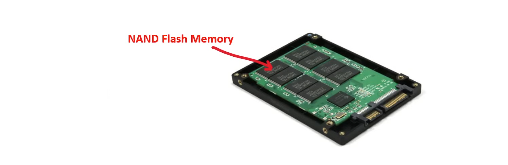

**SSDs** are more resistant to physical shock and vibration than HDDs because they don't have any moving parts, hence run silently and have quicker access time and lower latency. This makes them ideal for use in laptops, tablets, and other portable devices.

- Very good frequent read/write operations
- No physical moving parts

#### SSD Types

1. **SATA SSDs**
   - Uses the SATA interface to connect to the motherboard.
   - Slower than NVMe SSDs but faster than HDDs due to the SATA interface limitations.
   - Good for general-purpose computing.

2. **NVMe SSDs**
   - Uses the PCIe interface for higher performance.
   - Much faster than SATA SSDs.
   - Ideal for intensive data tasks and gaming.
   - Available in M.2 or PCIe card form factors.

3. **M.2 SSDs**
   - Uses SATA or NVMe interfaces.
   - Compact, suitable for laptops and compact PCs.
   - Installed directly on the motherboard.

4. **U.2 SSDs**
   - Similar to M.2 NVMe SSDs but with a 2.5-inch form factor.
   - Designed for 2.5-inch drive bays.
   - Mainly used in enterprise and server environments.

5. **Portable SSDs**
   - External drives for easy portability
   - Uses the USB interface to connect to the motherboard.
   - Offers SSD speed and durability on the go.

6. **PCIe SSDs**
   - Add-on cards that provide high performance for older systems or specialized tasks.
   - Uses the PCIe interface to connect to the motherboard.

#### Serial Advanced Technology Attachment (SATA) SSDs

These are the most common and are compatible with the serial ATA interface, used by most desktop and laptop computers. They are relatively easy to install and offer good performance, though they are typically slower than their NVMe counterparts due to the limitations of the SATA interface.

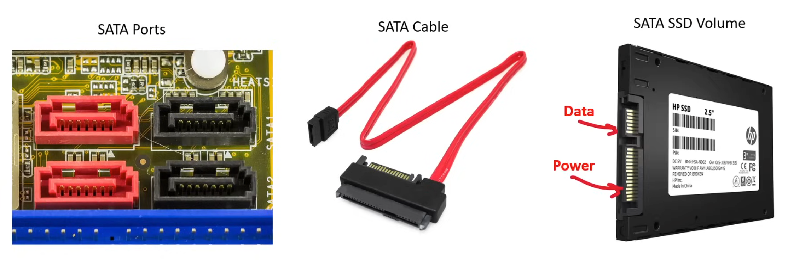

#### Non-Volatile Memory Express (NVMe) SSDs

**NVMe SSDs** use the PCIe interface offering significantly higher performance compared to **SATA SSDs**. They are designed to take full advantage of the high speeds of flash-based torage technologies. **NVMe** drives are found in the form of M.2 SSDs but can also be added to a computer using PCIe expansions slot.


#### Peripheral Component Interconnect Express (PCIe) SSDs

These SSDs are add-on cards that fit into the PCI slot on the motherboard. They can offer high performance, especially in configurations that support NVMe. They are a good option for users looking to upgrade the storage of an older system or for specialized high-performance computing tasks.

PCIe slots on a motherboard come in different sizes, including x1, x4, x8, and x16. The larger the slot, the more data can be transferred between the SSD and the motherboard.

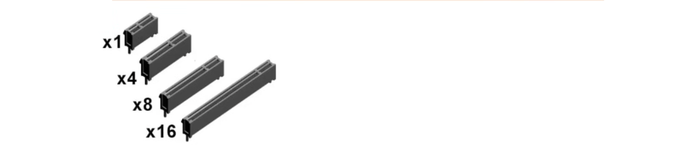

| PCIe slot generation | Releases | Max Bandwidth per lane | Max Bandwidth x16 Slot |
|----------------------|----------|------------------------|------------------------|
| PCIe 1.0             | 2003     | 250 MB/s               | 4 GB/s                 |
| PCIe 1.1             | 2005     | 250 MB/s               | 4 GB/s                 |
| PCIe 2.0             | 2007     | 500 MB/s               | 8 GB/s                 |
| PCIe 3.0             | 2010     | 1 GB/s                 | 16 GB/s                |
| PCIe 4.0             | 2017     | 2 GB/s                 | 32 GB/s                |
| PCIe 5.0             | 2019     | 4 GB/s                 | 64 GB/s                |
| PCIe 6.0             | 2022     | 8 GB/s                 | 128 GB/s               |

#### M.2 SSDs

**M.2 SSDs** are small, compact SSDs that are designed to fit into the M.2 slot on a motherboard. They are commonly used in laptops and other small form factor computers. M.2 SSDs can use either the SATA or NVMe interface.

#### U.2 SSDs

**U.2 SSDs** are similar in performance to M.2 NVMe SSDs but with a 2.5-inch form factor. They are designed for 2.5-inch drive bays and are mainly used in enterprise and server environments. They generally connect via a U.2 port.


### Magnetic Tape

**Magnetic Tapes** are sequential access storage devices that use magnetic tape to store data. A tape drive is used to write data to the tape. Medium and large-sized data centers use magnetic tapes for long-term storage and backup purposes due to their low cost and high storage density. They normally come in the form of cassettes. 

- Durable for decades (good for at least up to 30 years)
- Cheap to produce

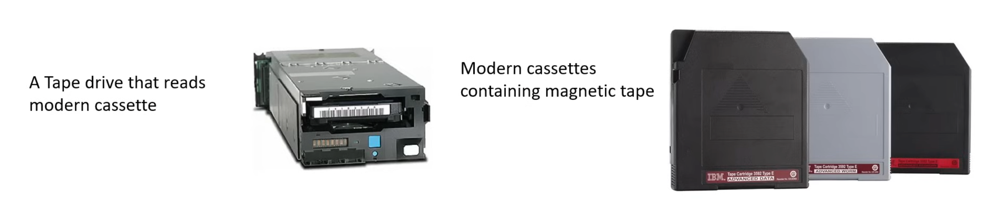

## Amazon Elastic File System (EFS)

**Elastic File System** is a managed file storage service provided by Amazon Web Services (AWS). It is a fully managed, scalable, and highly available file storage service that can be used by multiple EC2 instances at the same time. It is based on the Network File System (NFS) protocol and is designed to work with Linux-based workloads. EFS is a good choice for workloads that require shared file storage, such as web servers, content management systems, and big data analytics.

- Storage capacity grows(up to petabytes) and shrinks automatically based on the data stored(elastic).
- **Multiple instances** in the **same VPC** can mount a **single EFS volume**.
- EC2 instances install the **NFSv4 client** to mount the EFS volume.
- EFS uses the Network File System version 4(**NFSv4**) protocol.
- EFS creates multiple mount targets in VPCs.
- EFS is charged per space used starting at $0.30 GB/month.

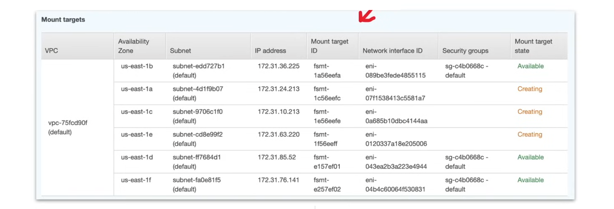

### Amazon EFS Client

`amazon-efs-utils` package is an open-source collection of Amazon EFS tools also known as the Amazon EFS Client. It provides a set of tools to manage EFS volumes and mount targets.

- EFS client enables the ability to use Amazon CloudWatch to monitor an EFS file system's mount status.
- Amazon EFS client needs to be installed on the EC2 instance prior to mounting an EFS file system.

It includes the Amazon EFS mount helper, which makes it easier to mount EFS file systems. Mount helper is a program used when mounting a specific type of file system. EFS mount helper provides the following options:

- Mounting on supported EC2 instances
- Mounting with IAM authorization
- Mounting with Amazon EFS access points
- Mounting with an on-premise Linux client
- Auto-mounting EFS file systems when EC2 instances start
- Mounting file system when creating an new EC2 instance
- Mounting either Linux or MacOS

Amazon EFS does not support mounting from Amazon EC2 Windows instances. Before EFS mount helper, standard Linux NFS client was used to mount EFS file systems. 

- Mount helper defines a new network file system type called `efs`, which is fully compatible with the standard `mount` command in Linux. 
- Mount helper also supports automating mounting an EFS file system at boot using the `/etc/fstab` configuration file.
- The `_netdev` option is used to identify network file systems when mounting file systems automatically, and if omitted, EC2 instance might stop responding.

EFS can be mounted with the following:

- File System DNS name
- File System ID
- Mount target IP address

```bash
sudo mount -t efs -o tls fs-example.efs.us-west-2.amazonaws.com:/ /mnt/efs

sudo mount -t efs -o tls fs-0123456789abcdef0:/ /mnt/efs

sudo mount -t efs -o tls,accesspoint=fsap-0123456789abcdef0 203.0.113.28:/ /mnt/efs
```

EFS Management Console will provide the mount command to mount the EFS file system via the Attach button.

EFS mount helper will use the following mount options:

- `nfsvers=4.1`: Used when mounting on EC2 Linux instances.
- `nfsvers=4.0`: Used when mounting on supported EC2 Mac instances running macOS Big Sur, Monterey, and Ventura.
- `rsize=1048576`: Sets the maximum number of bytes of data that the NFS client can receive for each network READ request to 1048576, the largest available, to avoid diminished performance.
- `wsize=1048576`: Sets the maximum number of bytes of data that the NFS client can send for each network WRITE request to 1048576, the largest available, to avoid diminished performance.
- `hard`: Sets the recovery behavior of the NFS client after an NFS request times out, so that NFS requests are retried indefinitely until the server replies, to ensure data integrity.
- `timeo=600`: Sets the timeout value that the NFS client uses to wait for a response from the server before it retries an NFS request, to 600 deciseconds(60secs), to avoid diminished performance.
- `retrans=2`: Sets to 2 the number of times that the NFS client retries an NFS request before it attempts other recovery methods.
- `noresvport`: Tells the NFS client to use a non-privileged TCP source port when a network connection is reestablished. Using the `noresvport` option helps to ensure that a file system has uninterrupted availability after a reconnection or network recovery event.
- `mountport=2049`: Only used when mounting on EC2 Mac instances running macOS Big Sur, Monterey, and Ventura.

## Amazon FSx

**Amazon FSx** allows users to deploy scale feature-rich, high performance file systems in the cloud. FSx supports a variety of file system protocols.

1. **Amazon FSX for NetApp ONTAP**
   - Proprietary enterprise storage platform known for handling petabytes of data.
2. **Amazon FSX for OpenZFS**
   - Open-source storage platform originally developed by Sun Microsystems.
3. **Amazon FSX for Windows File Server (WFS)**
   - File storage on a Windows server supporting native Windows features for Windows developers.
4. **Amazon FSX for Lustre**
   - Open-source file system for parallel computing

### Amazon FSx for Windows File Server (WFS)

**Amazon FSx for Windows File Server(WFS)** is a fully managed shared storage solutions built on Windows Server. Amazon FSx for WFS offers the following:

- Native support for Windows File systems eg. SMB
- Native Windows compatibility
- Enterprise performance and features
- Consistent sub-millisecond latency
- Tools for Windows developers and admins today continue to work unchanged
- Storage backed by SSD, HDD, or both
- Integration with Microsoft Active Directory

**Amazon FSx for WFS** can be used for:

- Business Applications
- Home directories
- Web serving
- Content management
- Data analytics
- Software build setups
- Media Processing Workloads

To run Amazon FSx it requires:

- An EC2 instance
- Workspace Instance
- AppStream 2.0
or
- VMWare Cloud on AWS

### Amazon File Cache

**Amazon File Cache** is a high-speed cache for datasets stored anywhere, accelerate cloud bursting workloads. Amazon File Cache is found under the **Amazon FSx Management Console**. 

It serves as a temporary, high-performance storage location for data stored in: 

- On-premise file systems
- AWS file systems
- Amazon S3 buckets

Makes dispersed datasets available to file-based applications on AWS with a unified view, and at high-speeds-sub-millisecond latency and high throughput. Amazon File Cache is accessible to EC2, ECS, and EKS.

It is compatible with the most popular Linux-based AMIs:

- Amazon Linux (AL2,AL2023)
- RHEL
- CentOS
- Rocky Linux
- Ubuntu

It integrates with AWS Batch via EC2 launch templates and also AWS Thinkbox Deadline; for creative studios used to scale rendering workloads

## AWS Backup

**AWS Backup** allows you to centrally manage backups across AWS Services. 

- **Backup Plan**: A backup policy defines the backup schedule, backup window and backup lifecycle
- **Backup Vault**: Backups are stored in a backup vault
  - AWS Backup Vault Lock allows for Write-Once-Read-Many (WORM) to set a retention period
  - **Standard Vault(default)**: backups are always initially stored in the standard vault
  - **Air-Gapped Vault**: backups can be moved to a logically air-gapped vault for additional security
- AWS resources can be assigned a backup plan using AWS resource tags
- Resources on a plan can be backed up to other AWS Regions or AWS accounts
- Backup Plans can be managed centrally from a centralized account across entire AWS Organization
- Backups are incremental, only the differences are stored instead of the full backups, saving on costs
- AWS Backups can use independent KMS encryption keys from those of AWS resources
- Associated charges for AWS Backups appear as 'Backup' under Cost Explorer
- AWS Backups are immutable to prevent them from being tempered with

**AWS Backup Audit Manager** is built-in reporting and auditing for AWS Backups.

## AWS Snow Family

AWS Snow Family are storage and compute devices used to physically move data in or out of the cloud, when moving data over the internet or a private connection is too slow, difficult, or costly.

### Snowcone

**AWS Snowcone** is a small, portable, rugged, and secure device for edge computing and data transfer. Snowcone can send data to AWS in two ways:

- Physically shipping the device back to AWS.
- AWS Datasync which runs on the device's compute.

Snowcone is available in two configurations:

- **Snowcone**: 8 TB HDD
- **Snowcone SSD**: 14 TB SSD

- The devices can run edge computing workloads that use EC2 instances
- They are small and lightweight enough to carry in a backpack
- With lighweight workloads at 25% CPU usage, the device can run on battery for up to approximately 6 hours 
- Uses the Wi-fi interface to gather sensor data (only in North America regions)
- Offers an interface with Network File System (NFS) support for Windows, Linux, and macOS
- Multiple layers of security encryption capabilities
- Can be used in space-constrained environments where Snowball Edge devices don't fit
- Can collect IoT data using AWS IoT Greengrass

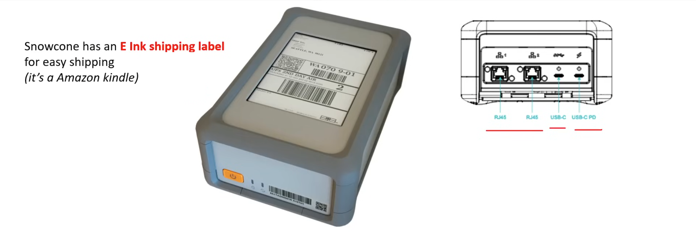

For ports:

- 2 RJ45 Jacks
  - 10/100 GB
- USB-C 
- USB-C Power Delivery 
  - USB-C connection using a suitable power adapter that can supply at least 45 W.

### Snowball Edge

**Snowball Edge** is similar to Snowcone but with more local processing, edge computing workloads, and device configuration options. 

#### Snowball Edge features

Generally comes in two types:

- **Snowball Edge Storage Optimized**: 80 TB of HDD storage
- **Snowball Edge Compute Optimized**: 42 TB of SSD storage

- LCD display of shipping information and other functionalities
- Can be used in clusters groups of 3 - 16 nodes
- Supports data transfer protocols:
  - NFSv3, NFSv4, NFSv4.1
  - Amazon S3 over HTTP or HTTPS

There are 5 device configuration options:
1. **Storage-Optimized(for data transfer)**: 100TB(80TB Usable)
2. **Storage-Optimized 210TB**: 210TB of usable storage
3. **Storage-Optimized with EC2-Compatible Compute**: Up to 80TB usable storage, 40 vCPUS, and 80GB of memory
4. **Compute-Optimized**: Up to 104 vCPUs, 416GB of memory, and 28TB of dedicated NVMe SSD storage.
5. **Compute-Optimized with GPU**: Has the addition of GPUs equivalent to the one available in the Instance Type P3. 


### Snowmobile 

**Snowmobile** is a 45-foot-long ruggedized shipping container, pulled by a semi-truck, that can transfer petabytes of data to AWS. It can transfer up to 100PB per snowmobil. AWS personnel will help you connect your network to the Snowmobile, and when data transfer is complete, they'll drive it back to AWS to import into S3 or Glacier.

#### Security Features

1. GPS Tracking
2. Alarm Monitoring
3. 24/7 Video Surveillance
4. Escort Security Vehicle while in transit

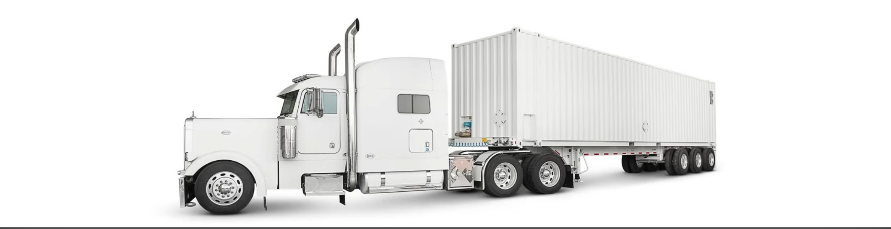

### AWS Snow Family Comparison

| Feature                  | Snowcone                  | Snowball Edge             | Snowmobile               |
| ------------------------ | ------------------------- | ------------------------- | ------------------------ |
| Usable HDD Storage       | 8TB                       | 80TB                      | No                       |
| Usable SSD Storage       | 14TB                      | 1TB, 210TB NVMe, 28TB     | No                       |
| Usable vCPUs             | 2 vCPUs                   | 40 vCPUs, 104 vCPUs       | N/A                      |
| Usable Memory            | 4GB                       | 40 vCPUs, 256GB           | N/A                      |
| Transfer Rate            | 100Mbps                   | 100Mbps                   | 100Mbps                  |
| Device Size              | 227mm x 148.6mm x 82.65mm | 548mm x 320mm x 501mm     | 45 ft. shipping container|
| Device Weight            | 4.5 lbs. (2.1Kg)          | 49.7 lbs. (22.3Kg)        | N/A                      |
| Storage Clustering       | No                        | No, 3/16 nodes for compute| N/A                      |
| 256-bit Encryption       | Yes                       | Yes                       | Yes                      |
| HIPPA Compliant          | No                        | Yes, Eligible             | Yes, Eligible            |

### AWS Transfer for SFTP

**AWS Transfer family** offers fully managed support for the transfer of files over SFTP, AS2, FTPS, and FTP to and from Amazon S3 or Amazon EFS. It eliminates the need for you to manage file transfer servers, patching, or scaling. It is a fully managed service that is available 24x7 with high availability and automatic scaling. It supports the following protocols:

- **FTP(File Transfer Protocol)**: An early network protocol without encryption, used for transfering files over a network.
- **SFTP(Secure File Transfer Protocol)**: Uses SSH to provide a secure encryption connection for transferring files.
- **FTPS(FTP Secure or FTP-SSL)**: Extends FTP with support for SSL/TLS encryption.
- **AS2(Applicability Statement 2)**: Enables secure and reliable messaging over HTTP/S, often used for EDI (Electronic Data Interchange) transactions. Used in industries like e-commerce and retail that require proof of compliant data transfers.

Common ports for these protocols:

- FTP: port 20 (control commands) and port 21 (data transfer)
- SFTP: port 22
- FTPS: port 990
- AS2: port 443

### Transfer Family Managed File Transfer Workflows

**Transfer Family Managed File Transfer Workflows (MFTW)** is a fully managed, serverless File Transfer Workflow service to set up, run, automate, and monitor processing of files uploaded using AWS Transfer Family.

Workflows allow you to perform the following after a file is uploaded:

- **Copy File** - Copy to another S3 destination
- **Tag File** - Apply metadata tagging for S3
- **Delete File** - Delete File from S3 or EFS
- **Custom File-processing step** - Pass file to a lambda to be processed
- **Decrypt File** - Automatically decrypt file using PGP after uploaded to S3 or EFS

### AWS Migration Hub

**AWS Migration Hub** is a singel place to discover your existing servers, applications, and databases, and plan migrations and track their status during migration to AWS. AWS Migration Hub can monitor migration statuses from migration services:

- Application Migration Service (AMS)
- Database Migration Service (DMS)

1. **AWS Discovery Agent**: An agent installed on your VM of servers to help discover and migrate servers
2. **Migration Evaluator Collector**: You submit a request to AWS help assess a migration

#### AWS Migration Hub Refactor

Bridges networking across AWS accounts so that legacy and new services can communicate while they maintain the independence of separate accounts.

#### AWS Migration Hub Journey

Guided templates for end-to-end migration.

### AWS DataSync

**AWS DataSync** is a data transfer service that simpliefies data migration to, from, and between Cloud Storage services. **AWS DataSync** works with the following protocols:

- Network File System (NFS)
- Server Message Block (SMB)
- Hadoop Distributed File System (HDFS)
- Object Storage

**AWS DataSync** works with the following AWS services:

- Amazon S3
- Amazon EFS
- FSx for Windows File Server, Lustre, OpenZFS, NetApp ONTAP
- Amazon Snowcone
- Amazon S3 Compatible Snowball Edge

**AWS DataSync** supports the following cloud storage services:

- Google Cloud Storage
- Microsoft Azure Blob Storage
- Microsoft Azure Files
- Wasabi Cloud Storage
- DigitalOcean Spaces
- Oracle Cloud Infrastructure Object Storage
- CloudFlare R2 Storage
- Backblaze B2 Cloud Storage
- NEVER Cloud Object Storage
- Alibaba Cloud Object Storage Service
- IBM Cloud Object Storage
- Seagate Lyve Cloud 

