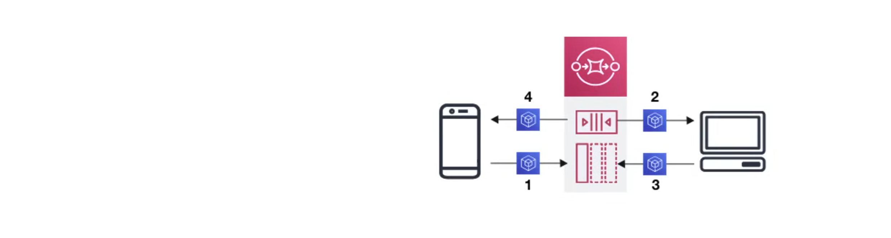

## Amazon Simple Queueing Service (SQS)

**Simple Queueing Service (SQS)** is a fully managed message queuing service that enables you to decouple and scale microservices, distributed systems, and serverless applications.



**Use Case**

When a user needs to queue up transaction emails to be sent. e.g. Sign-up, Password Reset, Order Confirmation.

#### SQS Queue Types

1. **Standard Queue**: Allows users to process a nearly unlimited number of messages, but messages are not in order.
2. **FIFO Queue**: Allows users to process a certain number of messages, but messages are in order and there are no duplicates.

#### SQS Message Size

SQS Messages can be between 1KB and 256KB. For large messages, a Library is required.

#### Message Retention

This is how long SQS will hold onto a message in the queue before dropping (deleting) it. By default, messages in the queue are held for 4 days. Message retention can be adjusted from a minimum of 60 seconds to a maximum of 14 days.

#### Queue Encryption

SQS queues can be encrypted using Amazon Managed Server-Side Encryption or KMS. This ensures that messages in the queue are encrypted at rest and in transit.

#### Use Case

1. App publishes messages to the queue
2. Another app pulls the queue and finds the message in the queue and does something with it
3. Another app reports that they completed their task and marks the message for completion
4. Original app pulls the queue and finds that the message is no longer in the queue

In this scenario, both apps are using the AWS SDK to interact with the SQS queue for push and pull operations.

### Sending Large Messages

To send large messages to SQS, these libraries can be used:

- Amazon SQS Extended Client Library for Java/Python.
  - https://github.com/awslas/amazon-sqs-python-extended-client-lib


These libraries are useful for messages that are larger than the current maximum of 256KB, with a maximum of 2GB. Both libraries save the actual payload to an S3 bucket, and publish the reference of the stored S3 object to the SNS topic. 

#### Python Example

```python
import boto3
import sns_extended_client

sns = boto3.client('sns')
sns.large_payload_support = 'bucket_name'

# boto SNS topic resource
resource = boto3.resource('sns')
topic = resource.Topic('topic-arn')
platform_endpoint = resource.PlatformEndpoint('endpoint-arn')
platform_endpoint.large_payload_support = 'my_bucket_name'

# To keep it enabled at all times
platform_endpoint.always_through_s3 = True

# Publish the Large Message
sns.publish(
    Message="message",
    MessageAttribute = {
        "S3Key": {
            "DataType": "String",
            "StringValue": "--S3--Key--",
        }
    },
)
```

### SQS Standard Queue

**AWS SQS Standard Queue** allows users to process a nearly-unlimited number of transactions per second (tps). It guarantees at-least-once delivery, but does not guarantee the order of messages.


- **AWS SQS Standard Queues** guarantee that a message will be delivered at least once.
- More than one copy of a message could be delivered out of order. Senders need to ensure that consumers can process messages that arrive more than once and out of order.
- Provides best-effort ordering that helps ensure that messages are delivered in the order they are sent.

#### Example

Sending a message to the SQS Queue using the AWS SDK in ruby:

```ruby
require 'aws-sdk-sqs'

# Create an SQS client
sqs_client = Aws::SQS::Client.new(region: 'us-east-1')
queue_url = 'https://sqs.us-est-1.amazonaws.com/123456789012/my-queue'
message_body = 'Hello, world!'

# Send a message to the queue
begin
  sqs_client.send_message(queue_url: queue_url, message_body: message_body)
  puts "Message sent successfully."
rescue Aws::SQS::Errors::ServiceError => e
  puts "Error sending message: #{e}"
end
```

Sending a batch of messages to the SQS queue using the AWS SDK in ruby:

```ruby
require 'aws-sdk-sqs'

# Create an SQS client
sqs_client = Aws::SQS::Client.new(region: 'us-east-1')
queue_url = 'https://sqs.us-est-1.amazonaws.com/123456789012/my-queue'

messages = [
    {id: 'message1', message_body: 'First Message'},
    {id: 'message2', message_body: 'Second Message'},
    {id: 'message3', message_body: 'Third Message'},
    {id: 'message4', message_body: 'Fourth Message'}
]

# Send a batch of messages to the queue
begin
  sqs_client.send_message_batch(
    queue_url: queue_url,
    entries: messages.map { |msg| {id: msg[:id], message_body: msg[:message_body]}}
  )
  puts "Messages sent successfully."
rescue Aws::SQS::Errors::ServiceError => e
  puts "Error sending messages: #{e}"
end
```
### SQS FIFO Queue

**AWS SQS FIFO Queue** allows users to process a certain number of transactions per second (tps). It guarantees that the messages are received in the order that they were sent and that there are no duplicates.


- FIFO queues are limited to 300 transactions per second (tps).
- Messages have a unique duplication ID to ensure there are no duplicate messages in the queue.
- FIFO queues ensure Exactly-Once processing.
- Messages are ordered based on Message Group IDs.
- To endure that order is preserved, each producer must have their own unique Message Group ID.
- To request (poll) messages, consumers have to specify a Message Group ID.
- FIFO queues support reading upto 10 messages at a time.
- SQS FIFO manages data in partitions across multiple AZs, all managed by AWS.
- With batching, each partition supports up to 3000 messages per second (tps), or up to 300 messages per second for send, receive, and delete operations.
- An existing Standard Queue cannot be converted to a FIFO Queue.

#### Example

When sending a message to a FIFO queue, the `message_group_id` and `Message_duplication_id` parameters must be specified:

```ruby
require 'aws-sdk-sqs'

# Create an SQS client
sqs_client = Aws::SQS::Client.new(region: 'us-east-1')
queue_url = 'https://sqs.us-est-1.amazonaws.com/123456789012/my-queue'
message_body = 'Hello, FIFO World!'
message_group_id = 'myMessageGroup1'
message_deduplication_id = 'myMessageDeduplicationId1'

# Send a message to the queue
begin
  sqs_client.send_message(
    queue_url: queue_url, 
    message_body: message_body, 
    message_group_id: message_group_id, 
    message_deduplication_id: message_deduplication_id
  )
  puts "Message sent to FIFO queue successfully."
rescue Aws::SQS::Errors::ServiceError => e
  puts "Error sending message to FIFO queue: #{e}"
end
```

#### FIFO High Throughput

**High Throughput** allows FIFO queues to process up to 3000 messages per second (tps) with batching(10x greater than SQS FIFO without high throughput). It can be enabled by setting `FifoThroughputLimit=perMessageGroupId`.

```bash
aws sqs set-queue-attributes \
    --queue-url "https://sqs.us-east-1.amazonaws.com/123456789012/my-queue.fifo" \
    --attributes \
    FifoQueue=true, \
    ContentBasedDeduplication=true, \
    DeduplicationScope="messageGroup", \
    FifoThroughputLimit="perMessageGroupId"
```
### SQS Attribute-based Access Control (ABAC)

**Attribute-based Access Control (ABAC)** is a method of controlling access to resources based on attributes of the user, and AWS resources. It defines permissions based on the tags that are attached to the user, and AWS resources. 

SQS supports ABAC by allowing users to control access to Amazon SQS Queues based on the tags and aliases that are associated with an Amazon SQS Queue. 

#### Example

Example of denying production resources(tagged with prod) from sending, receiving or deleting messages to a queue:

```json
{
  "Version": "2012-10-17",
  "Statement": [
    {
      "Sid": "DenyAccessForProd",
      "Effect": "Deny",
      "Action": "sqs:*",
      "Resource": "*",
      "Condition": {
        "StringEquals": {
          "aws:ResourceTag/environment": "prod"
        }
      }
    }
  ]
}
```

Possible condition tags:

- `aws:ResourceTag`
- `aws:RequestTag`
- `aws:TagKeys`

### SQS Access Policy

**Access Policy** allows users to grant other principals permission to send, receive, or delete messages to an SQS queue. It is attached to the queue and specifies the permissions that are granted to other principals.

Common actions:

- SendMessage
- ReceiveMessage
- DeleteMessage

#### Example

An example of letting an SNS topic send, receive, and delete messages to an SQS queue:

```json
{
  "Version": "2012-10-17",
  "Statement": [
    {
      "Sid": "AllowCrossAccountAccess",
      "Effect": "Allow",
      "Principal": {
        "Service": "sns.amazonaws.com"
      },
      "Action": [
        "sqs:SendMessage",
        "sqs:ReceiveMessage",
        "sqs:DeleteMessage"
      ],
      "Resource": "arn:aws:sqs:region:account-id:queue-name"
      "Condition": {
        "ArnEquals": {
          "aws:SourceArn": "arn:aws:sns:region:account-id:topic-name"
        }
      }
    }
  ]
}
```

### SQS Message Metadata

**Message Metadata** is a set of key-value pairs that are attached to a message. It is used to store information about the message, such as the message type, message priority, and message timestamp. Message metadata allows users to attach metadata to SQS messages.

Possible logical data types:

- String 
- Number
- Binary
- Custom
  - Append a `custom-type` label to any data eg.
    - Number.byte, Number.short, Number.long, Number.float, Number.double, Number.
    - Binary.gif, Binary.jpg, Binary.png, Binary.pdf, Binary.zip

#### Example

Sending a message with metadata:

```bash
aws sqs send-message \
    --queue-url "https://sqs.region.amazonaws.com/123456789012/my-queue" \
    --message-body "Your Message Text" \
    --message-attributes file://message-attributes.json
```

Where `message-attributes.json` is:

```json
{
  "OrderID": {
    "DataType": "String",
    "StringValue": "1234567890"
  },
  "CustomerEmail": {
    "DataType": "String",
    "StringValue": "customer@example.com"
  },
  "PurchaseDate": {
    "DataType": "String",
    "StringValue": "2022-01-01"
  },
  "IsPriority": {
    "DataType": "String",
    "StringValue": "true"
  },
  "OrderTotal": {
    "DataType": "Number",
    "NumberValue": 100.00
  },
  "OrderItems": {
    "DataType": "Binary",
    "BinaryValue": "TmV3IFJlYWwgT2ZmbGluZyBmb3IgY29udGVudC4gVGhpcyBpcyBhIHRlc3QgZm9yIHRoaXMgc2VhcmNoIG1lc3NhZ2Uu"
  }
}
```