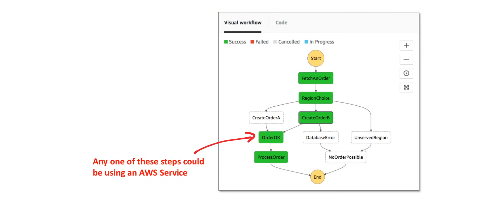
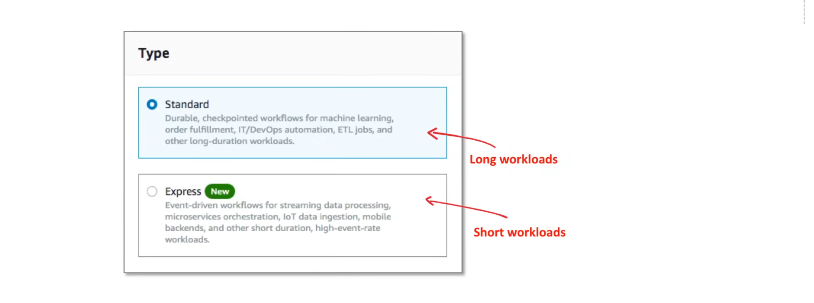
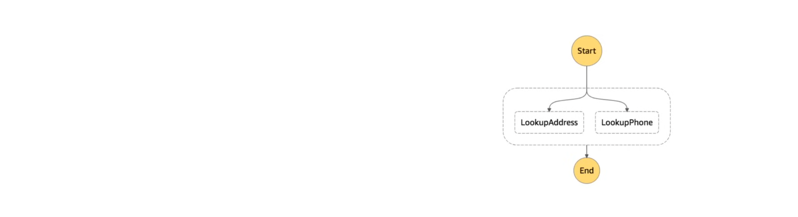
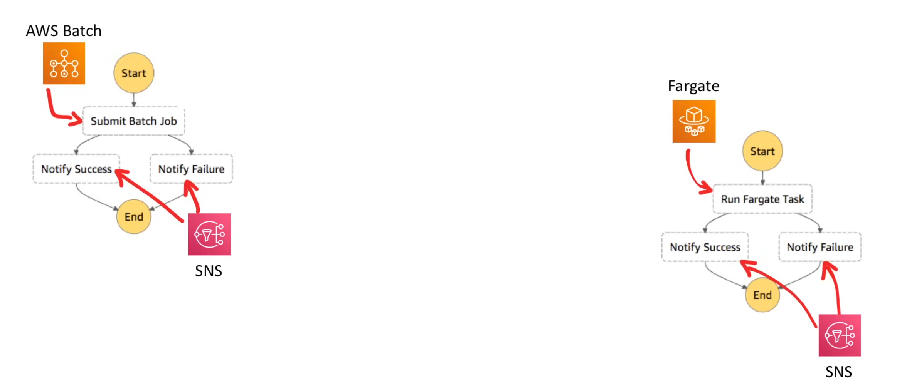
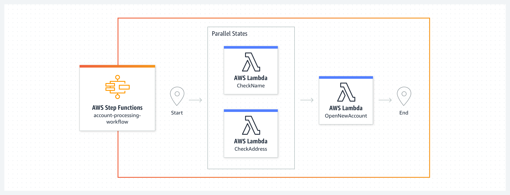
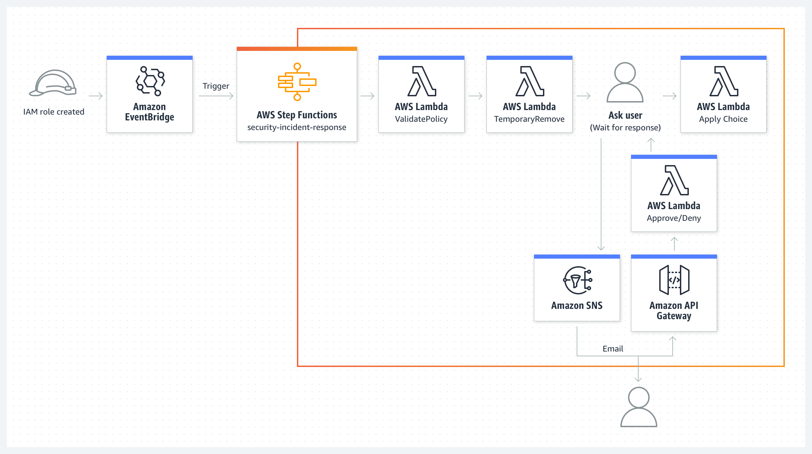
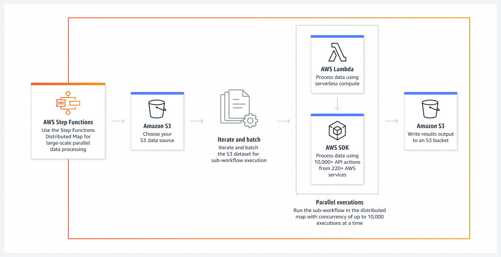
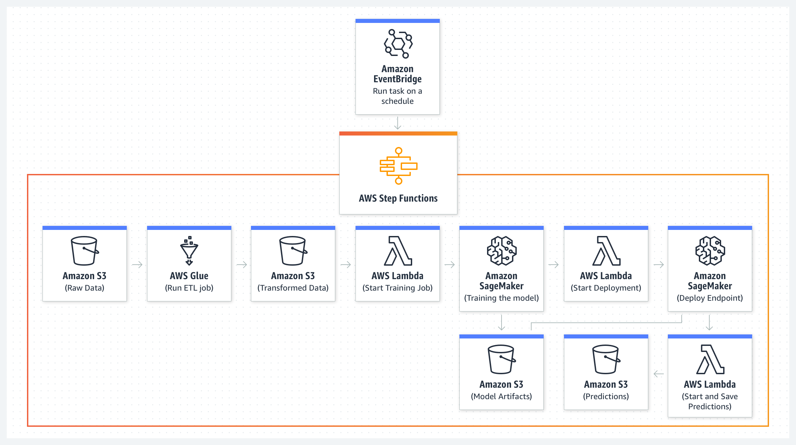
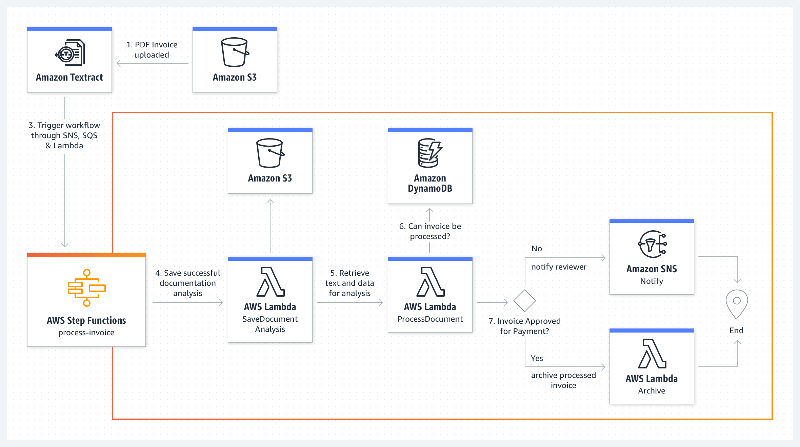

## AWS Step Functions

A State Machine is an abstract model which decides how one state moves to another based on a series of events. It's like a flow chart.

**Step Functions** is a serverless, low-code visual workflow orchestration service that allows developers to orchestrate multiple AWS services into serverless workflows(state machines) to build and update applications quickly.

- Allows users to coordinate multiple AWS services into serverless workflows.
- Offers a graphical console to visualize the components of the step functions as a series of steps.
- Automatically triggers and keeps track of each step, and retries where there are errors, so that applications execute in order as expected, every time.
- Logs the state of each step, so that debugging and diagnosing of problems become easy.



AWS Step Functions has two types of state machines:

1. **Standard** - General Purpose
2. **Express** - For streaming data



Steps can be executed in parallel:



States are configured using Amazon States Language (JSON):

```json
"States": {
    "Submit Batch Job": {
        "Type": "Task",
        "Resource": "arn:aws:states:::batch:submitJob.sync",
        "Parameters": {
            "JobName": "BatchNotification",
            "JobQueue": "arn:aws:batch:us-east-1:123456789012:job-queue/BatchNotification",
            "JobDefinition": "arn:aws:batch:us-east-1:123456789012:job-definition/BatchNotification:1"
        },
        "Next": "Notify Success",
        "Catch": [
            {
                "ErrorEquals": ["States.ALL"],
                "Next": "Notify Failure"
            }
        ]
    }
},
...
```

### Use Cases

1. **Managed a Batch Job or Fargate Container**
   - Submit a batch job to AWS Batch, if job fails or succeeds, notify via SNS.
   - Run a Fargate Task, if task fails or succeeds, notify via SNS.

   

2. **Micro-service Orchestration**
   - Combine Lambda functions to build a web-based application
      - In this example of a simple banking system, a new bank account is created after validating a customer’s name and address. The workflow begins with two Lambda functions CheckName and CheckAddress executing in parallel as task states. Once both are complete, the workflow executes the ApproveApplication Lambda function. You can define retry and catch clauses to handle errors from task states. You can use predefined system errors or handle custom errors thrown by these Lambda functions in your workflow. Since your workflow code takes on error handling, the Lambda functions can focus on the business logic and have less code. Express workflows would be a better fit for this example as the Lambda functions are performing tasks that together take less than five minutes, with no external dependencies. 

   

3. **Security and IT Automation**
   - Orchestrate a security incident response for IAM policy creation
     - You can use AWS Step Functions to create an automated security incident response workflow that includes a manual approval step. In this example, a Step Functions workflow is triggered when an IAM policy is created. The workflow compares the policy action against a customizable list of restricted actions. The workflow rolls back the policy temporarily, then notifies an administrator and waits for them to approve or deny. You can extend this workflow to remediate automatically such as applying alternative actions, or restricting actions to specific ARNs. 

   

4. **Data Processing and ETL Orchestration**
   - Large scale data processing
     - In this example, the Step Functions workflow uses a Map state in Distributed mode to process a list of S3 objects in an S3 bucket. Step Functions iterates over the list of objects and then launches thousands of parallel workflows, running concurrently, to process the items. You can use compute services, such as Lambda, helping you write code in any language supported. You can also choose from over 220 purpose-built AWS services to include in the Map state workflow. Once executions of child workflows are complete, Step Functions can export the results to an S3 bucket making it available for review or for further processing.

   

5. **Machine Learning Operations**
   - Run an ETL job and build, train and deploy a machine learning model
      - In this example, a Step Functions workflow runs on a schedule triggered by EventBridge to execute once a day. The workflow starts by checking whether new data is available in S3. Next, it performs an ETL job to transform the data. After that, it trains and deploys a machine learning model on this data with the use of Lambda functions that trigger a SageMaker job and wait for completion before the workflow moves to the next step. Finally, the workflow triggers a Lambda function to generate predictions that are saved to S3.

   

6. **Media Processing**
   - Extract data from PDF or images for processing
     - In this example, you will learn how to combine AWS Step Functions,AWS Lambda and Amazon Textract to scan a PDF invoice to extract its text and data to process a payment. Amazon Textract analyses the text and data from the invoice and triggers a Step Functions workflow through SNS, SQS and Lambda for each successful job completion. The workflow begins with a Lambda function saving the results of a successful invoice analysis to S3. This triggers another Lambda function that processes the analyzed document to see if a payment can be processed for this invoice, and updates the information in DynamoDB. If the invoice can be processed, the workflow checks if invoice is approved for payment. If its not, it notifies a reviewer through SNS to manually approve the invoice. If its approved, a Lambda function archives the processed invoice and ends the workflow.

   

### Step Functions States

#### Pass State

- Passes it's input to it's output, without performing any tasks. (dummy work).
- Useful when constructing and debugging state machines.

Input:

```json
{
    "Type": "Pass",
    "Parameters": {
        "ship": "enterprise"
    },
    "Result": {
        "government": "federation",
    },
    "ResultPath": "$.politics",
    "Next": "End"
}
```
- **Parameters** - Key value pair that will be passed as input.
- **Result** - A virtual task to be passed to the next state.
- **ResultPath** - Where to place the output of the virtual task.

Output:

```json
{
    "ship": "enterprise",
    "politics": {
        "government": "federation"
    }
}
```

#### Task State

Represents a single unit of work performed by a state machine. A task performs work by:

1. Using an AWS Lambda Function
2. Passing Parameters to API actions of other services
3. Using an activity

**Task Lambda Function**

You provide the Lambda ARN as the resource:

```json
"LambdaState": {
    "Type": "Task",
    "Resource": "arn:aws:lambda:us-east-1:123456789012:function:MyFunction",
    "Next": "NextState"
}
```

**A Supported AWS Service**

Support Services:

- Lambda
- AWS Watch
- DynamoDB
- ECS/Farget
- SNS
- SQS
- SageMaker
- EMR
- StepFunctions

You pass the ARN of the service as the source. Parameters vary per service:

```json
{
    "StartAt": "BATCH_JOB",
    "States": {
        "BATCH_JOB": {
            "Type": "Task",
            "Resource": "arn:aws:states:::batch:submitJob.sync",
            "Parameters": {
                "JobName": "PerprocessingBatchJob",
                "JobQueue": "SecondaryQueue",
                "JobDefinition": "Preprocessing",
                "Parameters.$": "$.batchjob.parameters",
                "RetryStrategy": {
                    "attempts": 5
                }
            },
            "End": true
        }
    }
}
```

#### Task Activities

Activities enable orchestration of external, long-running tasks by allowing decoupled workers (e.g., on EC2, ECS, on-premise, or mobile) to poll for tasks, perform work, and return results using tokens. They support long-running processes, human-in-the-loop approvals, and provide task heartbeats for monitoring.

When Step Functions reaches an activity task state, the workflow waits for an activity worker to poll for a task.

```ruby
activity = StepFunctions::Activity.new(
    {
        credentials: credentials,
        region: region,
        activity_arn: activity_arn,
        workers_count: 1,
        pollers_count: 1,
        heartbeat_delay: 30
    }
)
activity.start do | input |
  # do something
  { result: : SUCCESS, echo: input['value']}
end
```


#### Choice State

Adds conditional logic (if/else) to a state machine, allowing the workflow to branch to different "Next" states based on the input data. It evaluates one or more conditions against the current state's input and routes execution to the first matching branch.

```json
"AlienChooser": {
    "Type": "Choice",
    "Choices": [
        {
            "Not": {
                "Variable": "$.skin",
                "StringEquals": "Pink",
                "Next": "Andosiana"
            },
            {
                "Variable": "$.hearts",
                "NumericEquals": 2,
                "Next": "Kligons"
            },
            {
                "And": [
                    {
                        "Variable": "$.legs",
                        "NumericGreaterThanEquals": 2,
                    },
                    {
                        "Variable": "$.mouths",
                        "NumericLessThan": 1
                    }
                ],
                "Next": "Tholians"
            }
        }
    ],
    "Default": "Vulcans"
}
```

#### Wait State

**Wait State** is a mechanism for pausing a workflow's execution for a specified duration or until a specific time or event before proceeding to the next step.

##### Examples

Wait for 10 seconds:

```json
"wait_ten_seconds": {
    "Type": "Wait",
    "Seconds": 10,
    "Next": "NextState"
}
```

Wait until:

```json
"wait_until": {
    "Type": "Wait",
    "Timestamp": "2026-03-24T14:30:00Z", 
    "Next": "NextState"
}
```
#### Succeed State

It is a terminal state that stops the execution of a state machine and marks it as a success. It is one of the basic state types in the Amazon States Language used for defining workflows.

```json
"SuccessState": {
    "Type": "Succeed"
}
```

#### Fail State

It is a terminal state that stops the execution of the state machine and marks it as a failure. It is primarily used to handle errors that cannot be recovered from or to explicitly terminate a workflow when specific business conditions aren't met.

```json
"FailState": {
    "Type": "Fail",
    "Error": "Wapcore",
    "Cause": "Overloading"
}
```

Because Fail States always exit the state machine, they have no Next Filed, and do not require and End File.

#### Parallel State

It is used to execute multiple fixed branches of a workflow concurrently. It is ideal for running independent tasks at the same time—such as sending a notification while simultaneously writing to a database—to reduce the overall execution time.

