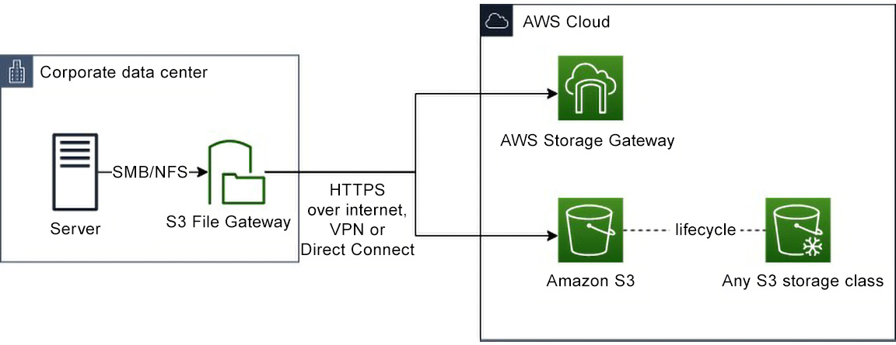
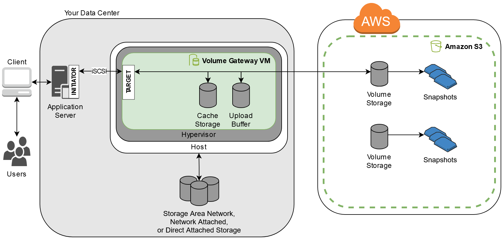

## AWS Storage Gateway 

**AWS Storage Gateway** is a hybrid cloud storage service that connects on-premises environments with AWS cloud storage. It allows you to seamlessly integrate your existing 
on-premises infrastructure with AWS, enabling you to store and retrieve data from the cloud and run applications in a hybrid environment.

1. **File Gateway** allows you to run a gateway within your on-premise environment so you can interact through an SMB or NFS file-system protocol.
   - *Amazon S3 File Gateway* - enables you to store your files in Amazon S3 while providing access to your users by using traditional SMB shares.
   - *Amazon FSx File Gateway* - store data in a Windows File Server, can also offer cost savings when working with Amazon FSx Windows file systems.
2. **Volume Gateway** - Allows you to mount S3 as local drive using the iSCSI protocol.
   - *Cached Volumes* - Primary data stored on S3 and frequently accessed files stored locally.
   - *Stored Volumes(Non-cached)* - Primary data stored locally and entire data backed up to S3.
3. **Tape Gateway** - stores files onto Virtual Library Tapes (VTLs) for backing up files on very cost-effective long term storage.

## Amazon S3 File Gateway

**Amazon S3 File Gateway** allows you to store your files as objects inside S3 buckets. Files are accessed through a Network File System or an SMB mount point. 

This provides a familiar user interface and helps reduce costs by storing your data in Amazon S3 and taking advantage of the various Amazon S3 storage tiers. You can implement 
Storage Gateway with S3 Intelligent Tiering to help you automatically move lifecycle files to the lowest cost storage tiers to lower your costs even further.

You deploy your gateway to an on-premise Virtual Machine that runs on the following hypervisors:

- VMWare ESXi
- Microsoft Hyper-V
- Linux Kernel-based Virtual Machine (KVM)

The gateway can also be deployed to:

- VMWare Cloud on AWS
- Amazon EC2 instances

For File Protocols, you can use:

- Network File System (NFS) Version 3 or 4.1
- Server Message Block (SMB) Version 2 or 3

Amazon S3 File Gateway integrates with:

- IAM, KMS, CloudWatch, CloudTrail, AWS CLI

Files can take full advantage of S3 features such as:

- Bucket Policies
- Versioning
- Lifecycle Management
- Cross-region replication
- Metadata

## Amazon FSx File Gateway

**Amazon FSx File Gateway** is a file storage service that provides on-premises access to fully managed Amazon FSx for Windows File Server file systems. It allows you to store 
and retrieve files in Amazon FSx File Storage(WFS). This allows your Windows developers to easily store datain the cloud using the tools they are already farmiliar with.

- You must have at least one Amazon FSx for Windows File Server File system.
- You must also have on-premise access to FSx for Windows File Server, either through AWS Direct Connect or AWS Site-to-Site VPN.

You deploy your gateway to an on-premise Virtual Machine that runs one of the following hypervisors:

- VMWare ESXi
- Microsoft Hyper-V
- Linux Kernel-based Virtual Machine (KVM)
- or as a hardware appliance ordered from a preferred reseller.

The gateway can also be deployed to:

- VMWare Cloud on AWS
- Amazon EC2 instances

## Volume Gateway

**AWS Storage Gateway** connects an on-premises software appliance with cloud-based storage to provide seamless integration with data security features between your on-premises 
IT environment and the AWS storage infrastructure. You can use the service to store data in the Amazon Web Services Cloud for scalable and cost-effective storage that helps 
maintain data security.

- Data written to volumes can be asynchronously backed up to S3 in the form of snapshots of the volume and stored in the AWS Cloud as EBS snapshots.
- Snapshots are incremental backups that capture only changed blocks in the volume.
- All snapshots storage is also compressed to help minimize the storage charges.

You can deploy Storage Gateway either on-premises as a VM appliance running on:

- VMware ESXi
- KVM
- Microsoft Hyper-V
- or as a hardware appliance ordered from a preferred reseller.

The gateway can also be deployed to:

- VMWare Cloud on AWS
- Amazon EC2 instances

### Stored Volumes

- Stored volumes store primary data locally and asynchronously backup that data to AWS.
- Provide your on-premise applications with low-latency access to their datasets while still providing durable off-site backups.
- Create storage volumes and mount them as iSCSI devices from your on-premise servers.
- Any data written to stored volumes are stored on your on-premise storage hardware.
- Amazon Elastic Block Store(EBS) snapshots are used to backup the data to AWS S3.
- Stored volumes can be between 1 GiB and 16 TiB in size.
- Hosting:
  - Deployed on a VM appliance
  - Deployed as a Hardware Appliance
  - Deployed to an EC2 instance

### Cached Volumes

- 