## AWS Virtual Private Cloud (VPC)

AWS Virtual Private Cloud is a logically isolated virtual network. A VPC resembles a traditional network that you'd operate in your own data center.


A VPC provides many different networking components. A virtual Machine, i.e EC2 is the most common reason that a user would need a VPC in AWS. 

Virtual Network Cards, i.e, Elastic Network Interface(ENI) are used within a VPC to attach to different compute types e.g, EC2, Lambda, ECS.

AWS Virtual Private Cloud is tightly coupled with AWS EC2, and all VPC CLI command are under `aws ec2`, so technically, you can't separate VPC from EC2 even though they are treated as two different things in the console.

### Core Components of AWS VPC

A VPC is composed of many different networking components and here are the main ones:
1. **Internet Gateway (IGW)**: A gateway that connects a VPC to the public internet
2. **Virtual Private Gateway (VPN Gateway)**: A gateway that connects a VPC to a private external network
3. **Route Tables**: A set of rules that determine where to route traffic in a VPC
4. **NAT Gateway**: A gateway that allows private instances (e.g EC2 instances) to connect to services outside of the VPC
5. **Network Access Control Lists (NACLs)**: Acts as a stateless virtual firewall for compute within a VPC. It operates at the subnet level with allow and deny rules.
6. **Security Groups (SG)**: Acts as a stateful virtual firewall for compute instances within a VPC. It operates at the instance level with allow rules.
7. **Public Subnets**: Subnets that allow instances to have public IP addresses.
8. **Private Subnets**: Subnets that disallow instances to have public IP addresses.
9. **VPC Endpoints**: Privately connect to AWS support services.
10. **VPC Peering**: Connecting VPCs to other VPCs.

Technically, NACLs and SGs are EC2 networking components, but as mentioned earlier, you can't really separate VPC from EC2.

### VPC Key Features

- VPCs are region specific. You can use VPC Peering to connect VPCs across regions.
- You can create upto 5 VPCs per region. (adjustable)
- Every region comes with a default VPC.
- You can have upto 200 subnets per VPC.
- You can have upto 5 IPv4 CIDR blocks per VPC.
- You can have upto 5 IPv6 CIDR blocks per VPC.
- Most VPC components don't incur any charges from AWS, e.g
  - VPC itself, Route Tables, NACLs, Internet Gateways, Security Groups, Subnets, and VPC Peering.
- Here's what has additional charges from AWS:
  - VPC Endpoints, VPN Gateway, Customer Gateway
  - IPv4 addresses, Elastic IPs.
- DNS hostnames

### Default VPC

AWS has a default VPC in every region, so you can immediately deploy instances. 

A default VPC is configured with:
- An IPv4 CIDR block at the address 172.31.0.0/16, with 65,536 IP addresses available
- A subnet size of `/20` for each AZ, with 4096 IP addresses available
- An Internet Gateway
- A default Security Group
- A default Network Access Control List(NACL)
- A default DHCP options set
- A route table with a route to the public internet via an Internet Gateway

A defaut VPC can be deleted, but AWS recommends that you do not, and instead use the default VPC.

If you accidentally delete the default VPC, it can be recreated via the CLI, using the following command:

```bash
aws ec2 create-default-vpc --region us-east-1
```
- A deleted VPC cannot be restored.
- You cannot mark an existing non-default VPC as a default VPC and if you already have a default VPC in a region, you canoot create another one.

###  Deleting a VPC

To be able to delete a VPC, you need to ensure that all the VPC resources have been deleted prior to that. e.g
- Security Groups and Network ACLs
- Subnets
- Route Tables
- Gateway Endpoints
- Internet Gateways
- Egress-Only Internet Gateways (EO-IGWs)

When a VPC is deleted in the AWS Console, it will automatically attempt to delete all the VPC resources associated with that VPC.

### Default Route / Catch-all-route

The default route represents all the IP addresses. It gives access from anywhere or to the internet without restriction.

IPv4 default route: `0.0.0.0/0`

IPv6 default route: `::/0`

When `0.0.0.0/0` is specified as the default route in a route table for the Internet Gateway, it allows all internet access. When `0.0.0.0/0` is specified in a Security Group's inbound Rules, it allows all traffic from the internet to access the public resources.

### Shared VPC

AWS Resource Access Manager allows you to share resources across your AWS accounts. VPCs can be shared with other AWS accounts within the same account to centrally manage resources in a single VPC. 

Using a shared VPC allows you to:
- Reduce the number of VPCs you create and manage
- Separate accounts for billing and access control

In order to share a VPC you need to establish sharing within your AWS organization via the RAM api:

```bash
aws ram enable-sharing-with-aws-organization
```
- You share VPCs by sharing subnets.
- You can ony share non-default subnets
- You need to create a resource share in RAM (what you are sharing)
- You need to create a shared principles in RAM (who you are sharing with)

Shared VPC will appear in the shared account with the specific share subnets. You can tell if it's shared by looking at the OwnerID.

### Introduction to NACls (Network Access Control Lists)

NACLs act as a stateless virtual firewall at the subnet level. NACLs have both ALLOW and DENY Rules, unlike Security Groups, which only have ALLOW rules.

A default NACL is created with every new VPC.

Each NACL has two different sets of rules:
- Inbound Rules (Ingress traffic)
- Outbound Rules (Egress traffic)

Subnets are associated with NACLs and a subnet can only belong to a single NACL.

They key difference of NACLs from Security Groups is that NACLs have both ALLOW and DENY rules, while Security Groups only have ALLOW rules. With NACLs, you could block a single IP address, which you can't do with Security Groups.

NACL rules have NACL numbers, which determine the order of evaluation from the lowest to the highest. The highest rule # can be 32766 and it's recommended to work in 10 or 100 increments.

With NACL rules, you can set a type of traffic or set up a custom Protocol and Port range. You can either allow or deny traffic for a specific rule.

#### Creating NACLs

User creates the NACL rule:

```bash
aws ec2 create-network-acl \
  --vpc-id vpc-1234abcd5678efgh 
```

Then adds a NACL entry rule:

```bash
aws ec2 create-network-acl-entry \
  --network-acl-id acl-1a2b3c4d5e6f7h789a \
  --ingress \
  --rule-number 100 \
  --protocol tcp \
  --port-range From=80,To=80 \
  --cidr-block 0.0.0.0/0 --rule-action allow
```

Then associate the NACL to a subnet:

```bash
aws ec2 replace-network-acl-association \
  --association-id aclassoc-1a2b3c4d5e6f7890a \
  --network-acl-id acl-1a2b3c4d5e6f7890ab
```
### Security Groups

Security Groups act as a stateful virtual firewall at the instance level. Security Groups are associated with EC2 instances. 

Each Security Group has two different sets of rules:
- Inbound Rules (ingress traffic)
- Outbound Rules (egress traffic)

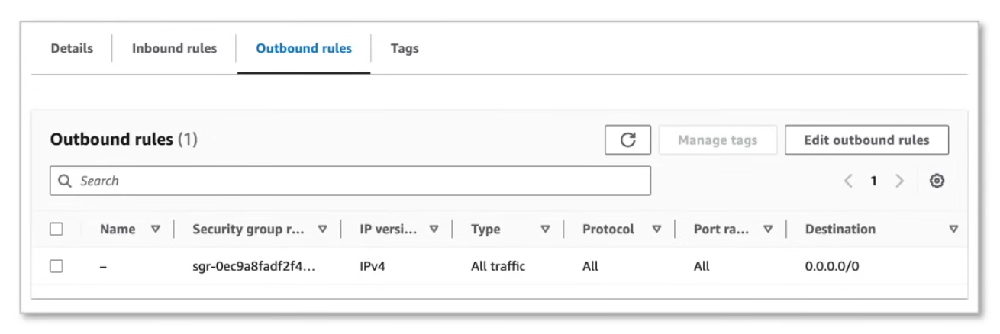

A Security Group can contain multiple instances in different subnets. They are not bound by subnets but they are bound by VPCs. 

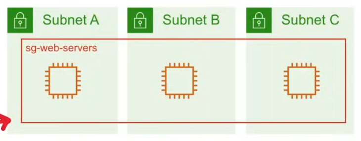

#### Security Group Rules

- With Security Group rules, you can choose a preset traffic type, eg. HTTP/S, Postgres, etc.
- You can choose a custom protocol and port range.
- Then destination type can be a:
  - IPv4 CIDR block
  - IPv6 CIDR block
  - Another Security Group
  - A Managed Prefix list

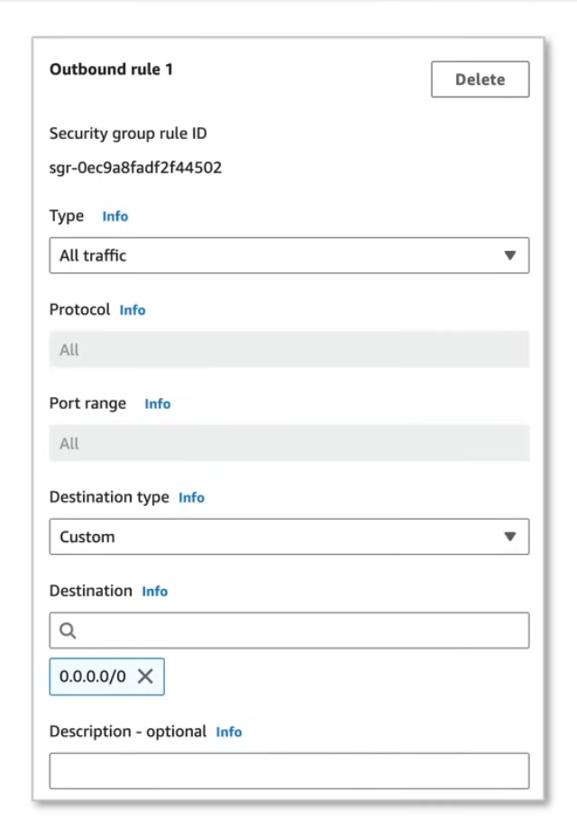

Security Groups have only ALLOW rules, unlike NACLs, which have both ALLOW and DENY rules.

#### Security Groups Use Cases

1. **Allow IP Address**
    - You can specify the source to be an IPv4 or IPv6 range, or a specific IP address.
    - A specific IPv4 address is a `/32` range. 
    - A specific IPv6 address is a `/128` range. 

    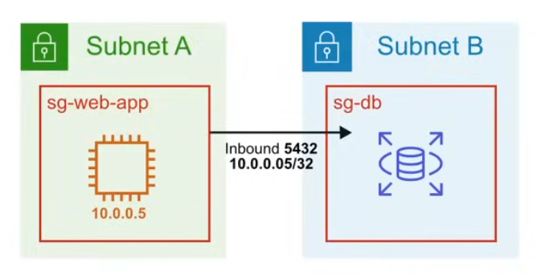

2. **Allow to Another Security Group**
    - You can specify the source to be another Security Group.
    - This is useful when you want to allow traffic from one Security Group to another.

    

3. **Nested Security Groups**
    - An instance can belong to multiple Security Groups, and rules are permissive, instead of restrictive. If you have one security group with no ALLOW rule, and an ALLOW to another security group, it will be ALLOW.

    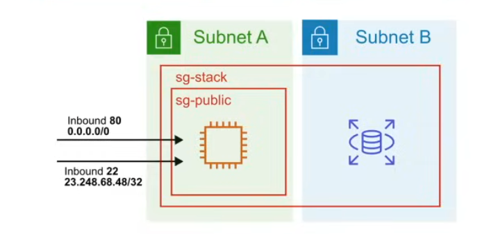

#### Creating Security Groups

1. Create Security Group:
   ```bash
   aws ec2 create-security-group \
     --group-name my-sg \
     --description "My Security Group" \
     --vpc-id vpc-1234abcd5678efgh
   ```

2. Add Security Group Rule:
   ```bash
   aws ec2 authorize-security-group-ingress \
     --group-id sg-1234abcd5678efgh \
     --protocol tcp \
     --port 80 \
     --cidr 0.0.0.0/0
   ```
3. Associate Security Group with Instance:
   ```bash
   aws ec2 modify-instance-attribute \
     --instance-id i-1234abcd5678efgh \
     --groups sg-1234abcd5678efgh
   ```
#### Security Group Limits

- You can have upto 10,000 Security Groups in a region. (default is 2,500)
- You can have upto 60 inbound rules and 60 outbound rules per Security Group. 
- You can have upto 16 Security Groups per Elastic Network Interface (ENI). (default is 5)

Security Groups do not filter traffic destined to and from the following:
- Amazon Domain Name Services (DNS)
- Amazon Dynamic Host Configuration Protocol (DHCP)
- Amazon EC2 instance metadata 
- Amazon ECS task metadata endpoints
- License activation for Windows instances
- Amazon Time Sync Service
- Reserved IP addresses used by default VPC routes

### Stateful vs Stateless

**Stateless Firewalls** like **AWS NACLs** are not aware of the state of the request. They only look at the packet headers and decide whether to allow or deny the packet based on the rules.

In both directions, they treat you like a stranger and stop you both ways and do a rule check, it does not matter if the request had been authenticated on entry or on exit, they will always do a rule check.

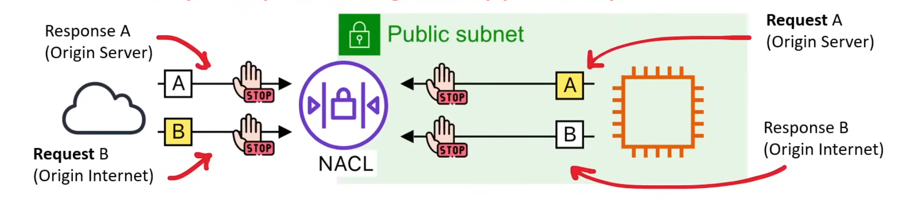

**Stateful Firewalls** like **AWS Security Groups** are aware of the state of the request. They keep track of the state of the connection and decide whether to allow or deny the packet based on the rules.

For Security Groups, they allow all outbound request, and responses for the outbound requests are also allowed back in.

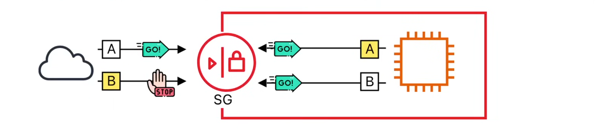

### Route Tables

Route Tables are used to determine where traffic is directed. A route table contains a set of rules, called routes, that are used to determine where traffic is directed. 

Each VPC has a main route table by default. You can create additional route tables and associate them with subnets.

Each subnet in your VPC must explicitly be associated with a route table. If you don't explicitly associate a subnet with a route table, it will be associated with the main route table by default.

A subnet can only be associated with one route table at a time but you can associate multiple subnets with the same route table.

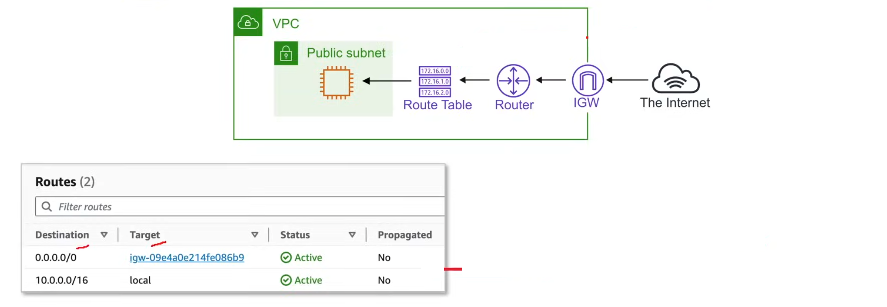

#### Main Route Table

This is a default route table created alongside every VPC which cannot be deleted whatsoever.

A subnet that is not explicitly associated with a route table, will use the main route table by default.

#### Custom Route Tables

You can create custom route tables and associate them with subnets. eg. A custom route table could be used if you need specific subnets to only route out to a VPN and not the IGW.

#### Destination 

This is where the route will go. Here you need to specify an IPv4 or IPv6 CIDR Block on Managed Prefix List:
- `0.0.0.0/0`
- `::/0`
- `pl-1234abcd5678efgh` (com.amazonaws.us-east-1.s3)

### Elastic IPs

Elastic IP addresses in AWS are static IPv4 addresses that can be associated with an EC2 instance. 
- Elastic IP addresses are region specific.
- Elastic IP addresses are drawn from Amazon's pool of IPv4 addresses.
- Elastic IP addresses are charged $1 for each EIP that is allocated and unassociated.
- Elastic IP addresses also include the public IPv4 address charge.
- Elastic IP addresses can be associated or unassociated to:
  - An EC2 instance
  - A primary Network Card eg. ENI

#### Use Cases

- When you restart an EC2 instance, it will get a new public IP address. If you want to keep the same public IP address, you can use an Elastic IP address.
- When an EC2 instance fails, you might want to use the same IP address on a fail-over instance. An elastic IP allows you to remap that static IP address.

In IPv6, VPC addressing is already globally unique, and therefore there is no need for elastic IP addresses.

#### Usage

With `--network-board-group` you can pick very specific AZs, Local Zones or Wavelength Zones. To allocate an Elastic IP:

```bash
aws ec2 allocate-address --domain vpc 
{
    "PublicIP": "54.228.5.3",
    "AllocationId": "eipalloc-1234567890abcdef0",
    "IublicIPv4Pool": "amazon",
    "Domain": "vpc",
    "NetworkBorderGroup": "us-east-1a"
}
```
Associate Elastic IP with an EC2 instance:

```bash
aws ec2 associate-address \
  --instance-id i-1234567890abcdef0 \
  --allocation-id eipalloc-1234567890abcdef0
```

Disassociate Elastic IP from an EC2 instance:

```bash
aws ec2 disassociate-address \
  --association-id eipassoc-1234567890abcdef0
```

Deallocate Elastic IP:

```bash
aws ec2 release-address \
  --allocation-id eipalloc-1234567890abcdef0
```
In the case of a failure, you can re-associate the Elastic IP address with another EC2 instance.

```bash
aws ec2 associate-address \
  --instance-id i-1234567890abcdef0 \
  --allocation-id eipalloc-1234567890abcdef0
  --allow-reassociation
```
 You can also explicitly tell it not to re-associate:

```bash
aws ec2 associate-address \
  --instance-id i-1234567890abcdef0 \
  --allocation-id eipalloc-1234567890abcdef0
  --no-allow-reassociation
```

You can attempt to recover or specify and IPv4 address during allocation:

```bash
aws ec2 allocate-address \
  --domain vpc \
  --address 54.228.5.3
```

For bring-your-own-IP (BYO) addresses:

```bash
aws ec2 allocate-address \
  --domain vpc \
  --public-ipv4-pool ipv4-pool-id \
```
### AWS IPv6 Support

IPv6 was developed to provide a solution for the eventual exhaustion of IPv4 addresses. AWS Services provide support for IPv6 but it's configuration and access will vary per service.

A service is configured either for: 
- IPv6 Only
- IPv4 & IPv6

IPv6 is accessed using a service endpoint, which is a DNS name that is used to access the service. 
- Public Endpoint Support 
AND/OR
- Private Endpoint Support

Not all AWS services support IPv4 addresses, and not all AWS services or their resources have IPv6 turned on by default. 

### Migrating from IPv4 to IPv6

IPv4 only VPCs can be migrated to operate in Dualstack Mode (IPv4 & IPv6). To migrate an IPv4 only VPC to Dualstack:
- Add a new IPv6 CIDR Block to the VPC
- Create or associate IPv6 subnets 
- Update Route tables to include IPv6 routes
- Upgrade Security Rules to include IPv6 ranges
- Enable IPv6 on your EC2 instances or migrate if it does not support IPv6

You cannot disable IPv4 support on a VPC and it's subnets, as it is the default IP addressing format for Amazon VPC and Amazon EC2.

### AWS Direct Connect

AWS Direct Connect is the AWS solution for establishing dedicated network connections from on-premise locations to AWS. It is a private connection between your on-premise network and your VPC. It is not a VPN and it is not a proxy. It is a dedicated connection between your on-premise network and your VPC.

Direct Connect has two ver fast-network connection options:
- Lower Bandwidth (50 Mbps - 500 Mbps)
- Higher Bandwidth (1 Gbps - 100 Gbps)

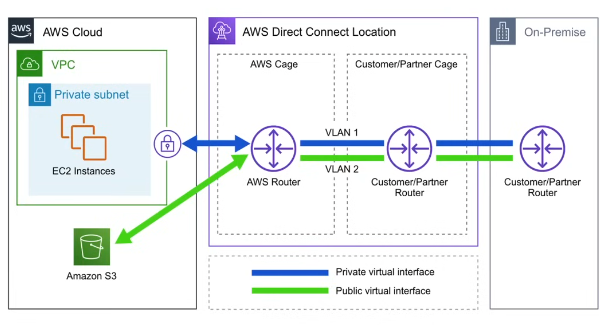

- AWS Direct Connect helps reduce network costs and increase bandwidth throughput. Ideal for high-traffic networks.
- AWS Direct Connect provides a more consistent network performance than a typical internet-based connection.

#### Direct Connect Support

AWS Direct Connect supports:

- both IPv4 and IPv6
- Ethernet Frame sizes of 1522 to 9023 bytes

#### Direct Connect Maintenance

Periodically, AWS performs maintenance on the hardware fleet. There are two types of maintenance:

- **Planned Maintenance**: 
    - Scheduled in advance to improve availability and deliver new features.
    - AWS will notify you at least 14 days in advance of planned maintenance.
- **Unplanned Maintenance**:
    - Maintenance that isn't planned in advance, often occurs due to unexpected hardware failures.
    - AWS will notify you as soon as possible of unplanned maintenance.


### VPC Endpoints

VPC Endpoints allow you to connect your VPC to supported AWS services and VPC endpoint services powered by PrivateLink without requiring an Internet Gateway, NAT device, VPN connection, or AWS Direct Connect connection.

Traffic between your VPC and the supported service does not leave the Amazon network.

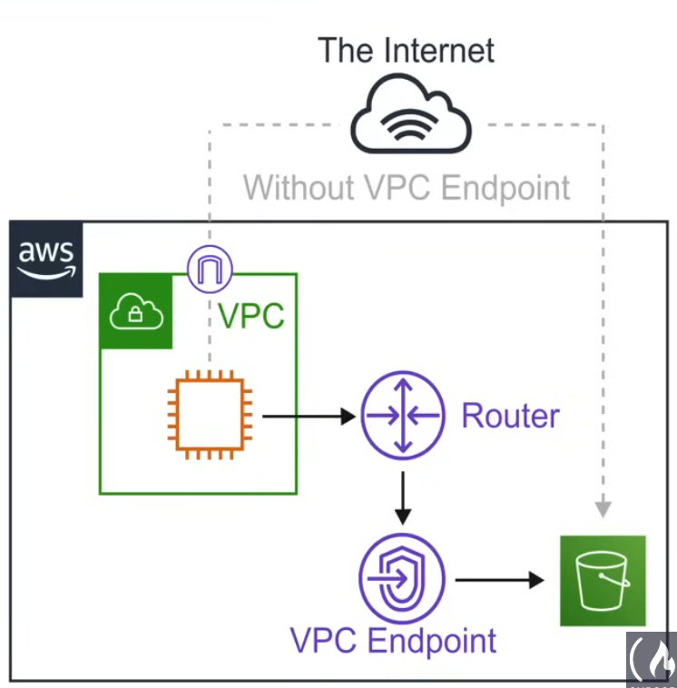

There are three types of VPC endpoints:

- **Interface endpoints**
- **Gateway endpoints**
- **Gateway Load Balancer Endpoints**

VPC Endpoints provide the following benefits:
- They eliminate the need for and Internet Gateway, NAT device, VPN connection, or AWS Direct Connect connection.
- Instances in the VPC do not require public IP addresses to access AWS Services.
- Traffic between your VPC and other services does not leave the AWS network.
- Horizontally scaled, redundant, and highly available VPC component for the specific AZs you choose.
- Allows secure communication between instances and services without adding availability risks or bandwidth constraints on traffic.

### AWS PrivateLink

AWS PrivateLink is a networking technology that enables private connectivity between VPCs and AWS services. It allows you to access AWS services from your VPC without exposing them to the public internet.

It allows you to securely connect your VPC to:

- AWS services.
- AWS Services hosted in other AWS accounts.
- Supported AWS Marketplace partners' services without the need for an IGW, NAT device, VPN connection, or AWS Direct Connect connection.

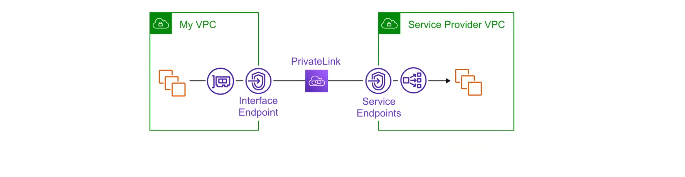

With Privatelink, you create an Interface Endpoint to connect to services. You also create your own services by creating a service endpoint.

**PrivateLink ready partner services** allow you to access SaaS products privately, as if they were running in your own VPC.

### Interface Endpoints

Interface endpoints are **Elastic Network Interfaces (ENIs)** with private IP addresses that are created in your subnets. They are used to access AWS services from your VPC without exposing them to the public internet.

Interfaca Endpoints are used to access services hosted on AWS easily and securely by keeping your network traffic within the AWS network.

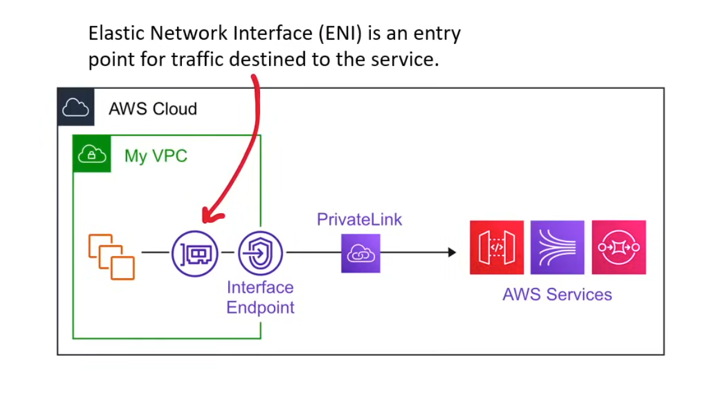

Interface Endpoints support the following AWS Services:
- Amazon API Gateway
- CloudFormation
- CloudWatch
- Kinesis
- SageMaker
- CodeBuild
- AWS Config
- EC2 API
- ELB API
- AWS KMS
- Secrets Manager
- Systems Manager
- Security Token Service (STS)
- SNS (Simple Notification Service)
- SQS (Simple Queue Service)
- Marketplace Partner Services
- Endpoint Services in other AWS Accounts

Pricing per VPC Endpoint per AZ ($/hour) = $0.01

Pricing per GB data processed ($) = $0.01

### Gateway Load Balancer Endpoints

Gateway Load Balancer Endpoints powered via AWS PrivateLink allow you to distribute traffic to third-party security appliances and services, such as firewalls, intrusion detection and prevention systems, and deep packet inspection systems, in a highly available and scalable manner.

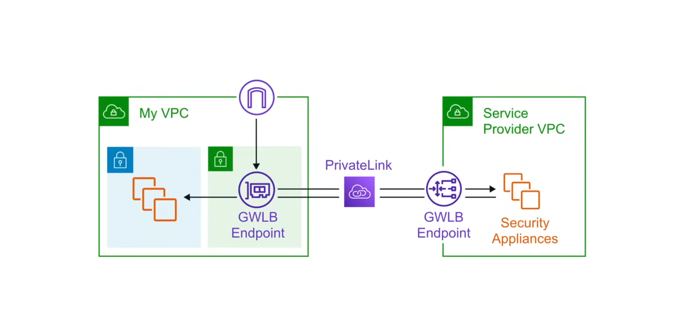

**GWLB endpoints** allow you to deploy, scale, and manage:
- Firewalls
- Intrusion Detection and Prevention Systems (IDPS)
- Deep Packet Inspection Systems

Virtual Appliances as-a-service can be obtained from:
- AWS Partner Network
- AWS Marketplace

You can send traffic to GWLB by making simple configuration changes to your VPC's route tables.

### VPC Gateway Endpoint

A Gateway Endpoint provides reliable connectivity to Amazon S3, and DynamoDB without requiring an Internet Gateway, NAT device, VPN connection, or AWS Direct Connect connection. 

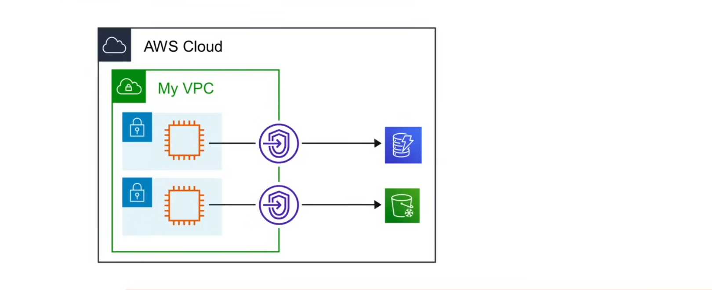

- Gateway Endpoints do not use AWS PrivateLink. 
- Gateway Endpoints do not incur additional charges.
- Gateway Endpoints suport the following services:
  - Amazon S3
  - DynamoDB

To create a Gateway Endpoint, you must specify the VPC in which you want to create the endpoint and the service to which you want to establish the connection.

### VPC Endpoints Comparison

| Feature | Interface Endpoint | Gateway Endpoint | Gateway Load Balancer Endpoint |
| --- | --- | --- | --- |
| **Type** | Elastic Network Interface(ENI) | Gateway with VPC | Interface Endpoint Type |
| **Use Case** | Private connections to AWS Services, Partner Services, and other VPCs without public IPS. | Private connections to S3 and DynamoDB from VPCs. | Route traffic to 3rd party virtual appliances like firewalls in another VPC. |
| **Service Integration** | AWS PrivateLink | S3 and DynamoDB | AWS PrivateLink and GWLB |
| **Pricing** | Per hour when provisioned<br> Per GB data processed | Free | Per Endpoint Hours<br> Per data processed |
| **Routing Mechanism** | DNS interception and routing | Rout table entries for specific destinations | Integrates with GWLB |
| **Traffic Direction** | Bi-directional | Uni-directional | Usually Uni-directional |

### VPC Flow Logs

VPC Flow Logs allow you to capture information about the IP traffic going to and from the instances in your VPC.

To create VPC Flow Logs:

```bash
aws ec2 create-flow-logs \
    --resource-type VPC \
    --resource-id vpc-1234567890abcdef0 \
    --traffic-type ALL \
    --log-destination-type cloud-watch-logs \
    --log-destination arn:aws:logs:region:account-id:log-group:log-group-name \
    --deliver-logs-permission-arn arn:aws:iam::account-id:role/role-name
```
Flow logs can be scoped for the following:
- VPC, Subnets
- Elastic Network Interfaces (ENIs)
- Transit Gateway
- Transit Gateway Attachments

Traffic can be monitored for:
- ACCEPT - Traffic was accepted.
- REJECT - Traffic was rejected.
- ALL - All accepted and rejectedtraffic.

Logs can be delivered to either:
- Amazon S3 Bucket
- CloudWatch Logs
- Kinesis Data Firehose

**VPC Flow Log Entry Format**

```xml
<version> <account-id> <interface-id> <srcaddr> <dstaddr> <srcport> <dstport> <protocol> <packets> <bytes> <start> <end> <action> <log-status>
```

**VPC Flow Log Entry Fields**

- `version`: The VPC Flow Logs version.
- `account-id`: The AWS account ID for the flow log.
- `interface-id`: ID of the network interface for which the traffic is recorded.
- `srcaddr`: Source IP address of the flow.
- `dstaddr`: Destination IP address of the flow.
- `srcport`: Source port of the flow.
- `dstport`: Destination port of the flow.
- `protocol`: The IANA protocol number of the traffic.
- `packets`: Number of packets transferred during the flow.
- `bytes`: Number of bytes transferred during the flow.
- `start`: Start time, in Unix seconds, of the capture window. 
- `end`: End time, in Unix secounds, of the capture window. 
- `action`: The action associated with the traffic.
   - **ACCEPT** - The recorded traffic was permitted by the security group and NACLs.
   - **REJECT** - The recorded traffic was rejected by the security group or NACLs.
- `log-status`: Status of the flow log entry.
   - **OK** - Data is logging normally to the specified locations.
   - **NODATA** - There was no traffic to or from the network interface during the capture window.
   - **SKIPDATA** - Some Flow log records were skipped during the capture window. This may be due to an internal capacity constraint or an internal error.

### AWS Virtual Private Network (VPN)

**AWS VPN** let's you establisha secure and private tunnel from your network or device, to the **AWS Global Network**.

There are two types of VPN connections in AWS:
- **AWS Site-to-Site VPN**: Allows you to securely connect your on-premise network or branch office to your VPC.
- **AWS Client VPN**: Allows you to securely connect individual users to AWS or on-premise networks.

#### What is IPSec?

Internet Protocol Security (IPSec) is a secure network protocol suite that authenticates and encrypts the packets of data to provide secure encrypted communication between two computers over an Internet Protocol (IP) network. It is used in Private Networks and VPNs.

### AWS Site-to-Site VPN

AWS Site-to-Site VPN allows you to connect your VPC to your on-premise network. 

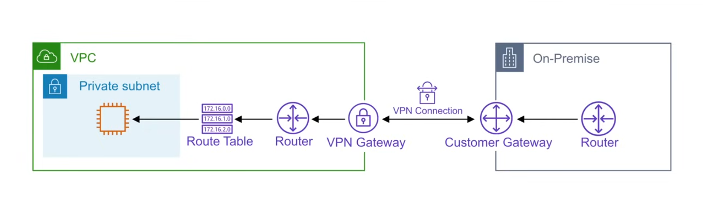

#### AWS Site-to-Site Components

- **VPN Connection**: Secure connection between your VPC and your on-premise network.
- **VPN Tunneel**: Encrypted connection for data transfer between your VPC and your on-premise network.
- **Customer Gateway(CGW)**: Provides information to AWS about your customer gateway device.
- **Customer Gateway Device**: The physical device or software application on your side of the Site-to-Site VPN connection.
- **Target Gateway**: A generic term for the VPN endpoint on the AWS Side of the Site-to-Site VPN connection.
- **Virtual Private Gateway (VGW)**: VPN endpoint on the Amazon Side of the Site-to-Site VPN connection that can be attached to a single VPC.
- **Transit Gateway**: A transit hub that can be used to interconnect multiple VPCs and on-premise networks, and as a VPN endpoint for the Amazon side of the Site-to-Site VPN connection.

#### Features

- Internet Key Exchange Version 2 (IKEv2)
- NAT Traversal
- 4-byte ASN in the range of 1-2147483647 for VGW configuration
- 2-byte ASN for CGW in the range of 1-65535
- CloudWatch Metrics for VPN Connection
- Reusable IP addresses for customer gateways
- Additional Encryption Options
  - AES-256-bit encryption
  - SHA-2 Hashing Algorithm
  - Diffie-Hellman Group 14
  - Configurable tunnel options
- Custom private ASN for the Amazon side of the BGP session
- Support for IPv6 traffic for VPN connections on a transit gateway
- Optional acceleration for the Site-to-Site VPN connection via AWS Global Accelerator service.
- Site-to-Site VPN can be attached to AWS Cloud WAN
- Site-to-Site VPN can be attached to AWS Transit Gateway

#### Limitations

- IPv6 traffic is not supported for VPN connections on a Virtual Private Gateway (VGW).
- An AWS VPN connection does not support path MTU discovery
- Does not support the use of overlapping CIDR blocks

#### Pricing

- Each VPN Connection hour
- Data transfer from Amazon EC2 to the internet


### Virtual Private Gateway (VGW)

A **Virtual Private Gateway (VGW)** is a VPN endpoint on the Amazon Side of the Site-to-Site VPN connection that can be attached to a single VPC.

When you create a VGW, you need to assign an Amazon Autonomous System Number (ASN), or a custom ASN. If you don't specify an ASN, the Virtual Private Gateway (VGW) will be created with the default ASN of 64512. Once a VGW is created, the ASN cannot be changed.

**What is an ASN?**

An **Autonomous System Number (ASN)** is a unique identifier that is allocated to each autonomous system (AS) that participates in the internet. An autonomous system is a network or group of networks that are managed as a single entity and are responsible for routing traffic for a specific domain or organization.

### Customer Gateway (CGW)

A **Customer Gateway (CGW)** is a resource that you create in AWS that represents the customer Gateway Device in your on-premise network. When configuring a CGW, you'll set:
- BGP ASN for your customer gateway device
- IP Address of your customer gateway device
- Private Cert provisioned by AWS Certificate Manager (ACM)

You'll also need to provide additional configuration to the customer gateway device which will establish the connection between AWS and the customer's on-premise network.

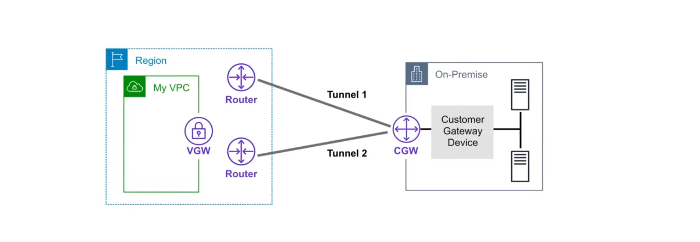

Incase of a failure within AWS, the VPN connection automatically fails over to the second tunnel so that access isn't interrupted. From time to time, AWS performs routine maintenance on the first tunnel, during which time the VPN connection will fail over to the second tunnel.

AWS provides sample configuration files for various customer gateway devices. 

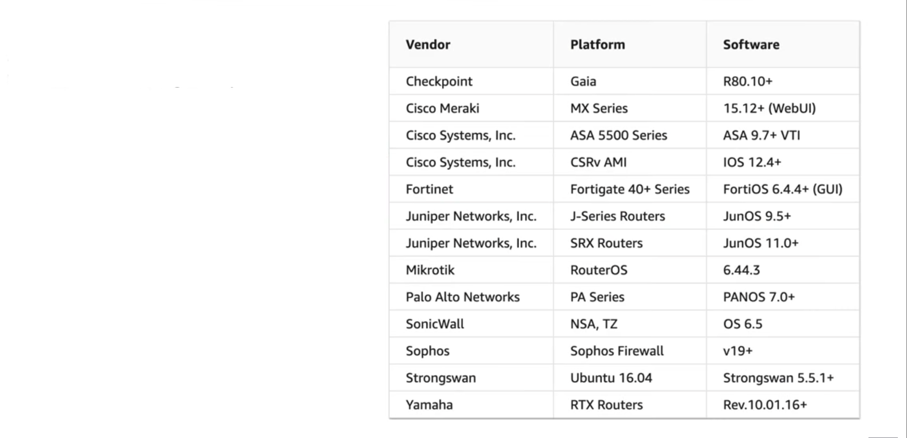

If you have a device not listed in the list, you'll have to ensure that the device can be configured for the following:
- Internet Key Exchange Version 2 (IKEv2)
- IPsec security association
- Tunnel Interface
- Border Gateway Protocol (BGP) (Optional)

### Transit Gateway (TGW)

A transit Gateway is a transit hub that can be used to interconnect multiple VPCs and on-premise networks, and as a VPN endpoint for the Amazon side of the Site-to-Site VPN connection.

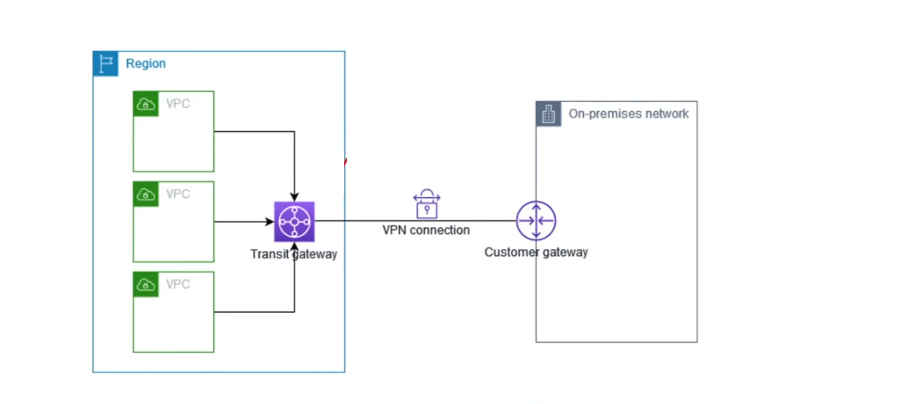

Transit gateway can support either IPv4 or IPv6 traffic inside the VPN tunnel. 

### AWS Client VPN

AWS Client VPN is a fully managed client-based VPN service that enables you to securely access AWS resources and resources in your on-premise network.

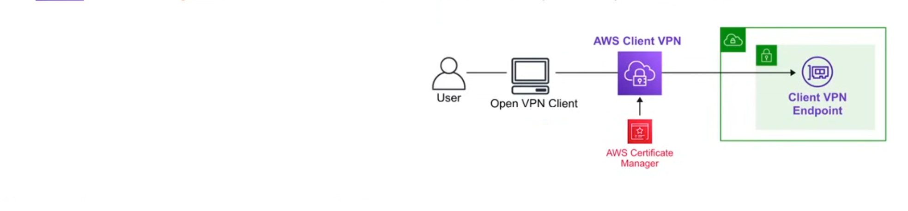

AWS Client VPN offers:

- Certificate-based authentication 
- Active Directory authentication (AWS Directory Service)
- Federation authentication (Single Sign-On via SAML)
- AWS CLient VPN uses a single tunnel
- Uses Security Groups for granular control
- Uses AD groups for granular control
- Self-service portal to download AWS VPN Desktop Client

AWS Client VPN has two roles:

- **Administrators**: Responsible for setting up and configuring the service
- **Clients**: The user who connects to the Client VPN endpoint to establish a VPN Session

AWS Client VPN can be used to securely connect to an RDS instance that is only in a private subnet.

### Network Address Translation (NAT)

**NAT** is a method of mapping an IP address space to another by modifying network address information in the IP header of packets while they are in transit across a traffic routing device. NAT is used to allow instances in a private subnet to access the internet.

If you have a private network and you need help to gain outbound access to the internet, you would need to use a NAT gateway to remap the private IP addresses to a public IP address.

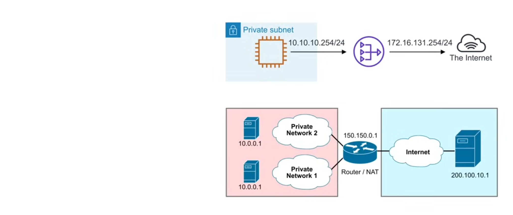

### NAT Gateway

**NAT Gateway** is a fully managed NAT service to allow instances in a private subnet to access the internet while preventing the internet from initiating a connection with those instances.
- A NAT Gateway is redundant within a single subnet
- A NAT Gateway is required per subnet

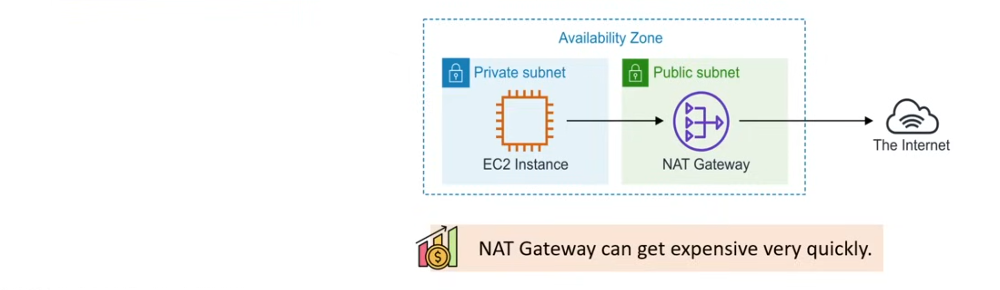

**Pricing**

An AWS NAT Gateway can get exepensive really quickly. For example,3 NATs for 1 month = $98.55 

You pay:

- Per Hour Per NAT Gateway eg. $0.045
- Per GB data processed eg. $0.045

A NAT Gateway has two connection modes:
1. **Public**
    - Instances in private subnets can connect to the internet through a public NAT Gateway.
    - It cannot receive unsolicited inbound connections from the internet.
    - It must be associated with an Elastic IP Address.
2. **Private**
    - Instances in private subnets can connect to other VPCs or your on-premise network through a private NAT Gateway.
    - You can route traffic from the NAT gateway through a transit gateway or a virtual private gateway.
    - You cannot associate an Elastic IP Address with a private NAT Gateway.

### DNS64 and NAT64

A NAT Gateway supports network address translation from IPv6 to IPv4, popularly known as NAT64. 

#### What is DNS64?

IPv6-only workloads running in a VPC can only send and receive IPv6 network packets. Without **DNS64**, a DNS query for an IPv4-only service will yield an IPv4 destination address in response and an IPv6-only service cannot communicate with it. To bridge this communication gap, DNS64 can be enabled for a subnet and it applies to all AWS resources within that subnet.

#### What is NAT64?

**NAT64** enables IPv6 services in Amazon VPCs to communicate with IPv4-only services within the same VPC or connected VPCs, in an on-premise network, or over the internet.

### NAT Instance

**NAT Instances** (legacy) is an AWS managed IAM to launch a NAT onto individual EC2 instances. NAT instnaces require the client to handle scaling, high availability, and patching. NAT instances are not fault tolerant and must be manually configured for high availability.

The NAT AMI is built on the lastes version of the Amazon Linux AMI, 2018.03, which reached the end of standard support on December 31, 2023 and end of maintenance support on December 31, 2023.

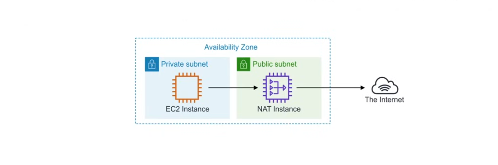

Community AMIs for third-party NAT software exist to launch NAT Instances.

